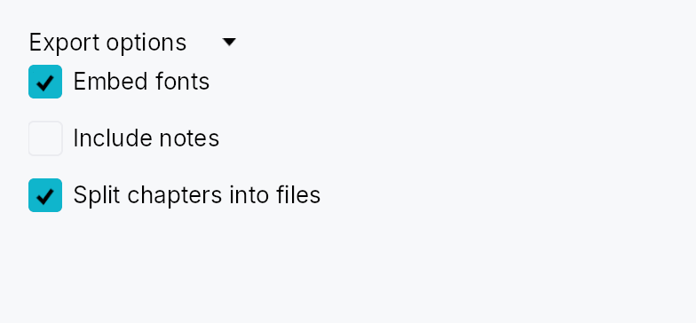
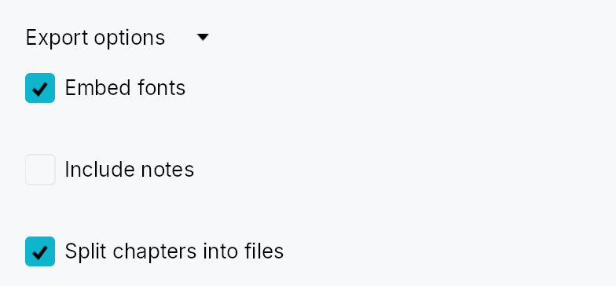

<!-- SPDX-License-Identifier: MPL-2.0 -->
<!-- SPDX-FileCopyrightText: 2026 FernTech -->

# Accordion



Accordion — a collapsible section with a clickable header that shows or hides
its content when activated.

## Public types

| Kind | Name |
| ---: | :--- |
| `const` | [`ACCORDION_HEADER_HEIGHT`](#accordion_header_height) — Height of the accordion header row in pixels (vertical mode) |
| `fn` | [`accordion_header_height`](#accordion_header_height-2) — `ACCORDION_HEADER_HEIGHT` raised to the density's `target_size` (24 / 32 / 44 dp) |
| `const` | [`ACCORDION_HEADER_PADDING_HORIZONTAL`](#accordion_header_padding_horizontal) — Horizontal padding inside the accordion header on the leading and trailing edges |
| `fn` | [`accordion_header_padding_horizontal`](#accordion_header_padding_horizontal-2) — `ACCORDION_HEADER_PADDING_HORIZONTAL` scaled by the density's `spacing_factor` (1.00 / 1.15 / 1.30) |
| `const` | [`ACCORDION_INDICATOR_SIZE`](#accordion_indicator_size) — Size of the chevron disclosure indicator icon in pixels |
| `const` | [`ACCORDION_INDICATOR_GAP`](#accordion_indicator_gap) — Gap between the disclosure indicator and the title label |
| `fn` | [`accordion_indicator_gap`](#accordion_indicator_gap-2) — `ACCORDION_INDICATOR_GAP` scaled by the density's `spacing_factor` (1.00 / 1.15 / 1.30) |
| `const` | [`ACCORDION_CORNER_RADIUS`](#accordion_corner_radius) — Corner radius of the keyboard-focus ring painted on the accordion header |
| `enum` | [`AccordionOrientation`](#accordionorientation) — Orientation of an `Accordion`: how its header sits relative to its content |
| `struct` | [`Accordion`](#accordion) — A collapsible section widget whose header button shows or hides attached content |

## Public functions

### `Accordion`

| Returns | Function |
| ---: | :--- |
| | **Constructors** |
| `Self` | [`new(title: impl Into<LocalizedString>, expanded: Signal<bool>)`](#accordion-new) |
| | **Builder methods** |
| `Self` | [`orientation(orientation: AccordionOrientation)`](#accordion-orientation) |
| `Self` | [`horizontal()`](#accordion-horizontal) |
| `Self` | [`fill(fill: bool)`](#accordion-fill) |
| `Self` | [`on_header_drag(f: impl Fn(&mut EventContext) + 'static)`](#accordion-on_header_drag) |
| `Self` | [`trailing(widget: impl teksilo_core::IntoTeksiChild)`](#accordion-trailing) |
| `Self` | [`title_color(color: impl Into<ColorProp>)`](#accordion-title_color) |
| `Self` | [`title_style(style: impl Into<TextStyleProp>)`](#accordion-title_style) |
| `Self` | [`content(widget: impl teksilo_core::IntoTeksiChild)`](#accordion-content) |

## Detailed description

In the default vertical mode a horizontally-spanning header row sits above the
content; clicking or pressing Space/Enter toggles visibility with an animated
height disclosure (via `Collapse`).
A horizontal mode flips the header into a narrow vertical strip with a rotated
label — used by top/bottom sides of a `DockingLayout`. Fill mode (`.fill(true)`)
is designed for fixed-size slots such as Splitter panes: the content fills all
available space and collapse animation is driven externally by the enclosing
pane rather than by an internal height tween.

#### Accessibility

The header is announced as `Role::Button` with `aria-expanded` reflecting the
current state, and `aria-controls` pointing at the content region
(`Role::Region`). Space/Enter toggle the disclosure; AT "click" actions are
also handled. The focus ring appears only on keyboard focus (not on pointer
clicks), matching the IntUI convention.

```rust
# use teksilo_widgets::accordion::Accordion;
# use teksilo_core::signal::Signal;
# use teksilo_i18n::lit;
let expanded = Signal::new(false);
let _accordion = Accordion::new(lit!("Advanced settings"), expanded);
```

#### Touch and pen

The header is one target on the density ladder and toggles from its tap, so on
the release. Where a dock panel installs `on_header_drag`, the same header is
also a drag source: `DragActivation::Auto` resolves that to `Immediate` when
nothing competes for the axis and to the hold when a scroller does, so a contact
needs no declaration to move a panel — and a press that lifts without
travelling still toggles.

The trailing slot is wrapped in a `DeadZone`, so
its action buttons and `⋮` menu take a press — jitter and all — without arming
the panel drag behind them.

## Density

The picture above is the widget at `TargetDensity::Compact`, the mouse-and-keyboard ladder. Below is the same subject on the same canvas with only the ladder changed, so what moves is the density and nothing else — where the subject no longer fits, that is what the denser targets cost it at that size. See `docs/density-and-targets.md`.

**Touch**



## API reference

📖 [Full rustdoc API for this module](https://docs.rs/teksilo-widgets/latest/teksilo_widgets/accordion/index.html)

<a id="accordion_header_height"></a>

## `pub const ACCORDION_HEADER_HEIGHT`

Height of the accordion header row in pixels (vertical mode).

```rust
pub const ACCORDION_HEADER_HEIGHT: f32 = 28.0;
```

<a id="accordion_header_height-2"></a>

## `pub fn accordion_header_height(...)`

`ACCORDION_HEADER_HEIGHT` raised to the density's `target_size`
(24 / 32 / 44 dp). The identity at Compact.

```rust
pub fn accordion_header_height(tokens: &InputTokens) -> f32;
```

<a id="accordion_header_padding_horizontal"></a>

## `pub const ACCORDION_HEADER_PADDING_HORIZONTAL`

Horizontal padding inside the accordion header on the leading and trailing edges.

```rust
pub const ACCORDION_HEADER_PADDING_HORIZONTAL: f32 = 8.0;
```

<a id="accordion_header_padding_horizontal-2"></a>

## `pub fn accordion_header_padding_horizontal(...)`

`ACCORDION_HEADER_PADDING_HORIZONTAL` scaled by the density's `spacing_factor`
(1.00 / 1.15 / 1.30).

```rust
pub fn accordion_header_padding_horizontal(tokens: &InputTokens) -> f32;
```

<a id="accordion_indicator_size"></a>

## `pub const ACCORDION_INDICATOR_SIZE`

Size of the chevron disclosure indicator icon in pixels.

```rust
pub const ACCORDION_INDICATOR_SIZE: f32 = 12.0;
```

<a id="accordion_indicator_gap"></a>

## `pub const ACCORDION_INDICATOR_GAP`

Gap between the disclosure indicator and the title label.

```rust
pub const ACCORDION_INDICATOR_GAP: f32 = 6.0;
```

<a id="accordion_indicator_gap-2"></a>

## `pub fn accordion_indicator_gap(...)`

`ACCORDION_INDICATOR_GAP` scaled by the density's `spacing_factor`
(1.00 / 1.15 / 1.30).

```rust
pub fn accordion_indicator_gap(tokens: &InputTokens) -> f32;
```

<a id="accordion_corner_radius"></a>

## `pub const ACCORDION_CORNER_RADIUS`

Corner radius of the keyboard-focus ring painted on the accordion header.

```rust
pub const ACCORDION_CORNER_RADIUS: f32 = 4.0;
```

<a id="accordionorientation"></a>

## `pub enum AccordionOrientation`

Orientation of an `Accordion`: how its header sits relative to its
content. `Vertical` (the default) is a
horizontal header row above the content; `Horizontal`
is a narrow vertical header **strip** (rotated-90° label, left/right
chevron) beside the content — used by top/bottom dock sides.

```rust
pub enum AccordionOrientation { /* variants */ }
```

### Variants

- **`Vertical`** — Header row above the content (default).
- **`Horizontal`** — Vertical header strip beside the content.

<a id="accordion"></a>

## `pub struct Accordion`

A collapsible section widget whose header button shows or hides attached content.

Supply the title and a `Signal<bool>` for the expanded state, then attach
content via `.content(w)` or
`.content(id)`. The signal can be toggled externally
(e.g. from a "collapse all" button) and the disclosure animation will follow.

```rust
pub struct Accordion { /* fields */ }
```

### Methods

<a id="accordion-new"></a>

#### `pub fn new(title: impl Into<LocalizedString>, expanded: Signal<bool>) -> Self`

Create a new accordion with the given `title` and an external `expanded` signal.

The accordion starts collapsed or expanded according to the initial value of
`expanded`. Toggling the signal later drives the disclosure animation.

<a id="accordion-orientation"></a>

#### `pub fn orientation(mut self, orientation: AccordionOrientation) -> Self`

Set the header orientation (default `AccordionOrientation::Vertical`).

<a id="accordion-horizontal"></a>

#### `pub fn horizontal(mut self) -> Self`

Shorthand for `Accordion::orientation``(``AccordionOrientation::Horizontal``)`.

<a id="accordion-fill"></a>

#### `pub fn fill(mut self, fill: bool) -> Self`

Make the expanded content **fill** the accordion's allotted space (the
leftover after the header) — instead of the default natural-height
disclosure — while keeping the collapse/expand **animated**. Use when the
accordion lives in a fixed-size slot such as a Splitter pane (a dock
panel): the content lays out at exactly the available size (no narrow
content, no overflow) and the header tween still plays. Default `false`.

<a id="accordion-on_header_drag"></a>

#### `pub fn on_header_drag(mut self, f: impl Fn(&mut EventContext) + 'static) -> Self`

Make the header a **drag source**: a drag gesture starting on it fires
`f` (which should begin a drag, e.g. `ctx.start_drag(source, payload)`).
Tap-to-toggle is unaffected — the gesture arena tells a tap from a drag.

<a id="accordion-trailing"></a>

#### `pub fn trailing(mut self, widget: impl teksilo_core::IntoTeksiChild) -> Self`

Place a widget at the trailing end of the header, before the disclosure
chevron — an options (`⋮`) button, an inline action toolbar, etc. The
slot's own controls capture their gestures (innermost hit wins), so
clicking them does not toggle the accordion. Mirrors
`ToolBoxItem::trailing` /
`TabWidget::bar_trailing_slot`.

<a id="accordion-title_color"></a>

#### `pub fn title_color(mut self, color: impl Into<ColorProp>) -> Self`

Override the header foreground color used for the title text and
chevron icon. Defaults to `TextRole::Primary`. Accepts a literal
`Color`, a `TextRole`/`SurfaceRole`, or a `Signal<Color>`.

<a id="accordion-title_style"></a>

#### `pub fn title_style(mut self, style: impl Into<TextStyleProp>) -> Self`

Override the header title's text style. Use this to make the
disclosure label smaller (e.g. inside a tooltip) or to match a
non-body typography role. Accepts a static
`TextStyle` or a
`TextStyleRole`.

<a id="accordion-content"></a>

#### `pub fn content(mut self, widget: impl teksilo_core::IntoTeksiChild) -> Self`

Set an inline content widget (deferred insertion).
