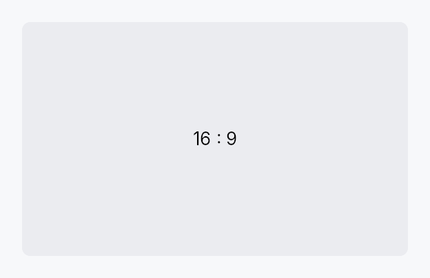

<!-- SPDX-License-Identifier: MPL-2.0 -->
<!-- SPDX-FileCopyrightText: 2026 FernTech -->

# AspectRatio



AspectRatio — a single-child wrapper that constrains layout to a fixed
width-to-height ratio.

Given a proposal, `AspectRatio` computes the largest rectangle that fits
within both dimensions while satisfying `width / height == ratio`. When
only one axis is constrained by the parent, the other is derived from the
ratio. The child is stretched to the resulting rectangle. The widget is
invisible to assistive technology (`set_hidden`); its child carries all
semantic meaning.

## When to use

- Embedding images, thumbnails, or video placeholders that must stay
  letter-boxed regardless of the available space.
- Ensuring a square avatar or tile layout against an unconstrained parent
  axis.

```rust
# use teksilo_widgets::primitives::{AspectRatio, RectWidget};
// 16:9 video placeholder
let _thumbnail = AspectRatio::new(16.0 / 9.0)
    .child(RectWidget::new());
```

## Builder methods at a glance

`widescreen`, `square`, `child`, `child_id`

## API reference

📖 [Full rustdoc API for this module](https://docs.rs/teksilo-widgets/latest/teksilo_widgets/primitives/aspect_ratio/index.html)

## `pub struct AspectRatio`

A single-child wrapper that maintains a fixed width/height ratio.

```rust
pub struct AspectRatio { /* fields */ }
```

### Methods

#### `pub fn new(ratio: f32) -> Self`

Create a new aspect ratio wrapper. Ratio is width / height.

#### `pub fn widescreen() -> Self`

Convenience for 16:9 aspect ratio.

#### `pub fn square() -> Self`

Convenience for 1:1 aspect ratio.

#### `pub fn child(mut self, widget: impl Widget + 'static) -> Self`

Set an inline child widget to constrain; the child is stretched to the
computed aspect-ratio rectangle.

#### `pub fn child_id(mut self, id: WidgetId) -> Self`

Set a pre-registered child widget by ID.
