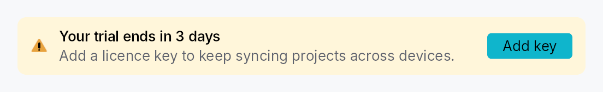
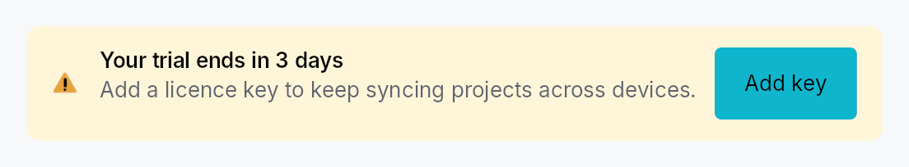

<!-- SPDX-License-Identifier: MPL-2.0 -->
<!-- SPDX-FileCopyrightText: 2026 FernTech -->

# Banner



Banner — persistent inline status strip (info / success / warning / error).

## Public functions

### `Banner`

| Returns | Function |
| ---: | :--- |
| | **Constructors** |
| `Self` | [`info(title: impl Into<LocalizedString>)`](#banner-info) |
| `Self` | [`success(title: impl Into<LocalizedString>)`](#banner-success) |
| `Self` | [`warning(title: impl Into<LocalizedString>)`](#banner-warning) |
| `Self` | [`error(title: impl Into<LocalizedString>)`](#banner-error) |
| | **Builder methods** |
| `Self` | [`style(style: impl teksilo_core::styles::BannerStyle)`](#banner-style) |
| `Self` | [`description(text: impl Into<LocalizedString>)`](#banner-description) |
| `Self` | [`action(widget: impl Widget + 'static)`](#banner-action) |
| `Self` | [`on_dismiss(f: impl Fn(&mut EventContext) + 'static)`](#banner-on_dismiss) |

## Detailed description

A non-transient, full-width callout for app-level conditions: deprecation
notices, "you have unsaved changes", trial-expiry warnings, license
issues, restored-from-cache notices, etc. Distinct from
`Snackbar` (transient, corner-anchored) and
`MessageBox` (modal).

```ignore
Banner::warning(tr!(unsaved_changes()))
    .description(tr!(close_loses_changes()))
    .action(Button::new(tr!(save_now()))
        .on_activate_fn(|ctx| ctx.send_intent(AppIntent::SaveNow)))
    .on_dismiss(|ctx| ctx.send_intent(AppIntent::DismissBanner))
```

## Density

The picture above is the widget at `TargetDensity::Compact`, the mouse-and-keyboard ladder. Below is the same subject on the same canvas with only the ladder changed, so what moves is the density and nothing else — where the subject no longer fits, that is what the denser targets cost it at that size. See `docs/density-and-targets.md`.

**Touch**



## API reference

📖 [Full rustdoc API for this module](https://docs.rs/teksilo-widgets/latest/teksilo_widgets/banner/index.html)

<a id="banner"></a>

## `pub struct Banner`

A persistent inline status strip.

```rust
pub struct Banner { /* fields */ }
```

### Methods

<a id="banner-style"></a>

#### `pub fn style(mut self, style: impl teksilo_core::styles::BannerStyle) -> Self`

Per-call style override for the banner strip chrome. Replaces
the theme-wide default `BannerStyle` for just this instance.

<a id="banner-info"></a>

#### `pub fn info(title: impl Into<LocalizedString>) -> Self`

Construct an info-severity banner.

<a id="banner-success"></a>

#### `pub fn success(title: impl Into<LocalizedString>) -> Self`

Construct a success-severity banner.

<a id="banner-warning"></a>

#### `pub fn warning(title: impl Into<LocalizedString>) -> Self`

Construct a warning-severity banner.

<a id="banner-error"></a>

#### `pub fn error(title: impl Into<LocalizedString>) -> Self`

Construct an error-severity banner.

<a id="banner-description"></a>

#### `pub fn description(mut self, text: impl Into<LocalizedString>) -> Self`

Optional secondary line of text rendered below the title.

<a id="banner-action"></a>

#### `pub fn action(mut self, widget: impl Widget + 'static) -> Self`

Trailing widget — typically a `Button` or
an `HStack` of buttons. Placed before the optional dismiss button.

<a id="banner-on_dismiss"></a>

#### `pub fn on_dismiss(mut self, f: impl Fn(&mut EventContext) + 'static) -> Self`

Attach a trailing dismiss (X) button. The closure runs when the
user clicks it; the host is expected to remove the banner from the
tree (typically by toggling a `Signal<bool>` driving a `Switcher`).
