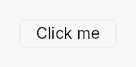

<!-- SPDX-License-Identifier: MPL-2.0 -->
<!-- SPDX-FileCopyrightText: 2026 FernTech -->

# Button



Button — a labelled, activatable action trigger.

`Button` is the primary action surface in Teksilo. It renders a text
label (optionally with a leading, trailing, top, or bottom icon), fires
a closure on click / Space / Enter / AT click, and advertises seven
design-language variants via `ButtonVariant`. Chrome (fill, border,
focus ring, padding) is delegated to the active `ButtonStyle`; the
default `RecipeButtonStyle` implements the Int UI token ladder.

## When to use

- Primary action: `.variant(ButtonVariant::Filled)` — one per context.
- Secondary / cancel: default `ButtonVariant::Plain`.
- Danger: `ButtonVariant::Destructive` (IntUI maps this to Filled).
- Text-only link: `ButtonVariant::Link` / `ButtonVariant::Ghost`.

## Accessibility

Announces as `Role::Button` with the resolved label as its AT name.
Keyboard: Space / Enter activate; the lone-KeyUp guard prevents spurious
re-activation when a shortcut consumes the KeyDown and returns focus here.

```rust
# use teksilo_widgets::{Button, ButtonVariant};
# use teksilo_i18n::lit;
# use teksilo_core::Intent;
let _btn = Button::new(lit!("Save"))
    .variant(ButtonVariant::Filled)
    .on_activate_fn(|ctx| ctx.send_intent(Intent::new("app.save")));
```

## Builder methods at a glance

`current_variant`, `share_interaction`, `variant`, `style`, `label`, `on_activate_fn`, `tooltip`, `rich_tooltip`, `rich_tooltip_content`, `composite_tooltip`, `enabled`, `text_role`, `text_style`, `icon`, `icon_keeps_color`, `has_popup`, `expanded_when`, `leading`, `trailing`

## API reference

📖 [Full rustdoc API for this module](../api/teksilo_widgets/button/index.html)

## `pub enum InteractionState`

Internal interaction state.

```rust
pub enum InteractionState { /* variants */ }
```

### Variants

- **`Idle`**
- **`Hovered`**
- **`Pressed`**
- **`Focused`**
- **`Disabled`**

## `pub enum IconLocation`

Where an optional icon is placed relative to the button label.

```rust
pub enum IconLocation { /* variants */ }
```

### Variants

- **`None`** — No icon (default).
- **`IconOnly`** — Icon only, no label.
- **`Leading`** — Icon to the left of the label (default).
- **`Trailing`** — Icon to the right of the label.
- **`Top`** — Icon above the label.
- **`Bottom`** — Icon below the label.

## `pub struct Button`

A labelled action trigger; use `Button::new` and chain builder methods.

```rust
pub struct Button { /* fields */ }
```

### Methods

#### `pub fn new(label: impl Into<LocalizedString>) -> Self`

Construct a button from a `LocalizedString` label. The label may
come from `tr!(...)` (translated) or `lit!(...)`
(explicit non-translated). When an `I18nManager` is installed, a
`tr!(...)` label becomes a `Prop::Bound` that observes the locale
version signal, so the inner `TextWidget` re-renders on a locale
switch without rebuilding the Button — matching `TextWidget::new`.
`lit!(...)` and the no-manager case resolve to a static `String`.

#### `pub fn current_variant(&self) -> ButtonVariant`

Returns the configured visual variant. Used by wrappers like
`PopoverButton` that
derive their own chrome colors from the same recipe-resolution
path the inner Button uses.

#### `pub fn share_interaction(mut self, signal: Signal<InteractionState>) -> Self`

Bind the button's internal interaction state to a caller-owned
`Signal<InteractionState>` instead of letting `build()` allocate
its own. Used by wrapper widgets like
`PopoverButton` whose
disclosure caret needs to match the label's color across hover
/ press / focus / disabled states.

The provided signal is reset to `Disabled` when `enabled == false`
during `build()` so the shared signal honors the button's
enabled state without the caller having to seed it.

#### `pub fn variant(mut self, variant: ButtonVariant) -> Self`

Set the Tier-1 design-language variant. The active
`ButtonStyle` decides whether to honour or remap it (the IntUI
default `RecipeButtonStyle` collapses Destructive → Filled,
Tinted/Outlined → Plain, Link → Ghost).

#### `pub fn style(mut self, style: impl ButtonStyle) -> Self`

Override the active `ButtonStyle` for this widget instance
only. Useful for one-off custom-painted buttons (glassmorphism
CTA, Material-3 ripple, etc.) without forking the Button.

#### `pub fn label(mut self, label: impl Into<teksilo_core::signal::Prop<String>>) -> Self`

Bind the button's label to a reactive source — replaces the
static label captured at `new(...)`. Accepts any
`impl Into<Prop<String>>`: a `Signal<String>` for live
updates, or a plain `String` (which is the same as constructing
the button with that string). Mirrors
`TextWidget::text`.
The inner label `TextWidget` is built with the bound prop, so
the visible text refreshes without rebuilding the Button. The
AT node's `set_name` reads the current value via `Prop::get`.

Translation note: derive the signal with
`state.map(|s| tr!(status_label(value = s)).resolve_now())` for translated
reactive labels — Button only sees the resolved `String`.

#### `pub fn on_activate_fn(mut self, f: impl Fn(&mut EventContext) + 'static) -> Self`

Closure invoked on activation. Use `ctx.send_intent(...)` to
route activation through the Action/Intent system, or inline
the behavior directly.

#### `pub fn tooltip(mut self, text: impl Into<LocalizedString>) -> Self`

Attach a tooltip that appears after a hover delay.

#### `pub fn rich_tooltip(mut self, key: impl Into<String>) -> Self`

Attach a rich tooltip resolved from the app-wide tooltip registry.
The `key` is looked up via
`TooltipRegistry` at build
time; the resolved body text supports inline markup
(``label``, `*italic*`, `**bold**`) and the entry's
shortcut / long-form "more" fields are rendered automatically.

Overrides any previously set plain `.tooltip(...)` text.

#### `pub fn rich_tooltip_content(mut self, content: crate::tooltip::TooltipContent) -> Self`

Attach a rich tooltip driven by inline
`TooltipContent` — for
one-off tooltips that aren't worth registering in the central
catalog. Overrides any previously set plain `.tooltip(...)`.

#### `pub fn composite_tooltip( mut self, content: impl teksilo_core::widget::Widget + 'static, ) -> Self`

Attach a composite tooltip — third tier, hosting an arbitrary
widget tree (Crusader Kings 3 style: tabbed sections, charts,
progress bars, conditional rows). Promotes to a focusable
`Role::Dialog` after the user dwells for the standard
promotion threshold. Overrides any plain or rich tooltip
previously set on this button.

#### `pub fn enabled(mut self, enabled: impl Into<Prop<bool>>) -> Self`

Set the enabled state, statically or reactively. Disabled buttons
ignore input and dim their content (the framework's
`PaintContext::effective_enabled` propagates through to the
label/icon leaves). Forwarded into the arena via
`ctx.enabled_when(self_id, self.enabled.clone())` at build time —
a bound signal updates live as it changes.

#### `pub fn text_role(mut self, role: impl Into<teksilo_core::color_prop::ColorProp>) -> Self`

Override the label and icon's tint with a static `ColorProp`.
When set, the button ignores its `style` and the auto-derived
idle/hover/press text-role cascade — both the label text and
any icon are bound directly to this prop instead. Use for chrome
whose host enforces a single text role across all of its
sub-widgets (e.g. tab-bar overflow-dropdown triggers that must
match the strip's `idle_text_role` regardless of hover state).
Accepts `Color`, `TextRole`, `Signal<Color>`, or `Signal<TextRole>`.

#### `pub fn text_style(mut self, style: impl Into<teksilo_core::color_prop::TextStyleProp>) -> Self`

Override the label's text style (font, size, weight). By default the
label uses the inner `TextWidget`'s default style; pass a
`TextStyleRole` (e.g. `TextStyleRole::BodyBold`), a `TextStyle`, or a
`Signal` of either to change it — e.g. to make the label bold.
Orthogonal to `Button::text_role`, which only sets the color.

#### `pub fn icon(mut self, icon: IconWidget, location: IconLocation) -> Self`

Add an icon to the button at the specified location.

#### `pub fn icon_keeps_color(mut self) -> Self`

Keep the icon's own colour instead of tinting it to the label's.

The mirror of `MenuItem::icon_keeps_color`,
and it exists for the same reason: an icon whose colour *is* the information.
A filter chip carrying a user-chosen tag colour, a legend swatch, a status
disc — tinting those to the label's foreground destroys the one thing they
carry, while tinting is exactly right for a glyph that merely repeats the
label.

Two consequences worth knowing, both inherited from
`ColorProp`'s own rules rather than
special-cased here:

* The colour must clear contrast against **every** fill the button takes —
  an accent-filled selected state as well as the resting surface.
* A literal colour **does not dim when the button is disabled**. An icon
  that should dim wants a role instead, and then it does not need this.

#### `pub fn has_popup(mut self, kind: teksilo_core::accesskit::HasPopup) -> Self`

Declare that this button is a disclosure trigger for a
popup (menu, dialog, listbox, tree, grid). Surfaced via
`set_has_popup` in the a11y node so screen readers announce
it as leading into the named popup kind.

#### `pub fn expanded_when(mut self, signal: impl Into<Prop<bool>>) -> Self`

Bind a signal reporting whether this button's popup is
currently visible. The Popover / Dialog wrapper owns the
signal and flips it on show / dismiss; Button reads it in
`accessibility()` to publish `set_expanded`. Only
meaningful alongside `.has_popup(...)`.

#### `pub fn leading(mut self, widget: impl Widget + 'static) -> Self`

Insert a widget at the leading edge of the button's content
(left in LTR, right in RTL). Composes with `.icon(...)`: the
final order is `[leading_slot, icon+label, trailing_slot]`,
separated by `btn::BUTTON_ICON_LABEL_GAP`. Single-slot —
calling `.leading(...)` again replaces the previous slot.
Stack multiple widgets with an explicit `HStack`.

The slot widget paints itself and emits its own a11y. Button
does **not** retint it (so e.g. a `ColorSwatch` keeps its own
color through every interaction state). If the slot widget
declares an AT role of its own — `ColorSwatch` is the canonical
case (`Role::ColorWell`) — pass `widget.access_hidden(true)`
so the trigger reads as a single Button node instead of a
Button containing a redundant ColorWell child.

#### `pub fn trailing(mut self, widget: impl Widget + 'static) -> Self`

Same as `leading` but at the trailing edge
(right in LTR, left in RTL). Common uses: chevron-down hint
on disclosure triggers, clear-X on search fields, status
badges on segmented control segments.
