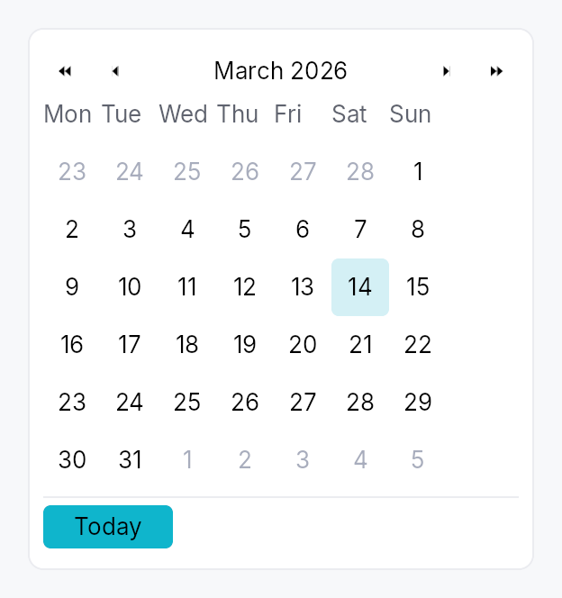
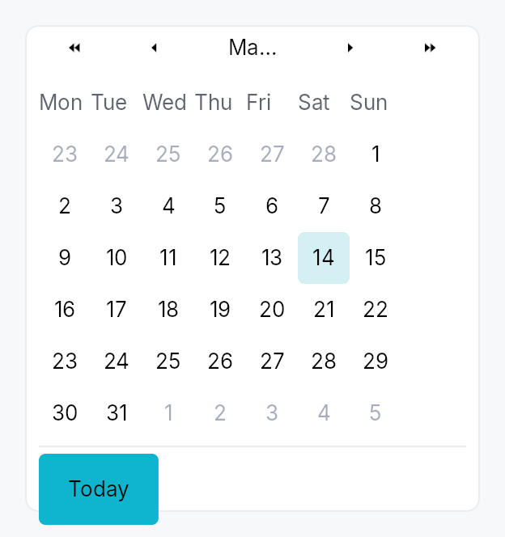

<!-- SPDX-License-Identifier: MPL-2.0 -->
<!-- SPDX-FileCopyrightText: 2026 FernTech -->

# Calendar



`Calendar` — month-grid date picker, standalone widget.

A self-contained calendar with month/year navigation, a 6×7 day grid,
keyboard navigation matching the WAI-ARIA grid pattern, and full
AccessKit instrumentation (`Role::Grid` + per-cell `Role::GridCell`).
Used standalone for event apps and scheduling, and embedded in
`DateEdit`'s popover.

# Selection modes

- `Calendar::single` — pick one day. Bound to `Signal<Option<Date>>`.
- `Calendar::range` — pick a start + end day. Bound to
  `Signal<Option<DateRange>>`. Click first day → click second day to
  commit. Escape mid-selection cancels the in-progress anchor.

# Behaviour

- **Visible month** is independent of the selection — navigating past
  the selected month doesn't lose the selection.
- **Today highlight** draws a ring around today's cell whenever it's
  in the visible month. Color comes from `BorderRole::Focused`,
  painted by the active `CalendarStyle::make_day_cell`.
- **Out-of-month cells** (the leading days from the previous month
  and trailing days from the next month that fill the 6×7 grid) are
  rendered with `TextRole::Disabled` and remain selectable (matching
  macOS / Material). To prevent selection use
  `disabled_date_filter`.
- **Keyboard** (matches the WAI-ARIA `grid` pattern):
  - Arrow keys: move focus by one day.
  - Home / End: first / last day of week.
  - Ctrl+Home / Ctrl+End: first / last day of month.
  - PageUp / PageDown: previous / next month.
  - Shift+PageUp / Shift+PageDown: previous / next year.
  - Enter / Space: commit focused day to selection.
  - Escape: in range mode mid-selection, cancel anchor; otherwise
    bubble (popover hosts close).
  - `T`: jump focus to today.
- **Keyboard in the months and years views**: the cursor is the month
  (or year) shown, highlighted in the grid.
  - Arrow keys: move by one month (year) across a row, by a row of three
    up and down.
  - PageUp / PageDown: a year back or on (a decade in the years view).
  - Enter / Space: open the month under the cursor on its days (the year
    on its months). Nothing is selected.
  - Escape: back to the days of the month under the cursor. A date
    field's popup takes Escape first and closes, and opens again on its
    days.
  - Activating the header title zooms out and takes the keyboard into the
    grid, on the month (year) shown.

# Accessibility

Every string below is in the user's language. The words come from the
framework's Fluent bundle, so an application that registers
`framework_locales()` gets them translated; every date inside them is
written by ICU for the widget tree's locale, in the locale's own order
and grammar and on the Gregorian calendar the grid is laid out in, never
assembled from numbers or from translated names (see
`common::datetime::written`).

- Container: `Role::Grid`, named after the visible month
  ("Calendar, May 2026", "Calendrier, mai 2026"). It is **not** a live
  region: a live grid announced its name and each weekday header as it
  opened, and then focus said its name again. A change of month made
  from the keyboard moves the focus to a day of the new month (see the
  day cells below), whose name says the month. One made from a header
  arrow or the Today button, where focus stays on the button, is
  announced once through the tree's announcer: the title as it now
  reads, or today's date in full. The value is the day under the
  keyboard cursor in full, then the selection when there is one:
  "Saturday, May 2, 2026 (selected: Friday, May 1, 2026)". With the
  cursor on the one selected day, the day is said once: "Friday, May 1,
  2026 (selected)". A range is joined by words ("… to …"), not an
  en-dash, which some screen readers skip. The value is for a client
  that reads the grid; the cursor is heard through the focus. UIA and
  macOS raise a value-changed event on the grid, which is not the focus
  while a day is; AT-SPI carries a string value on no interface.
- Header arrow buttons: `Role::Button` with localized labels
  ("Previous month", "Next month") and `Action::Click` advertised.
- Header month/year label: `Role::Button`, a `Ghost` `Button` whose
  activation demotes `CalendarMode` one level, swapping the body for
  the coarser grid in place, and moves focus to the grid; no popup is
  opened. Its name is its title: the month and year, the year, or the
  decade in words ("2020 to 2029").
- Month and year cells of the zoomed views: `Role::GridCell`, a month
  named with its year ("mai 2026"), `Action::Click` advertised, no Tab
  stop of their own: the grid names the one under the cursor as its
  active descendant, as it does a day.
- Weekday header row: `Role::Row` of `Role::ColumnHeader` cells, each
  labelled with the long weekday name (e.g. "Monday").
- Weeks: `Role::Row`, each holding its seven day cells, so the grid is
  `Grid > Row > GridCell` in every platform's tree.
- Day cells: `Role::GridCell` named by the day in full
  ("Saturday, May 2, 2026", "samedi 2 mai 2026"), `set_selected`,
  `set_aria_current(Date)` on today, `set_disabled` for filter
  rejections, and `Action::Click` advertised. Keyboard focus stays on
  the Calendar root, which names the cell under the cursor as its
  active descendant while it holds focus in the day view. AccessKit
  reports that cell as the focus on AT-SPI, UIA and macOS, so each
  arrow press, and each change of month, is a focus change to the new
  day, which is what a screen reader speaks.

# Example

```ignore
use teksilo::widgets::{Calendar, common::datetime::Date};

let date = ctx.signal(Some(Date::constant(2026, 5, 2)));
ctx.add(
    Calendar::single(date.clone())
        .show_today_button(true)
        .on_selection_changed(|d, ctx| ctx.send_intent(MyIntent::DateChanged(d))),
);
```

## Touch and pen

A day cell is a **tap target**, not a manipulator, and the distinction
decides what it declares. Its activation is `on_tap`, so it already lands on
the release; its 32 dp box already clears the WCAG 2.2 SC 2.5.8 floor at
Compact and follows the density ladder above it; and it produces no value
from the press position and owns no drag. It therefore does **not** declare
`touch_action(NONE)`: a finger that comes to rest on a day and then drags is
scrolling the dialog or form the calendar sits in, which is what a user
expects and what declaring NONE would forbid for nothing gained.

## Density

The picture above is the widget at `TargetDensity::Compact`, the mouse-and-keyboard ladder. Below is the same subject on the same canvas with only the ladder changed, so what moves is the density and nothing else — where the subject no longer fits, that is what the denser targets cost it at that size. See `docs/density-and-targets.md`.

**Touch**



## Builder methods at a glance

`single`, `range`, `first_day_of_week`, `week_numbers`, `show_today_button`, `show_navigation`, `min_date`, `max_date`, `disabled_date_filter`, `label`, `enabled`, `on_selection_changed`, `on_range_changed`, `on_month_changed`, `on_activate`, `visible_month_signal`, `focused_date_signal`, `mode_signal`

## API reference

📖 [Full rustdoc API for this module](https://docs.rs/teksilo-widgets/latest/teksilo_widgets/calendar/index.html)

## `pub struct DateRange`

Inclusive range of two dates, with `start <= end` enforced at
construction. Used by `Calendar::range`.

```rust
pub struct DateRange { /* fields */ }
```

### Methods

#### `pub fn new(a: Date, b: Date) -> Self`

Construct a range; swaps `start` and `end` if needed so the
invariant `start <= end` always holds.

#### `pub fn contains(&self, d: Date) -> bool`

`true` iff `d` is between `start` and `end` inclusive.

## `pub enum CalendarMode`

What the calendar body is showing — drives the WPF/Avalonia
"header-zoom" UX where clicking the title cycles to a coarser
grid, letting the user reach any year in 2-3 clicks instead of
many chevron presses. Default `CalendarMode::Days`.

```rust
pub enum CalendarMode { /* variants */ }
```

### Variants

- **`Days`** — 6×7 day grid for the visible month. Title shows "May 2026". Header chevrons step by ±1 month and ±1 year.
- **`Months`** — 4×3 grid of months. Title shows "2026". Header chevrons step by ±1 year. Picking a cell zooms back into `Self::Days`.
- **`Years`** — 4×3 grid of years (current decade). Title shows "2020 to 2029". Header chevrons step by ±10 years (one decade). Picking a cell zooms back into `Self::Months`.

### Methods

#### `pub fn demote(self) -> Self`

Mode after demoting one level (clicking the header title).
`Years` is the coarsest level — no further demotion.

## `pub enum WeekNumberDisplay`

Whether and how week numbers are displayed in the leading column of the day grid.

```rust
pub enum WeekNumberDisplay { /* variants */ }
```

### Variants

- **`None`** — No week-number column (default).
- **`Iso8601`** — ISO 8601 week number — week 1 is the week containing the first Thursday of the year. Adds a narrow column to the left of the day grid.

## `pub struct Calendar`

Standalone month-grid date picker. See the `module docs` for
the full feature list and a usage example.

```rust
pub struct Calendar { /* fields */ }
```

### Methods

#### `pub fn single(value: Signal<Option<Date>>) -> Self`

Construct a calendar in single-selection mode bound to a
nullable date signal.

#### `pub fn range(value: Signal<Option<DateRange>>) -> Self`

Construct a calendar in range-selection mode bound to a
nullable date-range signal.

#### `pub fn first_day_of_week(mut self, w: Weekday) -> Self`

Override the locale-derived first day of the week.

#### `pub fn week_numbers(mut self, mode: WeekNumberDisplay) -> Self`

Show or hide the leading week-number column.

#### `pub fn show_today_button(mut self, show: bool) -> Self`

Show a "Today" button in the footer that jumps focus and selection
(in single mode) to today.

#### `pub fn show_navigation(mut self, show: bool) -> Self`

Show or hide the prev/next month navigation arrows.

#### `pub fn min_date(mut self, d: Date) -> Self`

Earliest allowed date; days before this read as disabled.

#### `pub fn max_date(mut self, d: Date) -> Self`

Latest allowed date; days after this read as disabled.

#### `pub fn disabled_date_filter(mut self, f: impl Fn(Date) -> bool + 'static) -> Self`

Per-cell predicate. `true` ⇒ cell is disabled (no click, no
keyboard commit, AT marks `disabled`).

#### `pub fn label(mut self, label: impl Into<LocalizedString>) -> Self`

Override the AT label. Default: "Calendar, May 2026" (localized,
derived from the visible month).

#### `pub fn enabled(mut self, enabled: impl Into<Prop<bool>>) -> Self`

Set the enabled state, statically or reactively. Forwarded to the
arena at build time — a bound `Signal<bool>` updates live.

#### `pub fn on_selection_changed( mut self, f: impl Fn(Option<Date>, &mut EventContext) + 'static, ) -> Self`

Fired when the selection changes. In range mode use
`on_range_changed` instead — this
callback fires on every committed-day change in range mode too,
passing the just-committed endpoint.

#### `pub fn on_range_changed( mut self, f: impl Fn(Option<DateRange>, &mut EventContext) + 'static, ) -> Self`

Fired in range mode whenever a range is committed (second click
of the pair). `None` fires when the user resets via Escape or
when the bound value is externally cleared.

#### `pub fn on_month_changed(mut self, f: impl Fn(YearMonth, &mut EventContext) + 'static) -> Self`

Fired when the visible month changes (navigation arrows,
keyboard PageUp/Down, today jump).

#### `pub fn on_activate(mut self, f: impl Fn(Date, &mut EventContext) + 'static) -> Self`

Fired in single mode on Enter or click (i.e. when the user
"double commits"). Distinct from selection change; popover hosts
use this to dismiss themselves only on a real click, not on
keyboard navigation.

#### `pub fn visible_month_signal(&self) -> Signal<YearMonth>`

Reactive accessor for the currently-visible month.

#### `pub fn focused_date_signal(&self) -> Signal<Date>`

Reactive accessor for the focused-cell date.

#### `pub fn mode_signal(&self) -> Signal<CalendarMode>`

Reactive accessor for the body mode (Days / Months / Years).
Drives the header-zoom UX. Apps can read this to react to mode
changes, or write to it to programmatically zoom in/out.
