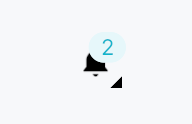
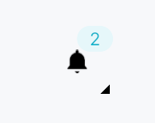

<!-- SPDX-License-Identifier: MPL-2.0 -->
<!-- SPDX-FileCopyrightText: 2026 FernTech -->

# NotificationCenterButton



`NotificationCenterButton` — bell icon with an unread-count badge that
opens a `NotificationLog` popover when clicked.

## Public functions

### `NotificationCenterButton`

| Returns | Function |
| ---: | :--- |
| | **Constructors** |
| `Self` | [`new(archive: Rc<NotificationArchiveModel>)`](#notificationcenterbutton-new) |
| | **Builder methods** |
| `Self` | [`for_window(window_id: TeksiloWindowId)`](#notificationcenterbutton-for_window) |
| `Self` | [`for_audience(audience: ToastAudience)`](#notificationcenterbutton-for_audience) |
| `Self` | [`size(size: IconButtonSize)`](#notificationcenterbutton-size) |
| `Self` | [`show_badge_when_zero(show: bool)`](#notificationcenterbutton-show_badge_when_zero) |
| `Self` | [`max_badge_count(max: u32)`](#notificationcenterbutton-max_badge_count) |
| `Self` | [`placement(p: OverlayPlacement)`](#notificationcenterbutton-placement) |
| `Self` | [`on_action_invoked(f: impl Fn(&NotificationEntry, &ArchivedAction, &mut EventContext) + 'static)`](#notificationcenterbutton-on_action_invoked) |
| `Self` | [`tooltip(text: impl Into<LocalizedString>)`](#notificationcenterbutton-tooltip) |
| `Self` | [`rich_tooltip(key: impl Into<String>)`](#notificationcenterbutton-rich_tooltip) |
| `Self` | [`rich_tooltip_content(content: crate::tooltip::TooltipContent)`](#notificationcenterbutton-rich_tooltip_content) |
| `Self` | [`composite_tooltip(content: impl Widget + 'static)`](#notificationcenterbutton-composite_tooltip) |

## Detailed description

Composed as a `ZStack { PopoverIconButton(bell), Badge }`. The badge
shows the current unread count and is hit-transparent so clicks always
reach the bell beneath. On popover close the archive's `mark_all_read`
is called and the badge resets — matching the GitHub / Slack / JetBrains
convention. Most apps mount this in a `StatusBar` or `TitleBar` trailing
slot; all popover behaviour is self-managed with no further wiring.

#### Accessibility

The inner `IconButton` carries the bell `Role::Button` label; the outer
container is a bare `Role::GenericContainer`, which every adapter steps
through to the button. It is never hidden: a hidden node takes its whole
subtree out of every platform's tree, the button with it. The badge count is not
separately announced — the button label and badge label together convey
the state to sighted users; AT users interact through the button itself.

```ignore
// Typical setup — archive comes from install_toast_default():
let archive: Rc<NotificationArchiveModel> = ctx.app_state().unwrap();
let bell = NotificationCenterButton::new(archive)
    .on_action_invoked(|_entry, action, ctx| {
        if let Some(name) = &action.intent_name {
            ctx.send_intent(teksilo_core::Intent::new(name));
        }
    });
```

## Density

The picture above is the widget at `TargetDensity::Compact`, the mouse-and-keyboard ladder. Below is the same subject on the same canvas with only the ladder changed, so what moves is the density and nothing else — where the subject no longer fits, that is what the denser targets cost it at that size. See `docs/density-and-targets.md`.

**Touch**



## API reference

📖 [Full rustdoc API for this module](https://docs.rs/teksilo-widgets/latest/teksilo_widgets/notification/center_button/index.html)

<a id="notificationcenterbutton"></a>

## `pub struct NotificationCenterButton`

Bell-icon trigger + unread-count badge + popover that contains a
`NotificationLog`. On popover *close* the entries in this bell's
scope are marked read (the user is presumed to have seen the
toasts now).

```rust
pub struct NotificationCenterButton { /* fields */ }
```

### Methods

<a id="notificationcenterbutton-new"></a>

#### `pub fn new(archive: Rc<NotificationArchiveModel>) -> Self`

Construct bound to a shared archive. The archive is typically
held in `app_state` and cloned to every consumer.

<a id="notificationcenterbutton-for_window"></a>

#### `pub fn for_window(mut self, window_id: TeksiloWindowId) -> Self`

Scope this bell to window `window_id`: its badge counts unread
among entries routed to that window (plus any `Broadcast`
entry), and its popover shows only those. Overrides any
previous `for_window` / `for_audience` call.

<a id="notificationcenterbutton-for_audience"></a>

#### `pub fn for_audience(mut self, audience: ToastAudience) -> Self`

Scope this bell to `audience`: its badge counts unread among
entries routed to that audience (plus any `Broadcast` entry),
and its popover shows only those. Overrides any previous
`for_window` / `for_audience` call.

<a id="notificationcenterbutton-size"></a>

#### `pub fn size(mut self, size: IconButtonSize) -> Self`

Bell-icon size. Default `IconButtonSize::Toolbar` (30 dp) —
matches the JetBrains status-bar density.

<a id="notificationcenterbutton-show_badge_when_zero"></a>

#### `pub fn show_badge_when_zero(mut self, show: bool) -> Self`

Whether to keep the badge visible when the unread count is
zero. Default `false` (badge hidden when no unread). Apps
that want a persistent "0" indicator pass `true`.

<a id="notificationcenterbutton-max_badge_count"></a>

#### `pub fn max_badge_count(mut self, max: u32) -> Self`

Cap the displayed badge count. Default `99` — counts above
the cap display as `"99+"`. Set to `u32::MAX` to disable the
cap.

<a id="notificationcenterbutton-placement"></a>

#### `pub fn placement(mut self, p: OverlayPlacement) -> Self`

Popover placement relative to the bell. Default
`BelowPreferred` — flips above when the button is near the
viewport bottom edge.

<a id="notificationcenterbutton-on_action_invoked"></a>

#### `pub fn on_action_invoked( mut self, f: impl Fn(&NotificationEntry, &ArchivedAction, &mut EventContext) + 'static, ) -> Self`

Threaded into the embedded `NotificationLog` —
see `NotificationLog::on_action_invoked` for the contract.
Wire this to dispatch archived actions; without it the
action buttons in the log are inert.

<a id="notificationcenterbutton-tooltip"></a>

#### `pub fn tooltip(mut self, text: impl Into<LocalizedString>) -> Self`

Attach a plain single-line tooltip shown after a hover delay.

Mutually exclusive with `rich_tooltip`,
`rich_tooltip_content`, and
`composite_tooltip` — the last setter
called wins.

<a id="notificationcenterbutton-rich_tooltip"></a>

#### `pub fn rich_tooltip(mut self, key: impl Into<String>) -> Self`

Attach a rich tooltip identified by a registry key.

Mutually exclusive with `tooltip`,
`rich_tooltip_content`, and
`composite_tooltip`.

<a id="notificationcenterbutton-rich_tooltip_content"></a>

#### `pub fn rich_tooltip_content(mut self, content: crate::tooltip::TooltipContent) -> Self`

Attach a rich tooltip from inline `crate::tooltip::TooltipContent`.

Mutually exclusive with `tooltip`,
`rich_tooltip`, and
`composite_tooltip`.

<a id="notificationcenterbutton-composite_tooltip"></a>

#### `pub fn composite_tooltip(mut self, content: impl Widget + 'static) -> Self`

Attach a composite tooltip containing an arbitrary widget tree.

Mutually exclusive with `tooltip`,
`rich_tooltip`, and
`rich_tooltip_content`.
