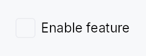

<!-- SPDX-License-Identifier: MPL-2.0 -->
<!-- SPDX-FileCopyrightText: 2026 FernTech -->

# Checkbox



Checkbox — a two-state or tristate checkbox with an optional label.

`Checkbox` renders a square (or rounded-square / circle) toggle box
alongside an optional label and caption. Two modes are supported:

- **Two-state** (`Checkbox::new`): toggles a `Signal<bool>` between
  `true` (checked) and `false` (unchecked) on click or Space.
- **Tristate** (`Checkbox::tristate`): cycles a `Signal<CheckState>`
  between `Checked` and `Unchecked` on user interaction; the
  `Indeterminate` state is set only by external sources such as
  `TreeCheckedModel` aggregation — clicking from `Indeterminate` goes
  to `Checked`, not a further third state.

Chrome (box shape, fill, focus ring) is driven by the active
`CheckboxStyle`; three visual variants are available via
`CheckboxVariant`.

## Accessibility

Announces as `Role::CheckBox`. A label is required in debug builds
unless `.labels_hidden(true)` is set (for embedding inside a composite
row that owns the AT name). Keyboard: Space toggles; lone-KeyUp guard
prevents spurious toggle when focus is restored after a shortcut.

```rust
# use teksilo_widgets::Checkbox;
# use teksilo_core::signal::Signal;
# use teksilo_i18n::lit;
let checked = Signal::new(false);
let _cb = Checkbox::new(checked)
    .label(lit!("Accept terms and conditions"));
```

## Builder methods at a glance

`tristate`, `labels_hidden`, `label`, `caption`, `enabled`, `variant`, `style`, `tooltip`, `rich_tooltip`, `rich_tooltip_content`, `composite_tooltip`

## API reference

📖 [Full rustdoc API for this module](https://docs.rs/teksilo-widgets/latest/teksilo_widgets/checkbox/index.html)

## `pub struct Checkbox`

A checkbox that toggles a `Signal<bool>` or cycles a `Signal<CheckState>`.

```rust
pub struct Checkbox { /* fields */ }
```

### Methods

#### `pub fn new(checked: Signal<bool>) -> Self`

Create a two-state checkbox bound to a `Signal<bool>`.

#### `pub fn tristate(state: Signal<CheckState>) -> Self`

Create a tristate checkbox bound to a `Signal<CheckState>`.

User clicks toggle Checked ↔ Unchecked (clicking from Indeterminate
checks the whole). The `Indeterminate` state is reserved for external
sources — `TreeCheckedModel` aggregation when descendants are mixed,
"select all" indicators, etc. Matches the Outlook / Files-app
folder-checkbox semantic. Useful for parent checkboxes in tree views.

#### `pub fn labels_hidden(mut self, hidden: bool) -> Self`

Suppress the visual label/caption AND the debug-time
"missing accessible label" assertion. Use this **only** when
the checkbox is embedded inside a composite that owns the
row's accessible name (e.g. `StandardListItem` /
`StandardTreeItem`, where the row's `accessibility(builder)`
calls `set_name(...)` with the row label).

**A11y contract:** when `labels_hidden(true)` is set, the
caller MUST guarantee that an addressable AT ancestor
provides the name — either via that ancestor's own
`accessibility()` impl or a builder-level
`.access_label*` override. Without it the AT tree exposes a
`Role::CheckBox` node with no name; screen readers announce
"checkbox, checked" with no context. The Outlook /
Files-app row pattern (where the row label covers the
embedded checkbox) is the supported use case.

#### `pub fn label(mut self, label: impl Into<LocalizedString>) -> Self`

Set the visible label rendered to the right of the checkbox box,
also used as the AT name. Required unless `.labels_hidden(true)` is set.

#### `pub fn caption(mut self, text: impl Into<LocalizedString>) -> Self`

Secondary explanatory text rendered below the label, left-aligned
with the label (not the box). Uses the `small` / `text_secondary`
style. Has no effect unless `label(...)` is also set.

#### `pub fn enabled(mut self, enabled: impl Into<Prop<bool>>) -> Self`

Set the enabled state, statically or reactively. Forwarded to the
arena via `ctx.enabled_when(self_id, self.enabled.clone())` at
build time — a bound `Signal<bool>` updates live.

#### `pub fn variant(mut self, variant: CheckboxVariant) -> Self`

Pick the design-language variant. Default `Square`. The active
`CheckboxStyle` impl decides what the variant means visually
(the IntUI `RecipeCheckboxStyle` honours all three variants
directly via corner-shape changes).

#### `pub fn style(mut self, style: impl teksilo_core::styles::CheckboxStyle) -> Self`

Per-call style override. Replaces the theme-wide default
`CheckboxStyle` for just this Checkbox instance — same role as
`Button::style(...)`.

#### `pub fn tooltip(mut self, text: impl Into<LocalizedString>) -> Self`

Attach a plain tooltip shown after a hover delay.
Clears any previously set rich or composite tooltip (last-call wins).

#### `pub fn rich_tooltip(mut self, key: impl Into<String>) -> Self`

Attach a rich tooltip resolved from the app-wide tooltip
registry. See `Button::rich_tooltip`.

#### `pub fn rich_tooltip_content(mut self, content: crate::tooltip::TooltipContent) -> Self`

Attach a rich tooltip driven by inline `TooltipContent`.

#### `pub fn composite_tooltip( mut self, content: impl teksilo_core::widget::Widget + 'static, ) -> Self`

Attach a composite tooltip — third tier, hosting an arbitrary
widget tree. See `Button::composite_tooltip`.
