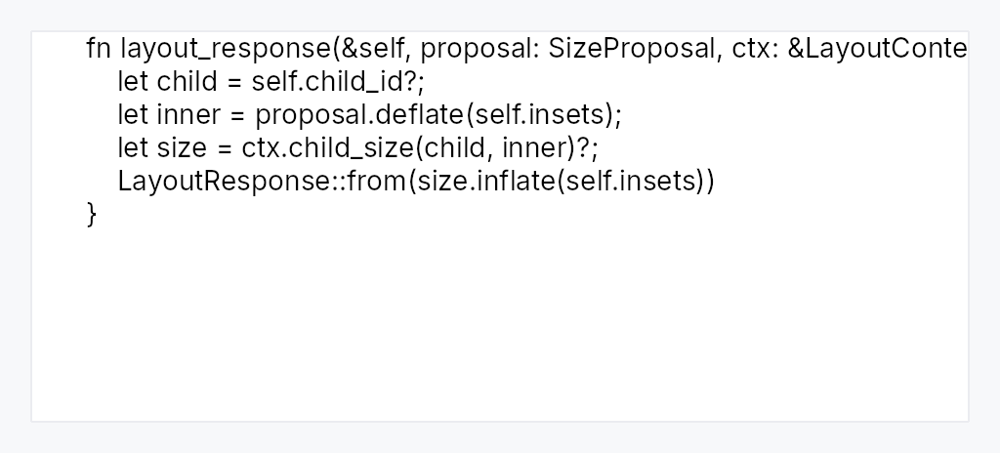

<!-- SPDX-License-Identifier: MPL-2.0 -->
<!-- SPDX-FileCopyrightText: 2026 FernTech -->

# CodeEditorHandle



Multi-line plain-text and code editing surfaces.

Three faces over one core:

- `CodeEditor` — a source editor: gutter, current-line highlight,
  indentation, bracket handling, multiple carets.
- `PlainTextEditor` — the same core with the code affordances off and
  wrapping on: a notes field, a commit message, a description box.
- `LogView` — read-only, append-only, tail-following.

They are one implementation because they differ in *configuration*, not in
kind. All three are a monospaced-or-not run of lines with a caret in it; a
separate widget per face would triplicate the caret, selection, IME,
clipboard, scrolling, and accessibility and let them drift.

# Why not `RichTextEditor`

`RichTextEditor` already edits multi-line text, and this deliberately does
not build on it. Its command vocabulary is tables, lists, blockquotes, and
bold — reusing it would put Tab-navigates-a-table-cell and
Ctrl+B-emboldens into a source file, where the first is wrong and the second
is meaningless. Its state carries a table-aware Ctrl+A ladder and a rich
clipboard fragment; this one carries an indent policy and a caret vector.
The overlap is real but it is the *clock* — the caret blink, the debounce
window, the scroll arithmetic — and that lives in the crate-internal
`common::editor_runtime`, shared by both.

# Language-agnostic by construction

There is no `Language` enum here. Comment tokens, bracket pairs, indent
width, and highlighting are `CodeConfig` values the application supplies:
the editor knows how to toggle a line comment, not that Rust uses `//`.
Guessing would be worse than not knowing — inserting `//` into a Python file
corrupts it silently.

## Builder methods at a glance

`cursor_position`, `cursor_position_signal`, `caret_count`, `bracket_match`, `has_selection`, `can_undo`, `undo`, `redo`, `copy`, `cut`, `paste`, `select_all`, `is_read_only`, `can_redo`, `document_version`, `scroll_y`

## API reference

📖 [Full rustdoc API for this module](../api/teksilo_widgets/code_editor/index.html)

## `pub struct CodeEditorHandle`

A handle onto a live editor, cloneable and detachable from the widget.

The `EditorHandle` pattern: an app keeps one to drive the editor from a
toolbar, a shortcut, or a test without holding the widget itself.

```rust
pub struct CodeEditorHandle { /* fields */ }
```

### Methods

#### `pub fn cursor_position(&self) -> usize`

The caret's document position.

#### `pub fn cursor_position_signal(&self) -> teksilo_core::Signal<usize>`

The primary caret's document position — a character offset into the whole
document, not a line or column — as a reactive signal. Bind it in a status
bar to show a caret position that tracks every caret move, not only edits.

#### `pub fn caret_count(&self) -> teksilo_core::Signal<usize>`

Live caret count — `1` unless multi-caret editing is active.

#### `pub fn bracket_match(&self) -> teksilo_core::Signal<Option<(usize, usize)>>`

The bracket next to the caret and its match, as document positions, or
`None`. Populated only when the editor was configured with
`match_brackets` and bracket pairs; a status surface can bind it, or an
app can read it to drive its own overlay.

#### `pub fn has_selection(&self) -> teksilo_core::Signal<bool>`

#### `pub fn can_undo(&self) -> teksilo_core::Signal<bool>`

#### `pub fn undo(&self)`

Undo this editor's last edit.

The handle could report `can_undo` long before it could
*act* on it, which left a host able to light an Undo button here and
unable to make it do anything. Ctrl+Z inside the widget always worked;
this is the same command from outside.

#### `pub fn redo(&self)`

Redo this editor's last undone edit.

#### `pub fn copy(&self, ctx: &teksilo_core::widget::EventContext<'_>)`

Copy the selection to the clipboard.

#### `pub fn cut(&self, ctx: &teksilo_core::widget::EventContext<'_>)`

Cut the selection to the clipboard.

#### `pub fn paste(&self, ctx: &teksilo_core::widget::EventContext<'_>)`

Paste over the selection.

#### `pub fn select_all(&self)`

Select the whole document.

#### `pub fn is_read_only(&self) -> bool`

Is this editor refusing edits?

#### `pub fn can_redo(&self) -> teksilo_core::Signal<bool>`

#### `pub fn document_version(&self) -> teksilo_core::Signal<u64>`

Bumps on every content or format change.

#### `pub fn scroll_y(&self) -> teksilo_core::Signal<f32>`

## `pub struct CompletionItem`

A completion candidate. Build with `CompletionItem::new` and the fluent
setters; `insert_text` defaults to `label`.

```rust
pub struct CompletionItem { /* fields */ }
```

### Methods

#### `pub fn new(label: impl Into<String>) -> Self`

A candidate whose inserted text is its label.

#### `pub fn insert_text(mut self, text: impl Into<String>) -> Self`

Override the text inserted on accept (when it differs from the label).

#### `pub fn detail(mut self, detail: impl Into<String>) -> Self`

Trailing dimmed detail (a type or signature).

#### `pub fn kind(mut self, kind: CompletionKind) -> Self`

The leading badge category.

## `pub enum CompletionKind`

The category of a completion candidate — drives a small leading badge only.
Deliberately a fixed, language-neutral set: the editor renders a glyph, the
application decides which candidate is which kind.

```rust
pub enum CompletionKind { /* variants */ }
```

### Variants

- **`Text`**
- **`Keyword`**
- **`Function`**
- **`Method`**
- **`Variable`**
- **`Field`**
- **`Type`**
- **`Module`**
- **`Constant`**
- **`Snippet`**

## `pub struct CompletionContext`

What a completion provider is told about the caret when asked for candidates.

```rust
pub struct CompletionContext<'a> { /* fields */ }
```

## `pub enum IndentStyle`

How a line's leading indentation is written.

```rust
pub enum IndentStyle { /* variants */ }
```

### Variants

- **`Spaces`** — `width` spaces per indent level.
- **`Tabs`** — One tab character per level, rendered `width` columns wide.

### Methods

#### `pub fn unit(&self) -> String`

The text one indent level inserts.

#### `pub fn width(&self) -> u8`

How many columns one level occupies on screen. Both styles need this:
spaces to know how many to strip on dedent, tabs to render the stop.

## `pub struct BracketPair`

A pair of characters the editor treats as opening and closing delimiters.

Used for auto-closing and for match highlighting. The application declares
the set, because the *same* character means different things per language:
`<` is a bracket in a generic parameter list and a less-than sign in
arithmetic, and only the caller knows which document this is.

```rust
pub struct BracketPair { /* fields */ }
```

### Methods

#### `pub const fn new(open: char, close: char) -> Self`

## `pub const COMMON_BRACKETS`

The three pairs that are structural in essentially every bracketed
language. A convenience starting point, not a default — an editor with no
configured pairs simply does no bracket handling, which is correct for
prose or a log.

```rust
pub const COMMON_BRACKETS: &[BracketPair] = &[
    BracketPair::new('(', ')'),
    BracketPair::new('[', ']'),
    BracketPair::new('{', '}'),
];
```

## `pub struct CodeConfig`

Editing behaviour the code editor applies, all supplied by the application.

```rust
pub struct CodeConfig { /* fields */ }
```

### Methods

#### `pub fn closing_for(&self, open: char) -> Option<char>`

The closing partner for `open`, if it is a configured opening delimiter.

#### `pub fn opening_for(&self, close: char) -> Option<char>`

The opening partner for `close`, if it is a configured closing delimiter.
