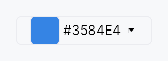

<!-- SPDX-License-Identifier: MPL-2.0 -->
<!-- SPDX-FileCopyrightText: 2026 FernTech -->

# ColorEdit



`ColorEdit` — compact field-style color picker trigger that opens
a popover containing a `ColorPicker`.

Direct analog of `DateEdit`. The
trigger is a `Button` with a reactive `ColorSwatch` in its
leading slot, the current hex as the label, and an optional
chevron in its trailing slot. Click, Enter, Space, or Alt+Down
opens the popover; Escape or click-outside closes it. The inner
picker writes through the same bound `Signal<Color>`, so external
observers see live updates as the user drags within the popover
(no commit step).

Built on [`PopoverButton`]:
the overlay wiring (dormant content + show / dismiss + AT
`has_popup` + `expanded`) lives there. This file is just the
ColorEdit-specific assembly — picker config pass-through, the
reactive trigger, and the nullable-binding bridge.

# Accessibility

The trigger declares `Role::Button`
(via Button), `HasPopup::Dialog`
(via PopoverButton), and tracks the popover open state through
`set_expanded`. The label binds reactively to the hex value so
AT name updates as the picker mutates the bound color.

# Example

```ignore
use teksilo_core::signal::Signal;
use teksilo_tokens::Color;

let color = ctx.signal(Color::new(0.21, 0.52, 0.89, 1.0));
let _edit = ColorEdit::new(color)
    .alpha_enabled(true)
    .show_chevron(true);
```

## Builder methods at a glance

`nullable`, `alpha_enabled`, `swatches`, `swatch_columns`, `picker_layout`, `show_rgb_spinners`, `show_hsv_spinners`, `show_hex_input`, `show_hex_in_trigger`, `show_chevron`, `trigger_swatch_size`, `placement`, `dismiss_behavior`, `label`, `enabled`, `on_open`, `on_close`, `tooltip`, `rich_tooltip`, `rich_tooltip_content`, `composite_tooltip`

## API reference

📖 [Full rustdoc API for this module](https://docs.rs/teksilo-widgets/latest/teksilo_widgets/color_edit/index.html)

## `pub struct ColorEdit`

Compact color cell that opens a full `ColorPicker` in a popover when activated.

```rust
pub struct ColorEdit { /* fields */ }
```

### Methods

#### `pub fn new(value: Signal<Color>) -> Self`

Bind to a non-nullable color signal. The trigger and the picker
both read from and write to the same signal.

#### `pub fn nullable(value: Signal<Option<Color>>) -> Self`

Bind to a nullable color signal. `None` is treated as transparent
black for picker math; any user interaction produces a concrete
`Some(color)`. To clear back to `None`, compose a separate
Clear button alongside the `ColorEdit`.

#### `pub fn alpha_enabled(mut self, enabled: bool) -> Self`

Enable or disable the alpha channel in the picker and the hex trigger label.

#### `pub fn swatches(mut self, s: impl Into<Prop<Vec<Color>>>) -> Self`

Provide a palette of preset swatches shown in the popover —
statically, or reactively via a bound `Signal<Vec<Color>>` so the
palette updates without reopening the popover.

#### `pub fn swatch_columns(mut self, n: usize) -> Self`

Number of columns in the preset swatch grid. Defaults to 6;
clamped to at least 1.

#### `pub fn picker_layout(mut self, l: ColorPickerLayout) -> Self`

Select a popover layout variant — `ColorPickerLayout::Compact`
(default, minimal height) or `Standard` / `Wide` for richer controls.

#### `pub fn show_rgb_spinners(mut self, s: bool) -> Self`

Show or hide the RGB (0–255) component spinners in the popover.

#### `pub fn show_hsv_spinners(mut self, s: bool) -> Self`

Show or hide the HSV (hue/saturation/value) component spinners in the popover.

#### `pub fn show_hex_input(mut self, s: bool) -> Self`

Show or hide the hex string input in the popover.

#### `pub fn show_hex_in_trigger(mut self, s: bool) -> Self`

Show or hide the formatted hex value as the trigger button label.

#### `pub fn show_chevron(mut self, s: bool) -> Self`

Show or hide the trailing chevron glyph on the trigger button.

#### `pub fn trigger_swatch_size(mut self, size: f32) -> Self`

Override the size of the color swatch thumbnail in the trigger button (logical pixels).

#### `pub fn placement(mut self, p: OverlayPlacement) -> Self`

Override where the popover appears relative to the trigger.
Default is `OverlayPlacement::BelowPreferred`.

#### `pub fn dismiss_behavior(mut self, b: DismissBehavior) -> Self`

Override how the popover is dismissed. Default is
`DismissBehavior::EscapeOrClickOutside`.

#### `pub fn label(mut self, label: impl Into<LocalizedString>) -> Self`

Replace the trigger button's visible label with a static localized
string. When set, the hex value is no longer displayed in the trigger
(combine with `.show_hex_in_trigger(false)` if needed).

#### `pub fn enabled(mut self, enabled: impl Into<Prop<bool>>) -> Self`

Set the enabled state, statically or reactively. Forwarded to the
arena at build time.

#### `pub fn on_open(mut self, f: impl Fn() + 'static) -> Self`

Install a callback fired when the color-picker popover opens.

The signature is `Fn()` (no `EventContext`)
because `on_close` is invoked from the overlay-dismiss path,
which has no ctx in scope. To keep the open/close pair
symmetric, `on_open` matches. If you need ctx in a
color-editing-mode callback, attach an `on_tap` on a sibling
trigger that wakes the editor explicitly.

#### `pub fn on_close(mut self, f: impl Fn() + 'static) -> Self`

Install a callback fired when the color-picker popover closes.
See `on_open` for why this is `Fn()` and not
`Fn(&mut EventContext)`.

#### `pub fn tooltip(mut self, text: impl Into<LocalizedString>) -> Self`

Attach a plain single-line tooltip shown after a hover delay.

Mutually exclusive with `rich_tooltip`,
`rich_tooltip_content`, and
`composite_tooltip` — calling this
clears the other slots (last setter wins).

#### `pub fn rich_tooltip(mut self, key: impl Into<String>) -> Self`

Attach a rich tooltip identified by a registry key.

Mutually exclusive with `tooltip`,
`rich_tooltip_content`, and
`composite_tooltip` — calling this
clears the other slots (last setter wins).

#### `pub fn rich_tooltip_content(mut self, content: crate::tooltip::TooltipContent) -> Self`

Attach a rich tooltip from an inline `TooltipContent` value.

Mutually exclusive with `tooltip`,
`rich_tooltip`, and
`composite_tooltip` — calling this
clears the other slots (last setter wins).

#### `pub fn composite_tooltip(mut self, content: impl Widget + 'static) -> Self`

Attach a composite tooltip whose body is an arbitrary widget tree.

Mutually exclusive with `tooltip`,
`rich_tooltip`, and
`rich_tooltip_content` — calling
this clears the other slots (last setter wins).
