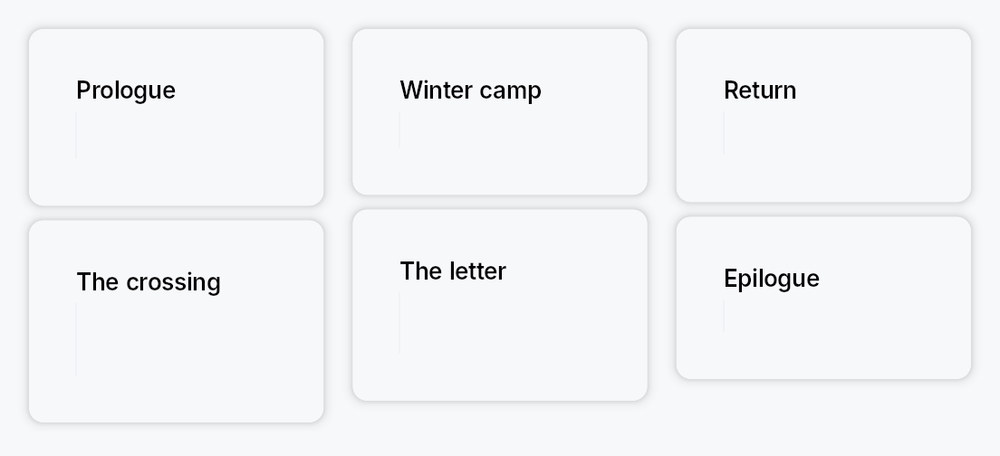

<!-- SPDX-License-Identifier: MPL-2.0 -->
<!-- SPDX-FileCopyrightText: 2026 FernTech -->

# ColumnFlow



`ColumnFlow` — flows children into as many columns as the width affords,
re-partitioning every child when a column is gained or lost.

The newspaper / CSS multi-column model: content runs down column 0, then
down column 1, and so on. The column count is derived from the available
width and `min_column_width` — when the
width no longer affords *N* columns the layout drops to *N−1* and **all**
children are re-partitioned across the survivors. Children are atomic: one
child never straddles a column boundary.

Pair it with a `ScrollArea` for vertical
overflow — `ColumnFlow` reports its true content height (the tallest
column), so the scroll extent is correct.

```rust
# use teksilo_widgets::primitives::column_flow::ColumnFlow;
# use teksilo_widgets::primitives::TextWidget;
# use teksilo_widgets::scroll_area::ScrollArea;
# use teksilo_i18n::lit;
let _view = ScrollArea::new().child(
    ColumnFlow::new()
        .min_column_width(240.0)
        .max_columns(4)
        .column_spacing(16.0)
        .item_spacing(12.0)
        .child(TextWidget::new(lit!("First")))
        .child(TextWidget::new(lit!("Second")))
        .child(TextWidget::new(lit!("Third"))),
);
```

# Reading order

Children are distributed as **contiguous runs in source order** — column 0
takes children `0..i`, column 1 takes `i..j`. So source order, visual
reading order, and focus order are the same thing, at every column count.
This is why `ColumnFlow` does not reuse
`MasonryLayout`'s shortest-column
packing, which interleaves children and would divorce the visual order from
the source order.

# Accessibility

By default `ColumnFlow` emits a bare `Role::GenericContainer` carrying no
properties, which the accessibility walker *prunes*, promoting the children
to its parent in source order. That is the correct outcome for a layout
primitive: it contributes geometry, not semantics, and the reading order is
already right. Add semantics from the outside with `.access_role(..)` /
`.access_label(..)`, or opt into list semantics with
`semantic_list`.

# Relationship to CSS multi-column

Close, but not identical. CSS `column-fill: balance` balances content within
a column height it computes from a *bounded* block size; `ColumnFlow` derives
the column *count* from the width and lets the height run free (a
`ScrollArea` absorbs it). No CSS `column-fill` mode does that, so don't read
this as a CSS multicol port.

## Builder methods at a glance

`min_column_width`, `max_column_width`, `max_columns`, `column_spacing`, `item_spacing`, `alignment`, `column_rule`, `semantic_list`, `add_child`, `child`, `children`, `child_opt`, `column_count_signal`

## API reference

📖 [Full rustdoc API for this module](https://docs.rs/teksilo-widgets/latest/teksilo_widgets/primitives/column_flow/index.html)

## `pub struct ColumnFlow`

A layout that flows its children into as many columns as the available
width affords, re-partitioning every child when a column is gained or lost.

```text
 wide                            narrower
┌────┐ ┌────┐ ┌────┐            ┌────┐ ┌────┐
│ 1  │ │ 3  │ │ 5  │            │ 1  │ │ 4  │
├────┤ ├────┤ ├────┤            ├────┤ ├────┤
│ 2  │ │ 4  │ │ 6  │    ───►    │ 2  │ │ 5  │
└────┘ └────┘ └────┘            ├────┤ ├────┤
                                │ 3  │ │ 6  │
                                └────┘ └────┘
```

Reading order is 1..6 at both widths. See the `module docs`.

```rust
pub struct ColumnFlow { /* fields */ }
```

### Methods

#### `pub fn new() -> Self`

Create a `ColumnFlow` with a 240 dp minimum column width, no maximum
column width, and no column-count cap.

#### `pub fn min_column_width(mut self, width: f32) -> Self`

The narrowest a column may be. The column count is the largest *N* whose
columns are all at least this wide — CSS `column-width` / SwiftUI
`GridItem(.adaptive(minimum:))` / Compose `GridCells.Adaptive(minSize)`.

A value of zero or less pins the layout to a single column.

#### `pub fn max_column_width(mut self, width: f32) -> Self`

The widest a column may be. Unset by default, so columns stretch to
share the full width evenly.

Set it to stop columns becoming unreadably wide when few of them fit a
large display — the reason KDE's `Kirigami.CardsLayout` pairs
`minimumColumnWidth` with `maximumColumnWidth`. When it bites, the
columns no longer fill the width and
`alignment` decides where the block sits.

#### `pub fn max_columns(mut self, max: usize) -> Self`

Never use more than `max` columns however wide the layout gets.

Also decides the count when the width is unconstrained (inside a
size-to-content parent such as a popover): unset, that case reports one
column, matching CSS `column-count: auto` in a shrink-to-fit context.
Clamped to at least 1.

#### `pub fn column_spacing(mut self, spacing: impl Into<Prop<f32>>) -> Self`

Horizontal gap between columns. Accepts an `f32` or a `Signal<f32>`.

#### `pub fn item_spacing(mut self, spacing: impl Into<Prop<f32>>) -> Self`

Vertical gap between items within a column. Accepts an `f32` or a
`Signal<f32>`.

Named for items rather than rows because there are no rows here: a
column's items are independent of its neighbours'.

#### `pub fn alignment(mut self, alignment: HAlignment) -> Self`

Where the column block sits when it does not fill the available width.

Only observable once `max_column_width` clamps
the columns narrower than their even share — otherwise the columns
consume the whole width and there is nothing to align. Defaults to
`HAlignment::Leading`; RTL-aware.

#### `pub fn column_rule(mut self, width: f32, color: impl Into<ColorProp>) -> Self`

Draw a rule of `width` dp, centred in every inter-column gap — CSS
`column-rule`.

Purely decorative: it emits no accessibility node. Accepts a `Color`, a
theme role, or a `Signal`. Pass `BorderRole::Divider` to track the
theme's divider colour.

#### `pub fn semantic_list(mut self, enabled: bool) -> Self`

Expose the children to assistive technology as a list.

The container becomes `Role::List` and every child is wrapped in a
layout-transparent node reporting `Role::ListItem` with its position and
the set size, so a screen reader announces "list, 30 items" and
"item 5 of 30" rather than reading 30 unrelated widgets.

Off by default: a layout primitive should not invent semantics its
content may not have. Turn it on when the children genuinely *are* a
list of peers. Costs one extra node per child.

#### `pub fn add_child(mut self, id: WidgetId) -> Self`

Add a pre-registered child by ID.

#### `pub fn child(mut self, widget: impl Widget + 'static) -> Self`

Add an inline child widget (deferred insertion).

#### `pub fn children(mut self, iter: impl IntoIterator<Item = impl Widget + 'static>) -> Self`

Add multiple inline children from an iterator.

#### `pub fn child_opt(mut self, widget: Option<impl Widget + 'static>) -> Self`

Conditionally add a child. No-op if `None`.

#### `pub fn column_count_signal(&self) -> Signal<usize>`

The live column count, as a reactive signal.

Lets an app follow the reflow — swapping to a compact header at one
column, say. Written from the layout pass behind an equality guard, so
it only fires when the count actually changes.

**Binding contract.** Safe for `RepaintOnly` / `AccessibilityOnly`
consumers, and for `Relayout` consumers that do not feed back into this
widget's own width. The count is a pure function of the width
`ColumnFlow` is *given* — it never changes its own width, so it cannot
oscillate on its own. But a `Relayout` consumer that resizes something
which in turn resizes this `ColumnFlow` closes a feedback loop through
the layout pass, which is exactly what
`Widget::place_children`'s own documentation warns against.

