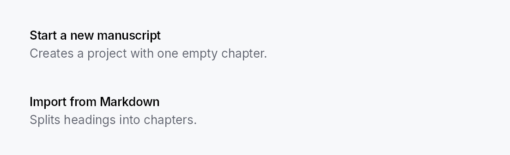
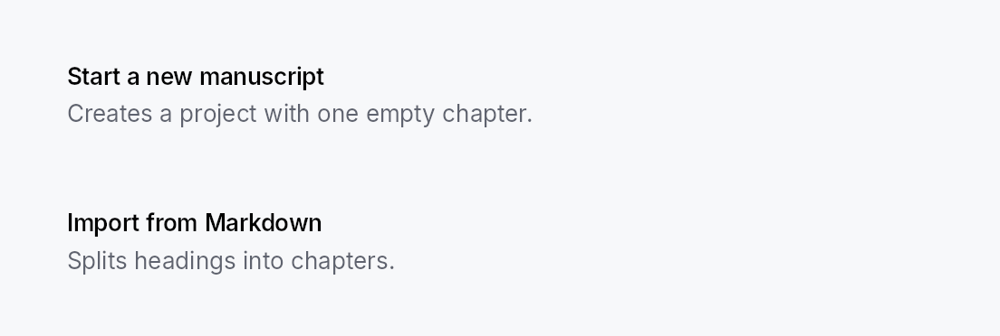

<!-- SPDX-License-Identifier: MPL-2.0 -->
<!-- SPDX-FileCopyrightText: 2026 FernTech -->

# CommandLinkButton



CommandLinkButton — large two-line button with icon, title, and
subtitle. Used for wizard landing screens, onboarding choices, and
any "card-shaped CTA" pattern.

## Public types

| Kind | Name |
| ---: | :--- |
| `const` | [`COMMAND_LINK_BUTTON_ICON_SIZE`](#command_link_button_icon_size) — CommandLinkButton design tokens |
| `const` | [`COMMAND_LINK_BUTTON_ICON_TEXT_GAP`](#command_link_button_icon_text_gap) |
| `fn` | [`command_link_button_icon_text_gap`](#command_link_button_icon_text_gap-2) — `COMMAND_LINK_BUTTON_ICON_TEXT_GAP` scaled by the density's `spacing_factor` (1.00 / 1.15 / 1.30) |
| `const` | [`COMMAND_LINK_BUTTON_TITLE_DESCRIPTION_GAP`](#command_link_button_title_description_gap) |
| `fn` | [`command_link_button_title_description_gap`](#command_link_button_title_description_gap-2) — `COMMAND_LINK_BUTTON_TITLE_DESCRIPTION_GAP` scaled by the density's `spacing_factor` (1.00 / 1.15 / 1.30) |
| `const` | [`COMMAND_LINK_BUTTON_PADDING_HORIZONTAL`](#command_link_button_padding_horizontal) |
| `fn` | [`command_link_button_padding_horizontal`](#command_link_button_padding_horizontal-2) — `COMMAND_LINK_BUTTON_PADDING_HORIZONTAL` scaled by the density's `spacing_factor` (1.00 / 1.15 / 1.30) |
| `const` | [`COMMAND_LINK_BUTTON_PADDING_VERTICAL`](#command_link_button_padding_vertical) |
| `fn` | [`command_link_button_padding_vertical`](#command_link_button_padding_vertical-2) — `COMMAND_LINK_BUTTON_PADDING_VERTICAL` scaled by the density's `spacing_factor` (1.00 / 1.15 / 1.30) |
| `const` | [`COMMAND_LINK_BUTTON_MIN_HEIGHT`](#command_link_button_min_height) |
| `fn` | [`command_link_button_min_height`](#command_link_button_min_height-2) — `COMMAND_LINK_BUTTON_MIN_HEIGHT` raised to the density's `target_size` (24 / 32 / 44 dp) |
| `struct` | [`CommandLinkButton`](#commandlinkbutton) — A large two-line CTA button: icon + title + subtitle |

## Public functions

### `CommandLinkButton`

| Returns | Function |
| ---: | :--- |
| | **Constructors** |
| `Self` | [`new(title: impl Into<LocalizedString>)`](#commandlinkbutton-new) |
| | **Builder methods** |
| `Self` | [`description(text: impl Into<LocalizedString>)`](#commandlinkbutton-description) |
| `Self` | [`icon(icon: IconWidget)`](#commandlinkbutton-icon) |
| `Self` | [`enabled(enabled: impl Into<Prop<bool>>)`](#commandlinkbutton-enabled) |
| `Self` | [`on_activate_fn(f: impl Fn(&mut EventContext) + 'static)`](#commandlinkbutton-on_activate_fn) |
| `Self` | [`title_style(style: impl Into<teksilo_core::color_prop::TextStyleProp>)`](#commandlinkbutton-title_style) |
| `Self` | [`description_style(style: impl Into<teksilo_core::color_prop::TextStyleProp>)`](#commandlinkbutton-description_style) |
| `Self` | [`title_color(color: impl Into<teksilo_core::color_prop::ColorProp>)`](#commandlinkbutton-title_color) |
| `Self` | [`description_color(color: impl Into<teksilo_core::color_prop::ColorProp>)`](#commandlinkbutton-description_color) |
| `Self` | [`tooltip(text: impl Into<LocalizedString>)`](#commandlinkbutton-tooltip) |
| `Self` | [`rich_tooltip(key: impl Into<String>)`](#commandlinkbutton-rich_tooltip) |
| `Self` | [`rich_tooltip_content(content: crate::tooltip::TooltipContent)`](#commandlinkbutton-rich_tooltip_content) |
| `Self` | [`composite_tooltip(content: impl Widget + 'static)`](#commandlinkbutton-composite_tooltip) |

## Detailed description

Modeled on Qt's `QCommandLinkButton`. Distinct from a regular
`Button` by its layout (`HStack(icon +
VStack(title + subtitle))`) and default visual variant (`Flat` —
Int UI convention — with an interactive surface tint on hover).

```ignore
CommandLinkButton::new(tr!(create_new_project()))
    .description(tr!(create_new_project_subtitle()))
    .icon(IconWidget::from_svg(NEW_PROJECT_ICON))
    .on_activate_fn(|ctx| ctx.send_intent(AppIntent::NewProject))
```

#### Touch and pen

Shares `build_interaction_handlers` with `Button`; see that
module's "Touch and pen" section. A command link is a tall, wide target by
construction, so no hit-widening mechanism is involved.

## Density

The picture above is the widget at `TargetDensity::Compact`, the mouse-and-keyboard ladder. Below is the same subject on the same canvas with only the ladder changed, so what moves is the density and nothing else — where the subject no longer fits, that is what the denser targets cost it at that size. See `docs/density-and-targets.md`.

**Touch**



## API reference

📖 [Full rustdoc API for this module](https://docs.rs/teksilo-widgets/latest/teksilo_widgets/command_link_button/index.html)

<a id="command_link_button_icon_size"></a>

## `pub const COMMAND_LINK_BUTTON_ICON_SIZE`

CommandLinkButton design tokens. The widget is a group-4 composite
with no dedicated recipe module.

```rust
pub const COMMAND_LINK_BUTTON_ICON_SIZE: f32 = 28.0;
```

<a id="command_link_button_icon_text_gap"></a>

## `pub const COMMAND_LINK_BUTTON_ICON_TEXT_GAP`

```rust
pub const COMMAND_LINK_BUTTON_ICON_TEXT_GAP: f32 = 14.0;
```

<a id="command_link_button_icon_text_gap-2"></a>

## `pub fn command_link_button_icon_text_gap(...)`

`COMMAND_LINK_BUTTON_ICON_TEXT_GAP` scaled by the density's `spacing_factor`
(1.00 / 1.15 / 1.30).

```rust
pub fn command_link_button_icon_text_gap(tokens: &InputTokens) -> f32;
```

<a id="command_link_button_title_description_gap"></a>

## `pub const COMMAND_LINK_BUTTON_TITLE_DESCRIPTION_GAP`

```rust
pub const COMMAND_LINK_BUTTON_TITLE_DESCRIPTION_GAP: f32 = 4.0;
```

<a id="command_link_button_title_description_gap-2"></a>

## `pub fn command_link_button_title_description_gap(...)`

`COMMAND_LINK_BUTTON_TITLE_DESCRIPTION_GAP` scaled by the density's `spacing_factor`
(1.00 / 1.15 / 1.30).

```rust
pub fn command_link_button_title_description_gap(tokens: &InputTokens) -> f32;
```

<a id="command_link_button_padding_horizontal"></a>

## `pub const COMMAND_LINK_BUTTON_PADDING_HORIZONTAL`

```rust
pub const COMMAND_LINK_BUTTON_PADDING_HORIZONTAL: f32 = 16.0;
```

<a id="command_link_button_padding_horizontal-2"></a>

## `pub fn command_link_button_padding_horizontal(...)`

`COMMAND_LINK_BUTTON_PADDING_HORIZONTAL` scaled by the density's `spacing_factor`
(1.00 / 1.15 / 1.30).

```rust
pub fn command_link_button_padding_horizontal(tokens: &InputTokens) -> f32;
```

<a id="command_link_button_padding_vertical"></a>

## `pub const COMMAND_LINK_BUTTON_PADDING_VERTICAL`

```rust
pub const COMMAND_LINK_BUTTON_PADDING_VERTICAL: f32 = 14.0;
```

<a id="command_link_button_padding_vertical-2"></a>

## `pub fn command_link_button_padding_vertical(...)`

`COMMAND_LINK_BUTTON_PADDING_VERTICAL` scaled by the density's `spacing_factor`
(1.00 / 1.15 / 1.30).

```rust
pub fn command_link_button_padding_vertical(tokens: &InputTokens) -> f32;
```

<a id="command_link_button_min_height"></a>

## `pub const COMMAND_LINK_BUTTON_MIN_HEIGHT`

```rust
pub const COMMAND_LINK_BUTTON_MIN_HEIGHT: f32 = 64.0;
```

<a id="command_link_button_min_height-2"></a>

## `pub fn command_link_button_min_height(...)`

`COMMAND_LINK_BUTTON_MIN_HEIGHT` raised to the density's `target_size`
(24 / 32 / 44 dp). The identity at Compact.

```rust
pub fn command_link_button_min_height(tokens: &InputTokens) -> f32;
```

<a id="commandlinkbutton"></a>

## `pub struct CommandLinkButton`

A large two-line CTA button: icon + title + subtitle.

```rust
pub struct CommandLinkButton { /* fields */ }
```

### Methods

<a id="commandlinkbutton-new"></a>

#### `pub fn new(title: impl Into<LocalizedString>) -> Self`

Create a `CommandLinkButton` with the given title text.
Chain `.description(...)` and `.icon(...)` to complete the card layout.

<a id="commandlinkbutton-description"></a>

#### `pub fn description(mut self, text: impl Into<LocalizedString>) -> Self`

Optional descriptive subtitle rendered below the title.

<a id="commandlinkbutton-icon"></a>

#### `pub fn icon(mut self, icon: IconWidget) -> Self`

Leading icon — large enough to anchor the card visually
(rendered at 28 dp).

<a id="commandlinkbutton-enabled"></a>

#### `pub fn enabled(mut self, enabled: impl Into<Prop<bool>>) -> Self`

Set the enabled state, statically or reactively. Forwarded to
the arena at build time.

<a id="commandlinkbutton-on_activate_fn"></a>

#### `pub fn on_activate_fn(mut self, f: impl Fn(&mut EventContext) + 'static) -> Self`

Closure invoked on activation. Use `ctx.send_intent(...)` to
route through the Action / Intent system.

<a id="commandlinkbutton-title_style"></a>

#### `pub fn title_style( mut self, style: impl Into<teksilo_core::color_prop::TextStyleProp>, ) -> Self`

Override the title's text style (font, size, weight). Accepts a
`TextStyleRole`, a `TextStyle`, or a `Signal` of either. Default
(unset) is `TextStyleRole::BodyBold`.

<a id="commandlinkbutton-description_style"></a>

#### `pub fn description_style( mut self, style: impl Into<teksilo_core::color_prop::TextStyleProp>, ) -> Self`

Override the description's text style. Default is `TextStyleRole::Body`.

<a id="commandlinkbutton-title_color"></a>

#### `pub fn title_color(mut self, color: impl Into<teksilo_core::color_prop::ColorProp>) -> Self`

Override the title's text color. Accepts `Color`, a role, or a
`Signal` of either. Default (unset) is `TextRole::Primary`.

<a id="commandlinkbutton-description_color"></a>

#### `pub fn description_color( mut self, color: impl Into<teksilo_core::color_prop::ColorProp>, ) -> Self`

Override the description's text color. Default is `TextRole::Secondary`.

<a id="commandlinkbutton-tooltip"></a>

#### `pub fn tooltip(mut self, text: impl Into<LocalizedString>) -> Self`

Attach a plain single-line tooltip shown after a hover delay.
Clears any previously set rich or composite tooltip.

<a id="commandlinkbutton-rich_tooltip"></a>

#### `pub fn rich_tooltip(mut self, key: impl Into<String>) -> Self`

Attach a rich tooltip looked up by registry key.
Clears any previously set plain or composite tooltip.

<a id="commandlinkbutton-rich_tooltip_content"></a>

#### `pub fn rich_tooltip_content(mut self, content: crate::tooltip::TooltipContent) -> Self`

Attach a rich tooltip with inline content (no registry lookup).
Clears any previously set plain or composite tooltip.

<a id="commandlinkbutton-composite_tooltip"></a>

#### `pub fn composite_tooltip(mut self, content: impl Widget + 'static) -> Self`

Attach a composite tooltip hosting an arbitrary widget tree body.
Clears any previously set plain or rich tooltip.
