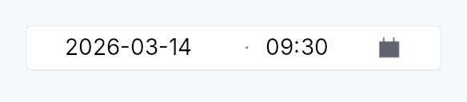
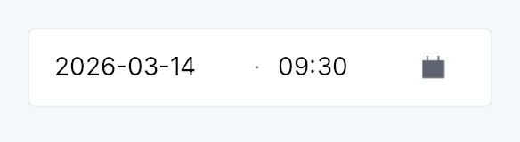

<!-- SPDX-License-Identifier: MPL-2.0 -->
<!-- SPDX-FileCopyrightText: 2026 FernTech -->

# DateTimeEdit



`DateTimeEdit` — single unified control for picking a `DateTime`.

## Public functions

### `DateTimeEdit`

| Returns | Function |
| ---: | :--- |
| | **Constructors** |
| `Self` | [`new(value: Signal<Option<DateTime>>)`](#datetimeedit-new) |
| `Self` | [`required(value: Signal<DateTime>)`](#datetimeedit-required) |
| | **Builder methods** |
| `Self` | [`style(style: impl teksilo_core::styles::DateEditStyle)`](#datetimeedit-style) |
| `Self` | [`date_format_pattern(p: impl Into<String>)`](#datetimeedit-date_format_pattern) |
| `Self` | [`time_format(f: TimeFormat)`](#datetimeedit-time_format) |
| `Self` | [`seconds(mode: SecondsMode)`](#datetimeedit-seconds) |
| `Self` | [`min(dt: DateTime)`](#datetimeedit-min) |
| `Self` | [`max(dt: DateTime)`](#datetimeedit-max) |
| `Self` | [`step_minutes(n: u32)`](#datetimeedit-step_minutes) |
| `Self` | [`first_day_of_week(w: Weekday)`](#datetimeedit-first_day_of_week) |
| `Self` | [`show_calendar_button(show: bool)`](#datetimeedit-show_calendar_button) |
| `Self` | [`separator(s: impl Into<String>)`](#datetimeedit-separator) |
| `Self` | [`placeholder(text: impl Into<LocalizedString>)`](#datetimeedit-placeholder) |
| `Self` | [`enabled(enabled: impl Into<Prop<bool>>)`](#datetimeedit-enabled) |
| `Self` | [`read_only(read_only: bool)`](#datetimeedit-read_only) |
| `Self` | [`label(label: impl Into<LocalizedString>)`](#datetimeedit-label) |
| `Self` | [`validation_behavior(behavior: ValidationBehavior)`](#datetimeedit-validation_behavior) |
| `Self` | [`time_width_policy(policy: crate::date_edit::WidthPolicy)`](#datetimeedit-time_width_policy) |
| `Self` | [`on_value_changed(f: impl Fn(Option<DateTime>, &mut EventContext) + 'static)`](#datetimeedit-on_value_changed) |
| `Self` | [`tooltip(text: impl Into<LocalizedString>)`](#datetimeedit-tooltip) |
| `Self` | [`rich_tooltip(key: impl Into<String>)`](#datetimeedit-rich_tooltip) |
| `Self` | [`rich_tooltip_content(content: crate::tooltip::TooltipContent)`](#datetimeedit-rich_tooltip_content) |
| `Self` | [`composite_tooltip(content: impl Widget + 'static)`](#datetimeedit-composite_tooltip) |
| | **Methods** |
| `Signal<ValidationFeedback>` | [`validation_feedback_signal()`](#datetimeedit-validation_feedback_signal) |
| `Signal<Option<DateTime>>` | [`value()`](#datetimeedit-value) |

## Detailed description

Visually one widget: a single bordered frame containing a date
`TextInputField` half, a small painted separator, a time
`TextInputField` half, and a trailing built-in calendar button that
opens a `Calendar` popover anchored below the wrapper. Backed by
`Signal<Option<DateTime>>`.

```text
┌──────────────────────────────────────┐
│ 05/02/2026   ·   14:35   │ 📅       │
└──────────────────────────────────────┘
```

### Why one frame?

Two adjacent `DateEdit` + `TimeEdit` (one frame each) visually read
as two separate fields that happen to be next to each other. A single
frame says "this is one moment in time" — same affordance the user
is used to from booking sites, calendar apps, and form builders.

### Behaviour

- **Two text halves** — date pattern on the left (locale-derived
  strftime subset), time pattern on the right (24h or 12h, with or
  without seconds). Each half carries its own input mask, validator,
  and segment-stepping (Up/Down on the focused segment).
- **Painted separator** — a thin middle-dot glyph (`·`), no text.
  Visual only; AT users see the wrapper's `Role::DateTimeInput`. The
  separator can be replaced with a custom string via
  `separator` (rendered as styled secondary text).
- **One trailing calendar button** — Int UI `IconButton::embedded()` with the
  calendar glyph. Opens a single popover hosting `Calendar::single`
  bound to the date half. Picking a cell commits the date and closes
  the popover; the time half retains whatever the user typed.
- **One frame** — focus-aware border (`BorderRole::Focused` while
  any half holds focus, otherwise `Default`), validation-aware
  border (`Error` for `Invalid`, `Focused` for `Corrected`).
- **One validation strip** below the frame — composed feedback from
  both halves (worse of the two wins).

### Accessibility

- Container: `Role::DateTimeInput`, its value the day in full and the
  time in the tree's locale ("samedi 2 mai 2026 à 14:35", "Saturday,
  May 2, 2026 at 2:35 PM"), with the seconds only when the field shows
  them. The clock is the locale's: an explicit `.time_format(...)`
  changes what the field shows, not how the value is read.
- Each `TextInputField` keeps its own AT node, a `Role::TextInput`
  named for its half ("Date", "Time"); the wrapper's
  `Role::DateTimeInput` provides the datetime semantics. The halves were
  re-roled `Role::DateInput` / `Role::TimeInput`, which the AT-SPI
  adapter hands a reader as a date editor, and Orca reads a date editor
  by its name and role alone: "Date date editor.", never the date. An
  editable text field is read with its text.
- The calendar opens on the date the date half holds, on its days,
  whatever an earlier opening left.

```ignore
// Requires ctx.signal() — shown as ignore per convention.
use teksilo_widgets::date_time_edit::DateTimeEdit;
use teksilo_widgets::time_edit::SecondsMode;

let datetime = ctx.signal(None);
let _w = DateTimeEdit::new(datetime.clone())
    .seconds(SecondsMode::Hidden)
    .on_value_changed(|dt, _ctx| println!("{dt:?}"));
```

#### Touch and pen

See `DateEdit`'s "Touch and pen" section.

## Density

The picture above is the widget at `TargetDensity::Compact`, the mouse-and-keyboard ladder. Below is the same subject on the same canvas with only the ladder changed, so what moves is the density and nothing else — where the subject no longer fits, that is what the denser targets cost it at that size. See `docs/density-and-targets.md`.

**Touch**



## API reference

📖 [Full rustdoc API for this module](https://docs.rs/teksilo-widgets/latest/teksilo_widgets/date_time_edit/index.html)

<a id="datetimeedit"></a>

## `pub struct DateTimeEdit`

Single unified datetime picker over `Signal<Option<DateTime>>`. See
the `module docs` for the visual layout and behaviour.

```rust
pub struct DateTimeEdit { /* fields */ }
```

### Methods

<a id="datetimeedit-new"></a>

#### `pub fn new(value: Signal<Option<DateTime>>) -> Self`

Create a datetime picker backed by the optional `value` signal.

<a id="datetimeedit-style"></a>

#### `pub fn style(mut self, style: impl teksilo_core::styles::DateEditStyle) -> Self`

Per-call DateEditStyle override (shared with DateEdit family).

<a id="datetimeedit-required"></a>

#### `pub fn required(value: Signal<DateTime>) -> Self`

Create a datetime picker backed by a *required* (non-optional) signal.
The widget wraps it in an `Option` proxy internally and keeps the two
in sync via `ctx.effect` — the outer signal is never set to `None`.

<a id="datetimeedit-date_format_pattern"></a>

#### `pub fn date_format_pattern(mut self, p: impl Into<String>) -> Self`

Override the strftime-subset format pattern for the date half
(e.g. `"%d/%m/%Y"`). Defaults to the locale-derived pattern.

<a id="datetimeedit-time_format"></a>

#### `pub fn time_format(mut self, f: TimeFormat) -> Self`

Lock the time half to a specific clock (12h or 24h). When this
builder is *not* called, the time half defaults to the user's
current locale via `prefers_12_hour_clock` — same rule as
standalone `TimeEdit`.

<a id="datetimeedit-seconds"></a>

#### `pub fn seconds(mut self, mode: SecondsMode) -> Self`

Whether the time half includes a seconds field. Defaults to `SecondsMode::Hidden`.

<a id="datetimeedit-min"></a>

#### `pub fn min(mut self, dt: DateTime) -> Self`

Earliest selectable datetime (inclusive). Both the calendar cell and the
text validator enforce this floor.

<a id="datetimeedit-max"></a>

#### `pub fn max(mut self, dt: DateTime) -> Self`

Latest selectable datetime (inclusive). Both the calendar cell and the
text validator enforce this ceiling.

<a id="datetimeedit-step_minutes"></a>

#### `pub fn step_minutes(mut self, n: u32) -> Self`

Minute increment for Up/Down segment stepping on the minute field.
Defaults to `1`; values below `1` are clamped to `1`.

**Currently inert**, exactly as on `TimeEdit`: segment-aware
stepping moves the field under the caret by one of *that*
segment's units (±1, ±10 with Shift, ±10 / ±100 on the page
keys) rather than by a fixed number of minutes. The builder is
kept on the public surface so callers that already configured it
still compile, and as the hook a future per-segment custom step
would use; it has no effect today.

<a id="datetimeedit-first_day_of_week"></a>

#### `pub fn first_day_of_week(mut self, w: Weekday) -> Self`

Override which weekday appears in the first column of the calendar popup.

<a id="datetimeedit-show_calendar_button"></a>

#### `pub fn show_calendar_button(mut self, show: bool) -> Self`

Show or hide the trailing calendar button. Default `true`.

<a id="datetimeedit-separator"></a>

#### `pub fn separator(mut self, s: impl Into<String>) -> Self`

Override the painted middle-dot separator with a custom string
(rendered as styled secondary text between the two halves).
Pass an empty string to suppress the separator entirely.

<a id="datetimeedit-placeholder"></a>

#### `pub fn placeholder(mut self, text: impl Into<LocalizedString>) -> Self`

Placeholder shown when the datetime is `None`.

<a id="datetimeedit-enabled"></a>

#### `pub fn enabled(mut self, enabled: impl Into<Prop<bool>>) -> Self`

Set the enabled state, statically or reactively. Forwarded to the
arena at build time.

<a id="datetimeedit-read_only"></a>

#### `pub fn read_only(mut self, read_only: bool) -> Self`

Make both halves read-only; the calendar button is also disabled.

<a id="datetimeedit-label"></a>

#### `pub fn label(mut self, label: impl Into<LocalizedString>) -> Self`

Accessible label for the wrapper `Role::DateTimeInput` node. When not
set, falls back to the localized `date-time-edit-name` message.

<a id="datetimeedit-validation_behavior"></a>

#### `pub fn validation_behavior(mut self, behavior: ValidationBehavior) -> Self`

How parse failures are surfaced. Forwarded to both halves —
each half uses the same behaviour.

<a id="datetimeedit-time_width_policy"></a>

#### `pub fn time_width_policy(mut self, policy: crate::date_edit::WidthPolicy) -> Self`

How the trailing (time) half claims horizontal space. The
leading (date) half always sizes to its natural mask width;
the time half follows this policy. Default
`WidthPolicy::Default` (natural width); pass
`WidthPolicy::Fill` to make the time half absorb extra
space the parent offers.

<a id="datetimeedit-validation_feedback_signal"></a>

#### `pub fn validation_feedback_signal(&self) -> Signal<ValidationFeedback>`

Reactive handle on the composed validation feedback. Reflects
whichever half is more severe (`Invalid > Corrected > Valid >
Pristine`).

<a id="datetimeedit-on_value_changed"></a>

#### `pub fn on_value_changed( mut self, f: impl Fn(Option<DateTime>, &mut EventContext) + 'static, ) -> Self`

Callback invoked whenever the datetime changes. Receives the new
`Option<DateTime>` and an `EventContext` for dispatching intents.

<a id="datetimeedit-tooltip"></a>

#### `pub fn tooltip(mut self, text: impl Into<LocalizedString>) -> Self`

Show a plain single-line tooltip after a hover delay. Mutually
exclusive with `rich_tooltip` / `rich_tooltip_content` /
`composite_tooltip` — each setter clears the other three so the
last call wins.

<a id="datetimeedit-rich_tooltip"></a>

#### `pub fn rich_tooltip(mut self, key: impl Into<String>) -> Self`

Show a rich tooltip identified by a registry key. Mutually
exclusive with `tooltip` / `rich_tooltip_content` /
`composite_tooltip` — each setter clears the other three so the
last call wins.

<a id="datetimeedit-rich_tooltip_content"></a>

#### `pub fn rich_tooltip_content(mut self, content: crate::tooltip::TooltipContent) -> Self`

Show a rich tooltip with inline content. Mutually exclusive with
`tooltip` / `rich_tooltip` / `composite_tooltip` — each setter
clears the other three so the last call wins.

<a id="datetimeedit-composite_tooltip"></a>

#### `pub fn composite_tooltip(mut self, content: impl Widget + 'static) -> Self`

Show a composite tooltip whose body is an arbitrary widget tree.
Mutually exclusive with `tooltip` / `rich_tooltip` /
`rich_tooltip_content` — each setter clears the other three so
the last call wins.

<a id="datetimeedit-value"></a>

#### `pub fn value(&self) -> Signal<Option<DateTime>>`

Clone the underlying `Signal<Option<DateTime>>` for external binding.
