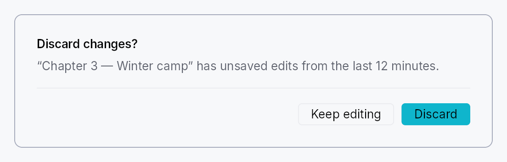
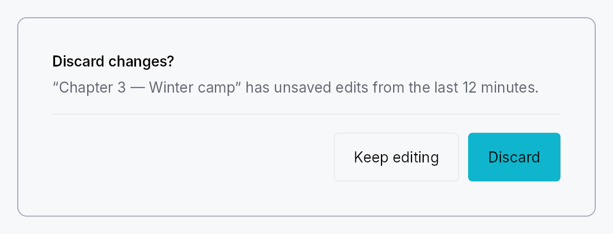

<!-- SPDX-License-Identifier: MPL-2.0 -->
<!-- SPDX-FileCopyrightText: 2026 FernTech -->

# Dialog



Modal dialogs — a trigger button that presents a centered modal panel.

## Public types

| Kind | Name |
| ---: | :--- |
| `struct` | [`ModalContainer`](#modalcontainer) — Rounded panel chrome that wraps a modal dialog's content widget |
| `struct` | [`ModalScrim`](#modalscrim) — Full-viewport dimming scrim painted behind a `ModalContainer` |
| `struct` | [`DialogContent`](#dialogcontent) — Convenience body layout for a modal dialog: optional title, supporting text, scrollable body slot, and a `Divider`-separated footer row |
| `struct` | [`Dialog`](#dialog) — A trigger button that presents a modal dialog when activated |

## Public functions

### `Dialog`

| Returns | Function |
| ---: | :--- |
| | **Constructors** |
| `Self` | [`new(label: impl Into<LocalizedString>)`](#dialog-new) |
| | **Builder methods** |
| `Self` | [`content<W, F>(factory: F)`](#dialog-content) |
| `Self` | [`variant(variant: ButtonVariant)`](#dialog-variant) |
| `Self` | [`enabled(enabled: impl Into<Prop<bool>>)`](#dialog-enabled) |
| `Self` | [`presentation(presentation: ModalPresentation)`](#dialog-presentation) |
| `Self` | [`close_behavior(close_behavior: ModalCloseBehavior)`](#dialog-close_behavior) |
| `Self` | [`trigger(trigger: impl teksilo_core::IntoTeksiChild)`](#dialog-trigger) |

### `ModalContainer`

| Returns | Function |
| ---: | :--- |
| | **Constructors** |
| `Self` | [`new(content: impl Widget + 'static)`](#modalcontainer-new) |
| | **Builder methods** |
| `Self` | [`padding(padding: f32)`](#modalcontainer-padding) |
| `Self` | [`min_width(min_width: f32)`](#modalcontainer-min_width) |
| `Self` | [`style(style: impl teksilo_core::styles::DialogStyle)`](#modalcontainer-style) |
| `Self` | [`title(title: impl Into<LocalizedString>)`](#modalcontainer-title) |

### `ModalScrim`

| Returns | Function |
| ---: | :--- |
| | **Constructors** |
| `Self` | [`new()`](#modalscrim-new) |
| | **Builder methods** |
| `Self` | [`style(style: impl teksilo_core::styles::DialogStyle)`](#modalscrim-style) |
| `Self` | [`dismiss_target(target: Rc<Cell<Option<OverlayId>>>)`](#modalscrim-dismiss_target) |
| `Self` | [`click_to_dismiss(enabled: bool)`](#modalscrim-click_to_dismiss) |

### `DialogContent`

| Returns | Function |
| ---: | :--- |
| | **Constructors** |
| `Self` | [`new()`](#dialogcontent-new) |
| | **Builder methods** |
| `Self` | [`title(title: impl Into<LocalizedString>)`](#dialogcontent-title) |
| `Self` | [`supporting_text(text: impl Into<LocalizedString>)`](#dialogcontent-supporting_text) |
| `Self` | [`body(body: impl teksilo_core::IntoTeksiChild)`](#dialogcontent-body) |
| `Self` | [`footer(footer: impl teksilo_core::IntoTeksiChild)`](#dialogcontent-footer) |

## Detailed description

Three cooperating types cover the common dialog use-case. `Dialog` is the
high-level entry point: a `Button` (or custom trigger) that, on activation,
presents a `ModalContainer` above a full-viewport dimming `ModalScrim`.
`DialogContent` is the convenience body layout — a `VStack` with an
optional title, supporting text, scrollable body slot, and a footer slot
separated by a `Divider`.

#### When to use

- `Dialog::new(label).content(|| …)` for the common "button opens dialog" pattern.
- `Dialog::new(label).trigger(my_icon_button).content(|| …)` to use a custom widget
  as the trigger instead of the default `Button`.
- `ModalContainer::new(content)` directly when you need to present a modal from
  handler code via `ctx.present_modal(ModalRequest::…)` rather than a persistent
  trigger.

#### Accessibility

`ModalContainer` is a `Role::Dialog` node and announces `set_modal()`.
Its accessible name defaults to the `DialogContent` title (via
`Widget::accessible_title_hint`) or falls back to the localized
`a11y_dialog_name` message; pass `.title(tr!(…))` to the container for an
explicit override. When the content's own node is already a dialog (a
`MessageBox`'s `Role::AlertDialog`, a `CommandPalette`'s `Role::Dialog`),
the container publishes no node of its own, so a reader meets one dialog
and hears its title once. The trigger button advertises `HasPopup::Dialog` and
`set_expanded` tracks whether the modal is currently open.

```ignore
use teksilo_widgets::dialog::{Dialog, DialogContent};
use teksilo_i18n::lit;

let _d = Dialog::new(lit!("Open settings"))
    .content(|| {
        DialogContent::new()
            .title(lit!("Settings"))
            .supporting_text(lit!("Adjust your preferences below."))
    });
```

#### Touch and pen

The trigger is a `Button` (or, with `.trigger(..)`, the caller's widget wrapped
in the same activation handlers), and both actuate on the release. The footer's
buttons are buttons.

The scrim is the one full-viewport node that has to receive exactly the presses
that land on it, so it says `no_hit_slop` outright rather than relying on the
slop pass's size formula to exclude it by arithmetic — see
`scrim_hit_targeting_tests` below. Its dismissal is a tap, so it too waits for
the release.

## Density

The picture above is the widget at `TargetDensity::Compact`, the mouse-and-keyboard ladder. Below is the same subject on the same canvas with only the ladder changed, so what moves is the density and nothing else — where the subject no longer fits, that is what the denser targets cost it at that size. See `docs/density-and-targets.md`.

**Touch**



## API reference

📖 [Full rustdoc API for this module](https://docs.rs/teksilo-widgets/latest/teksilo_widgets/dialog/index.html)

<a id="modalcontainer"></a>

## `pub struct ModalContainer`

Rounded panel chrome that wraps a modal dialog's content widget.

All visual dimensions (padding, corner radius, min-width, shadow) are owned
by the active `DialogStyle`; per-instance
overrides are available via `Self::padding` and `Self::min_width`.

```rust
pub struct ModalContainer { /* fields */ }
```

### Methods

<a id="modalcontainer-new"></a>

#### `pub fn new(content: impl Widget + 'static) -> Self`

Wrap `content` inside a modal panel with default chrome.

<a id="modalcontainer-padding"></a>

#### `pub fn padding(mut self, padding: f32) -> Self`

Override the content padding (logical pixels) from the theme default.

<a id="modalcontainer-min_width"></a>

#### `pub fn min_width(mut self, min_width: f32) -> Self`

Override the minimum panel width (logical pixels) from the theme default.

<a id="modalcontainer-style"></a>

#### `pub fn style(mut self, style: impl teksilo_core::styles::DialogStyle) -> Self`

Per-call style override for the modal panel chrome. Replaces the
theme-wide default `DialogStyle` for just this container.

<a id="modalcontainer-title"></a>

#### `pub fn title(mut self, title: impl Into<LocalizedString>) -> Self`

Accessible title for the dialog, announced as the dialog's name
when the content paints no title of its own. Content that does —
e.g. `DialogContent::title` — names the dialog by pointing at that
label and wins over this string, so the two should match. Content
that is itself a dialog names itself, and the container then
publishes no node for this title to name.

<a id="modalscrim"></a>

## `pub struct ModalScrim`

Full-viewport dimming scrim painted behind a `ModalContainer`.

Mounted by the modal-presentation pipeline (teksilo-app) as a separate
`OverlayPlacement::FullViewport` overlay pushed BEFORE the centered
modal overlay so it z-orders below the panel. The chrome itself is
delegated to the active `DialogStyle::make_scrim`; clicking the
scrim dismisses the linked modal when the modal's
`ModalCloseBehavior` permits click-outside dismissal.

The dismissal cascade is wired via
`OverlayManager::set_parent_overlay` AFTER both overlays are
pushed — the scrim's `parent_overlay` is set to the modal's id, so
any dismiss of the modal cascades through `dismiss_immediate` and
also dismisses the scrim. The scrim's own `dismiss` behavior is
`Manual` — it never dismisses itself directly.

```rust
pub struct ModalScrim { /* fields */ }
```

### Methods

<a id="modalscrim-new"></a>

#### `pub fn new() -> Self`

Build a new scrim; wire it with `Self::dismiss_target` and
`Self::click_to_dismiss` after construction.

<a id="modalscrim-style"></a>

#### `pub fn style(mut self, style: impl teksilo_core::styles::DialogStyle) -> Self`

Per-call style override for the scrim chrome. Replaces the
theme-wide default `DialogStyle` for just this scrim.

<a id="modalscrim-dismiss_target"></a>

#### `pub fn dismiss_target(mut self, target: Rc<Cell<Option<OverlayId>>>) -> Self`

Handle to the modal-overlay id the scrim dismisses on click.
The framework fills this AFTER the modal is pushed (see the
in-tree modal pipeline in `teksilo-app`).

<a id="modalscrim-click_to_dismiss"></a>

#### `pub fn click_to_dismiss(mut self, enabled: bool) -> Self`

Enable click-to-dismiss on the scrim. Should mirror whether the
modal's `ModalCloseBehavior` permits click-outside dismissal.

<a id="dialogcontent"></a>

## `pub struct DialogContent`

Convenience body layout for a modal dialog: optional title, supporting text,
scrollable body slot, and a `Divider`-separated footer row.

```rust
pub struct DialogContent { /* fields */ }
```

### Methods

<a id="dialogcontent-new"></a>

#### `pub fn new() -> Self`

Create an empty dialog body with no sections set.

<a id="dialogcontent-title"></a>

#### `pub fn title(mut self, title: impl Into<LocalizedString>) -> Self`

Bold title shown at the top of the content area. Also propagated to
the enclosing `ModalContainer` via `accessible_title_hint`.

<a id="dialogcontent-supporting_text"></a>

#### `pub fn supporting_text(mut self, text: impl Into<LocalizedString>) -> Self`

Secondary description text shown below the title.

<a id="dialogcontent-body"></a>

#### `pub fn body(mut self, body: impl teksilo_core::IntoTeksiChild) -> Self`

Main scrollable content slot (any widget).

<a id="dialogcontent-footer"></a>

#### `pub fn footer(mut self, footer: impl teksilo_core::IntoTeksiChild) -> Self`

Footer slot separated from the body by a `Divider` (typically action
buttons like "OK" / "Cancel").

<a id="dialog"></a>

## `pub struct Dialog`

A trigger button that presents a modal dialog when activated.

Renders as a `Button` by default; call `.trigger(w)` to replace it with any
widget. The content is lazily constructed by a factory closure each time the
dialog opens — no persistent widget subtree is kept while the dialog is closed.

```rust
pub struct Dialog { /* fields */ }
```

### Methods

<a id="dialog-new"></a>

#### `pub fn new(label: impl Into<LocalizedString>) -> Self`

Build a dialog trigger with `label` as the button text and accessible name.

<a id="dialog-content"></a>

#### `pub fn content<W, F>(mut self, factory: F) -> Self where W: Widget + 'static, F: Fn() -> W + 'static,`

Factory closure that builds the dialog's content each time it opens.
Required — the dialog panics at build time if no factory is set.

<a id="dialog-variant"></a>

#### `pub fn variant(mut self, variant: ButtonVariant) -> Self`

Visual style of the default trigger button. Has no effect when
`.trigger(…)` replaces the button with a custom widget.

<a id="dialog-enabled"></a>

#### `pub fn enabled(mut self, enabled: impl Into<Prop<bool>>) -> Self`

Enable or disable the trigger button, statically or reactively
(default `true`).

<a id="dialog-presentation"></a>

#### `pub fn presentation(mut self, presentation: ModalPresentation) -> Self`

Override the modal presentation mode (default `ModalPresentation::Auto`).

<a id="dialog-close_behavior"></a>

#### `pub fn close_behavior(mut self, close_behavior: ModalCloseBehavior) -> Self`

Override how the dialog may be closed (default `EscapeOrClickOutside`).

<a id="dialog-trigger"></a>

#### `pub fn trigger(mut self, trigger: impl teksilo_core::IntoTeksiChild) -> Self`

Replace the default `Button` trigger with a custom widget. The widget
receives the same tap / key / AT-action handlers as the button would.
