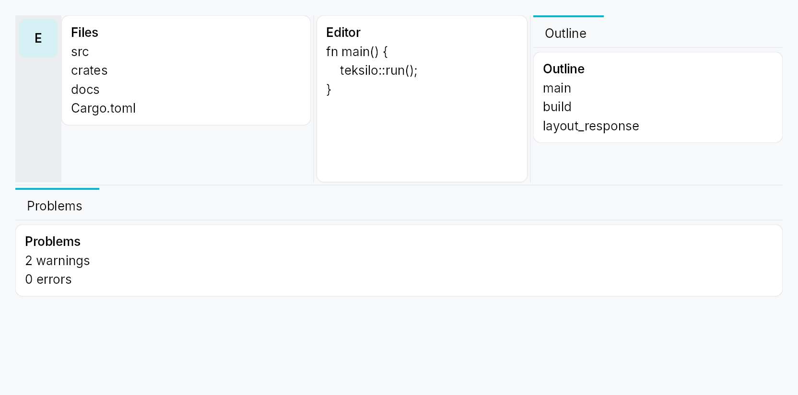

<!-- SPDX-License-Identifier: MPL-2.0 -->
<!-- SPDX-FileCopyrightText: 2026 FernTech -->

# DockingLayout



`DockingLayout` — a VS Code-style dockable layout: a fixed centre slot
(the app's main content) surrounded by four collapsible, splittable,
draggable side regions (leading / trailing / top / bottom), backed by a
cloneable, serializable `DockingModel`.

See `docs/docking.md` for the full reference. The structure is four
levels deep:

```text
DockingLayout
└── Centre + 4 Sides
    └── Side = [optional DockActivityBar rail] + collapsible content region
        └── content region holds ONE TabWidget (strip optional / replaced
            by the rail)
            └── Tab → DockArrangement (a Splitter of panes, each a single
                DockWidget or a ToolBox of DockWidgets)
                └── DockWidget — the atomic dockable unit
```

## Builder methods at a glance

`rail`, `center`, `policy`, `disable_side`, `center_id`, `dock`

## API reference

📖 [Full rustdoc API for this module](../api/teksilo_widgets/docking/index.html)

## `pub struct DockingLayout`

The docking layout widget. See the module docs and `docs/docking.md`.

```ignore
let model = DockingModel::new();
// …declare panels + an initial layout on `model`…
DockingLayout::new(model.clone())
    .center(editor)
    .dock(DockWidget::new(EXPLORER, lit!("Explorer"), |_| Explorer::new()))
```

```rust
pub struct DockingLayout { /* fields */ }
```

### Methods

#### `pub fn new(model: DockingModel) -> Self`

Create a docking layout over a model.

#### `pub fn rail(mut self, rail: DockRail) -> Self`

Configure a side's activity rail (item size, top/bottom slots, overflow
trigger). The side still needs `DockingModel::set_side_rail` to put it
in Rail presentation; this only styles the rail. See `DockRail`.

#### `pub fn center(mut self, widget: impl Widget + 'static) -> Self`

Set the always-present centre content (the app's main area).

#### `pub fn policy(self, policy: DockPolicy) -> Self`

Lock down end-user layout edits (sugar for `DockingModel::set_policy`).
See `DockPolicy`.

#### `pub fn disable_side(self, side: DockSide) -> Self`

Disable a side (sugar for `DockingModel::set_side_enabled``(side, false)`):
it renders nothing, reserves no space, and rejects docks.

#### `pub fn center_id(mut self, id: WidgetId) -> Self`

Set the centre content by a pre-registered id.

#### `pub fn dock(self, dock: DockWidget) -> Self`

Declare a dock widget (its content factory + chrome metadata). The
dock is registered immediately, so the app may set the initial layout
on the model (`open_dock` / `import_state`) before mounting.

## `pub type DockRailSlot`

Factory for a rail slot widget (rebuilt on each rail rebuild).

A slot that wants to match the rail's current item size binds
`DockingModel::rail_size_mode_signal`
— the rail rebuilds its slots whenever the size mode changes, so reading the
signal in the factory is enough to keep the slot in step.

```rust
pub type DockRailSlot = Rc<dyn Fn() -> Box<dyn Widget>>;
```

## `pub struct DockActionId`

Stable identity for a `DockAction`.

**Not** used for persistence — a rail action carries no user-mutable state,
so nothing about it is serialized (see `DockLayoutState`'s
"app-config is reconstructed each run" rule). It exists so the accessibility
tree and the automation bridge can address a given action stably across
runs; a fresh-per-run id would make every script that clicks a rail action
flaky.

```rust
pub struct DockActionId(u64);
```

### Methods

#### `pub const fn named(name: &str) -> Self`

Derive a stable id from a caller-chosen name — identical across runs,
processes and machines. Prefer this over `from_raw`:
it removes the hand-picked-`u64`-literal collision hazard entirely.

`const` so ids can be declared as module-scope `const` items, the same
way apps already declare their `DockWidgetId`s.

```
# use teksilo_widgets::docking::DockActionId;
const SETTINGS: DockActionId = DockActionId::named("app.settings");
assert_eq!(SETTINGS, DockActionId::named("app.settings"));
assert_ne!(SETTINGS, DockActionId::named("app.about"));
```

#### `pub const fn from_raw(v: u64) -> Self`

Wrap a raw value. Prefer `named`.

#### `pub const fn raw(self) -> u64`

## `pub enum DockActionPlacement`

Where a `DockAction` sits along the rail's column.

```rust
pub enum DockActionPlacement { /* variants */ }
```

### Variants

- **`Start`** — Before the first activity item, in the flowing cluster.
- **`End`** — After the last activity item **and after the overflow trigger**, still in the flowing cluster — the group grows downward with the tabs.
- **`Pinned`** — Past the flexible spacer, anchored to the rail's far edge regardless of how many activities exist — VS Code's Accounts / Manage-gear cluster. Where a Settings gear belongs.

## `pub struct DockAction`

A **dockless command button** in the activity rail: it looks and behaves
like an activity item, but opens no panel — activating it just runs a
closure.

Declared on `DockRail::action`, so (like the rail's slots) it is per-view
app config, reconstructed each run. A rail action is deliberately **more
restricted** than a real activity: it is never draggable, never hidable, has
no "Move to" menu, and is never overflow-parked — it is reserved space. That
matches every surveyed precedent (VS Code's fixed Accounts / Manage cluster;
IntelliJ's stripe, whose only non-tool-window button is IDE-owned chrome).

```ignore
DockRail::new(DockSide::Leading).action(
    DockAction::new(
        DockActionId::named("app.settings"),
        lit!("Settings"),
        || IconWidget::gear(),
        |ctx| ctx.send_intent(Intent::new("app.settings")),
    )
    .placement(DockActionPlacement::Pinned),
)
```

```rust
pub struct DockAction { /* fields */ }
```

### Methods

#### `pub fn new( id: DockActionId, label: impl Into<LocalizedString>, icon: impl Fn() -> IconWidget + 'static, on_activate: impl Fn(&mut EventContext) + 'static, ) -> Self`

Declare a rail action. Defaults to `DockActionPlacement::End`,
enabled, untoggled, with the label as its hover tooltip.

#### `pub fn placement(mut self, placement: DockActionPlacement) -> Self`

Where the action sits along the rail. See `DockActionPlacement`.

#### `pub fn tooltip(mut self, tooltip: impl Into<LocalizedString>) -> Self`

Override the hover tooltip (defaults to the label). Ignored in
`Icon + Label` rail mode, which paints the label inline instead.

#### `pub fn enabled(mut self, enabled: impl Into<Prop<bool>>) -> Self`

Enable / disable the action. Accepts a `bool` or a `Signal<bool>`.

#### `pub fn toggled(mut self, state: Signal<bool>) -> Self`

Paint the selected surface while `state` is `true` — the same
highlight an open activity gets. **Reflect-only**: activating the
action does not write `state`; `on_activate` must.

#### `pub fn id(&self) -> DockActionId`

The action's id.

## `pub struct DockRail`

App-facing configuration for a side's activity rail (Rail presentation).

Pass to `DockingLayout::rail`. All knobs are
optional; an unconfigured rail uses `IconButtonSize::Large` items, no
slots, and no overflow affordance (items just clip if the side is too
short).

```rust
pub struct DockRail { /* fields */ }
```

### Methods

#### `pub fn new(side: DockSide) -> Self`

Configure the rail for `side`.

#### `pub fn size(mut self, size: IconButtonSize) -> Self`

Pick one size for every rail item (`IconButtonSize::Compact` …
`Hero`). Default `IconButtonSize::Large`.

#### `pub fn background(mut self, color: impl Into<ColorProp>) -> Self`

Override the rail strip's background. Accepts `Color`, a
`SurfaceRole`, or a `Signal<Color>`.
Default (unset) is `SurfaceRole::Sunken`.

#### `pub fn divider(mut self) -> Self`

Draw a 1 dp divider line between the rail and the side's content, on
the rail's content-facing edge (RTL-aware). Uses `BorderRole::Divider`.
Off by default. See `divider_color` for a custom
colour.

#### `pub fn divider_color(mut self, color: impl Into<ColorProp>) -> Self`

Like `divider`, but with an explicit colour. Accepts
`Color`, a `BorderRole`, or a
`Signal<Color>`.

#### `pub fn top_slot<W: Widget + 'static>(mut self, f: impl Fn() -> W + 'static) -> Self`

Widget pinned **above** the items (e.g. a logo / hamburger). To track the
rail's item size, bind
`DockingModel::rail_size_mode_signal`
inside the factory.

#### `pub fn bottom_slot<W: Widget + 'static>(mut self, f: impl Fn() -> W + 'static) -> Self`

Widget pinned at the **bottom** of the rail (e.g. settings / account). To
track the rail's item size, bind
`DockingModel::rail_size_mode_signal`
inside the factory.

#### `pub fn leading_slot<W: Widget + 'static>(mut self, f: impl Fn() -> W + 'static) -> Self`

Widget pinned at the **start** of this side's **Strip**-presentation tab
bar (via `TabWidget::bar_leading_slot`).
The Rail-presentation counterpart is `top_slot`.

**Weaker contract than `top_slot`.** `top_slot`/`bottom_slot` sit on the
`DockActivityBar`, which is built whenever the side has a rail — they
survive the side being collapsed. `leading_slot`/`trailing_slot` sit
inside the side's `TabWidget`, which lives within the collapsing
`SideClipPane`, so they disappear with the content when the side is
hidden. If your content must survive a hidden side, use Rail
presentation, or host it outside the docking system.

#### `pub fn trailing_slot<W: Widget + 'static>(mut self, f: impl Fn() -> W + 'static) -> Self`

Widget pinned at the **end** of this side's **Strip**-presentation tab
bar. Composed *before* the side's own "hidden activities" hamburger when
both are present, so neither is dropped. See
`leading_slot` for the visibility contract.

#### `pub fn action(mut self, action: DockAction) -> Self`

Append a **dockless command button** to this side's rail. Declaration
order is render order within a placement. See `DockAction`.

**Rail presentation only.** A side in
`TabPresentation::Strip` renders no
actions at all — and `set_side_rail`
can flip presentation at runtime, so a side that flips Rail → Strip drops
its whole action cluster. If that is reachable in your app, mirror the
cluster with `trailing_slot`, which the same
`DockRail` can carry alongside its actions.

#### `pub fn overflow_icon(mut self, f: impl Fn() -> IconWidget + 'static) -> Self`

Choose the glyph for the overflow trigger — the item shown (in place of
the surplus items) when they don't all fit. Tapping it opens a popover
list of the overflowed entries.

## `pub enum DockSide`

One of the four dockable sides. `Leading`/`Trailing` are
writing-direction-relative (mirrored under RTL by the caller); `Top`/
`Bottom` never mirror.

```rust
pub enum DockSide { /* variants */ }
```

### Variants

- **`Leading`** — Left in LTR, right in RTL.
- **`Trailing`** — Right in LTR, left in RTL.
- **`Top`**
- **`Bottom`**

### Methods

#### `pub const ALL: [DockSide;`

All four sides, in a stable order.

#### `pub fn is_horizontal_axis(self) -> bool`

True for the vertical columns (leading / trailing), whose long axis
is vertical — they stack their dock content top-to-bottom.

## `pub enum DockCorner`

One of the four corners of the container. Each corner is owned by exactly
one of its two adjacent sides (Qt `setCorner`).

```rust
pub enum DockCorner { /* variants */ }
```

### Variants

- **`TopLeading`**
- **`TopTrailing`**
- **`BottomLeading`**
- **`BottomTrailing`**

### Methods

#### `pub const ALL: [DockCorner;`

All four corners.

#### `pub fn adjacent_sides(self) -> (DockSide, DockSide)`

The two sides adjacent to this corner: `(horizontal side, vertical
side)` — i.e. `(Leading|Trailing, Top|Bottom)`.

## `pub struct CornerOwners`

Which side owns each corner. Default = the classic IDE shell where the
top and bottom bars span the full width and the leading / trailing columns
occupy only the middle band.

```rust
pub struct CornerOwners { /* fields */ }
```

### Methods

#### `pub fn owner(&self, corner: DockCorner) -> DockSide`

#### `pub fn set(&mut self, corner: DockCorner, owner: DockSide)`

## `pub struct DockWidgetId`

Process-unique identity for a registered dock widget (the atomic unit).

```rust
pub struct DockWidgetId(pub u64);
```

### Methods

#### `pub fn fresh() -> Self`

Mint a fresh, process-unique id.

#### `pub fn from_raw(v: u64) -> Self`

#### `pub fn raw(self) -> u64`

## `pub struct DockTabId`

Process-unique identity for a dock tab (a tab of a side's TabWidget).

```rust
pub struct DockTabId(pub u64);
```

### Methods

#### `pub fn fresh() -> Self`

#### `pub fn from_raw(v: u64) -> Self`

#### `pub fn raw(self) -> u64`

## `pub enum TabPresentation`

How a side surfaces its tabs: an in-side strip (the TabWidget's own bar) or
an always-visible activity rail outboard of the collapsible content.

```rust
pub enum TabPresentation { /* variants */ }
```

### Variants

- **`Strip`** — In-side tab strip (hidden when a single tab is present).
- **`Rail`** — External always-visible activity rail; the in-side strip is suppressed.

## `pub enum DockOpenMode`

Placement mode for a programmatically-opened dock.

```rust
pub enum DockOpenMode { /* variants */ }
```

### Variants

- **`Stack`** — Stack into the side's currently-selected tab (as a ToolBox section).
- **`NewTab`** — Create a brand-new tab holding just this dock.

## `pub struct DockOpenLocation`

Target for `DockingModel::open_dock` / `DockingModel::move_dock`.

```rust
pub struct DockOpenLocation { /* fields */ }
```

### Methods

#### `pub fn side(side: DockSide) -> Self`

Default placement on a side (stack into the active tab).

#### `pub fn stack(mut self) -> Self`

Stack into the side's active tab.

#### `pub fn new_tab(mut self) -> Self`

Open as a fresh tab.

## `pub enum DockRailItemSize`

Activity-bar item size for a side's rail (context-menu "Activity bar size").

```rust
pub enum DockRailItemSize { /* variants */ }
```

### Variants

- **`Default`** — The rail's configured size (`DockRail::size`); icon only, title on hover.
- **`Compact`** — Compact items — the standard `IconButtonSize::Default` regardless of the rail's configured (larger) size; icon only, title on hover. Not the extra-small `Compact` button: a rail glyph is the activity's identifier and must stay legible.
- **`Labeled`** — Icon at the configured size **plus** a 90°-rotated title beneath it (the vertical-accordion look). The title shows inline, so no hover tooltip.

### Methods

#### `pub fn shows_label(self) -> bool`

Whether this mode paints the title inline (rotated) rather than only as a
hover tooltip.

## `pub enum DockTabDisplay`

How a side's dock tabs render (context-menu "Tab size").

```rust
pub enum DockTabDisplay { /* variants */ }
```

### Variants

- **`Text`** — Title text only (the default).
- **`Icon`** — The dock's icon only (falls back to the title initial if it has none).
- **`IconText`** — Icon + title.

### Methods

#### `pub fn shows_icon(self) -> bool`

Whether this mode shows the icon glyph.

#### `pub fn shows_text(self) -> bool`

Whether this mode shows the title text.

## `pub struct DockPolicy`

App-declared policy that **locks down end-user layout edits** on a
`DockingLayout`. Each flag removes a *user
affordance* only — the programmatic `DockingModel` API (a "Toggle panel"
button, `open_dock`, `set_tab_hidden`, …) keeps working regardless, so the
app can still drive the layout it has locked for the user.

App-declared each run (like `rail_thickness` / `min_size` / `DockRail`)
— **not** persisted in `DockLayoutState`. Set it with
`DockingModel::set_policy`. Default = everything allowed; `DockPolicy::locked`
= everything forbidden.

```rust
pub struct DockPolicy { /* fields */ }
```

### Methods

#### `pub fn locked() -> Self`

A fully **locked** layout — no user drag, no collapse, no activity hide.
The app's programmatic API still drives it.

## `pub struct DockingModel`

The shared docking-layout model. `Clone` = share-by-handle.

```rust
pub struct DockingModel(Rc<RefCell<Inner>>);
```

### Methods

#### `pub fn new() -> Self`

A fresh model: four empty, hidden sides and the default corner owners.

#### `pub fn version(&self) -> Signal<u64>`

Structural version — bump on tab / pane / section / side add-remove.
The widget binds this at `BindingLevel::Rebuild`.

#### `pub fn geometry_version(&self) -> Signal<u64>`

Geometry version — bump on side size / visibility / corner change.
The widget binds this at `BindingLevel::Relayout`.

#### `pub fn consume_animate_flag(&self) -> bool`

Read-and-reset the "animate the next side show/hide" latch.

#### `pub fn is_registered(&self, id: DockWidgetId) -> bool`

Whether a dock id is known (its content factory + meta are registered).

#### `pub fn set_side_rail(&self, side: DockSide, thickness: f32)`

Set a side's activity-rail thickness and presentation. A non-zero rail
switches the side to `TabPresentation::Rail`; the in-side strip is
then suppressed.

#### `pub fn set_side_size(&self, side: DockSide, size: f32)`

Set a side's stored content size (px). Relayout only (no rebuild).

#### `pub fn set_side_min_size(&self, side: DockSide, min: f32)`

Set a side's minimum content size (px).

#### `pub fn set_policy(&self, policy: DockPolicy)`

Set the app's `DockPolicy` — locks down end-user layout edits (the
programmatic API keeps working). Structural → rebuild.

#### `pub fn policy(&self) -> DockPolicy`

The app's current `DockPolicy` (cheap `Copy`; read by the widgets in
`build()` to gate their user affordances).

#### `pub fn set_side_enabled(&self, side: DockSide, enabled: bool)`

Enable / disable a whole side. A disabled side renders nothing, reserves
no space, is not a drop target, and rejects placement / moves to it; its
docks stay in the model and reappear when re-enabled. Structural →
rebuild.

#### `pub fn is_side_enabled(&self, side: DockSide) -> bool`

Whether a side is enabled (default `true`).

#### `pub fn set_side_visible(&self, side: DockSide, visible: bool)`

Show / hide a whole side (animated).

#### `pub fn set_side_visible_immediate(&self, side: DockSide, visible: bool)`

Show / hide a side immediately (no animation — drag-driven).

#### `pub fn toggle_side_visible(&self, side: DockSide)`

Toggle a side's visibility (animated).

#### `pub fn select_tab(&self, side: DockSide, tab_idx: usize)`

Select the active tab of a side. Repaint only (the Switcher swaps via
its bound `selected_tab` signal — no rebuild, no relayout).

#### `pub fn select_tab_by_id(&self, side: DockSide, tab_id: DockTabId)`

Select a side's active tab by id (position-independent — used by the
rail / strip, whose visible order may skip hidden tabs).

#### `pub fn set_tab_hidden(&self, tab_id: DockTabId, hidden: bool)`

Hide / show one activity (tab). A hidden activity stays registered (so
it remains listable + restorable) but is dropped from the rail and tab
strip. Hiding the selected tab moves the selection to the nearest still-
visible tab. Structural → rebuild.

#### `pub fn is_tab_hidden(&self, tab_id: DockTabId) -> bool`

Whether an activity (tab) is currently hidden.

#### `pub fn side_rail_size(&self, side: DockSide) -> DockRailItemSize`

Current activity-bar item size for a side.

#### `pub fn set_side_rail_size(&self, side: DockSide, size: DockRailItemSize)`

Set a side's activity-bar item size (reactive → the rail rebuilds).

#### `pub fn rail_size_mode_signal(&self, side: DockSide) -> Signal<DockRailItemSize>`

Reactive activity-bar **size mode** for a side — fires whenever the user
switches Default / Compact / Icon + Label (via the context menu or
`set_side_rail_size`). Bind it to adapt any
external widget — a rail's slotted controls, an app toolbar — to the
rail's current item size. (The rail rebuilds its slots on every change,
so a slot factory that reads this signal stays in step.)

#### `pub fn side_tab_display(&self, side: DockSide) -> DockTabDisplay`

Current dock-tab display mode for a side.

#### `pub fn set_side_tab_display(&self, side: DockSide, display: DockTabDisplay)`

Set a side's dock-tab display mode (reactive → the strip rebuilds).

#### `pub fn set_corner(&self, corner: DockCorner, owner: DockSide)`

Set the owner of a corner (must be one of its two adjacent sides).

#### `pub fn open_dock(&self, id: DockWidgetId, loc: DockOpenLocation)`

Open (or move) a dock onto a side. Already-open docks are relocated
(never duplicated).

#### `pub fn promote_to_tab(&self, id: DockWidgetId, side: DockSide, at_tab: usize)`

Drag a dock out into its own new tab on `side`, inserted at `at_tab`.

#### `pub fn split_into_tab( &self, id: DockWidgetId, side: DockSide, tab_idx: usize, pane_idx: usize, before: bool, )`

Drop a dock into an existing tab's Splitter as a new `Single` pane,
before (`before = true`) or after the pane at `pane_idx`.

#### `pub fn stack_into_tab(&self, id: DockWidgetId, side: DockSide, tab_idx: usize)`

Drop a dock into a tab as a new Splitter pane appended after its
existing panes (the "centre" drop — join this group without choosing a
split direction). Each pane is its own single-item ToolBox.

#### `pub fn move_dock(&self, id: DockWidgetId, loc: DockOpenLocation)`

Move a dock to another location (close + open in one notify).

#### `pub fn close_tab(&self, tab_id: DockTabId)`

Close a whole tab (and every dock it holds).

#### `pub fn move_tab(&self, tab_id: DockTabId, target_side: DockSide, at_tab: usize)`

Move a whole tab (its arrangement + every dock + selection) to another
side, re-deriving the Splitter orientation. Inserted at `at_tab`.

#### `pub fn close_dock(&self, id: DockWidgetId)`

Close (remove) a dock from the layout.

#### `pub fn toggle_dock(&self, id: DockWidgetId)`

Toggle a dock: close it if open, else open it on its default location.

#### `pub fn reveal_dock(&self, id: DockWidgetId)`

Reveal a dock: ensure it is open, show + select its side / tab.

#### `pub fn is_dock_open(&self, id: DockWidgetId) -> bool`

#### `pub fn dock_location(&self, id: DockWidgetId) -> Option<DockLoc>`

#### `pub fn dock_open_signal(&self, id: DockWidgetId) -> Signal<bool>`

A reactive `true`-while-open signal for an external rail / toolbar.

#### `pub fn is_side_visible(&self, side: DockSide) -> bool`

#### `pub fn side_visible_signal(&self, side: DockSide) -> Signal<bool>`

#### `pub fn side_selected_tab_signal(&self, side: DockSide) -> Signal<usize>`

#### `pub fn side_selected_tab(&self, side: DockSide) -> usize`

#### `pub fn side_presentation(&self, side: DockSide) -> TabPresentation`

#### `pub fn side_size(&self, side: DockSide) -> f32`

#### `pub fn side_min_size(&self, side: DockSide) -> f32`

#### `pub fn side_rail_thickness(&self, side: DockSide) -> f32`

#### `pub fn side_has_rail(&self, side: DockSide) -> bool`

#### `pub fn corner_owner(&self, corner: DockCorner) -> DockSide`

#### `pub fn tab_count(&self, side: DockSide) -> usize`

#### `pub fn tab_id_at(&self, side: DockSide, idx: usize) -> Option<DockTabId>`

The id of the tab at `idx` in a side's full tab list. The live inverse
of `select_tab_by_id` — the strip's
index → id selection sync uses it so both directions resolve against the
*current* order and agree across a reorder (a build-time snapshot would
disagree and feed back unboundedly).

#### `pub fn set_tab_title(&self, tab_id: DockTabId, title: Option<LocalizedString>)`

Give an activity (tab) a stable, explicit name, independent of which dock
occupies pane 0 (e.g. a grouped "Source Control" activity holding a file
tree and a git pane). Pass `None` to clear it (the label then derives from
the primary dock again). App-config — reconstructed each run, like dock
titles; not persisted. Structural → rebuild.

#### `pub fn tab_title(&self, tab_id: DockTabId) -> Option<LocalizedString>`

The explicit title set on an activity (`None` when it derives from its
primary dock).

#### `pub fn activity_of(&self, dock_id: DockWidgetId) -> Option<DockTabId>`

The activity (tab) currently holding a dock — apps hold stable
`DockWidgetId`s, so this is the bridge to address the enclosing tab.

#### `pub fn set_dock_activity_title( &self, dock_id: DockWidgetId, title: impl Into<LocalizedString>, )`

Sugar: name the activity that currently holds `dock_id`. The natural way
to title a grouped activity from app code that holds the dock id.

#### `pub fn enabled_move_targets(&self, from: DockSide) -> Vec<DockSide>`

The enabled sides a tab / dock on `from` can be relocated to (every side
except `from`, keeping only `is_side_enabled`).
The "Move to" menus iterate this so a disabled side is never offered as a
silently-rejected target.

#### `pub fn export_state(&self) -> super::state::DockLayoutState`

Serialize the user-controllable layout state (sizes / visibility /
selections / arrangement structure / corners). App-config (rail
thickness, mins, content factories) is reconstructed each run.

#### `pub fn import_state(&self, state: &super::state::DockLayoutState)`

Restore a previously-exported state. Unknown dock ids are dropped,
emptied panes / tabs pruned, selections clamped. Bumps `version`.

## `pub struct DockWidget`

App-facing declaration of a dock widget: identity, chrome metadata, and a
lazy content factory. Collect these on `DockingLayout::dock`.

```rust
pub struct DockWidget { /* fields */ }
```

### Methods

#### `pub fn new<W: Widget + 'static>( id: DockWidgetId, title: impl Into<LocalizedString>, factory: impl Fn(DockWidgetId) -> W + 'static, ) -> Self`

Declare a dock widget. `factory` builds its content the first time the
dock appears (and after it is closed and re-opened).

#### `pub fn icon(mut self, f: impl Fn() -> IconWidget + 'static) -> Self`

Set the dock's tab / rail icon.

#### `pub fn header_actions( mut self, f: impl Fn(DockWidgetId) -> Vec<ToolbarItem> + 'static, ) -> Self`

Attach a factory for the dock's **inline header actions** — a flat list
of `ToolbarAction`s shown before the `⋮` options button, the VS Code
"view actions" pattern ("New File", "Collapse All", …). Built on demand
each time the dock is placed into a header. The framework hosts them in a
`Toolbar`, so the actions gain **overflow** (when the header is tight,
the lowest-`priority` actions collapse into a
`⌄` menu) and the correct **axis** for free — a horizontal row on leading
/ trailing sides, a vertical column on the rotated top / bottom strip. The
actions appear in any header the dock has: the multi-pane `Accordion`
header always, and the sole-pane (bare) header when
`show_header(true)` is set.

Each item is a `ToolbarItem` — a collapsible
`ToolbarAction` via
`ToolbarItem::action`, or a pinned arbitrary widget (a `SplitButton`, a
search field, …) via `ToolbarItem::custom`.

```ignore
DockWidget::new(id, lit!("Explorer"), build).header_actions(|_| vec![
    ToolbarItem::action(ToolbarAction::new(lit!("New File"), new_icon).on_activate(..)),
    ToolbarItem::custom(CreateSplitButton::new(..)),
])
```

#### `pub fn show_header(mut self, show: bool) -> Self`

Give a **sole-pane** (bare) dock its own header bar (title + actions +
`⋮` options). Default `false`. The multi-pane Accordion header is always
present regardless; this only governs the bare case. Turn it on to get a
discoverable options button (and inline `header_actions`) on a dock that
is the only one on its side.

#### `pub fn default_location(mut self, loc: DockOpenLocation) -> Self`

The location used when the dock is opened via `toggle` / `reveal`
without an explicit target.

## `pub struct DockLayoutState`

The full serializable snapshot of a `DockingModel`.

```rust
pub struct DockLayoutState { /* fields */ }
```
