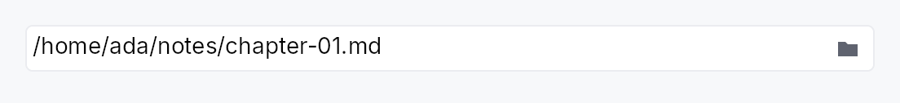
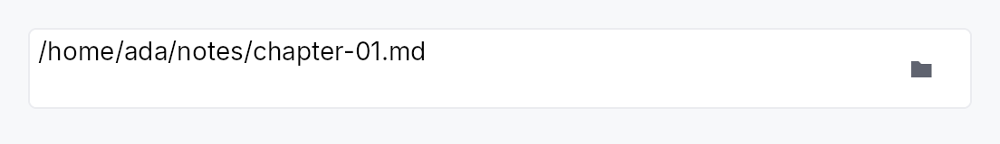

<!-- SPDX-License-Identifier: MPL-2.0 -->
<!-- SPDX-FileCopyrightText: 2026 FernTech -->

# FilePickerField



`FilePickerField` — a text-input preset for path entry with a Browse button.

## Public types

| Kind | Name |
| ---: | :--- |
| `enum` | [`FilePickerKind`](#filepickerkind) — Which file-dialog kind the trailing button opens |
| `struct` | [`FilePickerField`](#filepickerfield) — A single-line path entry field with a trailing Browse button that invokes the native file dialog and writes the chosen path back into the bound `Signal<String>` |

## Public functions

### `FilePickerField`

| Returns | Function |
| ---: | :--- |
| | **Constructors** |
| `Self` | [`new(text: Signal<String>)`](#filepickerfield-new) |
| | **Builder methods** |
| `Self` | [`kind(kind: FilePickerKind)`](#filepickerfield-kind) |
| `Self` | [`dialog_title(title: impl Into<LocalizedString>)`](#filepickerfield-dialog_title) |
| `Self` | [`starting_dir(path: impl Into<PathBuf>)`](#filepickerfield-starting_dir) |
| `Self` | [`default_file_name(name: impl Into<String>)`](#filepickerfield-default_file_name) |
| `Self` | [`add_filter(label: impl Into<String>, extensions: &[&str])`](#filepickerfield-add_filter) |
| `Self` | [`add_filters<'a, L, E>(filters: impl IntoIterator<Item = (L, E)>)`](#filepickerfield-add_filters) |
| `Self` | [`on_pick(f: impl Fn(&FileDialogResult, &mut EventContext) + 'static)`](#filepickerfield-on_pick) |
| `Self` | [`placeholder(text: impl Into<LocalizedString>)`](#filepickerfield-placeholder) |
| `Self` | [`label(label: impl Into<LocalizedString>)`](#filepickerfield-label) |
| `Self` | [`validation(validation: impl Into<Prop<ValidationState>>)`](#filepickerfield-validation) |
| `Self` | [`enabled(on: impl Into<Prop<bool>>)`](#filepickerfield-enabled) |
| `Self` | [`tooltip(text: impl Into<LocalizedString>)`](#filepickerfield-tooltip) |
| `Self` | [`rich_tooltip(key: impl Into<String>)`](#filepickerfield-rich_tooltip) |
| `Self` | [`rich_tooltip_content(content: crate::tooltip::TooltipContent)`](#filepickerfield-rich_tooltip_content) |
| `Self` | [`composite_tooltip(content: impl Widget + 'static)`](#filepickerfield-composite_tooltip) |

## Detailed description

Combines a `TextInput` with a trailing `IconButton` (the folder/browse glyph)
that opens a native file dialog and writes the chosen path back into the bound
`Signal<String>`. The three `FilePickerKind` variants map to the three
single-result dialog modes: open a file, pick a folder, or save a file.
Multi-file selection does not fit the "one editable line" pattern; use the
file-dialog API directly for that.

```ignore
// Requires ctx.signal() — shown as ignore per convention.
let path = ctx.signal(String::new());
let _f = FilePickerField::new(path.clone())
    .kind(FilePickerKind::OpenFile)
    .add_filter("Images", &["png", "jpg"])
    .placeholder(lit!("Choose a file…"));
```

## Density

The picture above is the widget at `TargetDensity::Compact`, the mouse-and-keyboard ladder. Below is the same subject on the same canvas with only the ladder changed, so what moves is the density and nothing else — where the subject no longer fits, that is what the denser targets cost it at that size. See `docs/density-and-targets.md`.

**Touch**



## API reference

📖 [Full rustdoc API for this module](https://docs.rs/teksilo-widgets/latest/teksilo_widgets/file_picker_field/index.html)

<a id="filepickerkind"></a>

## `pub enum FilePickerKind`

Which file-dialog kind the trailing button opens.

```rust
pub enum FilePickerKind { /* variants */ }
```

### Variants

- **`OpenFile`** — Open an existing file. Default.
- **`PickFolder`** — Pick an existing folder.
- **`SaveFile`** — Pick a new or existing file location for saving.

<a id="filepickerfield"></a>

## `pub struct FilePickerField`

A single-line path entry field with a trailing Browse button that invokes the
native file dialog and writes the chosen path back into the bound `Signal<String>`.

```rust
pub struct FilePickerField { /* fields */ }
```

### Methods

<a id="filepickerfield-new"></a>

#### `pub fn new(text: Signal<String>) -> Self`

Construct a `FilePickerField` bound to `text`. The visible string
is updated on a successful pick; existing content is shown as-is.

<a id="filepickerfield-kind"></a>

#### `pub fn kind(mut self, kind: FilePickerKind) -> Self`

Pick the dialog kind opened by the Browse button.

<a id="filepickerfield-dialog_title"></a>

#### `pub fn dialog_title(mut self, title: impl Into<LocalizedString>) -> Self`

Title shown in the file-dialog window caption.

<a id="filepickerfield-starting_dir"></a>

#### `pub fn starting_dir(mut self, path: impl Into<PathBuf>) -> Self`

Directory the dialog opens in. If not set, the OS default is used.

<a id="filepickerfield-default_file_name"></a>

#### `pub fn default_file_name(mut self, name: impl Into<String>) -> Self`

Pre-filled file name for the `FilePickerKind::SaveFile` dialog.
No-op for `OpenFile` / `PickFolder`.

<a id="filepickerfield-add_filter"></a>

#### `pub fn add_filter(mut self, label: impl Into<String>, extensions: &[&str]) -> Self`

Append an extension filter (label + extensions without leading dots).
Repeat to add multiple rows.

<a id="filepickerfield-add_filters"></a>

#### `pub fn add_filters<'a, L, E>(self, filters: impl IntoIterator<Item = (L, E)>) -> Self where L: Into<String>, E: AsRef<[&'a str]>,`

Append several extension filters from an iterator of
`(label, extensions)` pairs, in order.

The loop form of `add_filter`, for a filter list that
comes from data. The second element of each pair is anything that reads
as a `&[&str]`, so both `["txt", "md"]` and `&["txt", "md"][..]` work.

<a id="filepickerfield-on_pick"></a>

#### `pub fn on_pick(mut self, f: impl Fn(&FileDialogResult, &mut EventContext) + 'static) -> Self`

Hook invoked with the raw `FileDialogResult` after the dialog
closes — useful when the caller needs to react to cancellation
or backend errors. The bound text signal is already updated by
the time this fires (on success).

<a id="filepickerfield-placeholder"></a>

#### `pub fn placeholder(mut self, text: impl Into<LocalizedString>) -> Self`

Placeholder text shown when the field is empty.

<a id="filepickerfield-label"></a>

#### `pub fn label(mut self, label: impl Into<LocalizedString>) -> Self`

Accessible name for the path field.

<a id="filepickerfield-validation"></a>

#### `pub fn validation(mut self, validation: impl Into<Prop<ValidationState>>) -> Self`

Bind an external `ValidationState` signal — shown as the same inline
error/warning strip and border tint the inner `TextInput` renders (e.g.
"the chosen folder does not exist / is not writable").

<a id="filepickerfield-enabled"></a>

#### `pub fn enabled(mut self, on: impl Into<Prop<bool>>) -> Self`

Set the initial enabled state for the text field and Browse button.
Forwarded to the arena at build time.

<a id="filepickerfield-tooltip"></a>

#### `pub fn tooltip(mut self, text: impl Into<LocalizedString>) -> Self`

Attach a plain single-line tooltip shown after the hover delay.
Clears any previously set rich or composite tooltip (last call wins).

<a id="filepickerfield-rich_tooltip"></a>

#### `pub fn rich_tooltip(mut self, key: impl Into<String>) -> Self`

Attach a rich tooltip by registry key.
Clears any previously set plain or composite tooltip (last call wins).

<a id="filepickerfield-rich_tooltip_content"></a>

#### `pub fn rich_tooltip_content(mut self, content: crate::tooltip::TooltipContent) -> Self`

Attach a rich tooltip from inline `crate::tooltip::TooltipContent`.
Clears any previously set plain or composite tooltip (last call wins).

<a id="filepickerfield-composite_tooltip"></a>

#### `pub fn composite_tooltip(mut self, content: impl Widget + 'static) -> Self`

Attach a composite tooltip whose body is an arbitrary widget tree.
Clears any previously set plain or rich tooltip (last call wins).
