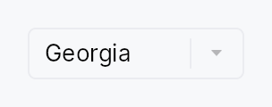

<!-- SPDX-License-Identifier: MPL-2.0 -->
<!-- SPDX-FileCopyrightText: 2026 FernTech -->

# FontPicker



FontPicker — a drop-in font-family selector.

## Public types

| Kind | Name |
| ---: | :--- |
| `enum` | [`FontSpacingFilter`](#fontspacingfilter) — Spacing filter, mirroring the monospaced / proportional axis of Qt's `QFontComboBox::FontFilters` |
| `enum` | [`FontPreviewMode`](#fontpreviewmode) — How each row — and the closed trigger — previews a font |
| `struct` | [`FontMeta`](#fontmeta) — Per-family metadata for headless testing / restricted font sets via `FontPicker::families_with_meta` |
| `struct` | [`FontPicker`](#fontpicker) — A font-family selector built on `ComboBox` |

## Public functions

### `FontPicker`

| Returns | Function |
| ---: | :--- |
| | **Constructors** |
| `Self` | [`new(selected: Signal<Option<String>>)`](#fontpicker-new) |
| | **Builder methods** |
| `Self` | [`families(families: impl IntoIterator<Item = impl Into<String>>)`](#fontpicker-families) |
| `Self` | [`families_with_meta(families: Vec<(String, FontMeta)>)`](#fontpicker-families_with_meta) |
| `Self` | [`spacing_filter(filter: impl Into<Prop<FontSpacingFilter>>)`](#fontpicker-spacing_filter) |
| `Self` | [`writing_system(ws: impl Into<Prop<Option<WritingSystem>>>)`](#fontpicker-writing_system) |
| `Self` | [`preview_mode(mode: FontPreviewMode)`](#fontpicker-preview_mode) |
| `Self` | [`preview_in_own_font(on: bool)`](#fontpicker-preview_in_own_font) |
| `Self` | [`sample_text(text: impl Into<String>)`](#fontpicker-sample_text) |
| `Self` | [`sample_text_for(ws: WritingSystem, text: impl Into<String>)`](#fontpicker-sample_text_for) |
| `Self` | [`sample_text_for_family(family: impl Into<String>, text: impl Into<String>)`](#fontpicker-sample_text_for_family) |
| `Self` | [`show_selected_in_own_font(on: bool)`](#fontpicker-show_selected_in_own_font) |
| `Self` | [`placeholder(text: impl Into<LocalizedString>)`](#fontpicker-placeholder) |
| `Self` | [`label(label: impl Into<LocalizedString>)`](#fontpicker-label) |
| `Self` | [`enabled(enabled: impl Into<Prop<bool>>)`](#fontpicker-enabled) |
| `Self` | [`variant(variant: ComboBoxVariant)`](#fontpicker-variant) |
| `Self` | [`style(style: impl ComboBoxStyle)`](#fontpicker-style) |
| `Self` | [`max_visible_items(n: usize)`](#fontpicker-max_visible_items) |
| `Self` | [`searchable(on: bool)`](#fontpicker-searchable) |
| `Self` | [`search_query(query: Signal<String>)`](#fontpicker-search_query) |
| `Self` | [`on_select(f: impl Fn(&str, &mut EventContext) + 'static)`](#fontpicker-on_select) |
| `Self` | [`tooltip(text: impl Into<LocalizedString>)`](#fontpicker-tooltip) |
| `Self` | [`rich_tooltip(key: impl Into<String>)`](#fontpicker-rich_tooltip) |
| `Self` | [`rich_tooltip_content(content: crate::tooltip::TooltipContent)`](#fontpicker-rich_tooltip_content) |
| `Self` | [`composite_tooltip(content: impl Widget + 'static)`](#fontpicker-composite_tooltip) |

## Detailed description

A `ComboBox` preset that lists every installed font family and lets
the user pick one, in the tradition of Qt's `QFontComboBox`, GTK's
`FontChooser`, and UIKit's `UIFontPickerViewController`. It

- **self-populates** from the app's shared typesetter
  (`ctx.app_state::<SharedTypesetter>()` → `families()`), so no font
  list is passed in;
- **previews each font**: every row shows the family name in a legible
  system font next to a tiny sample rendered *in that font*
  (`FontPreviewMode::NameThenSample`, the default), and the closed
  trigger shows the selected family in its own typeface;
- is **searchable** (type to filter hundreds of fonts) and
  **filterable** by spacing (`FontSpacingFilter`) and by writing
  system (`WritingSystem`);
- binds the choice to a `Signal<Option<String>>` (the family name), which
  plugs straight into `TextStyle.family` / `RichTextEditor::set_font_family`.

```ignore
let family: Signal<Option<String>> = Signal::new(None);
VStack::new()
    .child(TextWidget::new(tr!(font())).style(TextStyleRole::BodyBold))
    .child(FontPicker::new(family.clone())
        .on_select(|name, _ctx| editor.set_font_family(name)));
```

### Writing-system detection is off-thread

Classifying which scripts a font covers parses its OS/2 table, i.e.
reads the font file — hundreds of reads for a full system. The picker
therefore builds the coverage index on a background thread the first
time it mounts and polls readiness on the frame tick; until the index is
ready the writing-system filter shows the unfiltered list and samples
fall back to a Latin default. Spacing (monospaced / proportional)
filtering is instant (it uses only font metadata, no bytes).

Only family selection is offered, matching Qt's `QFontComboBox`. Face /
weight / size selection belongs to a larger font *dialog* and is out of
scope.

## Density

The picture above is the widget at `TargetDensity::Compact`, the mouse-and-keyboard ladder. Below is the same subject on the same canvas with only the ladder changed, so what moves is the density and nothing else — where the subject no longer fits, that is what the denser targets cost it at that size. See `docs/density-and-targets.md`.

**Touch**


## API reference

📖 [Full rustdoc API for this module](https://docs.rs/teksilo-widgets/latest/teksilo_widgets/font_picker/index.html)

<a id="fontspacingfilter"></a>

## `pub enum FontSpacingFilter`

Spacing filter, mirroring the monospaced / proportional axis of Qt's
`QFontComboBox::FontFilters`. Cheap — it reads only font metadata.

```rust
pub enum FontSpacingFilter { /* variants */ }
```

### Variants

- **`Any`** — Show all fonts (default).
- **`Monospaced`** — Only monospaced fonts.
- **`Proportional`** — Only proportional (non-monospaced) fonts.

<a id="fontpreviewmode"></a>

## `pub enum FontPreviewMode`

How each row — and the closed trigger — previews a font.

```rust
pub enum FontPreviewMode { /* variants */ }
```

### Variants

- **`NameThenSample`** — Family name in a legible system font, then a tiny sample rendered in the font itself (the default). The sample text is chosen for the font's writing system.
- **`NameInOwnFont`** — Family name rendered in its own typeface (the Qt / UIKit default).
- **`NameInSystemFont`** — Family name in the system font, no in-font sample (UIKit `displayUsingSystemFont`). Maximum legibility.

<a id="fontmeta"></a>

## `pub struct FontMeta`

Per-family metadata for headless testing / restricted font sets via
`FontPicker::families_with_meta`. In a real app this data comes from
the shared typesetter instead.

```rust
pub struct FontMeta { /* fields */ }
```

<a id="fontpicker"></a>

## `pub struct FontPicker`

A font-family selector built on `ComboBox`. See the module docs.

```rust
pub struct FontPicker { /* fields */ }
```

### Methods

<a id="fontpicker-new"></a>

#### `pub fn new(selected: Signal<Option<String>>) -> Self`

Create a picker bound to `selected` (the chosen family name). The
list is enumerated from the app's shared typesetter at build time.

<a id="fontpicker-families"></a>

#### `pub fn families(mut self, families: impl IntoIterator<Item = impl Into<String>>) -> Self`

Override the family list instead of enumerating from the typesetter.
Family names only — spacing is treated as proportional and
writing-system coverage is unknown (the writing-system filter shows
all). For deterministic filter tests, prefer
`families_with_meta`.

<a id="fontpicker-families_with_meta"></a>

#### `pub fn families_with_meta(mut self, families: Vec<(String, FontMeta)>) -> Self`

Override the family list *and* its metadata (monospaced + writing
systems). Enables headless testing of the spacing / writing-system
filters and the script-aware sample without a font backend.

<a id="fontpicker-spacing_filter"></a>

#### `pub fn spacing_filter(mut self, filter: impl Into<Prop<FontSpacingFilter>>) -> Self`

Restrict the list by spacing (monospaced / proportional). Accepts a
static value or a `Signal` for a reactive filter toolbar.

<a id="fontpicker-writing_system"></a>

#### `pub fn writing_system(mut self, ws: impl Into<Prop<Option<WritingSystem>>>) -> Self`

Restrict the list to fonts covering a writing system. `None` shows
all. Accepts a static value or a `Signal`. The first time a
non-`None` value is applied, the coverage index is built off-thread;
until it is ready the list is unfiltered.

<a id="fontpicker-preview_mode"></a>

#### `pub fn preview_mode(mut self, mode: FontPreviewMode) -> Self`

Choose how rows (and the trigger) preview each font. Default
`FontPreviewMode::NameThenSample`.

<a id="fontpicker-preview_in_own_font"></a>

#### `pub fn preview_in_own_font(mut self, on: bool) -> Self`

Convenience: `true` keeps the default preview; `false` switches to
`FontPreviewMode::NameInSystemFont` (UIKit `displayUsingSystemFont`).

<a id="fontpicker-sample_text"></a>

#### `pub fn sample_text(mut self, text: impl Into<String>) -> Self`

Global sample text override (used when the font's writing system has
no more specific sample). Mirrors GTK's preview text.

<a id="fontpicker-sample_text_for"></a>

#### `pub fn sample_text_for(mut self, ws: WritingSystem, text: impl Into<String>) -> Self`

Per-writing-system sample override (Qt `setSampleTextForSystem`).

<a id="fontpicker-sample_text_for_family"></a>

#### `pub fn sample_text_for_family( mut self, family: impl Into<String>, text: impl Into<String>, ) -> Self`

Per-family sample override (Qt `setSampleTextForFont`) — for fonts
whose script the generic sample doesn't suit (icon fonts, etc.).

<a id="fontpicker-show_selected_in_own_font"></a>

#### `pub fn show_selected_in_own_font(mut self, on: bool) -> Self`

Whether the closed trigger renders the selected family in its own
typeface (default `true`; Qt behaviour). No effect in
`FontPreviewMode::NameInSystemFont`.

<a id="fontpicker-placeholder"></a>

#### `pub fn placeholder(mut self, text: impl Into<LocalizedString>) -> Self`

Placeholder shown when nothing is selected. Defaults to a localized
"Select a font…".

<a id="fontpicker-label"></a>

#### `pub fn label(mut self, label: impl Into<LocalizedString>) -> Self`

Accessible / control label. Defaults to a localized "Font".

<a id="fontpicker-enabled"></a>

#### `pub fn enabled(mut self, enabled: impl Into<Prop<bool>>) -> Self`

Enable / disable the control, statically or reactively.

<a id="fontpicker-variant"></a>

#### `pub fn variant(mut self, variant: ComboBoxVariant) -> Self`

Design-language variant, forwarded to the inner `ComboBox`.

<a id="fontpicker-style"></a>

#### `pub fn style(mut self, style: impl ComboBoxStyle) -> Self`

Per-call `ComboBoxStyle` override, forwarded to the inner combo.

<a id="fontpicker-max_visible_items"></a>

#### `pub fn max_visible_items(mut self, n: usize) -> Self`

Maximum rows shown before the dropdown scrolls (default 8).

<a id="fontpicker-searchable"></a>

#### `pub fn searchable(mut self, on: bool) -> Self`

Enable / disable the in-dropdown search field (default `true`).

<a id="fontpicker-search_query"></a>

#### `pub fn search_query(mut self, query: Signal<String>) -> Self`

Drive the search field from an external query signal (implies
`searchable`).

<a id="fontpicker-on_select"></a>

#### `pub fn on_select(mut self, f: impl Fn(&str, &mut EventContext) + 'static) -> Self`

React to a commit with a live `EventContext` — the place to apply
the chosen font (e.g. `editor.set_font_family(name)`).

<a id="fontpicker-tooltip"></a>

#### `pub fn tooltip(mut self, text: impl Into<LocalizedString>) -> Self`

Attach a plain tooltip, forwarded to the inner `ComboBox`.
Mutually exclusive with the rich / composite variants — last-call-wins.

<a id="fontpicker-rich_tooltip"></a>

#### `pub fn rich_tooltip(mut self, key: impl Into<String>) -> Self`

Attach a registry-keyed rich tooltip, forwarded to the inner combo.

<a id="fontpicker-rich_tooltip_content"></a>

#### `pub fn rich_tooltip_content(mut self, content: crate::tooltip::TooltipContent) -> Self`

Attach an inline rich tooltip, forwarded to the inner combo.

<a id="fontpicker-composite_tooltip"></a>

#### `pub fn composite_tooltip(mut self, content: impl Widget + 'static) -> Self`

Attach a composite tooltip hosting an arbitrary widget tree,
forwarded to the inner combo.
