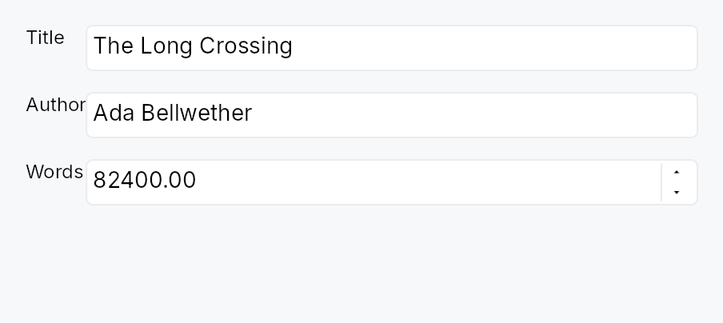

<!-- SPDX-License-Identifier: MPL-2.0 -->
<!-- SPDX-FileCopyrightText: 2026 FernTech -->

# FormLayout



FormLayout — a two-column settings or preferences form layout.

Children are added as label/field pairs via `FormLayout::line` (inline
widgets) or `FormLayout::line_ids` (pre-registered IDs). Full-width rows
that span both columns — section headers, `Divider`s, or banners — are
added via `FormLayout::full_width` / `FormLayout::full_width_id`. The
label column auto-sizes to the widest label across all pairs so all field
inputs are left-aligned. RTL layouts are handled automatically: the label
column migrates to the trailing side and the field column moves to the
leading side. Dormant rows are excluded from both measurement and
placement.

When an accessible name is provided via `FormLayout::label`, the widget
emits `Role::Form` so screen-reader users can navigate directly to the
form. Without a name it demotes to a presentational `GenericContainer`.

```rust
# use teksilo_widgets::primitives::{FormLayout, TextWidget, RectWidget};
# use teksilo_i18n::lit;
let _form = FormLayout::new()
    .label_gap(8.0)
    .row_spacing(6.0)
    .line(TextWidget::new(lit!("Name:")),  RectWidget::new())
    .line(TextWidget::new(lit!("Email:")), RectWidget::new());
```

## Builder methods at a glance

`label_gap`, `row_spacing`, `label`, `line`, `line_ids`, `full_width`, `full_width_id`

## API reference

📖 [Full rustdoc API for this module](https://docs.rs/teksilo-widgets/latest/teksilo_widgets/primitives/form_layout/index.html)

## `pub struct FormLayout`

A two-column form layout with auto-sized label column.

Children are added as label/field pairs via `line()` or as
full-width rows via `full_width()`. The label column
auto-sizes to the widest label; the field column takes the remaining
space.

```text
┌─ label col ─┐ gap ┌── field col ──────────────┐
│ Name:       │     │ [___________________]      │
│ Email:      │     │ [___________________]      │
├─────────────┴─────┴────────────────────────────┤
│ ── Advanced ──────────────────────────────────  │  ← full_width
├─ label col ─┐ gap ┌── field col ──────────────┐
│ Port:       │     │ [____]                     │
└─────────────┘     └────────────────────────────┘
```

```rust
pub struct FormLayout { /* fields */ }
```

### Methods

#### `pub fn new() -> Self`

Create an empty `FormLayout` with zero label gap and zero row spacing.

#### `pub fn label_gap(mut self, gap: f32) -> Self`

Horizontal gap between the label column and the field column.

#### `pub fn row_spacing(mut self, spacing: f32) -> Self`

Vertical gap between rows.

#### `pub fn label(mut self, label: impl Into<LocalizedString>) -> Self`

Set an accessible name for this form. When set, the widget emits
the `Role::Form` landmark so assistive-technology users can
navigate directly to it and distinguish it from other forms on
the page. When unset, the widget demotes to a presentational
`GenericContainer` — an unnamed landmark is worse than no
landmark for AT users.

#### `pub fn line(mut self, label: impl Widget + 'static, field: impl Widget + 'static) -> Self`

Add a label/field pair row.

#### `pub fn line_ids(mut self, label_id: WidgetId, field_id: WidgetId) -> Self`

Add a label/field pair row with pre-registered widget IDs.

#### `pub fn full_width(mut self, widget: impl Widget + 'static) -> Self`

Add a full-width row spanning both columns.

#### `pub fn full_width_id(mut self, id: WidgetId) -> Self`

Add a full-width row with a pre-registered widget ID.
