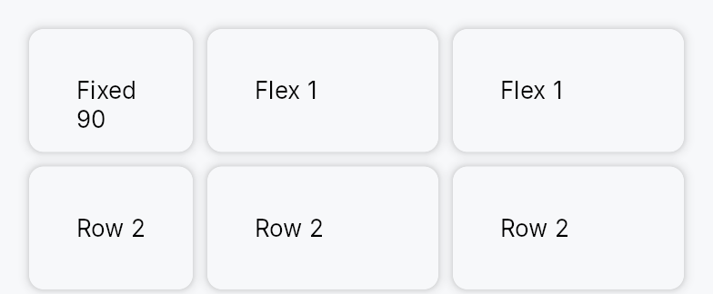
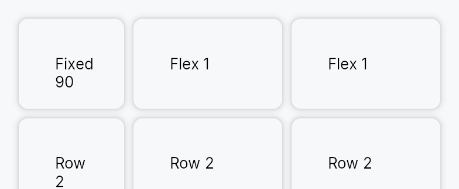

<!-- SPDX-License-Identifier: MPL-2.0 -->
<!-- SPDX-FileCopyrightText: 2026 FernTech -->

# Grid



Grid — a 2D layout container with explicit row and column tracks.

## Public types

| Kind | Name |
| ---: | :--- |
| `enum` | [`TrackSize`](#tracksize) — Sizing mode for a single row or column track in a `Grid` |
| `struct` | [`Grid`](#grid) — A 2D grid layout container with explicit track declarations |

## Public functions

### `Grid`

| Returns | Function |
| ---: | :--- |
| | **Constructors** |
| `Self` | [`new()`](#grid-new) |
| | **Builder methods** |
| `Self` | [`columns(columns: Vec<TrackSize>)`](#grid-columns) |
| `Self` | [`rows(rows: Vec<TrackSize>)`](#grid-rows) |
| `Self` | [`column_gap(gap: impl Into<Prop<f32>>)`](#grid-column_gap) |
| `Self` | [`row_gap(gap: impl Into<Prop<f32>>)`](#grid-row_gap) |
| `Self` | [`child(widget: impl teksilo_core::IntoTeksiChild)`](#grid-child) |
| `Self` | [`children(iter: impl IntoIterator<Item = impl teksilo_core::IntoTeksiChild>)`](#grid-children) |
| `Self` | [`child_opt(widget: Option<impl Widget + 'static>)`](#grid-child_opt) |

## Detailed description

Columns and rows are declared as `TrackSize` slices supporting three
sizing modes: `Fixed(px)` (exact logical pixels), `Auto` (sized to the
largest child in that track), and `Fractional(fr)` (share of the remaining
space after fixed and auto tracks are allocated — the CSS `fr` unit).
Children are placed in **row-major order**: child 0 occupies cell
`(row=0, col=0)`, child 1 `(row=0, col=1)`, and so on. Dormant children
are excluded from placement while keeping their siblings at their original
cell positions, so toggling a cell visible/dormant does not shift other
cells.

Fractional columns fall back to the child's natural width when the parent
provides no width constraint (intrinsic-measurement pass), preventing
wrap-aware children from reporting inflated heights.

```rust
# use teksilo_widgets::primitives::{Grid, TrackSize, RectWidget};
// Two equal columns with a fixed 40 dp row, separated by an 8 dp gap
let _grid = Grid::new()
    .columns(vec![TrackSize::Fractional(1.0), TrackSize::Fractional(1.0)])
    .rows(vec![TrackSize::Fixed(40.0)])
    .column_gap(8.0)
    .child(RectWidget::new())
    .child(RectWidget::new());
```

## Density

The picture above is the widget at `TargetDensity::Compact`, the mouse-and-keyboard ladder. Below is the same subject on the same canvas with only the ladder changed, so what moves is the density and nothing else — where the subject no longer fits, that is what the denser targets cost it at that size. See `docs/density-and-targets.md`.

**Touch**



## API reference

📖 [Full rustdoc API for this module](https://docs.rs/teksilo-widgets/latest/teksilo_widgets/primitives/grid/index.html)

<a id="tracksize"></a>

## `pub enum TrackSize`

Sizing mode for a single row or column track in a `Grid`.

```rust
pub enum TrackSize { /* variants */ }
```

### Variants

- **`Fixed`** — Fixed size in logical pixels regardless of available space.
- **`Fractional`** — Share of the remaining space after `Fixed` and `Auto` tracks are resolved; equivalent to the CSS `fr` unit.  Multiple `Fractional` tracks divide the remainder proportionally to their weights.
- **`Auto`** — Sized to the largest intrinsic dimension among all children in the track; expands to fill content, never clips.

<a id="grid"></a>

## `pub struct Grid`

A 2D grid layout container with explicit track declarations.

```rust
pub struct Grid { /* fields */ }
```

### Methods

<a id="grid-new"></a>

#### `pub fn new() -> Self`

Create a new `Grid` with a single `Auto` column and a single `Auto`
row; configure track definitions with `columns` and
`rows`.

<a id="grid-columns"></a>

#### `pub fn columns(mut self, columns: Vec<TrackSize>) -> Self`

Set the column track definitions; each entry describes one column's
sizing mode.

<a id="grid-rows"></a>

#### `pub fn rows(mut self, rows: Vec<TrackSize>) -> Self`

Set the row track definitions; each entry describes one row's sizing
mode.

<a id="grid-column_gap"></a>

#### `pub fn column_gap(mut self, gap: impl Into<Prop<f32>>) -> Self`

Set the inter-column gap. Accepts static `f32` or `Signal<f32>`.

<a id="grid-row_gap"></a>

#### `pub fn row_gap(mut self, gap: impl Into<Prop<f32>>) -> Self`

Set the inter-row gap. Accepts static `f32` or `Signal<f32>`.

<a id="grid-child"></a>

#### `pub fn child(mut self, widget: impl teksilo_core::IntoTeksiChild) -> Self`

Append an inline child widget in the next cell (row-major order).

<a id="grid-children"></a>

#### `pub fn children( mut self, iter: impl IntoIterator<Item = impl teksilo_core::IntoTeksiChild>, ) -> Self`

Append multiple inline children from an iterator, each occupying the
next cell in row-major order.

<a id="grid-child_opt"></a>

#### `pub fn child_opt(mut self, widget: Option<impl Widget + 'static>) -> Self`

Append an optional inline child; a `None` value is a no-op, keeping
subsequent children at their original cell positions.
