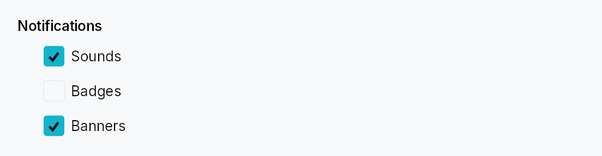

<!-- SPDX-License-Identifier: MPL-2.0 -->
<!-- SPDX-FileCopyrightText: 2026 FernTech -->

# GroupBox



GroupBox — titled cluster of controls in Int UI / Jewel style.

A bold title (optionally preceded by a checkbox) sits above an indented
content area. No border, no frame — pure composition. The standard use
is grouping related settings controls on a preferences sheet or
form — the IntelliJ "group" pattern.

In checkable mode, unchecking disables event dispatch to every descendant
of the content area (via `ctx.enabled_when` with ancestor propagation) AND
paints a translucent surface overlay over the content so it reads as
greyed-out. The title checkbox itself stays interactive.

## When to use

- **GroupBox** — logical cluster with a title; optional enable/disable
  toggle for the whole cluster. Use for settings sections.
- `GroupHeader` — lighter-weight "soft divider +
  caption" without a content slot; use to label regions that are not
  collapsed or disabled as a unit.

## Accessibility

The box node carries `Role::Group` and its `name` is set to the title
string. When checkable and unchecked, `set_disabled()` is set on the
group node so assistive technology announces the cluster as unavailable.

```rust
# use teksilo_widgets::GroupBox;
# use teksilo_widgets::primitives::TextWidget;
# use teksilo_i18n::lit;
let _w = GroupBox::new(lit!("Indentation"))
    .child(TextWidget::new(lit!("Tab width: 4")));
```

## Builder methods at a glance

`checkable`, `child`, `child_id`

## API reference

📖 [Full rustdoc API for this module](../api/teksilo_widgets/group_box/index.html)

## `pub const GROUP_BOX_CONTENT_INDENT`

Horizontal indent of the content area below the title (dp).

```rust
pub const GROUP_BOX_CONTENT_INDENT: f32 = 24.0;
```

## `pub const GROUP_BOX_TITLE_CONTENT_SPACING`

Vertical gap between the title row and the content area (dp).

```rust
pub const GROUP_BOX_TITLE_CONTENT_SPACING: f32 = 8.0;
```

## `pub const GROUP_BOX_CHECKBOX_GAP`

Gap between the checkbox and the adjacent title label in checkable mode (dp).

```rust
pub const GROUP_BOX_CHECKBOX_GAP: f32 = 6.0;
```

## `pub struct GroupBox`

A titled cluster of controls with optional enable/disable toggle.

See the `module documentation` for the checkable-mode details and
the `GroupHeader` sibling.

```rust
pub struct GroupBox { /* fields */ }
```

### Methods

#### `pub fn new(title: impl Into<LocalizedString>) -> Self`

Create a non-checkable group box with the given `title`.

#### `pub fn checkable(mut self, checked: Signal<bool>) -> Self`

Turn this into a checkable GroupBox. When the signal is `false`, events
to descendants of the content area are blocked via effective-enabled
ancestor propagation. The title checkbox itself stays interactive.

#### `pub fn child(mut self, widget: impl Widget + 'static) -> Self`

Set the content widget inline (deferred insertion).

#### `pub fn child_id(mut self, id: WidgetId) -> Self`

Set the content widget by pre-registered ID.
