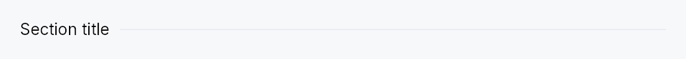

<!-- SPDX-License-Identifier: MPL-2.0 -->
<!-- SPDX-FileCopyrightText: 2026 FernTech -->

# GroupHeader



GroupHeader — a horizontal section header: label followed by a trailing
rule line that fills the remaining width.

## Public functions

### `GroupHeader`

| Returns | Function |
| ---: | :--- |
| | **Constructors** |
| `Self` | [`new(label: impl Into<LocalizedString>)`](#groupheader-new) |
| | **Builder methods** |
| `Self` | [`style(style: impl Into<TextStyleProp>)`](#groupheader-style) |
| `Self` | [`color(color: impl Into<ColorProp>)`](#groupheader-color) |
| `Self` | [`gap(gap: f32)`](#groupheader-gap) |

## Detailed description

Used to segment settings pages, preference sheets, and forms into labelled
regions without the heavier chrome of a `GroupBox`.
Int UI and Jewel use this pattern as a lightweight "soft divider with a
caption" between groups of related controls.

```rust
# use teksilo_widgets::GroupHeader;
# use teksilo_i18n::lit;
let _w = GroupHeader::new(lit!("Appearance"));
```

Trivially composed from existing primitives:
`HStack → TextWidget + Expand(Divider)`.

## Density

The picture above is the widget at `TargetDensity::Compact`, the mouse-and-keyboard ladder. Below is the same subject on the same canvas with only the ladder changed, so what moves is the density and nothing else — where the subject no longer fits, that is what the denser targets cost it at that size. See `docs/density-and-targets.md`.

**Touch**


## API reference

📖 [Full rustdoc API for this module](https://docs.rs/teksilo-widgets/latest/teksilo_widgets/group_header/index.html)

<a id="groupheader"></a>

## `pub struct GroupHeader`

A labelled section header with a trailing rule line.

```rust
pub struct GroupHeader { /* fields */ }
```

### Methods

<a id="groupheader-new"></a>

#### `pub fn new(label: impl Into<LocalizedString>) -> Self`

Create a section header with the given `label`.

<a id="groupheader-style"></a>

#### `pub fn style(mut self, style: impl Into<TextStyleProp>) -> Self`

Override the label's text style (font, size, weight, …). Accepts a
static `TextStyle` or a
`TextStyleRole`.

<a id="groupheader-color"></a>

#### `pub fn color(mut self, color: impl Into<ColorProp>) -> Self`

Override the label's color. Useful when a consumer wants to
emphasise a header with an accent. Accepts a literal `Color`, a
`TextRole`/`SurfaceRole`, or a `Signal<Color>`.

<a id="groupheader-gap"></a>

#### `pub fn gap(mut self, gap: f32) -> Self`

Horizontal gap between the label and the rule line. Defaults to 8 dp.
