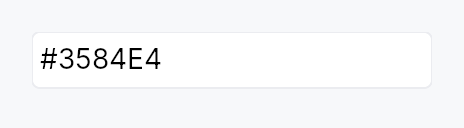

<!-- SPDX-License-Identifier: MPL-2.0 -->
<!-- SPDX-FileCopyrightText: 2026 FernTech -->

# HexColorInput



`HexColorInput` — single-line `#RRGGBB[AA]` color editor.

A specialization of `TextInput` that wires an input mask, a
hex-digit character filter, and a strict commit-time validator on top
of the standard text-editing surface. Bound to a `Signal<Color>`
(required) or `Signal<Option<Color>>` (nullable). External writes to
the bound signal reformat the field text — but only when the field
is unfocused, so a user typing "FF" in the middle of a long color
code isn't clobbered by a sibling widget tweaking the value.

# Behaviour

- **Parsing**: `#RRGGBB` (case-insensitive); `#RRGGBBAA` if
  `alpha_enabled`; `#RGB` short-form expands to `#RRGGBB` if
  `short_form_enabled`. Each accepted form may be normalized to
  uppercase on commit (configurable).
- **Char filter**: only `[0-9a-fA-F#]` admitted while typing.
- **Mask**: `\\#hhhhhh` (or `\\#hhhhhhhh` with alpha) — the
  `TextInputField` mask grammar (`h` = hex digit slot, `\\` literal
  escape).
- **Validation**: commits on Enter / Tab-out / blur.  Returns
  `ValidationOutcome::Valid` / `ValidationOutcome::Corrected` /
  `ValidationOutcome::Invalid` which the inner field maps to a
  visible inline strip via the standard
  `validation_feedback` bridge.
- **Nullable**: empty (after trim) commits `None`; non-empty
  parses normally and commits `Some(color)`.

# Example

```ignore
let color = ctx.signal(Color::from_hex("#3584E4"));
ctx.add(
    HexColorInput::new(color)
        .alpha_enabled(true)
        .label("Background"),
);
```

## Builder methods at a glance

`nullable`, `alpha_enabled`, `short_form_enabled`, `require_hash`, `uppercase`, `label`, `placeholder`, `enabled`, `read_only`, `width`, `on_value_changed`, `on_invalid`, `tooltip`, `rich_tooltip`, `rich_tooltip_content`, `composite_tooltip`, `validation_feedback_signal`

## API reference

📖 [Full rustdoc API for this module](https://docs.rs/teksilo-widgets/latest/teksilo_widgets/hex_color_input/index.html)

## `pub struct HexColorInput`

Single-line hex color editor.

```rust
pub struct HexColorInput { /* fields */ }
```

### Methods

#### `pub fn new(value: Signal<Color>) -> Self`

Bind to a non-nullable color signal. Empty / invalid input
surfaces an error and keeps the previous value. Commits on
Enter or blur.

#### `pub fn nullable(value: Signal<Option<Color>>) -> Self`

Bind to a nullable color signal. Empty input commits `None`;
invalid input surfaces an error and keeps the previous value.
Commits on Enter or blur.

#### `pub fn alpha_enabled(mut self, enabled: bool) -> Self`

Enable or disable the alpha channel (`#RRGGBBAA` form). Default `false`
(`#RRGGBB` only). When enabled, the input mask and parser both switch
to the 8-digit form; existing values are immediately reformatted.

#### `pub fn short_form_enabled(mut self, enabled: bool) -> Self`

Allow CSS `#RGB` short-form input (each digit doubles: `#F0A` →
`#FF00AA`). Default `true`. When committed, the short form is expanded
and a `Corrected` feedback is shown to the user.

#### `pub fn require_hash(mut self, required: bool) -> Self`

Require the `#` prefix during input. Default `true`. Set to `false`
to accept bare `RRGGBB` hex digits (e.g. CSS custom property editors).

#### `pub fn uppercase(mut self, upper: bool) -> Self`

Normalize committed values to uppercase hex digits. Default `true`
(`#FF0000`). Set to `false` for lowercase (`#ff0000`). Existing
values are reformatted immediately.

#### `pub fn label(mut self, label: impl Into<LocalizedString>) -> Self`

Attach a visible label above the field and use it as the AT name.

#### `pub fn placeholder(mut self, placeholder: impl Into<LocalizedString>) -> Self`

Placeholder text shown when the field is empty. Defaults to the
framework's locale-specific `#RRGGBB` / `#RRGGBBAA` hint.

#### `pub fn enabled(mut self, enabled: impl Into<Prop<bool>>) -> Self`

Set the enabled state, statically or reactively. Forwarded to the
arena at build time.

#### `pub fn read_only(mut self, read_only: bool) -> Self`

Put the field in read-only mode; the value is displayed but cannot be
edited. Forwarded to the inner `TextInput`.

#### `pub fn width(mut self, width: f32) -> Self`

Set a minimum intrinsic width for the field in logical pixels.

#### `pub fn on_value_changed( mut self, f: impl Fn(Option<Color>, &mut teksilo_core::widget::EventContext) + 'static, ) -> Self`

Called after a successful commit with the new color value (`None` on a
nullable binding when the field is cleared). Not called when the previous
and new values are identical.

#### `pub fn on_invalid( mut self, f: impl Fn(&str, &mut teksilo_core::widget::EventContext) + 'static, ) -> Self`

Called after a commit attempt when the input is invalid, with the raw
typed string. The field is left as-is so the user can correct the value.

#### `pub fn tooltip(mut self, text: impl Into<LocalizedString>) -> Self`

Attach a plain single-line tooltip shown after the standard hover delay.

Mutually exclusive with `Self::rich_tooltip`, `Self::rich_tooltip_content`,
and `Self::composite_tooltip` — each setter clears the other three so
the last call wins.

#### `pub fn rich_tooltip(mut self, key: impl Into<String>) -> Self`

Attach a rich tooltip driven by a registry key.

Mutually exclusive with `Self::tooltip`, `Self::rich_tooltip_content`,
and `Self::composite_tooltip` — each setter clears the other three so
the last call wins.

#### `pub fn rich_tooltip_content(mut self, content: crate::tooltip::TooltipContent) -> Self`

Attach a rich tooltip from inline `crate::tooltip::TooltipContent`.

Mutually exclusive with `Self::tooltip`, `Self::rich_tooltip`,
and `Self::composite_tooltip` — each setter clears the other three so
the last call wins.

#### `pub fn composite_tooltip(mut self, content: impl Widget + 'static) -> Self`

Attach a composite tooltip whose body is an arbitrary widget tree.

Mutually exclusive with `Self::tooltip`, `Self::rich_tooltip`,
and `Self::rich_tooltip_content` — each setter clears the other three so
the last call wins.

#### `pub fn validation_feedback_signal(&self) -> Signal<ValidationFeedback>`

Reactive handle on the inner TextInput's published validation
feedback. Mirrors the inner field's signal after `build()`.
