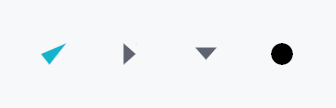

<!-- SPDX-License-Identifier: MPL-2.0 -->
<!-- SPDX-FileCopyrightText: 2026 FernTech -->

# IconWidget



IconWidget — a vector or raster icon rendered at a configurable size.

Supports multiple source formats: programmatic `Path` (checkmarks,
chevrons, dots), SVG strings, PNG, static WebP, and animated WebP. Icons
default to **tintable** mode — the pixels are treated as an alpha mask
and multiplied by the widget's color property (defaults to
`TextRole::Primary`) so they follow theme switches automatically.
`IconMode::FullColor` preserves original pixel colors and is appropriate
for emoji-style graphics or brand logos.

For arbitrary-aspect-ratio photos or artwork see
`ImageWidget`.

## Accessibility

Icons are decorative by default — they set no accessibility role and
announce nothing. The parent widget (e.g. `Button`, `IconButton`) is
responsible for the accessible label.

```rust
# use teksilo_widgets::primitives::icon_widget::{IconWidget, IconMode};
# use teksilo_tokens::TextRole;
let _check = IconWidget::checkmark(20.0);

let _chevron = IconWidget::chevron_down(16.0)
    .color(TextRole::Primary)
    .follow_text_scale(false);
```

## Builder methods at a glance

`from_path`, `checkmark`, `dash`, `radio_dot`, `chevron_down`, `chevron_right`, `chevron_left`, `chevron_up`, `from_svg`, `from_svg_icon`, `from_png`, `from_webp`, `from_raster`, `from_animated`, `mode`, `color`, `icon_size`, `follow_text_scale`

## API reference

📖 [Full rustdoc API for this module](../api/teksilo_widgets/primitives/icon_widget/index.html)

## `pub enum IconMode`

Whether an icon is rendered as a theme-tinted mask or in its original colors.

Applies to every source an `IconWidget` can hold — raster *and* SVG. For an
SVG the two modes select between the two representations the parser builds
(see `teksilo_canvas::svg`): `Tintable` draws the merged
silhouette in the widget's color, `FullColor` walks the
document-ordered ops and honours each shape's own fill / stroke / gradient.

The default is `Tintable`, which is what a UI glyph wants —
it follows the theme into dark mode. Reach for
`FullColor` for artwork whose colors *are* the content: a
brand mark, a flag, a colored file-type badge. A `currentColor` shape inside
full-color artwork still takes the widget's color, so the two are mixable.

```rust
pub enum IconMode { /* variants */ }
```

### Variants

- **`Tintable`** — Treat as an alpha mask: tint the whole icon with the widget's color.
- **`FullColor`** — Render the icon's own colors; the widget color supplies `currentColor` and its alpha attenuates the result.

## `pub struct IconWidget`

A leaf widget that renders an icon from a path, SVG string, PNG, or WebP source.

```rust
pub struct IconWidget { /* fields */ }
```

### Methods

#### `pub fn from_path(path: Path, size: f32) -> Self`

Create an icon from a custom path. The path should be defined
in coordinates matching the given size (e.g., 0..24 for size=24).

#### `pub fn checkmark(size: f32) -> Self`

A checkmark icon (✓) at the given size.

#### `pub fn dash(size: f32) -> Self`

A short horizontal dash at the given size — used as the
indeterminate-state glyph for tristate menu items (mirrors
the Windows "mixed-state" convention).

#### `pub fn radio_dot(size: f32) -> Self`

A small filled disc centered in the given size — used as the
selected-state glyph for radio menu items.

#### `pub fn chevron_down(size: f32) -> Self`

A downward-pointing chevron (▼) at the given size.

#### `pub fn chevron_right(size: f32) -> Self`

A right-pointing chevron (▶) at the given size.

#### `pub fn chevron_left(size: f32) -> Self`

A left-pointing chevron (◀) at the given size.

#### `pub fn chevron_up(size: f32) -> Self`

An upward-pointing chevron (▲) at the given size.

#### `pub fn from_svg(svg_str: &str) -> Self`

Create an icon from an SVG string. Parses the SVG and extracts
geometry, ignoring any colors in the SVG. Display size defaults
to the SVG's viewBox dimensions; use `icon_size`
to override.

If parsing fails, logs the error in debug mode and produces an empty icon.

#### `pub fn from_svg_icon(icon: &SvgIcon) -> Self`

Create an icon from a pre-parsed `SvgIcon`. Display size
defaults to the SVG's viewBox; use `icon_size`
to override. Scaling is deferred to paint time.

#### `pub fn from_png(data: &'static [u8], size: f32) -> Self`

Create an icon from PNG data.

If decoding fails, logs the error in debug mode and produces an empty icon.

#### `pub fn from_webp(data: &'static [u8], size: f32) -> Self`

Create an icon from WebP data. Auto-detects static vs animated.

If decoding fails, logs the error in debug mode and produces an empty icon.

#### `pub fn from_raster(icon: &RasterIcon, size: f32) -> Self`

Create an icon from a pre-decoded `RasterIcon`.
Accepts a reference — pixel data is copied internally.

#### `pub fn from_animated(icon: &AnimatedIcon, size: f32) -> Self`

Create an icon from a pre-decoded `AnimatedIcon`.
Accepts a reference — frame data is copied internally.

#### `pub fn mode(mut self, mode: IconMode) -> Self`

Set the icon rendering mode (tintable or full-color).
Re-computes cached pixel data for raster/animated icons.

#### `pub fn color(mut self, color: impl Into<ColorProp>) -> Self`

Set the tint. Accepts any `impl Into<ColorProp>`:

- A raw `Color` — a frozen literal.
- A `TextRole` / `SurfaceRole` / `BorderRole` — resolved against
  the theme at paint time (reactive across theme switches).
- A `Signal<Color>` — reactive state (usually interaction-driven).

#### `pub fn icon_size(mut self, size: f32) -> Self`

Set the display size of the icon. The path/image is scaled to fit
this size during rendering. This does not affect the design-time
coordinate space — SVG paths scale correctly.

#### `pub fn follow_text_scale(mut self, follow: bool) -> Self`

Make this icon grow with the global accessibility text scale
(`ctx.text_scale`). Off by default. Enable for icons that sit inline
with text and should scale together — e.g. status glyphs in a
`SeverityBadge`. The reported (and rendered) size becomes
`display_size × text_scale`.
