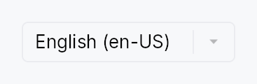
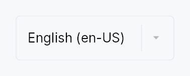

<!-- SPDX-License-Identifier: MPL-2.0 -->
<!-- SPDX-FileCopyrightText: 2026 FernTech -->

# LanguageSwitcher



LanguageSwitcher — a drop-in UI-language picker for settings screens.

## Public functions

### `LanguageSwitcher`

| Returns | Function |
| ---: | :--- |
| | **Constructors** |
| `Self` | [`new()`](#languageswitcher-new) |
| | **Builder methods** |
| `Self` | [`variant(variant: ComboBoxVariant)`](#languageswitcher-variant) |
| `Self` | [`label(label: impl Into<LocalizedString>)`](#languageswitcher-label) |
| `Self` | [`locales(locales: Vec<LanguageIdentifier>)`](#languageswitcher-locales) |
| `Self` | [`tooltip(text: impl Into<LocalizedString>)`](#languageswitcher-tooltip) |
| `Self` | [`rich_tooltip(key: impl Into<String>)`](#languageswitcher-rich_tooltip) |
| `Self` | [`rich_tooltip_content(content: crate::tooltip::TooltipContent)`](#languageswitcher-rich_tooltip_content) |
| `Self` | [`composite_tooltip(content: impl Widget + 'static)`](#languageswitcher-composite_tooltip) |

## Detailed description

A thin `ComboBox` preset that lists the application's supported
locales and switches the active locale on selection. Each entry is
shown as its **endonym** — the language's own name — followed by the
BCP-47 tag, e.g. `français (fr-FR)`, `Deutsch (de-DE)`,
`العربية (ar-SA)`. Showing endonyms (not "French", "German", "Arabic")
means a speaker of each language can always find their own in the list.

Zero-config: drop it into a settings panel and it

- self-populates from the installed `I18nManager`
  (`teksilo_i18n::current_supported_locales()`),
- shows the active locale as the current selection
  (`teksilo_i18n::current_locale()`),
- switches the app locale on selection via `EventContext::set_locale`,
  which the window manager fans out to every window (re-translating
  text and flipping layout direction for RTL locales like Arabic),
- and keeps its selection in sync if the locale is changed elsewhere.

```ignore
// In a settings panel's build():
VStack::new()
    .child(TextWidget::new(tr!(ui_language())).style(TextStyleRole::BodyBold))
    .child(LanguageSwitcher::new())
```

Endonyms come from ICU4X CLDR data via
`teksilo_i18n::language_endonym`; an unknown tag falls back to the
raw BCP-47 tag. When no `I18nManager` is configured the switcher
renders an empty, placeholder ComboBox.

## Density

The picture above is the widget at `TargetDensity::Compact`, the mouse-and-keyboard ladder. Below is the same subject on the same canvas with only the ladder changed, so what moves is the density and nothing else — where the subject no longer fits, that is what the denser targets cost it at that size. See `docs/density-and-targets.md`.

**Touch**



## API reference

📖 [Full rustdoc API for this module](https://docs.rs/teksilo-widgets/latest/teksilo_widgets/language_switcher/index.html)

<a id="languageswitcher"></a>

## `pub struct LanguageSwitcher`

A UI-language picker built on `ComboBox`. See the module docs.

```rust
pub struct LanguageSwitcher { /* fields */ }
```

### Methods

<a id="languageswitcher-new"></a>

#### `pub fn new() -> Self`

Create a switcher that auto-discovers the supported locales from
the active `I18nManager`.

<a id="languageswitcher-variant"></a>

#### `pub fn variant(mut self, variant: ComboBoxVariant) -> Self`

Pick the inner ComboBox's design-language variant.

<a id="languageswitcher-label"></a>

#### `pub fn label(mut self, label: impl Into<LocalizedString>) -> Self`

Set the accessible / control label (defaults to `"Language"`).
Pass a `tr!(...)` to localize it.

<a id="languageswitcher-locales"></a>

#### `pub fn locales(mut self, locales: Vec<LanguageIdentifier>) -> Self`

Override the locale list instead of auto-discovering it from the
active `I18nManager`. Useful in previews / tests, or to restrict
the offered set.

<a id="languageswitcher-tooltip"></a>

#### `pub fn tooltip(mut self, text: impl Into<LocalizedString>) -> Self`

Attach a plain tooltip, forwarded to the inner `ComboBox`.
Mutually exclusive with the rich / composite variants — last
call wins.

<a id="languageswitcher-rich_tooltip"></a>

#### `pub fn rich_tooltip(mut self, key: impl Into<String>) -> Self`

Attach a rich tooltip resolved from the app-wide registry,
forwarded to the inner `ComboBox`. Overrides any previously
set tooltip.

<a id="languageswitcher-rich_tooltip_content"></a>

#### `pub fn rich_tooltip_content(mut self, content: crate::tooltip::TooltipContent) -> Self`

Attach a rich tooltip driven by inline
`TooltipContent`, forwarded to
the inner `ComboBox`. Overrides any previously set tooltip.

<a id="languageswitcher-composite_tooltip"></a>

#### `pub fn composite_tooltip(mut self, content: impl Widget + 'static) -> Self`

Attach a composite tooltip hosting an arbitrary widget tree,
forwarded to the inner `ComboBox`. Overrides any previously
set tooltip.
