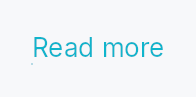

<!-- SPDX-License-Identifier: MPL-2.0 -->
<!-- SPDX-FileCopyrightText: 2026 FernTech -->

# Link



Link — a clickable text label rendered as underlined inline text.

`Link` is Teksilo's hyperlink control: it responds to tap, Enter, and
Space like a `Button`, but renders as styled underlined text rather than a
bordered box. It supports an optional `url` field (informational — the app
decides whether and how to open it), a reactive `visited` state that shifts
the text colour, and all three tooltip tiers (plain / rich / composite).

Keyboard behaviour follows the platform link convention: Space and Enter
activate; a bare KeyUp with no preceding KeyDown is ignored (lone-KeyUp
guard). The focus ring appears only after keyboard navigation
(`focus_visible`), not after a mouse click.

## Accessibility

`Role::Link` with the label as the AT name. When `url` is set it is
forwarded to `set_url` so screen readers can announce the destination.
Exposes `Action::Click` and `Action::Focus`.

```rust
# use teksilo_widgets::Link;
# use teksilo_i18n::lit;
let _w = Link::new(lit!("Open documentation"))
    .url("https://example.com/docs");
```

## Builder methods at a glance

`visited`, `style`, `on_activate_fn`, `url`, `tooltip`, `rich_tooltip`, `rich_tooltip_content`, `composite_tooltip`, `get_url`, `enabled`

## API reference

📖 [Full rustdoc API for this module](https://docs.rs/teksilo-widgets/latest/teksilo_widgets/link/index.html)

## `pub struct Link`

A clickable text link that renders as underlined inline text.

```rust
pub struct Link { /* fields */ }
```

### Methods

#### `pub fn new(text: impl Into<LocalizedString>) -> Self`

Create a link with the given display text.

#### `pub fn visited(mut self, visited: impl Into<Prop<bool>>) -> Self`

Mark the link's target as visited. Drives `TextRole::LinkVisited`
when no transient interaction (hover / press) is active. Visited
is overridden by hover/press, following the web convention. The
app owns the signal (typically backed by URL-history state).

#### `pub fn style(mut self, style: impl teksilo_core::styles::LinkStyle) -> Self`

Per-call style override for the link chrome.

#### `pub fn on_activate_fn(mut self, f: impl Fn(&mut EventContext) + 'static) -> Self`

Closure invoked on activation.

#### `pub fn url(mut self, url: impl Into<String>) -> Self`

Set a URL for the link (informational — not automatically opened).

#### `pub fn tooltip(mut self, text: impl Into<LocalizedString>) -> Self`

Attach a plain single-line tooltip shown after a hover delay.
Mutually exclusive with `rich_tooltip` / `composite_tooltip` — last call wins.

#### `pub fn rich_tooltip(mut self, key: impl Into<String>) -> Self`

Attach a rich tooltip resolved from the app-wide tooltip
registry. See `Button::rich_tooltip`.

#### `pub fn rich_tooltip_content(mut self, content: crate::tooltip::TooltipContent) -> Self`

Attach a rich tooltip driven by inline `TooltipContent`.

#### `pub fn composite_tooltip( mut self, content: impl teksilo_core::widget::Widget + 'static, ) -> Self`

Attach a composite tooltip — third tier, hosting an arbitrary
widget tree. See `Button::composite_tooltip`.

#### `pub fn get_url(&self) -> Option<&str>`

Return the URL previously set via `url`, if any.

#### `pub fn enabled(mut self, enabled: impl Into<Prop<bool>>) -> Self`

Set the enabled state, statically or reactively. Forwarded to the
arena at build time — a bound `Signal<bool>` updates live as it
changes.
