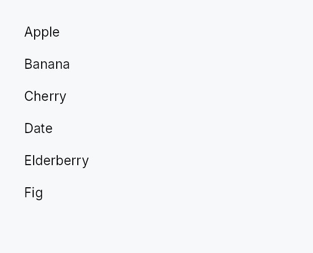

<!-- SPDX-License-Identifier: MPL-2.0 -->
<!-- SPDX-FileCopyrightText: 2026 FernTech -->

# ListView



ListView — a virtualized, scrollable list backed by a reactive data model.

`ListView<T>` materializes widget subtrees only for the rows currently
visible in its viewport (plus a configurable buffer). Scrolling and model
changes trigger a localized rebuild that touches only the newly-visible
slice, leaving the rest of the tree untouched. The data source is a
`ListModel<T>` (in-memory, reactive) or any `ListDataSource<Item = T>`
(lazy / external). A delegate closure `(index, &T, selected) -> Box<dyn Widget>`
produces each row widget on demand.

Row heights come in three modes: **uniform** (`item_height`, the 32 dp
default and fastest path), **exact callback** (`item_height_fn` — pure,
deterministic per-row sizes), and **auto-measured** (`auto_item_height` —
height-for-width measurement with scroll anchoring so content above the
viewport stays put while estimates converge).

## When to use

- Large or dynamically-loaded lists (thousands of rows) — use `ListView`.
- Small, always-all-visible collections — use `Repeater` instead.
- Hierarchical data — use `TreeView`.
- Multi-column tabular data — use `TableView`.

## Accessibility

The widget is `Role::ListBox`; each row is wrapped in
`Role::ListBoxOption` with `set_selected` state. Those are the interactive
ARIA roles — `listbox` / `option` — not the static `list` / `listitem` pair,
because this widget has keyboard navigation and selection.

Each row publishes its 1-based `position_in_set` **in the model**, and the
container publishes the model's length as `size_of_set`, so a screen reader
says "row 147 of 200" rather than counting the realized window. The count
sits on the container because AccessKit resolves an item's set size by
walking up from it, unlike ARIA's per-item `aria-setsize`.

The container is the focusable node and rows deliberately are not, so
`set_selected` is the only signal telling assistive technology which row is
current. Full keyboard navigation: arrows, Home, End, PageUp, PageDown,
Space (select/toggle), Enter (activate), Ctrl+A (select all), Shift+Arrow
(range), type-ahead (opt-in via `type_ahead_label`), and Shift+F10 or the
Menu key for the selected row's context menu.

```rust
# use teksilo_widgets::ListView;
# use teksilo_widgets::primitives::TextWidget;
# use teksilo_data::{ListModel, SelectionMode, SelectionModel};
# use teksilo_i18n::lit;
# struct Item { name: String }
# let model: ListModel<Item> = ListModel::from_vec(vec![Item { name: "Alpha".into() }]);
# let sel = SelectionModel::new(SelectionMode::Single);
let _w = ListView::new(model, |_i, item, _selected| {
    Box::new(TextWidget::new(lit!(&item.name)))
})
.item_height(32.0)
.selection(sel);
```

## Builder methods at a glance

`from_source`, `from_source_keyed`, `enabled`, `overscroll_behavior`, `smooth_scrolling`, `smooth_scroll_duration`, `scroll_bar_style`, `item_height`, `item_height_fn`, `auto_item_height`, `spacing`, `selection`, `realized_row_ids`, `reorderable`, `exportable`, `export_external`, `on_rows_transferred_out`, `accept_foreign_rows`, `on_rows_received`, `on_activate`, `activate_on`, `row_tooltip_sticky`, `row_tooltip`, `row_rich_tooltip`, `row_composite_tooltip`, `type_ahead_label`, `type_ahead_timeout`, `show_scrollbar`, `scroll_y_signal`, `max_scroll_y_signal`, `viewport_ratio_y_signal`, `scroll_to_index`, `ensure_index_visible`

## API reference

📖 [Full rustdoc API for this module](https://docs.rs/teksilo-widgets/latest/teksilo_widgets/list_view/index.html)

## `pub struct ListView`

A virtualized scrollable list backed by a `ListModel<T>` or `ListDataSource`.

See the module-level documentation for the full feature overview.

```rust
pub struct ListView<T: 'static> { /* fields */ }
```

### Methods

#### `pub fn new( model: ListModel<T>, delegate: impl Fn(usize, &T, bool) -> Box<dyn Widget> + 'static, ) -> Self`

Create a new ListView backed by a `ListModel<T>`.

The `delegate` closure receives `(index, &item, selected)` and returns
a boxed widget for that item.

#### `pub fn from_source<S: teksilo_data::ListDataSource<Item = T>>( source: S, delegate: impl Fn(usize, &T, bool) -> Box<dyn Widget> + 'static, ) -> Self`

Create a ListView backed by a custom `ListDataSource`.

Use this for large or external datasets that cannot fit in memory.
The source must implement `ListDataSource<Item = T>`.

#### `pub fn from_source_keyed<S: teksilo_data::ListDataSource<Item = T>>( source: S, keyed: KeyedSelectionModel<S::Key>, delegate: impl Fn(usize, &T, bool) -> Box<dyn Widget> + 'static, ) -> Self where S::Key: ItemKey,`

Create a ListView backed by a custom `ListDataSource` with **keyed**
selection. The `KeyedSelectionModel<S::Key>` tracks selection by source
identity, so it survives reorders, filters, lazy window-slides, and
stays consistent across two views of the same source. The view stays
key-less (`ListView<T>`) — the index↔key mapping is captured from the
concrete source here. Mutually exclusive with
`selection` (the last one set wins).

#### `pub fn enabled(mut self, enabled: impl Into<Prop<bool>>) -> Self`

Enable or disable the whole view. A disabled view greys out and stops
accepting focus / selection / keyboard input (arena-gated).

#### `pub fn overscroll_behavior(mut self, behavior: OverscrollBehavior) -> Self`

Set the scroll-chaining behavior at the boundary (default
`OverscrollBehavior::Chain`; `Contain`
disables chaining to an ancestor scrollable).

#### `pub fn smooth_scrolling(mut self, enabled: bool) -> Self`

Enable or disable animated wheel scrolling (enabled by default).

#### `pub fn smooth_scroll_duration(mut self, duration: Duration) -> Self`

Duration of the smooth scroll animation (default 150 ms).

#### `pub fn scroll_bar_style(mut self, style: ScrollBarMode) -> Self`

How the scroll bar is displayed (default `Permanent`). `Overlay`
and `Thin` float the bar over the content instead of reserving a
layout column, mirroring `ScrollArea::scroll_bar_style`.

#### `pub fn item_height(mut self, height: f32) -> Self`

Set the fixed height per item (default 32.0) — the uniform fast
path. Mutually exclusive with `item_height_fn`
and `auto_item_height`; the last mode
setter wins.

#### `pub fn item_height_fn(mut self, f: impl Fn(usize) -> f32 + 'static) -> Self`

Per-item heights from a callback. The callback must be pure (same
index + same data → same height); it is re-swept from the first
changed index on every model change. No measurement pass runs —
this is the deterministic variable-height path.

#### `pub fn auto_item_height(mut self, estimated: f32) -> Self`

Auto-measured item heights: each realized row is measured at the
list's content width (height-for-width), unrealized rows assume
`estimated`. Scroll anchoring keeps content above the viewport
stationary as estimates are corrected. `estimated` should be a
typical row height — a wrong estimate only costs realization
churn while measurements settle, never incorrect layout.

#### `pub fn spacing(mut self, spacing: f32) -> Self`

Set spacing between items (default 0.0).

#### `pub fn selection(mut self, sel: SelectionModel) -> Self`

Set the index-based selection model (positions). For identity-based
selection that survives reorder / filter / window-slide, build the view
with `from_source_keyed` instead.

#### `pub fn realized_row_ids(&self) -> Rc<RefCell<Vec<(usize, WidgetId)>>>`

A shared handle to the live `(model index → row node id)` map of the
**realized** rows, rewritten at the end of every build.

The id is the row's `Role::ListBoxOption` wrapper — the node an
`active_descendant` has to point at. Take the handle before moving the
view into the tree; it is populated on the first build.

This exists for the ARIA combobox / listbox pattern, where keyboard
focus stays on a *text field* while the arrow keys move a highlight
through this list (a command palette, a type-ahead picker). The field's
AT node publishes `active_descendant` pointing here, so a screen reader
announces each row as the highlight moves without focus ever leaving
the input. A `ListView` that holds focus itself does not need this.

Only realized rows are present — a row scrolled outside the
virtualization window has no widget, so look-ups for it return `None`.
Callers should `scroll_to_index` the row they intend to announce.

#### `pub fn reorderable(mut self, enabled: bool) -> Self`

Enable intra-widget drag reordering.

When enabled, rows can be dragged within this ListView to reorder them.
The move is routed through the source's `accept_drop` — a `ListModel`
reorders in place, an external source routes the move to its store. The
hover indicator reflects the source's `can_accept` verdict, so a
forbidden drop shows no insertion line. Keyboard equivalent:
Alt+ArrowUp/Down.

#### `pub fn exportable(mut self, mode: DragTransferMode) -> Self where T: Clone,`

Make rows **droppable outside this view** — on a
`DropTarget`, another data view, or the OS.

A dragged row (or the whole selection, when the pressed row is part of a
multi-selection) carries clones of its items in a public
`RowDragData<T>`, so a foreign receiver can pull
them out with `payload.get_typed::<RowDragData<T>>()` /
`DropTarget::on_drop_typed::<RowDragData<T>>()` — no serialization. This
also makes rows a drag source even without `reorderable`.

`mode` chooses what happens to the origin rows once a *foreign* target
accepts them: `DragTransferMode::Move` removes them (via the source's
`on_drag_out`, or `on_rows_transferred_out`),
`DragTransferMode::Copy` leaves them. A same-view reorder is never a
transfer, so `mode` never affects it. Requires `T: Clone`.

**Move caveats.** The row is removed only when the drop is accepted by an
in-app target *in the same window* (`DropOutcome::InApp { accepted: true }`)
or the OS reports a genuine move. Shipped OS backends advertise **copy
only**, so a drag exported to another application — or to another window
of the same app — is treated as a *copy*: the origin row is kept and the
receiver must own its own copy semantics. Also, for a `ListModel`-backed
view (whose key *is* the row index) the move-out removes by the indices
captured at drag-start; if a shared handle to the same model is mutated
while the drag is in flight, those indices can point at different rows —
use a keyed source, or `on_rows_transferred_out`
with your own stable identity, for models that change mid-drag.

#### `pub fn export_external(mut self, f: impl Fn(&[T]) -> Vec<(String, Vec<u8>)> + 'static) -> Self where T: Clone,`

Additionally advertise the dragged rows as MIME data so they can be
dropped on a `DropZone` or exported to another
application / window via the OS. `f` maps the dragged items to
`(mime_type, bytes)` pairs (e.g. `text/plain`, `text/uri-list`, an
app-specific `application/x-…`). Implies `exportable`
(defaulting to `DragTransferMode::Move` if not already set). Requires
`T: Clone`.

#### `pub fn on_rows_transferred_out( mut self, f: impl Fn(&[usize], &mut teksilo_core::widget::EventContext) + 'static, ) -> Self`

Override how rows moved out to a foreign target are removed from this
view. Receives the dragged rows' indices (descending-safe) and the live
context. Without this, an `exportable`
`Move` drag removes them through the source's
`on_drag_out` (works out of the box for a `ListModel`).

#### `pub fn accept_foreign_rows(mut self, accept: bool) -> Self`

Accept exported rows dropped from a **different** view or source without
writing a custom `ListDataSource`. Pair with
`on_rows_received`, which is handed the dropped
items and the insertion index. (Same-view reorder is
`reorderable`; a custom `ListDataSource` can still
accept foreign drops through its `can_accept`/`accept_drop` instead.)

#### `pub fn on_rows_received( mut self, f: impl Fn(Vec<T>, usize, &mut teksilo_core::widget::EventContext) + 'static, ) -> Self`

Handler for rows accepted via `accept_foreign_rows`:
`(items, insertion_index, ctx)`. Insert them into your model at the
index.

#### `pub fn on_activate( mut self, f: impl Fn(usize, &mut teksilo_core::widget::EventContext) + 'static, ) -> Self`

Set the row-**activation** handler — invoked with the flat row index and
the live `EventContext` on a click
(per `activate_on`) or **Enter** on the focused row.
The context lets the handler open a modal, toast, or dispatch an intent —
matching `TableView::on_row_activate`
/ `GridView::on_tile_activate`.
Distinct from *selection*: arrow-key navigation and **Space** move /
toggle the selection but do **not** activate.

#### `pub fn activate_on(mut self, mode: crate::data_views::ActivateOn) -> Self`

Choose single- vs double-click activation (default
`ActivateOn::DoubleClick`). Enter activates in
either mode.

#### `pub fn row_tooltip_sticky(mut self, on: bool) -> Self`

Enable **type-ahead** ("type to jump"): with this set, typing a
printable character while the list has keyboard focus jumps the
selection to the next row whose label starts with the accumulated
search term, wrapping around (Qt `keyboardSearch` / macOS &
Windows type-select). `label(&item)` yields the searchable text for
a row; matching is ASCII-case-insensitive. A pause longer than the
`type_ahead_timeout` starts a fresh term.
Whether a composite row tooltip offers dwell-to-sticky promotion.
Default `true`.

Turn it off for a read-only row card: with nothing to reach into there
is nothing to pin, so the countdown indicator would promise an
interaction that does not exist and the surface would outlive the
pointer for no reason.

#### `pub fn row_tooltip( mut self, f: impl Fn(usize, &T) -> Option<teksilo_i18n::LocalizedString> + 'static, ) -> Self`

Per-row plain tooltip: one line of text for the row under the pointer.

The resolver receives the row's flat index and its item; returning
`None` leaves that row without a tip. Mutually exclusive with
`row_rich_tooltip` and
`row_composite_tooltip` — last setter
wins, matching the per-widget tooltip matrix.

Opens to the row's trailing side, never below it: rows stack
vertically, so a tip below would cover the next row.

#### `pub fn row_rich_tooltip( mut self, f: impl Fn(usize, &T) -> Option<crate::tooltip::RichTooltipSource> + 'static, ) -> Self`

Per-row rich tooltip — a registry key or inline
`TooltipContent`. See
`row_tooltip` for the shared semantics.

#### `pub fn row_composite_tooltip( mut self, f: impl Fn(usize, &T) -> Option<Box<dyn Widget>> + 'static, ) -> Self`

Per-row composite tooltip — an arbitrary widget tree describing the row.

The body is built for every **realized** row (the virtualization window)
and rebuilt with it, so keep the resolver cheap and defer anything
costly to the body's own first paint, which only runs if the tip is
actually shown. See `row_tooltip` for the rest.

#### `pub fn type_ahead_label(mut self, label: impl Fn(&T) -> String + 'static) -> Self`

#### `pub fn type_ahead_timeout(mut self, timeout: Duration) -> Self`

Reset window between keystrokes before the type-ahead search term
clears (default 500 ms). A zero duration disables type-ahead.

#### `pub fn show_scrollbar(mut self, show: bool) -> Self`

Suppress the internal scroll bar. Use when the caller wants to
mount its own `ScrollBar` outside the ListView (keeping it alive
across rebuilds so a thumb drag isn't torn down when the visible
range shifts past the buffer). The caller is expected to wire
the external bar up to the signals returned by
`scroll_y_signal`,
`max_scroll_y_signal` and
`viewport_ratio_y_signal`.

#### `pub fn scroll_y_signal(&self) -> &Signal<f32>`

The current vertical scroll offset, in logical pixels. Drives the
viewport position and the scroll bar thumb. Exposed so external
logic (e.g. a parent widget implementing custom scroll-into-view)
can read or drive the scroll directly — prefer
`scroll_to_index` /
`ensure_index_visible` when possible.

#### `pub fn max_scroll_y_signal(&self) -> &Signal<f32>`

The maximum scroll offset, `content_height - viewport_height`.
Updated during layout. Exposed for callers that mount their own
external scrollbar via `show_scrollbar(false)`.

#### `pub fn viewport_ratio_y_signal(&self) -> &Signal<f32>`

The vertical viewport-to-content ratio (0.0..1.0). Drives the
thumb size on any external scrollbar.

#### `pub fn scroll_to_index(&self, index: usize)`

Scroll so the given model index is aligned to the top of the
viewport. Clamped to the valid scroll range. Safe to call before
the ListView has been laid out — the clamp will kick in on the
first layout pass.

#### `pub fn ensure_index_visible(&self, index: usize)`

Scroll the minimum distance needed to bring the given model
index fully into the viewport. No-op if already visible.
