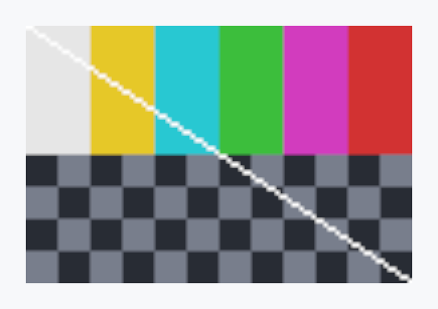

<!-- SPDX-License-Identifier: MPL-2.0 -->
<!-- SPDX-FileCopyrightText: 2026 FernTech -->

# LiveImage


LiveImage — shows a picture another thread rewrites many times a second.

A virtual machine's screen, a video frame, a camera preview: the pixels
never pass through the widget. A producer writes a
`LiveImageSource` from any thread through a `LiveImageWriter`; the
window's renderer uploads what changed since its last frame and draws it
where this widget's last paint put it. A commit that changes only pixels
runs no `paint()`, marks no widget and repaints nothing else: the window
replays its cached frame. Only a change of the source's size or status
(resized, `Waiting`, `Live`, `Disconnected`) relayouts and repaints this
widget.

# Sizing

`LiveImageSizing` picks the box: `Aspect` (the default) is the largest
box with the picture's aspect ratio inside the proposal, rounded to whole
device pixels; `Fill` takes the whole proposal and letterboxes; `Natural`
is one source pixel per logical pixel (`device_pixels`
makes it one per device pixel). `width`,
`height` and `size` pin the box
and win over the mode. Inside the box the picture is placed by an
`ImageFit` and an `Alignment`, turned by an `ImageOrientation`, and
its edges snap to the device-pixel grid.

```rust
use teksilo_widgets::primitives::live_image::{LiveImage, LiveImageSizing};
use teksilo_widgets::primitives::live_image::{LiveImageSource, LivePixelFormat};
use teksilo_widgets::primitives::ImageFit;

let screen = LiveImageSource::new(LivePixelFormat::Bgrx8);
let writer = screen.writer();
std::thread::spawn(move || {
    let frame = vec![0u8; 720 * 1280 * 4];
    writer.write_frame(720, 1280, &frame, 720 * 4).unwrap();
});
let _view = LiveImage::new(screen)
    .sizing(LiveImageSizing::Aspect)
    .fit(ImageFit::Contain)
    .alt("Virtual machine screen");
```

# Input

`LiveImage` handles no input. An app that forwards pointer input to what
the picture shows attaches its handlers through `WidgetBuilder` and maps
the positions they receive with the widget's `LiveImageHandle`, taken
before a `WidgetBuilder` method wraps the widget (or injected with
`with_handle`):
`map_to_source` gives the source pixel
a point shows, from the same placement paint drew. A position handed in
window space (`Scroll::window_position`) goes through
`EventContext::to_local` first.

# Accessibility

One `Role::Image` node named by `alt`; a decorative
picture calls `a11y_hidden` instead. Pixels are
not accessible content, and a commit never changes the node: only a
status change does, when the `placeholder`
becomes or stops being its description.

## Density

The picture above is the widget at `TargetDensity::Compact`, the mouse-and-keyboard ladder. Below is the same subject on the same canvas with only the ladder changed, so what moves is the density and nothing else — where the subject no longer fits, that is what the denser targets cost it at that size. See `docs/density-and-targets.md`.

**Touch**



## Builder methods at a glance

`fit`, `alignment`, `sizing`, `width`, `height`, `size`, `device_pixels`, `scaling`, `orientation`, `pixel_snap`, `background`, `placeholder`, `alt`, `a11y_hidden`, `pause_when_inactive`, `dim_when_disabled`, `with_handle`, `handle`

## API reference

📖 [Full rustdoc API for this module](https://docs.rs/teksilo-widgets/latest/teksilo_widgets/primitives/live_image/index.html)

## `pub enum LiveImageSizing`

How a `LiveImage` sizes its box. `LiveImage::width`,
`LiveImage::height` and `LiveImage::size` pin it and win over the
mode.

```rust
pub enum LiveImageSizing { /* variants */ }
```

### Variants

- **`Aspect`** — The largest box with the picture's aspect ratio inside the proposal, each side rounded to whole device pixels. It scales up as well as down; an axis the proposal leaves open follows the other one. With no frame size yet, the proposal on its bounded axes, else zero.
- **`Fill`** — The whole proposal, growing into a stack's slack; the `fit` places the picture and the rest is letterbox. An axis the proposal leaves open follows the picture's aspect ratio.
- **`Natural`** — The picture's own size, rigid: one source pixel per logical pixel, or per device pixel with `device_pixels`. Zero with no frame size yet.

## `pub struct LiveImage`

Shows a `LiveImageSource`. See the `module documentation`.

```rust
pub struct LiveImage { /* fields */ }
```

### Methods

#### `pub fn new(source: impl Into<Prop<LiveImageSource>>) -> Self`

Show `source`. A `Signal<LiveImageSource>` switches sources: the
widget rebuilds and attaches the new one, keeping its handle's
Signals, and the window drops the old one's texture at its next frame.

#### `pub fn fit(mut self, fit: ImageFit) -> Self`

How the picture fills its box: the CSS `object-fit` set. Default
`ImageFit::Contain`. `Cover`, and `None` on a picture larger than
the box, crop it to the box.

#### `pub fn alignment(mut self, alignment: Alignment) -> Self`

Where the picture sits in its box when the fit leaves room or crops.
Leading and Trailing follow the layout direction. Default
`Alignment::CENTER`.

#### `pub fn sizing(mut self, sizing: LiveImageSizing) -> Self`

How the box is sized. Default `LiveImageSizing::Aspect`.

#### `pub fn width(mut self, width: f32) -> Self`

Pin the box's width, in logical pixels; its height follows the
picture's aspect ratio (zero before the first frame).

#### `pub fn height(mut self, height: f32) -> Self`

Pin the box's height, in logical pixels; its width follows the
picture's aspect ratio (zero before the first frame).

#### `pub fn size(mut self, width: f32, height: f32) -> Self`

Pin the box to `width` × `height` logical pixels.

#### `pub fn device_pixels(mut self, on: bool) -> Self`

Measure the picture's own size in device pixels: one source pixel
per device pixel instead of per logical pixel. With
`sizing(Natural)`, `fit(ImageFit::None)` and
`scaling(ScalingFilter::Nearest)`, every texel lands on one device
pixel, at any device scale. Default false.

#### `pub fn scaling(mut self, scaling: ScalingFilter) -> Self`

How the picture is sampled when drawn at another size. Default
`ScalingFilter::Linear`; `Nearest` keeps an integer upscale crisp,
and `Trilinear` keeps a thumbnail drawn below half size from
aliasing.

#### `pub fn orientation(mut self, orientation: ImageOrientation) -> Self`

How the picture is turned or mirrored for display. A quarter turn
swaps the width and height the box is sized from. Default
`ImageOrientation::Normal`.

#### `pub fn pixel_snap(mut self, on: bool) -> Self`

Snap the picture's edges to the device-pixel grid, which keeps a 1:1
picture sharp. An edge moves by less than one device pixel. Turn it
off only for a picture whose box is animated, where that step would
show. Snapping applies under translations and scales; a rotated or
skewed ancestor turns it off. Default true.

#### `pub fn background(mut self, color: impl Into<ColorProp>) -> Self`

The fill of the letterbox, and of the whole box while the source is
not `Live`. A role or a `Signal` follows the theme and the window.
Default transparent.

#### `pub fn placeholder(mut self, text: impl Into<Prop<String>>) -> Self`

Text shown centred in the box while the source is not `Live`
(secondary text, body style, truncated to the box), and the node's
description then. Painted, so it takes no input. Default empty.

#### `pub fn alt(mut self, text: impl Into<Prop<String>>) -> Self`

The accessible name of the picture. A `tr!` string follows the
locale. Give it, or call `a11y_hidden`: a debug
build asserts one of them.

#### `pub fn a11y_hidden(mut self) -> Self`

Hide a decorative picture from assistive technology: what it shows
is said by text beside it.

#### `pub fn pause_when_inactive(mut self, pause: impl Into<Prop<bool>>) -> Self`

Stop uploading while the window is inactive: not focused, or covered
where the platform reports it. The picture keeps the last frame it
uploaded and a commit no longer wakes the window; once the window is
active again, the next frame shows the latest commit, in one upload.
A change of size or status still applies, a picture with nothing of
its size uploaded yet still gets its first frame, and a screenshot
shows the latest commit all the same. The pause belongs to the
window's texture: while another widget of the window shows the same
source unpaused, both stay live. A `Signal<bool>` turns it on and off
as the user decides. Default false.

#### `pub fn dim_when_disabled(mut self, on: bool) -> Self`

Dim the picture in a disabled subtree, by the theme's
`disabled_content_opacity`
over the widget's background, which then fills the whole box. By
default a live picture keeps its full strength when an ancestor is
disabled: a VM's screen is content, not a control. A commit still
repaints nothing while dimmed. Default false.

#### `pub fn with_handle(mut self, handle: &LiveImageHandle) -> Self`

Drive this widget through `handle`, made beforehand with
`handle` cannot be called. A handle follows one
widget; handing it to a second moves it there.

#### `pub fn handle(&self) -> LiveImageHandle`

A handle to this widget, for the UI thread: its source's size and
status, its placement, and the mapping from widget-local points to
source pixels. Take it before a `WidgetBuilder` method wraps the
widget.

## `pub struct LiveImageHandle`

A handle to a `LiveImage`, for the UI thread: the size and status of
what it shows, where it shows it, and the mapping between its points and
the source's pixels. `Clone` is an `Rc` clone; `!Send`.

It owns the widget's Signals from construction, so it works before the
widget mounts, and they stay the same across a switch of source. It does
not keep the widget alive: once the widget is gone, it has no placement.

```rust
pub struct LiveImageHandle { /* fields */ }
```

### Methods

#### `pub fn new() -> Self`

A handle for a widget not built yet, which takes it with
`LiveImage::with_handle`.

#### `pub fn widget_id(&self) -> Option<WidgetId>`

The widget's id while it is mounted.

#### `pub fn source(&self) -> Option<LiveImageSource>`

The source the widget shows; `None` until a widget took the handle.

#### `pub fn status(&self) -> Signal<LiveImageStatus>`

The source's status as the window's last layout saw it: the same
Signal across switches of source.

#### `pub fn frame_size(&self) -> Signal<Option<(u32, u32)>>`

The frame size layout uses: the source's buffer, else its size hint,
as the window's last layout saw it. The same Signal across switches
of source.

#### `pub fn geometry(&self) -> Option<ImageGeometry>`

The placement of the last layout, widget-local: the one paint draws
and the mappings below use. `None` before the first layout, with no
frame size, or once the widget is gone.

#### `pub fn map_to_source(&self, local: Point) -> Option<(u32, u32)>`

The source pixel whose displayed square contains the widget-local
point `local`; `None` on the letterbox, outside the widget, or
without a placement. A pointer handler's positions are widget-local.

#### `pub fn map_to_source_clamped(&self, local: Point) -> Option<(u32, u32)>`

The source pixel nearest `local`: the point is clamped into the
picture first, for a drag that leaves it. `None` only without a
placement.

#### `pub fn map_to_source_f32(&self, local: Point) -> Option<(f32, f32)>`

Continuous source coordinates of `local`, unclamped: pixel `k` spans
`[k, k + 1)`.

#### `pub fn map_from_source(&self, rect: PixelRect) -> Option<Rect>`

Where the source pixels of `rect` are displayed, widget-local: to
place an overlay on what the picture shows.

#### `pub fn stats(&self) -> LiveImageStats`

The source's counters and, while the widget is mounted, its
attachment's; zero attachment counters otherwise.
