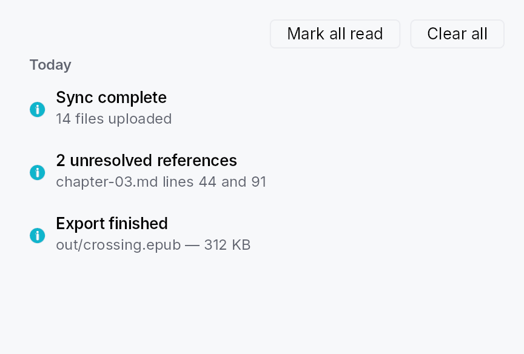
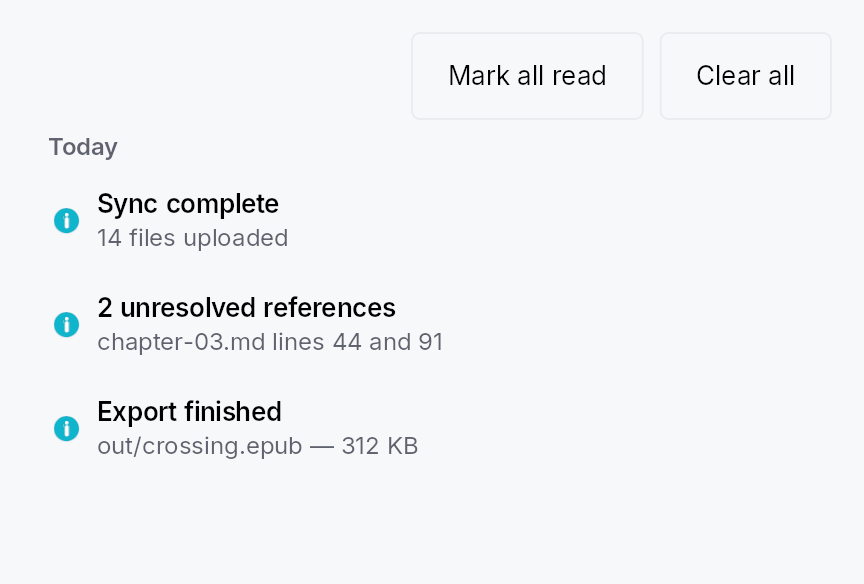

<!-- SPDX-License-Identifier: MPL-2.0 -->
<!-- SPDX-FileCopyrightText: 2026 FernTech -->

# NotificationLog



`NotificationLog` — a scrollable, day-bucketed list of archived notifications.

## Public functions

### `NotificationLog`

| Returns | Function |
| ---: | :--- |
| | **Constructors** |
| `Self` | [`new(archive: Rc<NotificationArchiveModel>)`](#notificationlog-new) |
| | **Builder methods** |
| `Self` | [`for_window(window_id: TeksiloWindowId)`](#notificationlog-for_window) |
| `Self` | [`for_audience(audience: ToastAudience)`](#notificationlog-for_audience) |
| `Self` | [`show_toolbar(show: bool)`](#notificationlog-show_toolbar) |
| `Self` | [`empty_state(f: impl Fn() -> Box<dyn Widget> + 'static)`](#notificationlog-empty_state) |
| `Self` | [`preferred_width(width: f32)`](#notificationlog-preferred_width) |
| `Self` | [`preferred_height(height: f32)`](#notificationlog-preferred_height) |
| `Self` | [`on_entry_invoked(f: impl Fn(&NotificationEntry, &mut EventContext) + 'static)`](#notificationlog-on_entry_invoked) |
| `Self` | [`on_action_invoked(f: impl Fn(&NotificationEntry, &ArchivedAction, &mut EventContext) + 'static)`](#notificationlog-on_action_invoked) |

## Detailed description

Renders a `NotificationArchiveModel` as a scrollable column of
`StandardListItem` rows grouped under section headers (Today /
Yesterday / This week / Earlier), computed against the user's local
timezone on every archive mutation. An optional toolbar row provides
mark-all-read and clear buttons. Unread rows show the title in
`BodyBold`; read rows use `Body`. An empty-state hint is shown when the
archive is empty.

#### Sizing

The log grows into a host that bounds its height and compresses
inside one shorter than its natural height (floored at one row);
only a host that hugs its content — which is how the overlay layer
measures the `NotificationCenterButton`
popover — falls back to `preferred_width` /
`preferred_height`. Row text is
**elided**, not wrapped, with the full text on the row's rich
tooltip: notification prose is arbitrary and the log does not
control its own width, so a wrapping row would over-constrain
itself and push its trailing action buttons out of view.

#### When to use

- Embed directly inside a side panel or settings page for an in-app
  notification centre.
- Wrap in `NotificationCenterButton`
  for the standard bell-icon-with-popover pattern.
- Call `NotificationLogDialog::show`
  for a one-line modal presentation.

```ignore
let archive: Rc<NotificationArchiveModel> = ctx.app_state().unwrap();
let log = NotificationLog::new(archive)
    .on_action_invoked(|_entry, action, ctx| {
        if let Some(name) = &action.intent_name {
            ctx.send_intent(teksilo_core::Intent::new(name));
        }
    });
```

#### Touch and pen

A log row is a `StandardListItem`, so its target floor follows the density
ladder with every other list row, and its tap replays the entry on the release.
The trailing action strip is made of `Link`s and `Button`s, each its own target.

## Density

The picture above is the widget at `TargetDensity::Compact`, the mouse-and-keyboard ladder. Below is the same subject on the same canvas with only the ladder changed, so what moves is the density and nothing else — where the subject no longer fits, that is what the denser targets cost it at that size. See `docs/density-and-targets.md`.

**Touch**



## API reference

📖 [Full rustdoc API for this module](https://docs.rs/teksilo-widgets/latest/teksilo_widgets/notification/log/index.html)

<a id="notificationlog"></a>

## `pub struct NotificationLog`

Configurable archive log. Shipped chrome:
- mark-all-read + clear buttons in a toolbar row;
- empty-state hint when the archive is empty;
- day-bucket section headers (Today / Yesterday / This week /
  Earlier) above the rows for each bucket — computed against the
  user's local timezone, recomputed on every archive mutation;
- `StandardListItem` rows with unread-as-bold differentiation.

A SearchField filter and a severity-chip filter can be composed by
apps using the existing widget toolkit.

```rust
pub struct NotificationLog { /* fields */ }
```

### Methods

<a id="notificationlog-new"></a>

#### `pub fn new(archive: Rc<NotificationArchiveModel>) -> Self`

Construct a log bound to the shared archive. The archive is
expected to outlive the log (typically held in `app_state`).

<a id="notificationlog-for_window"></a>

#### `pub fn for_window(mut self, window_id: TeksiloWindowId) -> Self`

Scope this log to entries routed to window `window_id` (plus
any `Broadcast` entry) — the shape a `NotificationCenterButton`
mounted in that window wants for its popover body. Overrides
any previous `for_window` / `for_audience` call.

<a id="notificationlog-for_audience"></a>

#### `pub fn for_audience(mut self, audience: ToastAudience) -> Self`

Scope this log to entries routed to `audience` (plus any
`Broadcast` entry). Overrides any previous `for_window` /
`for_audience` call.

<a id="notificationlog-show_toolbar"></a>

#### `pub fn show_toolbar(mut self, show: bool) -> Self`

Whether to render the toolbar row (mark-all-read + clear).
Default `true`. Apps that want a chrome-less log (e.g. inside
a custom panel that supplies its own toolbar) pass `false`.

<a id="notificationlog-empty_state"></a>

#### `pub fn empty_state(mut self, f: impl Fn() -> Box<dyn Widget> + 'static) -> Self`

Override the empty-state hint. Default: a centered
"No notifications" text. Pass a factory returning any widget
for a custom empty view (illustration, call-to-action, …).

A factory rather than a widget because the log rebuilds on
every archive mutation: the view has to be re-creatable each
time the archive goes empty again, not just the first time.

```ignore
log.empty_state(|| Box::new(TextWidget::new(tr!(inbox_zero()))))
```

<a id="notificationlog-preferred_width"></a>

#### `pub fn preferred_width(mut self, width: f32) -> Self`

Width the log reports when the host proposes an unbounded one.
Default `380` dp.

This is load-bearing for the popover presentation
(`NotificationCenterButton`):
the overlay layer measures its content with a fully unbounded
proposal, and a `StandardListItem` asked for an intrinsic
width reports only its chrome, so without a preferred width the
popover would size itself to whatever the two toolbar buttons
happen to measure (~248 dp with the stock labels) and elide
every title to a stub. Hosts that DO bound the width (a dialog,
a side panel) ignore this value.

<a id="notificationlog-preferred_height"></a>

#### `pub fn preferred_height(mut self, height: f32) -> Self`

Height of the scrolling list area when the host proposes an
unbounded height. Default `320` dp.

The log always *grows* into a host that bounds its height (it
reports a flex weight), so this only sets the natural height a
content-hugging host — again, the popover — sizes itself to.

<a id="notificationlog-on_entry_invoked"></a>

#### `pub fn on_entry_invoked( mut self, f: impl Fn(&NotificationEntry, &mut EventContext) + 'static, ) -> Self`

Called when the user clicks anywhere on an archived entry's
row body (outside any specific action button). The default
behaviour is no-op — the log is read-only display unless
callers wire this hook.

<a id="notificationlog-on_action_invoked"></a>

#### `pub fn on_action_invoked( mut self, f: impl Fn(&NotificationEntry, &ArchivedAction, &mut EventContext) + 'static, ) -> Self`

Called when an archived action button is clicked. Apps wire
this hook to replay the action — typically by mapping the
`ArchivedAction::intent_name` to one of the app's registered
`Action`s via `ctx.send_intent(...)`. Without this hook
configured the action buttons are inert (the log keeps them
visible for archival context).

Actions without an `intent_name` render as non-clickable
past-action tags regardless of this hook — there's nothing
for the framework to dispatch against once the live closure
has torn down.

```ignore
log.on_action_invoked(|_entry, action, ctx| {
    // Bridge the dynamic intent_name to one of the app's
    // typed AppIntent variants:
    match action.intent_name.as_deref() {
        Some("app.build.retry") => ctx.send_intent(AppIntent::BuildRetry),
        Some(name) => log::warn!("unknown archived intent: {name}"),
        None => {}
    }
})
```
