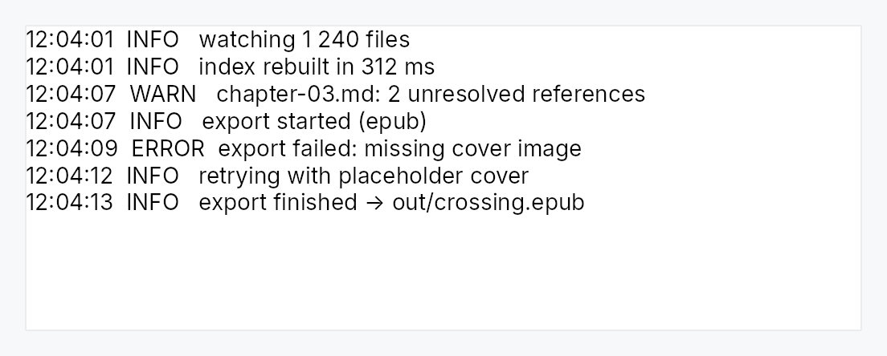

<!-- SPDX-License-Identifier: MPL-2.0 -->
<!-- SPDX-FileCopyrightText: 2026 FernTech -->

# LogView



`LogView` — a read-only, append-only, tail-following streaming view.

The third face of the editor core, and the one that is *not* an editor. A
program writes to it, forever, faster than a person types; a person only
reads, scrolls, selects, and copies. That inversion is why it does not share
the editor's frame step — the details are in `log_stream`
— but it *is* the same `CodeEditorState`, so
selection, copy, scrolling, theming, and accessibility come for free and
cannot drift from the editors'.

What it adds over the read-only code viewer:

- **Scale.** Only the visible rows are ever laid out, so a 100 000-line
  buffer costs a viewport's worth of memory, not the document's. Feed it a
  `scrollback_limit` to bound the raw text too.
- **Following the tail.** New lines stick the view to the bottom *while it is
  already at the bottom*; scroll up to read history and it pauses, scroll back
  and it resumes — derived from position, never a fight.
- **Severity colour.** An injected classifier paints a line by what it is (an
  error line red). Language-agnostic: the view colours a line, the
  application decides what an error looks like.

## Builder methods at a glance

`follow_tail`, `scrollback_limit`, `severity_highlighter`, `announce_appends`, `font_family`, `follow_text_scale`, `v_scroll_policy`, `h_scroll_policy`, `background`, `text_color`, `selection_color`, `handle`

## API reference

📖 [Full rustdoc API for this module](../api/teksilo_widgets/code_editor/index.html)

## `pub struct LogView`

A read-only, append-only, tail-following log / console view.

Construct with `LogView::new`, feed it with a `LogViewHandle` from
`handle`, and add it to the tree. It owns an internal
document; the application never touches one directly, it only appends lines.

```rust
pub struct LogView { /* fields */ }
```

### Methods

#### `pub fn new() -> Self`

A fresh, empty log view: read-only, no caret, no wrapping, following the
tail, unbounded. Attach a `handle` and append to it.

#### `pub fn follow_tail(self, follow: bool) -> Self`

Whether new lines stick the view to the bottom when it is already there
(default `true`). Off makes the view hold position while it grows.

#### `pub fn scrollback_limit(self, limit: usize) -> Self`

Cap the retained lines: older lines beyond `limit` are evicted from the
front. Unset (the default) keeps every line — *memory* stays flat in the
line count, since only the visible window is ever shaped, but the raw text
accumulates in the document and each append stays linear in the document's
size. A genuinely unbounded, sustained high-rate producer should therefore
set a limit; a bounded or bursty one need not. The cap is soft: eviction
is batched, so the count can briefly exceed `limit` (by a band that scales
down with the cap).

#### `pub fn severity_highlighter(self, classify: impl Fn(&str) -> Option<Color> + 'static) -> Self`

Colour each line by what it is: the classifier maps a line's text to a
colour, or `None` to leave it in the default colour. The view knows how
to colour a line; the application knows what an error line looks like.

#### `pub fn announce_appends(self, announce: bool) -> Self`

Whether appended lines are announced to assistive technology (default
`false`). Off is the right default: a live region is correct for a
handful of meaningful events and hostile for a build log at fifty lines a
second. The application says which it is.

#### `pub fn font_family(self, family: impl Into<String>) -> Self`

Fallback font family. A log reads best monospaced, so columns align; pass
a monospace family here.

#### `pub fn follow_text_scale(self, follow: bool) -> Self`

Whether the view grows text with the global accessibility text scale
(default `true`).

#### `pub fn v_scroll_policy(mut self, policy: ScrollPolicy) -> Self`

Vertical scrollbar policy (default `Auto`).

#### `pub fn h_scroll_policy(mut self, policy: ScrollPolicy) -> Self`

Horizontal scrollbar policy (default `Auto`).

#### `pub fn background(self, color: impl Into<teksilo_core::color_prop::ColorProp>) -> Self`

Override the background colour (accepts a `Color`, theme role, or
`Signal`). Default tracks the theme's `editor_bg`.

#### `pub fn text_color(self, color: impl Into<teksilo_core::color_prop::ColorProp>) -> Self`

Override the default text colour. Per-line severity colours (from
`severity_highlighter`) still win.

#### `pub fn selection_color(self, color: impl Into<teksilo_core::color_prop::ColorProp>) -> Self`

Override the selection colour.

#### `pub fn handle(&self) -> LogViewHandle`

A cloneable handle to append to the view and drive it from anywhere.

## `pub struct LogViewHandle`

A cloneable handle to append to a `LogView` and drive it.

Use it on the UI thread — from an event handler, a timer, or an async
completion. It holds an `Rc`, so it is **not** `Send`; feeding a log from a
background thread (a PTY reader, a tracing layer) means marshalling the lines
to the UI thread first — through the app's async executor, or a channel whose
receiver is drained in a handler. Each append wakes the view, which otherwise
stops asking for frames when idle.

```rust
pub struct LogViewHandle { /* fields */ }
```

### Methods

#### `pub fn append(&self, text: &str)`

Append text, split into lines on `\n`. A single trailing newline is a
terminator, not a blank line, so it is dropped; embedded blank lines are
kept. Enqueues for the next frame and wakes the view.

#### `pub fn append_line(&self, line: &str)`

Append one line. `\n` is still split defensively — the document rejects a
block containing one — so a value that turns out to be multi-line becomes
several lines rather than an error.

#### `pub fn append_lines<I, S>(&self, lines: I) where I: IntoIterator<Item = S>, S: AsRef<str>,`

Append many lines.

#### `pub fn clear(&self)`

Empty the view, resetting it to its pristine state. UI-thread only.

#### `pub fn scroll_to_bottom(&self)`

Scroll to the bottom, resuming tail-following. UI-thread only.

#### `pub fn line_count(&self) -> teksilo_core::Signal<usize>`

The live line count — a status bar can bind it.

#### `pub fn document_version(&self) -> teksilo_core::Signal<u64>`

Bumps on every content change.

#### `pub fn scroll_y(&self) -> teksilo_core::Signal<f32>`

The vertical scroll offset — a follow-state indicator can read it against
`max_scroll_y`.

#### `pub fn max_scroll_y(&self) -> teksilo_core::Signal<f32>`

The maximum vertical scroll offset.
