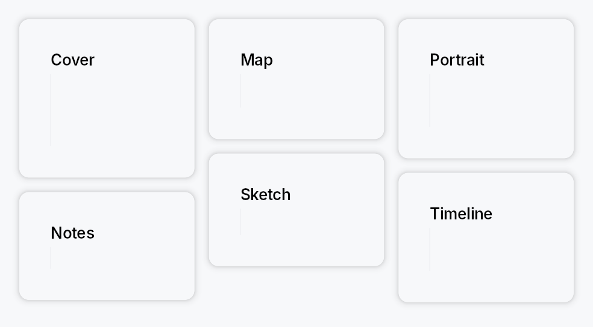

<!-- SPDX-License-Identifier: MPL-2.0 -->
<!-- SPDX-FileCopyrightText: 2026 FernTech -->

# MasonryLayout



MasonryLayout — a variable-height grid that packs children into the
shortest column (Pinterest-style).

Each child is measured at the shared column width and placed into
whichever column currently has the lowest accumulated height.
Ties between equal-height columns are broken by column index
(leftmost wins). All columns share the same width; column and item
spacing are independently configurable. RTL layout mirrors the
column order so the first logical child still goes to the leading edge.

```rust
# use teksilo_widgets::primitives::masonry::MasonryLayout;
# use teksilo_widgets::primitives::TextWidget;
# use teksilo_i18n::lit;
let _grid = MasonryLayout::new(3)
    .column_spacing(8.0)
    .item_spacing(8.0)
    .child(TextWidget::new(lit!("Tall card")))
    .child(TextWidget::new(lit!("Short card")))
    .child(TextWidget::new(lit!("Another card")));
```

## Builder methods at a glance

`column_spacing`, `item_spacing`, `add_child`, `child`, `children`, `child_opt`

## API reference

📖 [Full rustdoc API for this module](../api/teksilo_widgets/primitives/masonry/index.html)

## `pub struct MasonryLayout`

A masonry (Pinterest-style) layout that packs children into the shortest
column.

Children are placed left-to-right into whichever column is currently
shortest. All children receive the same column width; their heights are
determined by each child's intrinsic size at that width.

```text
┌──────┐ ┌──────┐ ┌──────┐
│  A   │ │  B   │ │  C   │
│      │ │      │ └──────┘
│      │ └──────┘ ┌──────┐
└──────┘ ┌──────┐ │  F   │
┌──────┐ │  E   │ │      │
│  D   │ └──────┘ └──────┘
└──────┘
```

```rust
pub struct MasonryLayout { /* fields */ }
```

### Methods

#### `pub fn new(column_count: usize) -> Self`

Create a masonry layout with the given number of columns.

The count is clamped to a minimum of 1.

#### `pub fn column_spacing(mut self, spacing: f32) -> Self`

Horizontal gap between columns.

#### `pub fn item_spacing(mut self, spacing: f32) -> Self`

Vertical gap between items within the same column.

#### `pub fn add_child(mut self, id: WidgetId) -> Self`

Add a pre-registered child by ID.

#### `pub fn child(mut self, widget: impl Widget + 'static) -> Self`

Add an inline child widget (deferred insertion).

#### `pub fn children(mut self, iter: impl IntoIterator<Item = impl Widget + 'static>) -> Self`

Add multiple inline children from an iterator.

#### `pub fn child_opt(mut self, widget: Option<impl Widget + 'static>) -> Self`

Conditionally add a child. No-op if `None`.
