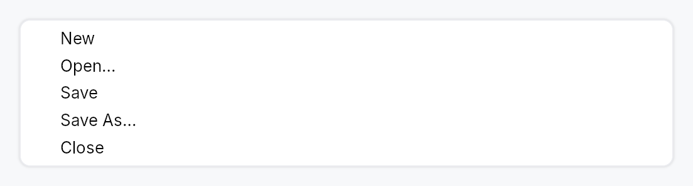

<!-- SPDX-License-Identifier: MPL-2.0 -->
<!-- SPDX-FileCopyrightText: 2026 FernTech -->

# MenuList



MenuList — a themed vertical menu container with keyboard navigation.

`MenuList` is the dropdown panel used by `MenuBar`, `MenuContext`, and
popover-style menus. It provides a themed surface (background, rounded
border, drop shadow) and owns the full keyboard navigation stack:
ArrowUp/Down moves focus, Enter activates, Escape bubbles to the
enclosing overlay host, Home and End jump to the first/last enabled item.
Type-ahead search jumps to the next item whose stripped label starts with
the accumulated keystrokes (500 ms reset window by default).

Items are added with `.item(widget)` (any `impl Widget`, but typically a
`MenuItem`); separators with `.separator()`. Conditional rows use
`.item_when(widget, visible_prop)` — a hidden row collapses to zero height
and is skipped by keyboard navigation. For very long lists (recent files,
etc.) call `.max_visible_items(n)` to cap the panel height and wrap the
content in a `ScrollArea`.

**Safe-triangle hover gate.** When a submenu item opens its child overlay,
`MenuList` stamps a shared anchor so sibling items can skip their
hover-switch while the cursor travels diagonally toward the submenu.

## Accessibility

`Role::Menu`; each row is `Role::MenuItem` / `Role::MenuItemCheckBox` /
`Role::MenuItemRadio` as declared by the item. Radio items in the same
list auto-group via `push_to_radio_group` so AT announces "2 of 3".

```rust
# use teksilo_widgets::{MenuList, MenuItem};
# use teksilo_i18n::lit;
# use teksilo_core::Intent;
let _w = MenuList::new()
    .item(MenuItem::new(lit!("Cut")).on_activate_fn(|ctx| ctx.send_intent(Intent::new("app.cut"))))
    .item(MenuItem::new(lit!("Copy")).on_activate_fn(|ctx| ctx.send_intent(Intent::new("app.copy"))))
    .separator()
    .item(MenuItem::new(lit!("Paste")).on_activate_fn(|ctx| ctx.send_intent(Intent::new("app.paste"))));
```

## Builder methods at a glance

`type_ahead_timeout`, `attached_side`, `item`, `item_when`, `item_boxed_when`, `separator`, `header`, `max_visible_items`

## API reference

📖 [Full rustdoc API for this module](../api/teksilo_widgets/menu_list/index.html)

## `pub struct MenuSeparator`

A 1 dp horizontal divider line between groups of menu items.

```rust
pub struct MenuSeparator;
```

## `pub struct MenuList`

A themed vertical dropdown menu panel with keyboard navigation and type-ahead.

See the module documentation for the full feature description.

```rust
pub struct MenuList { /* fields */ }
```

### Methods

#### `pub fn new() -> Self`

Create an empty menu list with no items, no height cap, and the default
500 ms type-ahead reset window.

#### `pub fn type_ahead_timeout(mut self, d: Duration) -> Self`

Override the type-ahead buffer reset window. Defaults to 500ms
to match Windows' menubar convention. Tests use
`Duration::ZERO` to force every keypress to start a fresh
search.

#### `pub fn attached_side(mut self, side: crate::shadow::AttachedSide) -> Self`

Suppress drop-shadow drawing on the side that visually merges
with the menu's trigger. See `crate::shadow::AttachedSide`
for the available edges.

#### `pub fn item(mut self, widget: impl Widget + 'static) -> Self`

Add a menu item (typically a `MenuItem`).

#### `pub fn item_when( self, widget: impl Widget + 'static, visible: impl Into<teksilo_core::signal::Prop<bool>>, ) -> Self`

Add a menu item that is shown only while `visible` is `true`. When the
gate is `false` the row collapses to zero height (no gap) and keyboard
navigation skips it — arrows, `Home`/`End`, `Enter`, type-ahead, and
mnemonic activation all ignore it. Used e.g. by a `Toolbar`'s overflow
menu, where each row is present only while its inline twin is collapsed.

Because a hidden row never claims its mnemonic letter, two gated rows
that are mutually exclusive may share one — the letter resolves to
whichever is visible when it is pressed.

#### `pub fn item_boxed_when( mut self, widget: Box<dyn Widget>, visible: impl Into<teksilo_core::signal::Prop<bool>>, ) -> Self`

`item_when` for an already-boxed widget — used when
the row type is decided at runtime (e.g. a menu row that is either a
`MenuItem` or an embedded control).

#### `pub fn separator(mut self) -> Self`

Add a separator line.

#### `pub fn header(mut self, widget: impl Widget + 'static) -> Self`

Add a non-interactive section caption (typically a `crate::GroupHeader`).
Skipped by Arrow/Home/End navigation and type-ahead, exactly like
`separator`. The caller passes any `impl Widget`, but it
must expose its own accessible name/role via `accessibility()` (as
`GroupHeader` does) or it is silently pruned from the AT tree as a
content-free container.

#### `pub fn max_visible_items(mut self, n: usize) -> Self`

Cap the panel height to roughly `n * item_height` and make the
content scrollable when that height is exceeded. Clamped to at
least 1. Useful for long menus (e.g. a "Recent files" list) —
without this, a very long menu grows to exceed the window.

Note: items are still materialized eagerly; this is a viewport
cap, not virtualization. See the module-level note.
