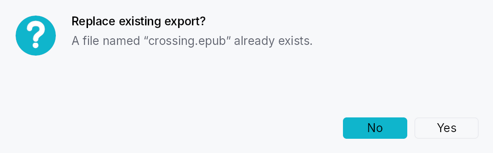

<!-- SPDX-License-Identifier: MPL-2.0 -->
<!-- SPDX-FileCopyrightText: 2026 FernTech -->

# MessageBox



MessageBox — QMessageBox-style alert dialog.

A higher-level surface built on top of `ModalContainer`
for the classic "tell the user something and ask for a response"
pattern: unsaved-changes prompts, error surfaces, confirmation
dialogs, and informational notices. Mirrors QMessageBox (Qt),
NSAlert (AppKit), and SwiftUI's `.alert(...)` while staying inside
Teksilo's idioms — closure result handlers, `Signal`/`Prop`
reactivity, `Intent`/`Action`/`Shortcut` routing for keyboard
defaults, and AccessKit `Role::AlertDialog` accessibility.

## Quick tour

```ignore
use teksilo::prelude::*;
use teksilo::widgets::{MessageBox, MessageBoxButtons, StandardButton};

fn on_close(ctx: &mut EventContext) {
    MessageBox::question(lit!("Save changes?"))
        .text(lit!("You have unsaved changes in report.skrib."))
        .informative_text(lit!("Your changes will be lost if you don't save them."))
        .buttons(MessageBoxButtons::SaveDiscardCancel)
        .default_button(StandardButton::Save)
        .escape_button(StandardButton::Cancel)
        .on_result(|r, ctx| match r.button {
            StandardButton::Save => save_and_close(ctx),
            StandardButton::Discard => close(ctx),
            _ => {}
        })
        .present(ctx);
}
# fn save_and_close(_: &mut EventContext) {}
# fn close(_: &mut EventContext) {}
```

## Severity

`MessageBoxSeverity` controls the icon drawn beside the title and
its tint:

- `Information` — info glyph, `status_info_fg` tint.
- `Question` — question mark glyph, `accent` tint.
- `Warning` — exclamation triangle, `status_warning_fg` tint.
- `Critical` — X-mark circle, `status_error_fg` tint. Also disables
  click-outside dismissal (Qt convention).
- `None` — no icon, no tint.

Severity is conveyed through the icon + title + text. Per Teksilo's
Int UI baseline, buttons are **never** colored as "destructive":
destructive intent lives in the dialog's severity and wording, not
in the button. See `crate::button` for details.

## Default & escape buttons

- `default_button` — activated by Enter (widget-scoped shortcut) and
  receives initial focus on open (via `ModalRequest::focus_target`
  plus `Widget::initial_focus_hint`). Styled with
  `ButtonVariant::Filled`.
- `escape_button` — activated by Escape. The fallback logic (for
  presets with no explicit `escape_button`) picks: explicit
  `escape_button` → first `Reject`-role button → `Cancel` → last
  button.

Each preset supplies a default: Ok for `Ok` and `OkCancel`, Save for
`SaveDiscardCancel`, Retry for `RetryIgnoreAbort`, and **No** for
`YesNo` and `YesNoCancel`.

The Yes/No default is the negative answer on purpose. An Ok/Cancel box
confirms something the user just asked for, so Ok is the answer they
meant. A Yes/No box asks a question they did not initiate, and it is
overwhelmingly asked before something irreversible — "Delete this?",
"Discard your changes?". Defaulting to Yes means Enter destroys, and
Enter is what a keyboard user presses on a dialog they have not
finished reading. Where the question is safe, `default_button` puts Yes
back in one reviewable line; the reverse default cannot be reviewed,
because there is nothing on the screen to review.

It matters more than it looks, because **no platform announces which
button is the default**: `Node::keyboard_shortcut` appears in none of
the three AccessKit adapters, so a screen-reader user discovers the
default only by pressing Enter. Where focus lands is the whole contract.

## Result reporting

`MessageBox::on_result` takes `impl Fn(MessageBoxResult,
&mut EventContext) + 'static`. The callback fires exactly once — on
button activation or Escape dismissal — then the modal is closed by
the framework.

## Accessibility

The widget exposes `Role::AlertDialog` (distinct from
`ModalContainer`'s `Role::Dialog`), with `set_modal()`,
`set_live(Live::Assertive)`, `set_name(title)`, and
`set_description(text + informative_text)` so screen readers
announce the dialog and its body on open.

## Builder methods at a glance

`information`, `warning`, `critical`, `question`, `plain`, `text`, `informative_text`, `detailed_text`, `buttons`, `add_button`, `default_button`, `escape_button`, `show_again_checkbox`, `show_again_checkbox_state`, `on_result`, `present`

## API reference

📖 [Full rustdoc API for this module](https://docs.rs/teksilo-widgets/latest/teksilo_widgets/message_box/index.html)

## `pub enum MessageBoxSeverity`

Alert severity level. Drives the icon glyph + tint shown beside the
title, and (for `Critical`) whether click-outside dismiss is enabled.

```rust
pub enum MessageBoxSeverity { /* variants */ }
```

### Variants

- **`None`** — No icon. Use for plain notices where an icon would be noise.
- **`Information`** — Informational notice — blue circle with "i" glyph.
- **`Question`** — Confirmation prompt — accent-tinted circle with "?" glyph.
- **`Warning`** — Non-fatal warning — amber triangle with "!" glyph.
- **`Critical`** — Critical error — red circle with an "X" glyph. Click-outside dismissal is disabled (Escape still works).

## `pub enum ButtonRole`

Semantic role of a message-box button. Used for fallback escape
resolution (`Reject` wins when no explicit escape button is set).
Teksilo deliberately does **not** render `Destructive` buttons with
a red fill — the dialog's severity icon and wording carry that
signal. See `crate::button` for the framework-level rationale.

```rust
pub enum ButtonRole { /* variants */ }
```

### Variants

- **`Accept`** — Confirms / proceeds. Ok, Yes, Save, Open, Apply, Retry.
- **`Reject`** — Bails out. Cancel, Close, No, Abort.
- **`Destructive`** — Data-loss action. Discard. (Same visuals as Regular — the severity of the surrounding MessageBox carries the warning.)
- **`Action`** — Side action. Help, Reset, RestoreDefaults, Ignore, and the "to all" variants.

## `pub enum StandardButton`

The Qt-modeled catalog of standard buttons. Each variant resolves
to a localized label, a semantic `ButtonRole`, and a stable
intent-name string used internally for shortcut/action routing.

```rust
pub enum StandardButton { /* variants */ }
```

### Variants

- **`Ok`** — Accept / confirm. `ButtonRole::Accept`.
- **`Cancel`** — Cancel the operation. `ButtonRole::Reject`.
- **`Close`** — Close the dialog. `ButtonRole::Reject`.
- **`Yes`** — Confirm with "Yes". `ButtonRole::Accept`.
- **`No`** — Decline with "No". `ButtonRole::Reject`.
- **`YesToAll`** — Confirm all remaining items. `ButtonRole::Accept`.
- **`NoToAll`** — Decline all remaining items. `ButtonRole::Reject`.
- **`Save`** — Save changes. `ButtonRole::Accept`.
- **`SaveAll`** — Save all open items. `ButtonRole::Accept`.
- **`Discard`** — Discard changes without saving. `ButtonRole::Destructive`.
- **`Apply`** — Apply changes without closing. `ButtonRole::Accept`.
- **`Reset`** — Reset to defaults. `ButtonRole::Action`.
- **`RestoreDefaults`** — Restore factory defaults. `ButtonRole::Action`.
- **`Abort`** — Abort the current operation. `ButtonRole::Reject`.
- **`Retry`** — Retry the failed operation. `ButtonRole::Accept`.
- **`Ignore`** — Ignore the error and continue. `ButtonRole::Action`.
- **`Open`** — Open a file or resource. `ButtonRole::Accept`.
- **`Help`** — Show help. `ButtonRole::Action`.

### Methods

#### `pub fn role(self) -> ButtonRole`

The button's semantic role — used internally by MessageBox's
escape-button fallback resolution, and available to callers that
want to inspect a `MessageBoxButton`'s role.

#### `pub fn intent_name(self) -> &'static str`

Stable string id used as both the shortcut id and the intent
name for routing default/escape key activations. Scoped to a
MessageBox instance via widget-scoped shortcut registration, so
the same id is safe to reuse across instances.

#### `pub fn default_label(self) -> LocalizedString`

Default label for the button. Resolved through the Fluent
catalog via `tr_widget!` so apps can override per-locale.

## `pub struct MessageBoxButton`

A single button placement inside a MessageBox, including an optional
per-instance label override. Callers usually build these via
`From<StandardButton>` (`StandardButton::Ok.into()`), or
construct them manually when `Custom` is needed.

```rust
pub struct MessageBoxButton { /* fields */ }
```

### Methods

#### `pub fn standard(kind: StandardButton) -> Self`

Build a button from a `StandardButton` with the default label.

#### `pub fn label(mut self, label: impl Into<LocalizedString>) -> Self`

Override the default translated label.

## `pub enum MessageBoxButtons`

Pre-built button bundles covering the common MessageBox shapes.
Custom combinations go through `MessageBox::add_button` or
`MessageBoxButtons::Custom`.

```rust
pub enum MessageBoxButtons { /* variants */ }
```

### Variants

- **`Ok`** — Just Ok.
- **`OkCancel`** — Ok + Cancel, Ok default, Cancel escape.
- **`YesNo`** — Yes + No. **No** is the default, and No is the escape. See the module docs for why the default is the negative answer.
- **`YesNoCancel`** — Yes + No + Cancel. **No** is the default, Cancel is the escape — Enter takes the safe answer to the question asked, Escape leaves the dialog.
- **`SaveDiscardCancel`** — The unsaved-changes triad: Save + Discard + Cancel.
- **`RetryIgnoreAbort`** — The error-recovery triad: Retry + Ignore + Abort.
- **`Custom`** — Explicit list. MessageBox preserves the order as the visual button order (leading Spacer pushes all buttons to the trailing edge; default button may appear anywhere).

## `pub struct MessageBoxResult`

Report passed to `MessageBox::on_result` when the dialog closes.

```rust
pub struct MessageBoxResult { /* fields */ }
```

## `pub struct MessageBox`

A modal alert dialog that displays a severity icon, title, body text, and
one or more buttons.

Constructed via severity-named constructors (`MessageBox::information`,
`MessageBox::warning`, `MessageBox::critical`, `MessageBox::question`,
`MessageBox::plain`), configured fluently, and presented with
`MessageBox::present`. See the module documentation for the full guide.

```rust
pub struct MessageBox { /* fields */ }
```

### Methods

#### `pub fn information(title: impl Into<LocalizedString>) -> Self`

Construct an informational MessageBox (`Information` severity).

#### `pub fn warning(title: impl Into<LocalizedString>) -> Self`

Construct a warning MessageBox (`Warning` severity).

#### `pub fn critical(title: impl Into<LocalizedString>) -> Self`

Construct a critical-error MessageBox (`Critical` severity).
Click-outside dismissal is disabled; use an explicit button or
Escape to close.

#### `pub fn question(title: impl Into<LocalizedString>) -> Self`

Construct a confirmation / question MessageBox (`Question`
severity).

#### `pub fn plain(title: impl Into<LocalizedString>) -> Self`

Construct a plain MessageBox with no severity icon.

#### `pub fn text(mut self, text: impl Into<LocalizedString>) -> Self`

Primary message line, rendered in `typography.body` with
`text_primary`. Prefer a short, self-contained sentence —
details belong in `informative_text`.

#### `pub fn informative_text(mut self, text: impl Into<LocalizedString>) -> Self`

Secondary, explanatory text rendered below the primary text in
`typography.body` with `text_secondary`. Matches Qt's
`setInformativeText`.

#### `pub fn detailed_text(mut self, text: impl Into<LocalizedString>) -> Self`

Detailed text hidden behind a "Show details" `Accordion` —
for technical diagnostics (stack traces, error codes). Matches
Qt's `setDetailedText`.

#### `pub fn buttons(mut self, preset: MessageBoxButtons) -> Self`

Apply a preset button bundle. Implicitly sets default and
escape buttons for the preset (both can be overridden via
`MessageBox::default_button` and
`MessageBox::escape_button`).

#### `pub fn add_button(mut self, button: impl Into<MessageBoxButton>) -> Self`

Append a single button. Use to augment a preset (rare) or to
build a bespoke button row without going through
`MessageBoxButtons::Custom`.

#### `pub fn default_button(mut self, which: StandardButton) -> Self`

Mark which button activates on Enter and receives initial
focus. Must refer to one of the buttons configured via
`buttons` / `add_button`.

#### `pub fn escape_button(mut self, which: StandardButton) -> Self`

Mark which button activates on Escape (and scrim-click, when
allowed). Must refer to one of the configured buttons.

#### `pub fn show_again_checkbox(mut self, label: impl Into<LocalizedString>) -> Self`

Attach a "Don't show again"-style checkbox below the body.
Internally creates a `Signal<bool>` initialized to `false` and
reports its state in `MessageBoxResult::checkbox_checked`.
For external observation, use
`MessageBox::show_again_checkbox_state` instead.

#### `pub fn show_again_checkbox_state(mut self, signal: Signal<bool>) -> Self`

Like `MessageBox::show_again_checkbox`, but with a
caller-owned `Signal<bool>` so the checkbox state survives the
dialog lifetime (useful for "remember my choice" persistence).

#### `pub fn on_result(mut self, f: impl Fn(MessageBoxResult, &mut EventContext) + 'static) -> Self`

Register the result callback, invoked exactly once when a
button fires (either by click or by Enter/Escape shortcut).

#### `pub fn present(self, ctx: &mut EventContext)`

Present the MessageBox as a modal on top of `ctx`'s current
tree. Consumes `self`; callers who need to present multiple
dialogs with shared config should build a factory closure.
