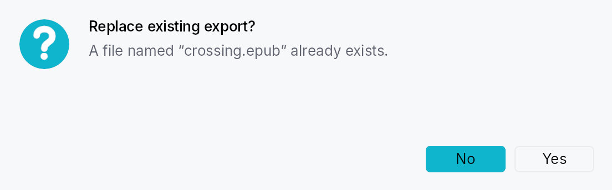
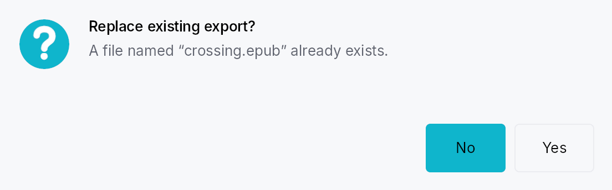

<!-- SPDX-License-Identifier: MPL-2.0 -->
<!-- SPDX-FileCopyrightText: 2026 FernTech -->

# MessageBox



MessageBox — QMessageBox-style alert dialog.

## Public types

| Kind | Name |
| ---: | :--- |
| `enum` | [`MessageBoxSeverity`](#messageboxseverity) — Alert severity level |
| `enum` | [`ButtonRole`](#buttonrole) — Semantic role of a message-box button |
| `enum` | [`StandardButton`](#standardbutton) — The Qt-modeled catalog of standard buttons |
| `struct` | [`MessageBoxButton`](#messageboxbutton) — A single button placement inside a MessageBox, including an optional per-instance label override |
| `enum` | [`MessageBoxButtons`](#messageboxbuttons) — Pre-built button bundles covering the common MessageBox shapes |
| `enum` | [`MessageBoxDismissal`](#messageboxdismissal) — How a `MessageBox` came to close |
| `struct` | [`MessageBoxResult`](#messageboxresult) — Report passed to `MessageBox::on_result` when the dialog closes |
| `struct` | [`MessageBox`](#messagebox) — A modal alert dialog that displays a severity icon, title, body text, and one or more buttons |
| `trait` | [`EventContextMessageBoxExt`](#eventcontextmessageboxext) — Extension trait on `EventContext` for ergonomic MessageBox presentation |

## Public functions

### `MessageBox`

| Returns | Function |
| ---: | :--- |
| | **Constructors** |
| `Self` | [`information(title: impl Into<LocalizedString>)`](#messagebox-information) |
| `Self` | [`warning(title: impl Into<LocalizedString>)`](#messagebox-warning) |
| `Self` | [`critical(title: impl Into<LocalizedString>)`](#messagebox-critical) |
| `Self` | [`question(title: impl Into<LocalizedString>)`](#messagebox-question) |
| `Self` | [`plain(title: impl Into<LocalizedString>)`](#messagebox-plain) |
| | **Builder methods** |
| `Self` | [`text(text: impl Into<LocalizedString>)`](#messagebox-text) |
| `Self` | [`informative_text(text: impl Into<LocalizedString>)`](#messagebox-informative_text) |
| `Self` | [`detailed_text(text: impl Into<LocalizedString>)`](#messagebox-detailed_text) |
| `Self` | [`buttons(preset: MessageBoxButtons)`](#messagebox-buttons) |
| `Self` | [`add_button(button: impl Into<MessageBoxButton>)`](#messagebox-add_button) |
| `Self` | [`add_buttons(buttons: impl IntoIterator<Item = impl Into<MessageBoxButton>>)`](#messagebox-add_buttons) |
| `Self` | [`default_button(which: StandardButton)`](#messagebox-default_button) |
| `Self` | [`escape_button(which: StandardButton)`](#messagebox-escape_button) |
| `Self` | [`show_again_checkbox(label: impl Into<LocalizedString>)`](#messagebox-show_again_checkbox) |
| `Self` | [`show_again_checkbox_state(signal: Signal<bool>)`](#messagebox-show_again_checkbox_state) |
| `Self` | [`on_result(f: impl Fn(MessageBoxResult, &mut EventContext) + 'static)`](#messagebox-on_result) |
| | **Methods** |
|  | [`present(ctx: &mut EventContext)`](#messagebox-present) |

### `StandardButton`

| Returns | Function |
| ---: | :--- |
| | **Methods** |
| `ButtonRole` | [`role()`](#standardbutton-role) |
| `&'static str` | [`intent_name()`](#standardbutton-intent_name) |
| `LocalizedString` | [`default_label()`](#standardbutton-default_label) |

### `MessageBoxButton`

| Returns | Function |
| ---: | :--- |
| | **Constructors** |
| `Self` | [`standard(kind: StandardButton)`](#messageboxbutton-standard) |
| | **Builder methods** |
| `Self` | [`label(label: impl Into<LocalizedString>)`](#messageboxbutton-label) |

### `MessageBoxResult`

| Returns | Function |
| ---: | :--- |
| | **Methods** |
| `bool` | [`was_dismissed()`](#messageboxresult-was_dismissed) |

### `EventContextMessageBoxExt`

| Returns | Function |
| ---: | :--- |
| | **Methods** |
|  | [`present_message_box(mb: MessageBox)`](#eventcontextmessageboxext-present_message_box) |

## Detailed description

A higher-level surface built on top of `ModalContainer`
for the classic "tell the user something and ask for a response"
pattern: unsaved-changes prompts, error surfaces, confirmation
dialogs, and informational notices. Mirrors QMessageBox (Qt),
NSAlert (AppKit), and SwiftUI's `.alert(...)` while staying inside
Teksilo's idioms — closure result handlers, `Signal`/`Prop`
reactivity, `Intent`/`Action`/`Shortcut` routing for keyboard
defaults, and AccessKit `Role::AlertDialog` accessibility.

#### Quick tour

```ignore
use teksilo::prelude::*;
use teksilo::widgets::{MessageBox, MessageBoxButtons, StandardButton};

fn on_close(ctx: &mut EventContext) {
    MessageBox::question(lit!("Save changes?"))
        .text(lit!("You have unsaved changes in report.skrib."))
        .informative_text(lit!("Your changes will be lost if you don't save them."))
        .buttons(MessageBoxButtons::SaveDiscardCancel)
        .default_button(StandardButton::Save)
        .escape_button(StandardButton::Cancel)
        .on_result(|r, ctx| match r.button {
            StandardButton::Save => save_and_close(ctx),
            StandardButton::Discard => close(ctx),
            _ => {}
        })
        .present(ctx);
}
# fn save_and_close(_: &mut EventContext) {}
# fn close(_: &mut EventContext) {}
```

#### Severity

`MessageBoxSeverity` controls the icon drawn beside the title and
its tint:

- `Information` — info glyph, `status_info_fg` tint.
- `Question` — question mark glyph, `accent` tint.
- `Warning` — exclamation triangle, `status_warning_fg` tint.
- `Critical` — X-mark circle, `status_error_fg` tint. Also disables
  click-outside dismissal (Qt convention).
- `None` — no icon, no tint.

Severity is conveyed through the icon + title + text. Per Teksilo's
Int UI baseline, buttons are **never** colored as "destructive":
destructive intent lives in the dialog's severity and wording, not
in the button. See `crate::button` for details.

#### Default & escape buttons

- `default_button` — activated by Enter (widget-scoped shortcut) and
  receives initial focus on open (via `ModalRequest::focus_target`
  plus `Widget::initial_focus_hint`). Styled with
  `ButtonVariant::Filled`.
- `escape_button` — activated by Escape. The fallback logic (for
  presets with no explicit `escape_button`) picks: explicit
  `escape_button` → first `Reject`-role button → `Cancel` → last
  button.

Each preset supplies a default: Ok for `Ok` and `OkCancel`, Save for
`SaveDiscardCancel`, Retry for `RetryIgnoreAbort`, and **No** for
`YesNo` and `YesNoCancel`.

The Yes/No default is the negative answer on purpose. An Ok/Cancel box
confirms something the user just asked for, so Ok is the answer they
meant. A Yes/No box asks a question they did not initiate, and it is
overwhelmingly asked before something irreversible — "Delete this?",
"Discard your changes?". Defaulting to Yes means Enter destroys, and
Enter is what a keyboard user presses on a dialog they have not
finished reading. Where the question is safe, `default_button` puts Yes
back in one reviewable line; the reverse default cannot be reviewed,
because there is nothing on the screen to review.

It matters more than it looks, because **no platform announces which
button is the default**: `Node::keyboard_shortcut` appears in none of
the three AccessKit adapters, so a screen-reader user discovers the
default only by pressing Enter. Where focus lands is the whole contract.

#### Result reporting

`MessageBox::on_result` takes `impl Fn(MessageBoxResult,
&mut EventContext) + 'static`. The callback fires exactly once, whichever
route closes the dialog — button activation, Escape, a press outside, or a
programmatic dismissal — with `MessageBoxResult::dismissal` naming which
one. On a button activation the modal is then closed by the framework; on
the other routes it is already going away.

#### Accessibility

The widget exposes `Role::AlertDialog`, with `set_modal()`,
`set_live(Live::Assertive)`, `set_name(title)`, and
`set_description(text + informative_text)`, so screen readers
announce the dialog by its title as it opens and find the text as its
description and by walking it. The `ModalContainer` that presents it
publishes no dialog of its own around it, and the content under it is
`Live::Off`, so the title is the one thing announced, once.

## Density

The picture above is the widget at `TargetDensity::Compact`, the mouse-and-keyboard ladder. Below is the same subject on the same canvas with only the ladder changed, so what moves is the density and nothing else — where the subject no longer fits, that is what the denser targets cost it at that size. See `docs/density-and-targets.md`.

**Touch**



## API reference

📖 [Full rustdoc API for this module](https://docs.rs/teksilo-widgets/latest/teksilo_widgets/message_box/index.html)

<a id="messageboxseverity"></a>

## `pub enum MessageBoxSeverity`

Alert severity level. Drives the icon glyph + tint shown beside the
title, and (for `Critical`) whether click-outside dismiss is enabled.

```rust
pub enum MessageBoxSeverity { /* variants */ }
```

### Variants

- **`None`** — No icon. Use for plain notices where an icon would be noise.
- **`Information`** — Informational notice — blue circle with "i" glyph.
- **`Question`** — Confirmation prompt — accent-tinted circle with "?" glyph.
- **`Warning`** — Non-fatal warning — amber triangle with "!" glyph.
- **`Critical`** — Critical error — red circle with an "X" glyph. Click-outside dismissal is disabled (Escape still works).

<a id="buttonrole"></a>

## `pub enum ButtonRole`

Semantic role of a message-box button. Used for fallback escape
resolution (`Reject` wins when no explicit escape button is set).
Teksilo deliberately does **not** render `Destructive` buttons with
a red fill — the dialog's severity icon and wording carry that
signal. See `crate::button` for the framework-level rationale.

```rust
pub enum ButtonRole { /* variants */ }
```

### Variants

- **`Accept`** — Confirms / proceeds. Ok, Yes, Save, Open, Apply, Retry.
- **`Reject`** — Bails out. Cancel, Close, No, Abort.
- **`Destructive`** — Data-loss action. Discard. (Same visuals as Regular — the severity of the surrounding MessageBox carries the warning.)
- **`Action`** — Side action. Help, Reset, RestoreDefaults, Ignore, and the "to all" variants.

<a id="standardbutton"></a>

## `pub enum StandardButton`

The Qt-modeled catalog of standard buttons. Each variant resolves
to a localized label, a semantic `ButtonRole`, and a stable
intent-name string used internally for shortcut/action routing.

```rust
pub enum StandardButton { /* variants */ }
```

### Variants

- **`Ok`** — Accept / confirm. `ButtonRole::Accept`.
- **`Cancel`** — Cancel the operation. `ButtonRole::Reject`.
- **`Close`** — Close the dialog. `ButtonRole::Reject`.
- **`Yes`** — Confirm with "Yes". `ButtonRole::Accept`.
- **`No`** — Decline with "No". `ButtonRole::Reject`.
- **`YesToAll`** — Confirm all remaining items. `ButtonRole::Accept`.
- **`NoToAll`** — Decline all remaining items. `ButtonRole::Reject`.
- **`Save`** — Save changes. `ButtonRole::Accept`.
- **`SaveAll`** — Save all open items. `ButtonRole::Accept`.
- **`Discard`** — Discard changes without saving. `ButtonRole::Destructive`.
- **`Apply`** — Apply changes without closing. `ButtonRole::Accept`.
- **`Reset`** — Reset to defaults. `ButtonRole::Action`.
- **`RestoreDefaults`** — Restore factory defaults. `ButtonRole::Action`.
- **`Abort`** — Abort the current operation. `ButtonRole::Reject`.
- **`Retry`** — Retry the failed operation. `ButtonRole::Accept`.
- **`Ignore`** — Ignore the error and continue. `ButtonRole::Action`.
- **`Open`** — Open a file or resource. `ButtonRole::Accept`.
- **`Help`** — Show help. `ButtonRole::Action`.

### Methods

<a id="standardbutton-role"></a>

#### `pub fn role(self) -> ButtonRole`

The button's semantic role — used internally by MessageBox's
escape-button fallback resolution, and available to callers that
want to inspect a `MessageBoxButton`'s role.

<a id="standardbutton-intent_name"></a>

#### `pub fn intent_name(self) -> &'static str`

Stable string id used as both the shortcut id and the intent
name for routing default/escape key activations. Scoped to a
MessageBox instance via widget-scoped shortcut registration, so
the same id is safe to reuse across instances.

<a id="standardbutton-default_label"></a>

#### `pub fn default_label(self) -> LocalizedString`

Default label for the button. Resolved through the Fluent
catalog via `tr_widget!` so apps can override per-locale.

<a id="messageboxbutton"></a>

## `pub struct MessageBoxButton`

A single button placement inside a MessageBox, including an optional
per-instance label override. Callers usually build these via
`From<StandardButton>` (`StandardButton::Ok.into()`), or
construct them manually when `Custom` is needed.

```rust
pub struct MessageBoxButton { /* fields */ }
```

### Methods

<a id="messageboxbutton-standard"></a>

#### `pub fn standard(kind: StandardButton) -> Self`

Build a button from a `StandardButton` with the default label.

<a id="messageboxbutton-label"></a>

#### `pub fn label(mut self, label: impl Into<LocalizedString>) -> Self`

Override the default translated label.

<a id="messageboxbuttons"></a>

## `pub enum MessageBoxButtons`

Pre-built button bundles covering the common MessageBox shapes.
Custom combinations go through `MessageBox::add_button` or
`MessageBoxButtons::Custom`.

```rust
pub enum MessageBoxButtons { /* variants */ }
```

### Variants

- **`Ok`** — Just Ok.
- **`OkCancel`** — Ok + Cancel, Ok default, Cancel escape.
- **`YesNo`** — Yes + No. **No** is the default, and No is the escape. See the module docs for why the default is the negative answer.
- **`YesNoCancel`** — Yes + No + Cancel. **No** is the default, Cancel is the escape — Enter takes the safe answer to the question asked, Escape leaves the dialog.
- **`SaveDiscardCancel`** — The unsaved-changes triad: Save + Discard + Cancel.
- **`RetryIgnoreAbort`** — The error-recovery triad: Retry + Ignore + Abort.
- **`Custom`** — Explicit list. MessageBox preserves the order as the visual button order (leading Spacer pushes all buttons to the trailing edge; default button may appear anywhere).

<a id="messageboxdismissal"></a>

## `pub enum MessageBoxDismissal`

How a `MessageBox` came to close.

This replaced a `dismissed_by_escape: bool` whose own rustdoc claimed to
cover scrim-click as well — a contract no code path could produce, because
the only writer was the Escape action. One field that names the route
cannot drift from its documentation the way two overlapping booleans can,
and the caller can finally tell "the user chose Cancel" from "the user
waved the dialog away", which for a Save/Discard/Cancel prompt are
different answers.

```rust
pub enum MessageBoxDismissal { /* variants */ }
```

### Variants

- **`Button`** — A button was chosen: clicked, or Enter on the default.
- **`Escape`** — Escape, resolved to the escape button.
- **`ClickOutside`** — A press outside the dialog, where its `ModalCloseBehavior` permits it.
- **`Programmatic`** — It went away for another reason — the application dismissed it, or an enclosing surface closed and took it along. `button` still carries the escape-button resolution, because something has to be reported and that is the same answer Escape would have given.

<a id="messageboxresult"></a>

## `pub struct MessageBoxResult`

Report passed to `MessageBox::on_result` when the dialog closes.

```rust
pub struct MessageBoxResult { /* fields */ }
```

### Methods

<a id="messageboxresult-was_dismissed"></a>

#### `pub fn was_dismissed(&self) -> bool`

Whether the dialog went away without the user choosing a button.

The predicate the old `dismissed_by_escape` flag was reached for, minus
the claim that Escape was the only way to get there.

<a id="messagebox"></a>

## `pub struct MessageBox`

A modal alert dialog that displays a severity icon, title, body text, and
one or more buttons.

Constructed via severity-named constructors (`MessageBox::information`,
`MessageBox::warning`, `MessageBox::critical`, `MessageBox::question`,
`MessageBox::plain`), configured fluently, and presented with
`MessageBox::present`. See the module documentation for the full guide.

```rust
pub struct MessageBox { /* fields */ }
```

### Methods

<a id="messagebox-information"></a>

#### `pub fn information(title: impl Into<LocalizedString>) -> Self`

Construct an informational MessageBox (`Information` severity).

<a id="messagebox-warning"></a>

#### `pub fn warning(title: impl Into<LocalizedString>) -> Self`

Construct a warning MessageBox (`Warning` severity).

<a id="messagebox-critical"></a>

#### `pub fn critical(title: impl Into<LocalizedString>) -> Self`

Construct a critical-error MessageBox (`Critical` severity).
Click-outside dismissal is disabled; use an explicit button or
Escape to close.

<a id="messagebox-question"></a>

#### `pub fn question(title: impl Into<LocalizedString>) -> Self`

Construct a confirmation / question MessageBox (`Question`
severity).

<a id="messagebox-plain"></a>

#### `pub fn plain(title: impl Into<LocalizedString>) -> Self`

Construct a plain MessageBox with no severity icon.

<a id="messagebox-text"></a>

#### `pub fn text(mut self, text: impl Into<LocalizedString>) -> Self`

Primary message line, rendered in `typography.body` with
`text_primary`. Prefer a short, self-contained sentence —
details belong in `informative_text`.

<a id="messagebox-informative_text"></a>

#### `pub fn informative_text(mut self, text: impl Into<LocalizedString>) -> Self`

Secondary, explanatory text rendered below the primary text in
`typography.body` with `text_secondary`. Matches Qt's
`setInformativeText`.

<a id="messagebox-detailed_text"></a>

#### `pub fn detailed_text(mut self, text: impl Into<LocalizedString>) -> Self`

Detailed text hidden behind a "Show details" `Accordion` —
for technical diagnostics (stack traces, error codes). Matches
Qt's `setDetailedText`.

<a id="messagebox-buttons"></a>

#### `pub fn buttons(mut self, preset: MessageBoxButtons) -> Self`

Apply a preset button bundle. Implicitly sets default and
escape buttons for the preset (both can be overridden via
`MessageBox::default_button` and
`MessageBox::escape_button`).

<a id="messagebox-add_button"></a>

#### `pub fn add_button(mut self, button: impl Into<MessageBoxButton>) -> Self`

Append a single button. Use to augment a preset (rare) or to
build a bespoke button row without going through
`MessageBoxButtons::Custom`.

<a id="messagebox-add_buttons"></a>

#### `pub fn add_buttons( self, buttons: impl IntoIterator<Item = impl Into<MessageBoxButton>>, ) -> Self`

Append several buttons from an iterator, in order.

The loop form of `add_button`, for a bespoke button
row built from data rather than spelled out one call at a time.

<a id="messagebox-default_button"></a>

#### `pub fn default_button(mut self, which: StandardButton) -> Self`

Mark which button activates on Enter and receives initial
focus. Must refer to one of the buttons configured via
`buttons` / `add_button`.

<a id="messagebox-escape_button"></a>

#### `pub fn escape_button(mut self, which: StandardButton) -> Self`

Mark which button activates on Escape (and scrim-click, when
allowed). Must refer to one of the configured buttons.

<a id="messagebox-show_again_checkbox"></a>

#### `pub fn show_again_checkbox(mut self, label: impl Into<LocalizedString>) -> Self`

Attach a "Don't show again"-style checkbox below the body.
Internally creates a `Signal<bool>` initialized to `false` and
reports its state in `MessageBoxResult::checkbox_checked`.
For external observation, use
`MessageBox::show_again_checkbox_state` instead.

<a id="messagebox-show_again_checkbox_state"></a>

#### `pub fn show_again_checkbox_state(mut self, signal: Signal<bool>) -> Self`

Like `MessageBox::show_again_checkbox`, but with a
caller-owned `Signal<bool>` so the checkbox state survives the
dialog lifetime (useful for "remember my choice" persistence).

<a id="messagebox-on_result"></a>

#### `pub fn on_result(mut self, f: impl Fn(MessageBoxResult, &mut EventContext) + 'static) -> Self`

Register the result callback, invoked exactly once however the
dialog closes — a button (by click, or by the Enter/Escape
shortcut), a press outside, or a programmatic dismissal.

<a id="messagebox-present"></a>

#### `pub fn present(mut self, ctx: &mut EventContext)`

Present the MessageBox as a modal on top of `ctx`'s current
tree. Consumes `self`; callers who need to present multiple
dialogs with shared config should build a factory closure.

<a id="eventcontextmessageboxext"></a>

## `pub trait EventContextMessageBoxExt`

Extension trait on `EventContext` for ergonomic MessageBox
presentation. Mirrors `ctx.present_modal(...)` for the general
case.

```rust
pub trait EventContextMessageBoxExt { /* associated items below */ }
```

### Associated items

<a id="eventcontextmessageboxext-present_message_box"></a>

#### `fn present_message_box(&mut self, mb: MessageBox);`

Present `mb` as a modal. Equivalent to `mb.present(self)`.
