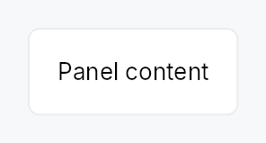

<!-- SPDX-License-Identifier: MPL-2.0 -->
<!-- SPDX-FileCopyrightText: 2026 FernTech -->

# Panel


Panel — a themed single-child container that provides a background, border,
corner radius, and padding.

## Public functions

### `Panel`

| Returns | Function |
| ---: | :--- |
| | **Constructors** |
| `Self` | [`new()`](#panel-new) |
| | **Builder methods** |
| `Self` | [`variant(variant: PanelVariant)`](#panel-variant) |
| `Self` | [`style(style: impl teksilo_core::styles::PanelStyle)`](#panel-style) |
| `Self` | [`a11y_presentational()`](#panel-a11y_presentational) |
| `Self` | [`child(widget: impl teksilo_core::IntoTeksiChild)`](#panel-child) |
| `Self` | [`child_opt(widget: Option<impl teksilo_core::IntoTeksiChild>)`](#panel-child_opt) |
| `Self` | [`background(color: impl Into<ColorProp>)`](#panel-background) |
| `Self` | [`border_color(color: impl Into<ColorProp>)`](#panel-border_color) |
| `Self` | [`border_width(width: impl Into<Prop<f32>>)`](#panel-border_width) |
| `Self` | [`corner_radius(radius: impl Into<Prop<f32>>)`](#panel-corner_radius) |
| `Self` | [`padding(padding: impl Into<Prop<f32>>)`](#panel-padding) |

## Detailed description

The equivalent of Qt's `QFrame`: a visual wrapper whose chrome comes from
the active `PanelStyle` trait
implementation. The IntUI default (`RecipePanelStyle`) honours four
`PanelVariant` presets (Plain /
Sunken / Raised / Highlighted) while still accepting per-call overrides
for background, border colour/width, corner radius, and padding. Apps
requiring a custom surface (frosted glass, brutalist frame) supply their
own `impl PanelStyle` per-call (`.style(...)`) or theme-wide via
`theme.style_slots.panel`.

#### Accessibility

Emits `Role::Group` by default. Call `.a11y_presentational()` to suppress
the group node when the panel is purely decorative (e.g. a toolbar
background that should not introduce a spurious container in the AT tree).
Either way the content is reachable: a presentational panel drops its own
node and keeps its children.

```rust
# use teksilo_widgets::Panel;
# use teksilo_widgets::primitives::TextWidget;
# use teksilo_i18n::lit;
let _w = Panel::new()
    .padding(12.0)
    .child(TextWidget::new(lit!("Content")));
```

## Density

The picture above is the widget at `TargetDensity::Compact`, the mouse-and-keyboard ladder. Below is the same subject on the same canvas with only the ladder changed, so what moves is the density and nothing else — where the subject no longer fits, that is what the denser targets cost it at that size. See `docs/density-and-targets.md`.

**Touch**



## API reference

📖 [Full rustdoc API for this module](https://docs.rs/teksilo-widgets/latest/teksilo_widgets/panel/index.html)

<a id="panel"></a>

## `pub struct Panel`

A themed container with background, border, corner radius, and padding.

```rust
pub struct Panel { /* fields */ }
```

### Methods

<a id="panel-new"></a>

#### `pub fn new() -> Self`

Construct a panel with default theme values (Plain variant, no manual overrides).

<a id="panel-variant"></a>

#### `pub fn variant(mut self, variant: PanelVariant) -> Self`

Pick the design-language variant. Default `Plain`. The active
`PanelStyle` decides what each variant means visually (the
IntUI default maps Plain → `surface_main`, Sunken →
`surface_sunken`, Raised → `surface_raised`, Highlighted →
`accent_subtle_bg`, with matching border defaults).

<a id="panel-style"></a>

#### `pub fn style(mut self, style: impl teksilo_core::styles::PanelStyle) -> Self`

Per-call style override. Replaces the theme-wide default
`PanelStyle` for just this Panel instance — same role as
`Button::style(...)`. Manual overrides (`background`,
`border_color`, etc.) are still passed to the style via
`PanelStyleConfig`; custom styles are free to honour or ignore
them.

<a id="panel-a11y_presentational"></a>

#### `pub fn a11y_presentational(mut self) -> Self`

Mark the panel as presentational for assistive tech: the panel's
own node becomes a bare `GenericContainer`, which the platform
adapters drop, so its wrapping chrome (background, border,
padding) doesn't introduce a spurious `Group` node between an
outer widget (Toolbar, StatusBar, etc.) and the real content.
The children stay in the tree, promoted to the panel's parent.

<a id="panel-child"></a>

#### `pub fn child(mut self, widget: impl teksilo_core::IntoTeksiChild) -> Self`

Set an inline child widget (deferred insertion).

<a id="panel-child_opt"></a>

#### `pub fn child_opt(self, widget: Option<impl teksilo_core::IntoTeksiChild>) -> Self`

Attach `widget` when it is `Some`, and do nothing when it is `None`.

The conditional-child form. `teksu!`'s `if` without an `else` lowers to
this, and it is what `cond.then(|| w)` is for in a builder chain. `None`
adds no arena node, so nothing is laid out, painted, or published to the
accessibility tree, and a stack applies no spacing around it.

<a id="panel-background"></a>

#### `pub fn background(mut self, color: impl Into<ColorProp>) -> Self`

Override the background. Accepts `Color`, a `SurfaceRole`,
or a `Signal<Color>`. Default (unset) is `SurfaceRole::Main`.

<a id="panel-border_color"></a>

#### `pub fn border_color(mut self, color: impl Into<ColorProp>) -> Self`

Override the border color. Accepts `Color`, a `BorderRole`,
or a `Signal<Color>`. Default (unset) is `BorderRole::Default`.

<a id="panel-border_width"></a>

#### `pub fn border_width(mut self, width: impl Into<Prop<f32>>) -> Self`

Override the border width (default: the active `PanelStyle` recipe's own
border width — `RecipePanelStyle` uses 1 dp).
Accepts a static `f32` or a reactive `Signal<f32>`.

<a id="panel-corner_radius"></a>

#### `pub fn corner_radius(mut self, radius: impl Into<Prop<f32>>) -> Self`

Override the corner radius (default: theme `radius_popup`).
Accepts a static `f32` or a reactive `Signal<f32>`.

<a id="panel-padding"></a>

#### `pub fn padding(mut self, padding: impl Into<Prop<f32>>) -> Self`

Override the padding (default: the active `PanelStyle` recipe's own
padding — `RecipePanelStyle`'s 12 dp, density-scaled).
Accepts a static `f32` or a reactive `Signal<f32>`.
