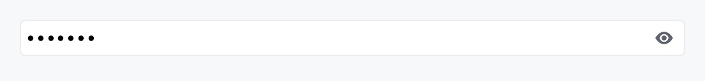

<!-- SPDX-License-Identifier: MPL-2.0 -->
<!-- SPDX-FileCopyrightText: 2026 FernTech -->

# PasswordField



`PasswordField` — secure single-line text entry with a reveal
toggle, masking, Caps Lock warning, and clipboard protection.

A thin, ergonomic preset over a secure
`TextInputField` composed
`SpinBox`-style: the field + an embedded reveal button live inside
one bordered frame with a unified focus halo. Masking happens at the
text-engine layer (one echo glyph per source `char`), so the
plaintext never reaches the shaper or glyph atlas while masked, and
caret / selection / hit-test stay correct.

Feature parity target: Qt `QLineEdit` echo modes, SwiftUI
`SecureField`, WinUI `PasswordBox` / `PasswordRevealMode`, and the
Android `password_toggle`.

# Example

```ignore
let password = ctx.signal(String::new());
PasswordField::new(password.clone())
    .label(tr!(password()))               // or .label(lit!("Password"))
    .placeholder(tr!(password_hint()))    // i18n-first; `_literal` twins bypass i18n
    .validator(|s| if s.len() >= 8 {
        ValidationOutcome::Valid
    } else {
        ValidationOutcome::Invalid { message: "Too short".into() }
    })
```

## Builder methods at a glance

`placeholder`, `label`, `enabled`, `read_only`, `max_length`, `char_filter`, `validator`, `on_submit_fn`, `on_blur_fn`, `min_width`, `variant`, `style`, `echo_char`, `echo_mode`, `reveal_mode`, `revealed`, `allow_copy`, `caps_lock_warning`, `at_reveal_policy`, `tooltip`, `rich_tooltip_key`, `rich_tooltip_content`, `rich_tooltip`, `composite_tooltip`, `revealed_signal`, `text`

## API reference

📖 [Full rustdoc API for this module](../api/teksilo_widgets/password_field/index.html)

## `pub enum RevealMode`

How the reveal affordance behaves. Mirrors WinUI's
`PasswordRevealMode`.

```rust
pub enum RevealMode { /* variants */ }
```

### Variants

- **`Toggle`** — A click (or Space / Enter while focused) flips between masked and revealed. Backed by `IconButton::visibility_toggle`; fully keyboard- and screen-reader-accessible. (Default.)
- **`Hold`** — Press-and-hold to reveal, release to re-mask (WinUI "Peek"). Pointer-oriented; prefer `Toggle` for keyboard accessibility.
- **`None`** — No reveal button — the field is always masked per its `EchoMode`.

## `pub struct PasswordField`

Secure single-line text entry. See the `module docs`.

```rust
pub struct PasswordField { /* fields */ }
```

### Methods

#### `pub fn new(password: Signal<String>) -> Self`

Construct a secure field bound to `password`.

#### `pub fn placeholder(mut self, text: impl Into<LocalizedString>) -> Self`

Placeholder shown when empty. Never masked.

#### `pub fn label(mut self, label: impl Into<LocalizedString>) -> Self`

Accessible name, applied to the `Role::PasswordInput` field node.
Strongly recommended for screen-reader users.

#### `pub fn enabled(mut self, enabled: impl Into<Prop<bool>>) -> Self`

Set the enabled state, statically or reactively. Forwarded to the
arena at build time — a bound `Signal<bool>` updates live as it
changes.

#### `pub fn read_only(mut self, read_only: bool) -> Self`

Read-only: selection works, edits don't.

#### `pub fn max_length(mut self, max_length: usize) -> Self`

Hard cap on length in `char`s.

#### `pub fn char_filter(mut self, f: impl Fn(char) -> bool + 'static) -> Self`

Per-character input filter (applied to keystrokes, IME commits,
and paste).

#### `pub fn validator(mut self, f: impl Fn(&str) -> ValidationOutcome + 'static) -> Self`

Commit-time validator (Enter / blur). Drives the inline
validation strip and `aria-invalid`.

#### `pub fn on_submit_fn( mut self, f: impl Fn(&mut teksilo_core::widget::EventContext) + 'static, ) -> Self`

Fired on Enter (focus stays put).

#### `pub fn on_blur_fn( mut self, f: impl Fn(&mut teksilo_core::widget::EventContext) + 'static, ) -> Self`

Fired once per focus-loss.

#### `pub fn min_width(mut self, width: f32) -> Self`

Minimum frame width (logical px). Default 65.

#### `pub fn variant(mut self, variant: TextInputVariant) -> Self`

Frame variant (Outlined / Filled / Underline / Bare).

#### `pub fn style(mut self, style: impl TextInputStyle) -> Self`

Per-instance style override.

#### `pub fn echo_char(mut self, c: char) -> Self`

Override the masking glyph (default `'•'`).

#### `pub fn echo_mode(mut self, mode: EchoMode) -> Self`

Set the `EchoMode` (default `EchoMode::Masked`).

#### `pub fn reveal_mode(mut self, mode: RevealMode) -> Self`

Set the `RevealMode` (default `RevealMode::Toggle`).

#### `pub fn revealed(mut self, revealed: Signal<bool>) -> Self`

Bind an external reveal signal (shared with other UI, observed
for analytics, or driven programmatically). Defaults to an
internal signal exposed via `revealed_signal`.

#### `pub fn allow_copy(mut self, allow: bool) -> Self`

Permit copy / cut even while masked (default `false`). Copy is
always allowed while revealed regardless of this flag.

#### `pub fn caps_lock_warning(mut self, on: bool) -> Self`

Show a Caps Lock warning when focused with Caps Lock on (default
`true`). The warning is announced to screen readers via a polite
live region.

#### `pub fn at_reveal_policy(mut self, policy: AtRevealPolicy) -> Self`

How a *revealed* field reports to assistive tech (default
`AtRevealPolicy::SwapRole`).

#### `pub fn tooltip(mut self, text: impl Into<LocalizedString>) -> Self`

Plain single-line tooltip shown on hover.

Mutually exclusive with `rich_tooltip_key`,
`rich_tooltip`,
`rich_tooltip_content`, and
`composite_tooltip` — calling any of them
clears the others.

#### `pub fn rich_tooltip_key(mut self, key: impl Into<String>) -> Self`

Registry-keyed rich tooltip.

Mutually exclusive with the other tooltip setters.

#### `pub fn rich_tooltip_content(mut self, content: tooltip::TooltipContent) -> Self`

Inline rich tooltip (canonical name: accepts a
`TooltipContent` directly without a
registry key).

Mutually exclusive with the other tooltip setters.

#### `pub fn rich_tooltip(mut self, content: tooltip::TooltipContent) -> Self`

Inline rich tooltip.

Mutually exclusive with the other tooltip setters.
Prefer `rich_tooltip_content` for the
canonical API.

#### `pub fn composite_tooltip(mut self, content: impl Widget + 'static) -> Self`

Composite (arbitrary-widget) tooltip.

Mutually exclusive with the other tooltip setters.

#### `pub fn revealed_signal(&self) -> Signal<bool>`

The reveal-state signal (`true` = plaintext shown). Useful to
observe or drive reveal programmatically.

#### `pub fn text(&self) -> Signal<String>`

The bound password signal.
