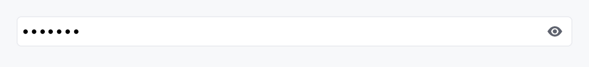
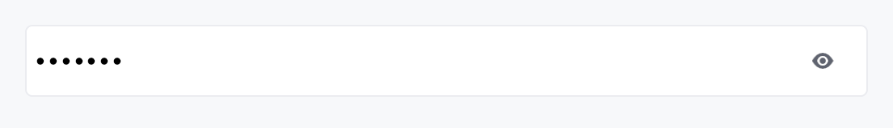

<!-- SPDX-License-Identifier: MPL-2.0 -->
<!-- SPDX-FileCopyrightText: 2026 FernTech -->

# PasswordField



`PasswordField` — secure single-line text entry with a reveal
toggle, masking, Caps Lock warning, and clipboard protection.

## Public types

| Kind | Name |
| ---: | :--- |
| `enum` | [`RevealMode`](#revealmode) — How the reveal affordance behaves |
| `struct` | [`PasswordField`](#passwordfield) — Secure single-line text entry |

## Public functions

### `PasswordField`

| Returns | Function |
| ---: | :--- |
| | **Constructors** |
| `Self` | [`new(password: Signal<String>)`](#passwordfield-new) |
| | **Builder methods** |
| `Self` | [`placeholder(text: impl Into<LocalizedString>)`](#passwordfield-placeholder) |
| `Self` | [`label(label: impl Into<LocalizedString>)`](#passwordfield-label) |
| `Self` | [`enabled(enabled: impl Into<Prop<bool>>)`](#passwordfield-enabled) |
| `Self` | [`read_only(read_only: bool)`](#passwordfield-read_only) |
| `Self` | [`max_length(max_length: usize)`](#passwordfield-max_length) |
| `Self` | [`char_filter(f: impl Fn(char) -> bool + 'static)`](#passwordfield-char_filter) |
| `Self` | [`validator(f: impl Fn(&str) -> ValidationOutcome + 'static)`](#passwordfield-validator) |
| `Self` | [`on_submit_fn(f: impl Fn(&mut teksilo_core::widget::EventContext) + 'static)`](#passwordfield-on_submit_fn) |
| `Self` | [`on_blur_fn(f: impl Fn(&mut teksilo_core::widget::EventContext) + 'static)`](#passwordfield-on_blur_fn) |
| `Self` | [`min_width(width: f32)`](#passwordfield-min_width) |
| `Self` | [`variant(variant: TextInputVariant)`](#passwordfield-variant) |
| `Self` | [`style(style: impl TextInputStyle)`](#passwordfield-style) |
| `Self` | [`echo_char(c: char)`](#passwordfield-echo_char) |
| `Self` | [`echo_mode(mode: EchoMode)`](#passwordfield-echo_mode) |
| `Self` | [`reveal_mode(mode: RevealMode)`](#passwordfield-reveal_mode) |
| `Self` | [`revealed(revealed: Signal<bool>)`](#passwordfield-revealed) |
| `Self` | [`allow_copy(allow: bool)`](#passwordfield-allow_copy) |
| `Self` | [`caps_lock_warning(on: bool)`](#passwordfield-caps_lock_warning) |
| `Self` | [`at_reveal_policy(policy: AtRevealPolicy)`](#passwordfield-at_reveal_policy) |
| `Self` | [`tooltip(text: impl Into<LocalizedString>)`](#passwordfield-tooltip) |
| `Self` | [`rich_tooltip_key(key: impl Into<String>)`](#passwordfield-rich_tooltip_key) |
| `Self` | [`rich_tooltip_content(content: tooltip::TooltipContent)`](#passwordfield-rich_tooltip_content) |
| `Self` | [`rich_tooltip(content: tooltip::TooltipContent)`](#passwordfield-rich_tooltip) |
| `Self` | [`composite_tooltip(content: impl Widget + 'static)`](#passwordfield-composite_tooltip) |
| | **Methods** |
| `Signal<bool>` | [`revealed_signal()`](#passwordfield-revealed_signal) |
| `Signal<String>` | [`text()`](#passwordfield-text) |

## Detailed description

A thin, ergonomic preset over a secure
`TextInputField` composed
`SpinBox`-style: the field + an embedded reveal button live inside
one bordered frame with a unified focus halo. Masking happens at the
text-engine layer (one echo glyph per source `char`), so the
plaintext never reaches the shaper or glyph atlas while masked, and
caret / selection / hit-test stay correct.

On Linux, while a screen reader is attached, Teksilo reports each key
to the AT-SPI registry, which is how Orca hears keys in a Wayland
session (`teksilo_platform::key_report`). A key typed into this field,
revealed or not, goes there without its character: no text, and the
keysym `VoidSymbol`. Its physical keycode and modifiers still go,
because Orca matches its own commands on them, so a process listening
to the registry can tell which physical keys were pressed. GTK 3 and
Qt report the character too.

Feature parity target: Qt `QLineEdit` echo modes, SwiftUI
`SecureField`, WinUI `PasswordBox` / `PasswordRevealMode`, and the
Android `password_toggle`.

### Example

```ignore
let password = ctx.signal(String::new());
PasswordField::new(password.clone())
    .label(tr!(password()))               // or .label(lit!("Password"))
    .placeholder(tr!(password_hint()))    // i18n-first; `_literal` twins bypass i18n
    .validator(|s| if s.len() >= 8 {
        ValidationOutcome::Valid
    } else {
        ValidationOutcome::Invalid { message: "Too short".into() }
    })
```

## Density

The picture above is the widget at `TargetDensity::Compact`, the mouse-and-keyboard ladder. Below is the same subject on the same canvas with only the ladder changed, so what moves is the density and nothing else — where the subject no longer fits, that is what the denser targets cost it at that size. See `docs/density-and-targets.md`.

**Touch**



## API reference

📖 [Full rustdoc API for this module](https://docs.rs/teksilo-widgets/latest/teksilo_widgets/password_field/index.html)

<a id="revealmode"></a>

## `pub enum RevealMode`

How the reveal affordance behaves. Mirrors WinUI's
`PasswordRevealMode`.

```rust
pub enum RevealMode { /* variants */ }
```

### Variants

- **`Toggle`** — A click (or Space / Enter while focused) flips between masked and revealed. Backed by `IconButton::visibility_toggle`; fully keyboard- and screen-reader-accessible. (Default.)
- **`Hold`** — Press-and-hold to reveal, release to re-mask (WinUI "Peek"). Pointer-oriented; prefer `Toggle` for keyboard accessibility.
- **`None`** — No reveal button — the field is always masked per its `EchoMode`.

<a id="passwordfield"></a>

## `pub struct PasswordField`

Secure single-line text entry. See the `module docs`.

```rust
pub struct PasswordField { /* fields */ }
```

### Methods

<a id="passwordfield-new"></a>

#### `pub fn new(password: Signal<String>) -> Self`

Construct a secure field bound to `password`.

<a id="passwordfield-placeholder"></a>

#### `pub fn placeholder(mut self, text: impl Into<LocalizedString>) -> Self`

Placeholder shown when empty. Never masked.

<a id="passwordfield-label"></a>

#### `pub fn label(mut self, label: impl Into<LocalizedString>) -> Self`

Accessible name, applied to the `Role::PasswordInput` field node.
Strongly recommended for screen-reader users.

<a id="passwordfield-enabled"></a>

#### `pub fn enabled(mut self, enabled: impl Into<Prop<bool>>) -> Self`

Set the enabled state, statically or reactively. Forwarded to the
arena at build time — a bound `Signal<bool>` updates live as it
changes.

<a id="passwordfield-read_only"></a>

#### `pub fn read_only(mut self, read_only: bool) -> Self`

Read-only: selection works, edits don't.

<a id="passwordfield-max_length"></a>

#### `pub fn max_length(mut self, max_length: usize) -> Self`

Hard cap on length in `char`s.

<a id="passwordfield-char_filter"></a>

#### `pub fn char_filter(mut self, f: impl Fn(char) -> bool + 'static) -> Self`

Per-character input filter (applied to keystrokes, IME commits,
and paste).

<a id="passwordfield-validator"></a>

#### `pub fn validator(mut self, f: impl Fn(&str) -> ValidationOutcome + 'static) -> Self`

Commit-time validator (Enter / blur). Drives the inline
validation strip and `aria-invalid`.

<a id="passwordfield-on_submit_fn"></a>

#### `pub fn on_submit_fn( mut self, f: impl Fn(&mut teksilo_core::widget::EventContext) + 'static, ) -> Self`

Fired on Enter (focus stays put).

<a id="passwordfield-on_blur_fn"></a>

#### `pub fn on_blur_fn( mut self, f: impl Fn(&mut teksilo_core::widget::EventContext) + 'static, ) -> Self`

Fired once per focus-loss.

<a id="passwordfield-min_width"></a>

#### `pub fn min_width(mut self, width: f32) -> Self`

Minimum frame width (logical px). Default 65.

<a id="passwordfield-variant"></a>

#### `pub fn variant(mut self, variant: TextInputVariant) -> Self`

Frame variant (Outlined / Filled / Underline / Bare).

<a id="passwordfield-style"></a>

#### `pub fn style(mut self, style: impl TextInputStyle) -> Self`

Per-instance style override.

<a id="passwordfield-echo_char"></a>

#### `pub fn echo_char(mut self, c: char) -> Self`

Override the masking glyph (default `'•'`).

<a id="passwordfield-echo_mode"></a>

#### `pub fn echo_mode(mut self, mode: EchoMode) -> Self`

Set the `EchoMode` (default `EchoMode::Masked`).

<a id="passwordfield-reveal_mode"></a>

#### `pub fn reveal_mode(mut self, mode: RevealMode) -> Self`

Set the `RevealMode` (default `RevealMode::Toggle`).

<a id="passwordfield-revealed"></a>

#### `pub fn revealed(mut self, revealed: Signal<bool>) -> Self`

Bind an external reveal signal (shared with other UI, observed
for analytics, or driven programmatically). Defaults to an
internal signal exposed via `revealed_signal`.

<a id="passwordfield-allow_copy"></a>

#### `pub fn allow_copy(mut self, allow: bool) -> Self`

Permit copy / cut even while masked (default `false`). Copy is
always allowed while revealed regardless of this flag.

<a id="passwordfield-caps_lock_warning"></a>

#### `pub fn caps_lock_warning(mut self, on: bool) -> Self`

Show a Caps Lock warning when focused with Caps Lock on (default
`true`). The warning is announced to screen readers via a polite
live region.

<a id="passwordfield-at_reveal_policy"></a>

#### `pub fn at_reveal_policy(mut self, policy: AtRevealPolicy) -> Self`

How a *revealed* field reports to assistive tech (default
`AtRevealPolicy::SwapRole`).

<a id="passwordfield-tooltip"></a>

#### `pub fn tooltip(mut self, text: impl Into<LocalizedString>) -> Self`

Plain single-line tooltip shown on hover.

Mutually exclusive with `rich_tooltip_key`,
`rich_tooltip`,
`rich_tooltip_content`, and
`composite_tooltip` — calling any of them
clears the others.

<a id="passwordfield-rich_tooltip_key"></a>

#### `pub fn rich_tooltip_key(mut self, key: impl Into<String>) -> Self`

Registry-keyed rich tooltip.

Mutually exclusive with the other tooltip setters.

<a id="passwordfield-rich_tooltip_content"></a>

#### `pub fn rich_tooltip_content(mut self, content: tooltip::TooltipContent) -> Self`

Inline rich tooltip (canonical name: accepts a
`TooltipContent` directly without a
registry key).

Mutually exclusive with the other tooltip setters.

<a id="passwordfield-rich_tooltip"></a>

#### `pub fn rich_tooltip(mut self, content: tooltip::TooltipContent) -> Self`

Inline rich tooltip.

Mutually exclusive with the other tooltip setters.
Prefer `rich_tooltip_content` for the
canonical API.

<a id="passwordfield-composite_tooltip"></a>

#### `pub fn composite_tooltip(mut self, content: impl Widget + 'static) -> Self`

Composite (arbitrary-widget) tooltip.

Mutually exclusive with the other tooltip setters.

<a id="passwordfield-revealed_signal"></a>

#### `pub fn revealed_signal(&self) -> Signal<bool>`

The reveal-state signal (`true` = plaintext shown). Useful to
observe or drive reveal programmatically.

<a id="passwordfield-text"></a>

#### `pub fn text(&self) -> Signal<String>`

The bound password signal.
