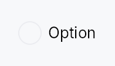
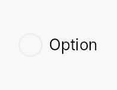

<!-- SPDX-License-Identifier: MPL-2.0 -->
<!-- SPDX-FileCopyrightText: 2026 FernTech -->

# RadioButton



RadioButton — mutually exclusive selection control.

Multiple `RadioButton`s share a `Signal<usize>`; selecting one writes its
`value` to the signal, which automatically deselects every sibling that
observes the same signal. The widget is non-generic: values are `usize`
indices into the caller's choice list. Wrap related buttons in a
`RadioGroup` to provide the AT "2 of 3"
positional announcement required by ARIA.

## Touch and pen

Same shape as `Checkbox`: the pressed state is the
framework's (`docs/touch-and-pen.md` §7.1), selection lands on the release,
and the 24 dp `MinSize` around the 19 dp dot already clears the conformance
floor at Compact.

## Accessibility

Reports `Role::RadioButton` with `set_toggled` mirroring the selected
state. Responds to `Action::Click` from assistive technology. The focus
ring is keyboard-only (`:focus-visible` gated by the input-modality
signal). When wrapped in `RadioGroup`, each button emits
`push_to_radio_group([sibling_ids])` so screen readers can announce
positional membership.

```rust
# use teksilo_widgets::RadioButton;
# use teksilo_core::signal::Signal;
# use teksilo_i18n::lit;
let selected = Signal::new(0_usize);
let _r0 = RadioButton::new(0, selected.clone()).label(lit!("Light"));
let _r1 = RadioButton::new(1, selected.clone()).label(lit!("Dark"));
let _r2 = RadioButton::new(2, selected.clone()).label(lit!("System"));
```

## Density

The picture above is the widget at `TargetDensity::Compact`, the mouse-and-keyboard ladder. Below is the same subject on the same canvas with only the ladder changed, so what moves is the density and nothing else — where the subject no longer fits, that is what the denser targets cost it at that size. See `docs/density-and-targets.md`.

**Touch**



## Builder methods at a glance

`on_change`, `label`, `caption`, `enabled`, `variant`, `style`, `tooltip`, `rich_tooltip`, `rich_tooltip_content`, `composite_tooltip`

## API reference

📖 [Full rustdoc API for this module](https://docs.rs/teksilo-widgets/latest/teksilo_widgets/radio_button/index.html)

## `pub struct RadioButton`

A single radio button option that writes `value` into a shared `Signal<usize>` on selection.

```rust
pub struct RadioButton { /* fields */ }
```

### Methods

#### `pub fn on_change(mut self, f: impl Fn(usize, &mut EventContext) + 'static) -> Self`

Run `f` when the **user** selects this button and it was not already
selected, with this button's value and an `EventContext`, so it can do
Create a radio button with the given `value` and shared selection signal.
Run `f` when the **user** selects this button and it was not already
selected, with this button's value and an `EventContext`, so it can do
what a bare `Signal` write cannot (`ctx.send_intent(...)`,
`ctx.set_locale(...)`, opening a window). Fires for the pointer, for
`Space`, and for an assistive-technology `Click`.

Re-activating the selected button writes the signal, as every path
does, but reports nothing: that is not a change. Programmatic writes to
the bound signal report nothing either — there is no event in flight to
carry. Observe the signal for those.

#### `pub fn new(value: usize, selected: Signal<usize>) -> Self`

#### `pub fn label(mut self, label: impl Into<LocalizedString>) -> Self`

Set the visible label text displayed to the right of the radio circle.

#### `pub fn caption(mut self, text: impl Into<LocalizedString>) -> Self`

Secondary explanatory text rendered below the label, left-aligned
with the label (not the radio circle). Uses the `small` /
`text_secondary` style. Has no effect unless `label(...)` is also set.

#### `pub fn enabled(mut self, enabled: impl Into<Prop<bool>>) -> Self`

Set the enabled state, statically or reactively. Forwarded to
the arena via `ctx.enabled_when(self_id, self.enabled.clone())`
at build time.

#### `pub fn variant(mut self, variant: RadioVariant) -> Self`

Pick the design-language variant. Default `Circle`. The active
`RadioStyle` impl decides what the variant means visually.

#### `pub fn style(mut self, style: impl teksilo_core::styles::RadioStyle) -> Self`

Per-call style override. Replaces the theme-wide default
`RadioStyle` for just this RadioButton instance.

#### `pub fn tooltip(mut self, text: impl Into<LocalizedString>) -> Self`

Attach a plain single-line tooltip shown on hover.

#### `pub fn rich_tooltip(mut self, key: impl Into<String>) -> Self`

Attach a rich tooltip resolved from the app-wide tooltip
registry. See `Button::rich_tooltip`.

#### `pub fn rich_tooltip_content(mut self, content: crate::tooltip::TooltipContent) -> Self`

Attach a rich tooltip driven by inline `TooltipContent`.

#### `pub fn composite_tooltip( mut self, content: impl teksilo_core::widget::Widget + 'static, ) -> Self`

Attach a composite tooltip — third tier, hosting an arbitrary
widget tree. See `Button::composite_tooltip`.
