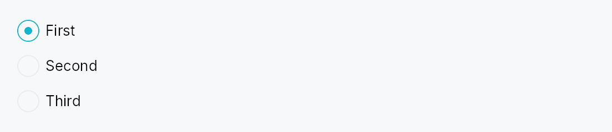

<!-- SPDX-License-Identifier: MPL-2.0 -->
<!-- SPDX-FileCopyrightText: 2026 FernTech -->

# RadioGroup



RadioGroup — invisible layout container that groups `RadioButton`s
and wires their accessibility metadata.

Radios are a fundamentally group-based control: screen readers need
to announce "2 of 3" positional info, which AccessKit models via
`push_to_radio_group([sibling_ids])` on each radio button. Loose
`RadioButton`s scattered in an HStack can't self-assemble this
relation because they have no knowledge of their siblings.

`RadioGroup` solves this by owning a shared `Rc<RefCell<Vec<WidgetId>>>`
buffer, injecting it into each `RadioButton` child before adding
them to the arena, and populating the buffer with each radio's
`WidgetId` as it's created. `RadioButton::accessibility()` reads
the buffer and emits the `push_to_radio_group` calls.

The widget is a pure layout wrapper — it delegates actual
rendering to an `HStack` or `VStack` under the hood. Its own
accessibility node carries `Role::RadioGroup` + an optional
accessible name.

```ignore
let selected = ctx.signal(0_usize);
RadioGroup::new()
    .label(lit!("Theme"))
    .radio(RadioButton::new(0, selected.clone()).label(lit!("Light")))
    .radio(RadioButton::new(1, selected.clone()).label(lit!("Dark")))
    .radio(RadioButton::new(2, selected.clone()).label(lit!("System")))
```

## Builder methods at a glance

`orientation`, `spacing`, `label`, `radio`, `child`

## API reference

📖 [Full rustdoc API for this module](../api/teksilo_widgets/radio_group/index.html)

## `pub struct RadioGroup`

Invisible layout container that groups `RadioButton`s for
accessibility. Arranges children in an `HStack` or `VStack`
and carries `Role::RadioGroup` on its own a11y node.

```rust
pub struct RadioGroup { /* fields */ }
```

### Methods

#### `pub fn new() -> Self`

Create an empty radio group with vertical orientation and 8 dp spacing.

#### `pub fn orientation(mut self, orientation: Orientation) -> Self`

Layout orientation. Defaults to `Vertical` — most radio groups
read top-to-bottom.

#### `pub fn spacing(mut self, spacing: f32) -> Self`

Gap between children.

#### `pub fn label(mut self, label: impl Into<LocalizedString>) -> Self`

Accessible name for the group — e.g. "Theme", "Font family".
Screen readers announce this before individual radio labels.

#### `pub fn radio(mut self, button: RadioButton) -> Self`

Add a radio button. The group's shared sibling-id buffer is
injected into the radio at build time so its accessibility
impl can publish group membership via `push_to_radio_group`.

#### `pub fn child(mut self, widget: impl Widget + 'static) -> Self`

Add a non-radio child (divider, caption label, etc.). Passed
straight through to the internal stack without a11y wiring.
