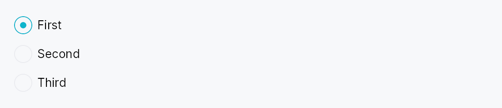

<!-- SPDX-License-Identifier: MPL-2.0 -->
<!-- SPDX-FileCopyrightText: 2026 FernTech -->

# RadioGroup



RadioGroup — invisible layout container that groups `RadioButton`s
and wires their accessibility metadata.

## Public functions

### `RadioGroup`

| Returns | Function |
| ---: | :--- |
| | **Constructors** |
| `Self` | [`new()`](#radiogroup-new) |
| | **Builder methods** |
| `Self` | [`orientation(orientation: Orientation)`](#radiogroup-orientation) |
| `Self` | [`spacing(spacing: f32)`](#radiogroup-spacing) |
| `Self` | [`label(label: impl Into<LocalizedString>)`](#radiogroup-label) |
| `Self` | [`radio(button: RadioButton)`](#radiogroup-radio) |
| `Self` | [`radios(buttons: impl IntoIterator<Item = RadioButton>)`](#radiogroup-radios) |
| `Self` | [`child(widget: impl Widget + 'static)`](#radiogroup-child) |
| `Self` | [`children(iter: impl IntoIterator<Item = impl Widget + 'static>)`](#radiogroup-children) |
| `Self` | [`child_opt(widget: Option<impl Widget + 'static>)`](#radiogroup-child_opt) |

## Detailed description

Radios are a fundamentally group-based control: screen readers need
to announce "2 of 3" positional info, which AccessKit models via
`push_to_radio_group([sibling_ids])` on each radio button. Loose
`RadioButton`s scattered in an HStack can't self-assemble this
relation because they have no knowledge of their siblings.

`RadioGroup` solves this by owning a shared `Rc<RefCell<Vec<WidgetId>>>`
buffer, injecting it into each `RadioButton` child before adding
them to the arena, and populating the buffer with each radio's
`WidgetId` as it's created. `RadioButton::accessibility()` reads
the buffer and emits the `push_to_radio_group` calls.

The widget is a pure layout wrapper — it delegates actual
rendering to an `HStack` or `VStack` under the hood. Its own
accessibility node carries `Role::RadioGroup` + an optional
accessible name.

```ignore
let selected = ctx.signal(0_usize);
RadioGroup::new()
    .label(lit!("Theme"))
    .radio(RadioButton::new(0, selected.clone()).label(lit!("Light")))
    .radio(RadioButton::new(1, selected.clone()).label(lit!("Dark")))
    .radio(RadioButton::new(2, selected.clone()).label(lit!("System")))
```

## Density

The picture above is the widget at `TargetDensity::Compact`, the mouse-and-keyboard ladder. Below is the same subject on the same canvas with only the ladder changed, so what moves is the density and nothing else — where the subject no longer fits, that is what the denser targets cost it at that size. See `docs/density-and-targets.md`.

**Touch**


## API reference

📖 [Full rustdoc API for this module](https://docs.rs/teksilo-widgets/latest/teksilo_widgets/radio_group/index.html)

<a id="radiogroup"></a>

## `pub struct RadioGroup`

Invisible layout container that groups `RadioButton`s for
accessibility. Arranges children in an `HStack` or `VStack`
and carries `Role::RadioGroup` on its own a11y node.

```rust
pub struct RadioGroup { /* fields */ }
```

### Methods

<a id="radiogroup-new"></a>

#### `pub fn new() -> Self`

Create an empty radio group with vertical orientation and 8 dp spacing.

<a id="radiogroup-orientation"></a>

#### `pub fn orientation(mut self, orientation: Orientation) -> Self`

Layout orientation. Defaults to `Vertical` — most radio groups
read top-to-bottom.

<a id="radiogroup-spacing"></a>

#### `pub fn spacing(mut self, spacing: f32) -> Self`

Gap between children.

<a id="radiogroup-label"></a>

#### `pub fn label(mut self, label: impl Into<LocalizedString>) -> Self`

Accessible name for the group — e.g. "Theme", "Font family".
Screen readers announce this before individual radio labels.

<a id="radiogroup-radio"></a>

#### `pub fn radio(mut self, button: RadioButton) -> Self`

Add a radio button. The group's shared sibling-id buffer is
injected into the radio at build time so its accessibility
impl can publish group membership via `push_to_radio_group`.

<a id="radiogroup-radios"></a>

#### `pub fn radios(self, buttons: impl IntoIterator<Item = RadioButton>) -> Self`

Add several radio buttons from an iterator, in order.

The loop form of `radio`, and the usual one: a radio group
is normally generated from the list of choices it offers. Each button
gets the group's shared sibling-id buffer exactly as `radio` gives it.

<a id="radiogroup-child"></a>

#### `pub fn child(mut self, widget: impl Widget + 'static) -> Self`

Add a non-radio child (divider, caption label, etc.). Passed
straight through to the internal stack without a11y wiring.

<a id="radiogroup-children"></a>

#### `pub fn children(self, iter: impl IntoIterator<Item = impl Widget + 'static>) -> Self`

Add several non-radio children from an iterator, in order.

The loop form of `child`. Like `child`, none of these get
the group's a11y wiring: use `radios` for the buttons.

<a id="radiogroup-child_opt"></a>

#### `pub fn child_opt(self, widget: Option<impl Widget + 'static>) -> Self`

Attach `widget` when it is `Some`, and do nothing when it is `None`.

The conditional-child form. `teksu!`'s `if` without an `else` lowers to
this, and it is what `cond.then(|| w)` is for in a builder chain. `None`
adds no arena node, so nothing is laid out, painted, or published to the
accessibility tree, and a stack applies no spacing around it.
