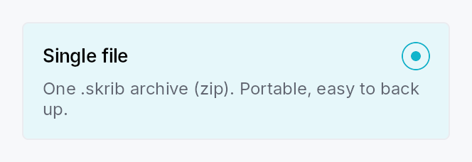

<!-- SPDX-License-Identifier: MPL-2.0 -->
<!-- SPDX-FileCopyrightText: 2026 FernTech -->

# RadioTile



RadioTile — a "selectable card" radio option.

A `RadioTile` behaves as a single radio button (`Role::RadioButton`,
`set_toggled`) rendered as a bordered, rounded card: a leading icon, a
bold title, an inline radio indicator, and a muted, wrapping description.
Multiple tiles share a `Signal<usize>` — selecting one writes its `value`,
which deselects every sibling observing the same signal (the `RadioButton`
model). Group them with
`RadioTileGroup` for layout,
roving keyboard navigation, and the AT "N of M" positional announcement.

## Content model

Typed slots cover the common case (matching the reference design):
`.icon(..)`, `.title(..)`, `.description(..)`. For arbitrary content, the
`.body(..)` slot replaces the description column with any widget subtree.

## Accessibility

Reports `Role::RadioButton` with `set_toggled` mirroring selection, the
title as the accessible name, and the description as the accessible
description. When grouped, each tile emits
`push_to_radio_group([sibling_ids])` plus `set_position_in_set` /
the group's `set_size_of_set` for "N of M". Inside a `RadioTileGroup` the tile is not
individually focusable — focus roves on the group (WAI-ARIA radiogroup),
and the group publishes `active_descendant`. A standalone tile is
focusable and responds to `Space` / `Action::Click`.

```ignore
let selected = ctx.signal(0_usize);
RadioTileGroup::new(selected)
    .tile(RadioTile::new().icon(icon).title(tr!(single_file())).description(tr!(single_file_desc())))
    .tile(RadioTile::new().icon(icon2).title(tr!(bundle())).description(tr!(bundle_desc())))
```

## Builder methods at a glance

`selection`, `icon`, `icon_boxed`, `title`, `description`, `body`, `body_boxed`, `trailing`, `trailing_slot`, `compact`, `title_style`, `title_color`, `description_style`, `description_color`, `enabled`, `variant`, `show_indicator`, `indicator_side`, `style`, `tooltip`, `rich_tooltip`, `rich_tooltip_content`, `composite_tooltip`

## API reference

📖 [Full rustdoc API for this module](https://docs.rs/teksilo-widgets/latest/teksilo_widgets/radio_tile/index.html)

## `pub enum RadioTileIndicatorSide`

Which side of the top row the radio indicator sits on. Defaults to
`Trailing` (top-right in LTR), matching the reference design.

```rust
pub enum RadioTileIndicatorSide { /* variants */ }
```

### Variants

- **`Trailing`** — Trailing edge of the row — top-right in LTR, top-left in RTL.
- **`Leading`** — Leading edge of the row — top-left in LTR, top-right in RTL.

## `pub struct RadioTile`

A single selectable-card radio option. See the `module docs`.

```rust
pub struct RadioTile { /* fields */ }
```

### Methods

#### `pub fn new() -> Self`

Create a tile with no selection binding. The enclosing
`RadioTileGroup` assigns
this tile's `value` (its position) and shared selection signal. Use
`selection` for a standalone tile.

#### `pub fn selection(mut self, value: usize, selected: Signal<usize>) -> Self`

Bind this tile to an explicit `value` + shared `Signal<usize>` for use
**outside** a `RadioTileGroup`. Inside a group this is set automatically.

#### `pub fn icon(mut self, widget: impl Widget + 'static) -> Self`

Leading icon slot (top-left of the tile). Any widget — typically an
`IconWidget`.

#### `pub fn icon_boxed(mut self, widget: Box<dyn Widget>) -> Self`

Leading icon slot, pre-boxed.

#### `pub fn title(mut self, title: impl Into<LocalizedString>) -> Self`

Bold title text (the tile's accessible name).

#### `pub fn description(mut self, text: impl Into<LocalizedString>) -> Self`

Muted, multi-line description (the tile's accessible description).
Ignored when a `body` is set.

#### `pub fn body(mut self, widget: impl Widget + 'static) -> Self`

Replace the description column with an arbitrary widget subtree. Takes
precedence over `description`. Note: a body's own
content is exposed to assistive technology as-is (unlike the typed
description, which is folded into the tile's accessible description).

#### `pub fn body_boxed(mut self, widget: Box<dyn Widget>) -> Self`

Custom body slot, pre-boxed.

#### `pub fn trailing(mut self, text: impl Into<LocalizedString>) -> Self`

Right-aligned trailing meta text (e.g. "20 chapters", "free-form
notes"). Tints to the accent color when the tile is selected. Most
useful with the compact vertical arrangement. Ignored when a
`trailing_slot` is set.

#### `pub fn trailing_slot(mut self, widget: impl Widget + 'static) -> Self`

Arbitrary right-aligned trailing widget (badge, count, chevron, …).
Takes precedence over `trailing`.

#### `pub fn compact(mut self, compact: bool) -> Self`

Compact single-line arrangement: `[indicator] [icon] [title] [Spacer]
[trailing]` with no description row — the vertical settings-list look.
`RadioTileGroup::layout(TileLayout::Vertical)` sets this automatically
(and moves the indicator to the leading edge).

#### `pub fn title_style(mut self, style: impl Into<TextStyleProp>) -> Self`

Override the title text style (default `TextStyleRole::BodyBold`).

#### `pub fn title_color(mut self, color: impl Into<ColorProp>) -> Self`

Override the title text color (default `TextRole::Primary`).

#### `pub fn description_style(mut self, style: impl Into<TextStyleProp>) -> Self`

Override the description text style (default `TextStyleRole::Small`).

#### `pub fn description_color(mut self, color: impl Into<ColorProp>) -> Self`

Override the description text color (default `TextRole::Secondary`).

#### `pub fn enabled(mut self, enabled: impl Into<Prop<bool>>) -> Self`

Set the enabled state, statically or reactively. A disabled tile
is skipped by the group's keyboard navigation and cannot be
selected.

#### `pub fn variant(mut self, variant: RadioTileVariant) -> Self`

Pick the card variant (default `Outlined`).

#### `pub fn show_indicator(mut self, show: bool) -> Self`

Whether to render the inline radio indicator (default `true`). When
`false`, the selection cue is the card highlight alone.

#### `pub fn indicator_side(mut self, side: RadioTileIndicatorSide) -> Self`

Which side of the top row the radio indicator sits on (default `Trailing`).

#### `pub fn style(mut self, style: impl RadioTileStyle) -> Self`

Per-call style override — replaces the theme-wide `RadioTileStyle`
for just this tile.

#### `pub fn tooltip(mut self, text: impl Into<LocalizedString>) -> Self`

Attach a plain single-line tooltip shown on hover.

#### `pub fn rich_tooltip(mut self, key: impl Into<String>) -> Self`

Attach a rich tooltip resolved from the app-wide tooltip registry.

#### `pub fn rich_tooltip_content(mut self, content: crate::tooltip::TooltipContent) -> Self`

Attach a rich tooltip driven by inline `TooltipContent`.

#### `pub fn composite_tooltip(mut self, content: impl Widget + 'static) -> Self`

Attach a composite tooltip hosting an arbitrary widget tree.
