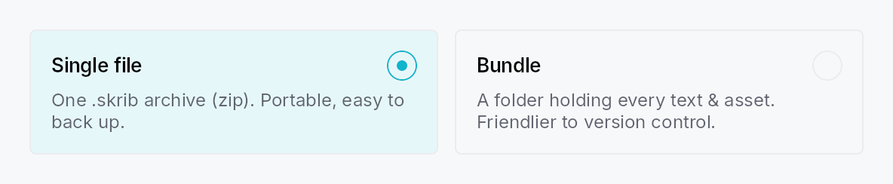
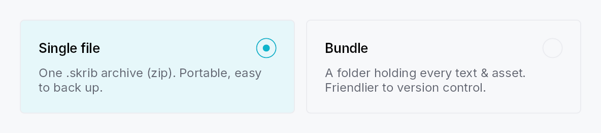

<!-- SPDX-License-Identifier: MPL-2.0 -->
<!-- SPDX-FileCopyrightText: 2026 FernTech -->

# RadioTileGroup



RadioTileGroup — an N-ary group of `RadioTile`s with single selection.

## Public types

| Kind | Name |
| ---: | :--- |
| `enum` | [`TileLayout`](#tilelayout) — How a `RadioTileGroup` arranges its tiles |
| `struct` | [`RadioTileGroup`](#radiotilegroup) — An N-ary, single-selection group of selectable-card radios |

## Public functions

### `RadioTileGroup`

| Returns | Function |
| ---: | :--- |
| | **Constructors** |
| `Self` | [`new(selected: Signal<usize>)`](#radiotilegroup-new) |
| | **Builder methods** |
| `Self` | [`label(label: impl Into<LocalizedString>)`](#radiotilegroup-label) |
| `Self` | [`tile(tile: RadioTile)`](#radiotilegroup-tile) |
| `Self` | [`tiles(tiles: impl IntoIterator<Item = RadioTile>)`](#radiotilegroup-tiles) |
| `Self` | [`layout(layout: TileLayout)`](#radiotilegroup-layout) |
| `Self` | [`spacing(spacing: f32)`](#radiotilegroup-spacing) |
| `Self` | [`line_spacing(spacing: f32)`](#radiotilegroup-line_spacing) |
| `Self` | [`row_height(height: f32)`](#radiotilegroup-row_height) |
| `Self` | [`enabled(enabled: impl Into<Prop<bool>>)`](#radiotilegroup-enabled) |
| `Self` | [`style(style: impl teksilo_core::styles::RadioTileStyle)`](#radiotilegroup-style) |

## Detailed description

Like `SegmentedControl`, the
tile count is not fixed: add any number of tiles, all sharing one
`Signal<usize>`. The group owns:

- **Layout** — an equal-size `TileLayout::Row`, an adaptive wrapping
  `TileLayout::Grid`, a full-width `TileLayout::Column`, or a compact
  fixed-height `TileLayout::Vertical` settings list. Row and Grid equalize
  tile size (uniform width + the tallest tile's height) via a custom
  `place_children` measuring each tile height-for-width — stacks have no
  cross-axis stretch, so the group does the sizing.
- **Keyboard** — the WAI-ARIA *roving radiogroup* pattern: the group is a
  single Tab stop; Arrow keys move selection (selection follows focus),
  Home/End jump, disabled tiles are skipped. `Increment`/`Decrement` AT
  actions mirror the arrows for switch access.
- **Accessibility** — `Role::RadioGroup` with `active_descendant` pointing
  at the selected tile; each tile is `Role::RadioButton` and declares its
  siblings via `push_to_radio_group` (for "N of M").

```ignore
let selected = ctx.signal(0_usize);
RadioTileGroup::new(selected)
    .label(tr!(project_format()))
    .tile(RadioTile::new().icon(a).title(tr!(single_file())).description(tr!(single_file_desc())))
    .tile(RadioTile::new().icon(b).title(tr!(bundle())).description(tr!(bundle_desc())))
    .layout(TileLayout::Row)
```

## Density

The picture above is the widget at `TargetDensity::Compact`, the mouse-and-keyboard ladder. Below is the same subject on the same canvas with only the ladder changed, so what moves is the density and nothing else — where the subject no longer fits, that is what the denser targets cost it at that size. See `docs/density-and-targets.md`.

**Touch**



## API reference

📖 [Full rustdoc API for this module](https://docs.rs/teksilo-widgets/latest/teksilo_widgets/radio_tile_group/index.html)

<a id="tilelayout"></a>

## `pub enum TileLayout`

How a `RadioTileGroup` arranges its tiles.

```rust
pub enum TileLayout { /* variants */ }
```

### Variants

- **`Row`** — A single horizontal row of equal-width, equal-height tiles (the tiles stretch to the tallest). The reference "two cards side-by-side" layout.
- **`Grid`** — A wrapping grid whose column count adapts to the available width: `cols = floor((width + spacing) / (min_tile_width + spacing))`, at least one. All cells share the same width and the tallest tile's height.
- **`Column`** — A vertical column of full-width tiles, each its natural height. Tiles keep their full card content (icon + title + description).
- **`Vertical`** — A vertical list of **compact** fixed-height full-width rows: `[radio] [icon] [title] [Spacer] [trailing]`, no description — the settings-list look. Every row is a fixed height taken from the active `RadioTileStyle` (the theme's `RadioTileRecipe::vertical_row_height`, 44 dp by default; override per-group with `RadioTileGroup::row_height`), and the group switches each tile to the compact arrangement (leading radio) automatically.

<a id="radiotilegroup"></a>

## `pub struct RadioTileGroup`

An N-ary, single-selection group of selectable-card radios. See the
`module docs`.

```rust
pub struct RadioTileGroup { /* fields */ }
```

### Methods

<a id="radiotilegroup-new"></a>

#### `pub fn new(selected: Signal<usize>) -> Self`

Create a group bound to the shared selection signal. Add tiles with
`tile` / `tiles`.

<a id="radiotilegroup-label"></a>

#### `pub fn label(mut self, label: impl Into<LocalizedString>) -> Self`

Accessible name for the group (announced before individual tiles).

<a id="radiotilegroup-tile"></a>

#### `pub fn tile(mut self, tile: RadioTile) -> Self`

Add a tile. Its `value` (position) and shared selection signal are
assigned automatically.

<a id="radiotilegroup-tiles"></a>

#### `pub fn tiles(mut self, tiles: impl IntoIterator<Item = RadioTile>) -> Self`

Add several tiles from an iterator.

<a id="radiotilegroup-layout"></a>

#### `pub fn layout(mut self, layout: TileLayout) -> Self`

Choose the layout (default `TileLayout::Row`).

<a id="radiotilegroup-spacing"></a>

#### `pub fn spacing(mut self, spacing: f32) -> Self`

Override the gap between tiles along the main axis (and grid columns).
Defaults to 6 dp for `TileLayout::Vertical`, 12 dp otherwise.

<a id="radiotilegroup-line_spacing"></a>

#### `pub fn line_spacing(mut self, spacing: f32) -> Self`

Gap between rows in `TileLayout::Grid`.

<a id="radiotilegroup-row_height"></a>

#### `pub fn row_height(mut self, height: f32) -> Self`

Override the fixed row height for `TileLayout::Vertical` compact rows.
Takes precedence over the theme value
(`RadioTileRecipe::vertical_row_height`, 44 dp by default). No effect on
other layouts.

<a id="radiotilegroup-enabled"></a>

#### `pub fn enabled(mut self, enabled: impl Into<Prop<bool>>) -> Self`

Set the enabled state for the whole group, statically or
reactively.

<a id="radiotilegroup-style"></a>

#### `pub fn style(mut self, style: impl teksilo_core::styles::RadioTileStyle) -> Self`

Forward a `RadioTileStyle` to every tile that doesn't set its own
`.style(...)`.
