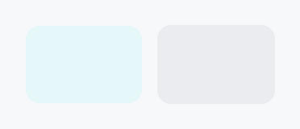

<!-- SPDX-License-Identifier: MPL-2.0 -->
<!-- SPDX-FileCopyrightText: 2026 FernTech -->

# RectWidget


RectWidget — a leaf widget that paints a filled and/or stroked rounded rectangle.

## Public functions

### `RectWidget`

| Returns | Function |
| ---: | :--- |
| | **Constructors** |
| `Self` | [`new()`](#rectwidget-new) |
| | **Builder methods** |
| `Self` | [`background(paint: impl Into<PaintProp>)`](#rectwidget-background) |
| `Self` | [`border_sides(sides: impl Into<Prop<Option<BorderSides>>>)`](#rectwidget-border_sides) |
| `Self` | [`border_position(position: BorderPosition)`](#rectwidget-border_position) |
| `Self` | [`border_color(color: impl Into<ColorProp>)`](#rectwidget-border_color) |
| `Self` | [`border_width(width: impl Into<Prop<f32>>)`](#rectwidget-border_width) |
| `Self` | [`corner_radius(radius: impl Into<Prop<CornerRadius>>)`](#rectwidget-corner_radius) |

## Detailed description

`RectWidget` has no intrinsic content: it fills whatever space its parent
proposes (or reports `0×0` when unconstrained) and draws a fill (solid color
or gradient), an optional border (a uniform stroke positioned inside / center
/ outside, or per-side edge fills for an underline), and an optional corner
radius. It is the low-level building block for card backgrounds, focus rings,
dividers, underlined fields, and highlight overlays.

The fill accepts `impl Into<PaintProp>` — anything `Into<ColorProp>` (a raw
`Color`, a theme role such as `SurfaceRole::Hover`, or a `Signal<Color>`) for
a solid, plus `PaintProp::Linear` / `Radial` for a gradient. Border color
accepts `impl Into<ColorProp>`, so reactive interaction-driven colors require
no extra wiring.

```rust
# use teksilo_tokens::{Color, CornerRadius};
# use teksilo_widgets::primitives::RectWidget;
// A pill-shaped accent badge background:
let _w = RectWidget::new()
    .background(Color::from_rgba(0.2, 0.5, 1.0, 1.0))
    .corner_radius(CornerRadius::uniform(12.0));
```

## Density

The picture above is the widget at `TargetDensity::Compact`, the mouse-and-keyboard ladder. Below is the same subject on the same canvas with only the ladder changed, so what moves is the density and nothing else — where the subject no longer fits, that is what the denser targets cost it at that size. See `docs/density-and-targets.md`.

**Touch**



## API reference

📖 [Full rustdoc API for this module](https://docs.rs/teksilo-widgets/latest/teksilo_widgets/primitives/rect_widget/index.html)

<a id="rectwidget"></a>

## `pub struct RectWidget`

A leaf widget that paints a filled and/or stroked rounded rectangle.

See the `module documentation` for the full feature description.
All visual properties accept `impl Into<ColorProp>` (colors/roles/signals) or
`impl Into<Prop<f32>>` / `impl Into<Prop<CornerRadius>>` (static or reactive)
— so the common "fill with theme surface, border with theme border" setup is
just `.background(SurfaceRole::Main).border_color(BorderRole::Default)`.

```rust
pub struct RectWidget { /* fields */ }
```

### Methods

<a id="rectwidget-new"></a>

#### `pub fn new() -> Self`

Create a fully transparent, zero-border rectangle with no corner radius.

<a id="rectwidget-background"></a>

#### `pub fn background(mut self, paint: impl Into<PaintProp>) -> Self`

Fill. Accepts `Color`, a theme role (`SurfaceRole`, etc.), a
`Signal<Color>`, or a `PaintProp` (e.g. a gradient).

<a id="rectwidget-border_sides"></a>

#### `pub fn border_sides(mut self, sides: impl Into<Prop<Option<BorderSides>>>) -> Self`

Per-side border widths (e.g. `BorderSides::bottom` for an
underline). When set, overrides the uniform stroke; sides are
drawn as edge fills in `border_color`.

<a id="rectwidget-border_position"></a>

#### `pub fn border_position(mut self, position: BorderPosition) -> Self`

Where a uniform stroke sits relative to the rect edge
(inside / center / outside). Ignored when `border_sides` is set.

<a id="rectwidget-border_color"></a>

#### `pub fn border_color(mut self, color: impl Into<ColorProp>) -> Self`

Border color. Accepts `Color`, a theme role (`BorderRole`, etc.),
or a `Signal<Color>`.

<a id="rectwidget-border_width"></a>

#### `pub fn border_width(mut self, width: impl Into<Prop<f32>>) -> Self`

Stroke width, in logical pixels. Accepts a static value or a reactive `Signal<f32>`.

<a id="rectwidget-corner_radius"></a>

#### `pub fn corner_radius(mut self, radius: impl Into<Prop<CornerRadius>>) -> Self`

Corner radius for the fill and stroke. Accepts a `CornerRadius` (per-corner
control) or a reactive `Signal<CornerRadius>`.
