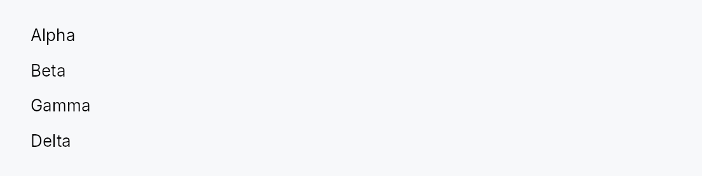

<!-- SPDX-License-Identifier: MPL-2.0 -->
<!-- SPDX-FileCopyrightText: 2026 FernTech -->

# Repeater



Repeater — non-virtualized dynamic widget list driven by a `ListModel<T>`.

`Repeater` creates one child widget per item in a `ListModel<T>`
using a caller-supplied factory closure, arranging them along one axis
(`RepeaterLayout::Vertical` by default) or as a wrapping flow
(`RepeaterLayout::Wrap`). It is **not virtualized**: every item has a live
widget at all times. That is a deliberate trade — it is what lets the
children keep real, stateful widgets (text editors, forms) mounted, which a
virtualizing `ListView` cannot do because it recycles
off-screen rows.

# `Repeater::new` — reconciling (the default)

The factory takes `&item` and each child widget is **reused across model
changes**. When the model mutates, `Repeater` reads the
`DataChange` it emits and applies the *minimal* edit to its child set: an
insert builds one new widget, a remove reaps one, a move reorders, an
in-place update rebuilds only that item — every other child keeps its
existing widget, and with it its focus, selection, caret, scroll offset,
in-flight text edit, and undo history.

This makes `Repeater` a fit for a **stack of editors** — e.g. a document
rendered as a column of `RichTextEditor`s,
one per scene/block:

```rust,ignore
Repeater::new(scenes, |scene| {
    Box::new(RichTextEditor::editor(scene.document()))
})
```

Inserting, deleting, or reordering a scene costs one widget's worth of work
instead of reshaping every editor in the document, and the editor the user is
typing in keeps its caret. Because the factory has no index, position shifts
are safe by construction: reuse can never leave a widget showing content
derived from a stale position. The one requirement is that an item's
*content* only changes through the model (via `set`/`replace_all`), which is
always true for a `ListModel`.

```rust
# use teksilo_widgets::Repeater;
# use teksilo_widgets::primitives::TextWidget;
# use teksilo_data::ListModel;
# use teksilo_i18n::lit;
let model: ListModel<u32> = ListModel::from_vec(vec![1, 2, 3]);
let _w = Repeater::new(model, |item| {
    Box::new(TextWidget::new(lit!(format!("item {item}"))))
})
.spacing(4.0);
```

# `Repeater::indexed` — full rebuild (position-in-content)

When the content genuinely depends on position — a numbered list, "N of M",
a ranking that must renumber on reorder — use `indexed`.
Its factory takes `(index, &item)`, and on **any** model change the whole
child subtree is torn down and rebuilt, so the index every widget shows is
always current. This is the right pick for cheap, stateless, position-derived
rows; it does **not** preserve per-child state across changes (that is the
reason to prefer `new` whenever the index isn't content).

# Accessibility

`Repeater` imposes **no** accessibility semantics of its own — it is a
transparent layout wrapper, so its children surface directly into the
surrounding AT subtree and their own roles decide how they read. When the
children genuinely form a named list, menu, or toolbar, opt in with the
standard builder overrides that every widget supports — these stay
locale-reactive:

```rust,ignore
use teksilo_core::accesskit::Role;
Repeater::new(tags, factory)
    .access_role(Role::List)
    .access_label(tr!(tags()))
```

## Builder methods at a glance

`indexed`, `layout`, `horizontal`, `wrap`, `spacing`, `line_spacing`

## API reference

📖 [Full rustdoc API for this module](https://docs.rs/teksilo-widgets/latest/teksilo_widgets/repeater/index.html)

## `pub enum RepeaterLayout`

How a `Repeater` arranges its item widgets.

```rust
pub enum RepeaterLayout { /* variants */ }
```

### Variants

- **`Vertical`** — A vertical column, top to bottom (default). Gap = `Repeater::spacing`.
- **`Horizontal`** — A horizontal row, leading to trailing (RTL-aware via `HStack`). Gap = `Repeater::spacing`.
- **`Wrap`** — A horizontal flow that wraps to the next line when items exceed the available width — chip rows, badge lists. `Repeater::spacing` is the inter-item gap, `Repeater::line_spacing` the inter-line gap.

## `pub struct Repeater`

A non-virtualized dynamic collection that creates one child widget per item in a `ListModel<T>`.

See the `module-level docs` for the two build modes, layout options,
and accessibility guidance.

```rust
pub struct Repeater<T: 'static> { /* fields */ }
```

### Methods

#### `pub fn new(model: ListModel<T>, factory: impl Fn(&T) -> Box<dyn Widget> + 'static) -> Self`

Create a Repeater in **reconciling** mode (the default): item widgets are
reused across model changes, so each child keeps its state (focus, caret,
selection, scroll, undo history) when siblings are inserted, removed, or
reordered.

The `factory` receives `&item` only — it must not depend on the item's
position, which is what makes reuse safe when items shift. This is the
mode for a stack of stateful widgets such as `RichTextEditor`s. If the
content genuinely depends on position (a numbered list), use
`Repeater::indexed` instead. See the `module-level docs` for the
full rationale.

#### `pub fn indexed( model: ListModel<T>, factory: impl Fn(usize, &T) -> Box<dyn Widget> + 'static, ) -> Self`

Create a Repeater in **full-rebuild** mode: the `factory` receives
`(index, &item)` and the entire child subtree is rebuilt on any model
change, so position-derived content stays current.

Use this only when the content depends on the item's position (row
numbers, "N of M", a ranking that renumbers on reorder). It does **not**
preserve per-child state across changes — prefer `Repeater::new`
whenever the index isn't part of what each item renders.

#### `pub fn layout(mut self, layout: RepeaterLayout) -> Self`

Choose how items are arranged (default `RepeaterLayout::Vertical`).

#### `pub fn horizontal(self) -> Self`

Arrange items horizontally — shorthand for `.layout(RepeaterLayout::Horizontal)`.

#### `pub fn wrap(self) -> Self`

Arrange items as a wrapping flow — shorthand for `.layout(RepeaterLayout::Wrap)`.

#### `pub fn spacing(mut self, spacing: f32) -> Self`

Set the gap between items along the main axis (default 0.0). For
`RepeaterLayout::Wrap` this is the inter-item (horizontal) gap.

#### `pub fn line_spacing(mut self, line_spacing: f32) -> Self`

Set the gap between lines for `RepeaterLayout::Wrap` (default 0.0).
Ignored by the single-axis layouts.
