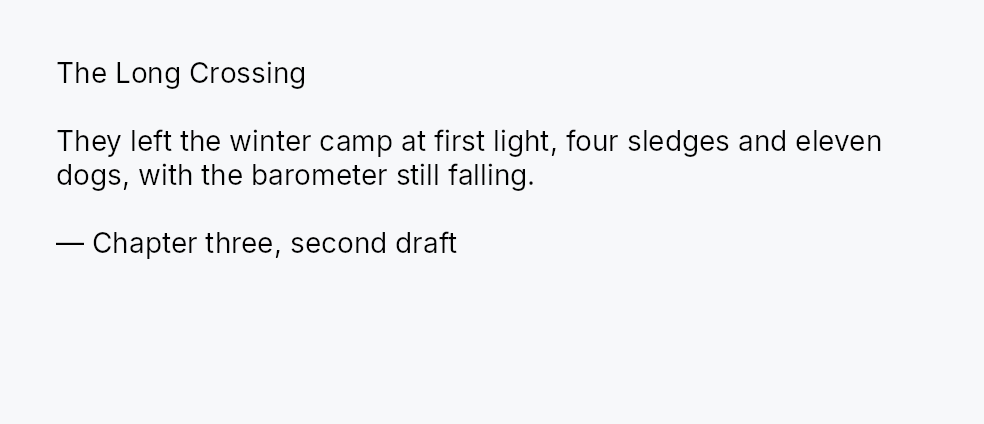

<!-- SPDX-License-Identifier: MPL-2.0 -->
<!-- SPDX-FileCopyrightText: 2026 FernTech -->

# RichTextEditor



Rich text editor and viewer widget.

## Public types

| Kind | Name |
| ---: | :--- |
| `enum` | [`ScrollPolicy`](#scrollpolicy) — Scroll bar visibility policy for `RichTextEditor`, applied independently per axis |
| `enum` | [`EditSource`](#editsource) — How a piece of text reached the document — the **channel**, not the author |
| `struct` | [`RichTextEditor`](#richtexteditor) |
| `struct` | [`EditorHandle`](#editorhandle) — A clone-able, `'static` handle to a `RichTextEditor`'s shared state |
| `struct` | [`WeakEditorHandle`](#weakeditorhandle) — An `EditorHandle` that does not keep its editor alive |
| `struct` | [`ImageActivation`](#imageactivation) — An inline image the user clicked |
| `struct` | [`EditorTextDrag`](#editortextdrag) — Rich text being dragged out of an editor |
| `struct` | [`ImageResize`](#imageresize) — A resize the reader finished dragging |

## Public functions

### `RichTextEditor`

| Returns | Function |
| ---: | :--- |
| | **Constructors** |
| `Self` | [`read_only(document: TextDocument)`](#richtexteditor-read_only) |
| `Self` | [`editor(document: TextDocument)`](#richtexteditor-editor) |
| | **Builder methods** |
| `Self` | [`label(label: impl Into<teksilo_i18n::LocalizedString>)`](#richtexteditor-label) |
| `Self` | [`style(style: impl RichTextEditorStyle)`](#richtexteditor-style) |
| `Self` | [`content_padding(amount: f32)`](#richtexteditor-content_padding) |
| `Self` | [`content_padding_symmetric(vertical: f32, horizontal: f32)`](#richtexteditor-content_padding_symmetric) |
| `Self` | [`content_padding_each(top: f32, right: f32, bottom: f32, left: f32)`](#richtexteditor-content_padding_each) |
| `Self` | [`content_padding_top(top: f32)`](#richtexteditor-content_padding_top) |
| `Self` | [`content_padding_right(right: f32)`](#richtexteditor-content_padding_right) |
| `Self` | [`content_padding_bottom(bottom: f32)`](#richtexteditor-content_padding_bottom) |
| `Self` | [`content_padding_left(left: f32)`](#richtexteditor-content_padding_left) |
| `Self` | [`wrap_mode(mode: WrapMode)`](#richtexteditor-wrap_mode) |
| `Self` | [`show_highlights(show: bool)`](#richtexteditor-show_highlights) |
| `Self` | [`annotation_spans(spans: Vec<TextAnnotationSpan>)`](#richtexteditor-annotation_spans) |
| `Self` | [`typography_defaults(defaults: EditorTypographyDefaults)`](#richtexteditor-typography_defaults) |
| `Self` | [`background(color: impl Into<ColorProp>)`](#richtexteditor-background) |
| `Self` | [`selection_color(color: impl Into<ColorProp>)`](#richtexteditor-selection_color) |
| `Self` | [`caret_color(color: impl Into<ColorProp>)`](#richtexteditor-caret_color) |
| `Self` | [`text_color(color: impl Into<ColorProp>)`](#richtexteditor-text_color) |
| `Self` | [`v_scroll_policy(policy: ScrollPolicy)`](#richtexteditor-v_scroll_policy) |
| `Self` | [`h_scroll_policy(policy: ScrollPolicy)`](#richtexteditor-h_scroll_policy) |
| `Self` | [`estimate_height_before_layout(on: bool)`](#richtexteditor-estimate_height_before_layout) |
| `Self` | [`window_to_clip(on: bool)`](#richtexteditor-window_to_clip) |
| `Self` | [`scroll_policy(policy: ScrollPolicy)`](#richtexteditor-scroll_policy) |
| `Self` | [`follow_caret_in_page(follow: bool)`](#richtexteditor-follow_caret_in_page) |
| `Self` | [`typewriter(anchor: Option<f32>)`](#richtexteditor-typewriter) |
| `Self` | [`overscroll_behavior(behavior: OverscrollBehavior)`](#richtexteditor-overscroll_behavior) |
| `Self` | [`min_lines(n: u32)`](#richtexteditor-min_lines) |
| `Self` | [`max_lines(n: u32)`](#richtexteditor-max_lines) |
| `Self` | [`follow_text_scale(follow: bool)`](#richtexteditor-follow_text_scale) |
| `Self` | [`font_size_scale(scale: f32)`](#richtexteditor-font_size_scale) |
| `Self` | [`context_menu(factory: impl Fn( teksilo_canvas::Point, &mut teksilo_core::widget::EventContext, ) -> Option<Box<dyn teksilo_core::widget::Widget>> + 'static)`](#richtexteditor-context_menu) |
| `Self` | [`default_context_menu(enabled: bool)`](#richtexteditor-default_context_menu) |
| `Self` | [`font_registrar(registrar: &dyn FontRegistrar)`](#richtexteditor-font_registrar) |
| `Self` | [`on_change(f: impl Fn() + 'static)`](#richtexteditor-on_change) |
| `Self` | [`on_text_inserted(f: impl Fn(EditSource, usize) + 'static)`](#richtexteditor-on_text_inserted) |
| `Self` | [`on_link_activated(handler: impl Fn(&str, &mut teksilo_core::widget::EventContext) + 'static)`](#richtexteditor-on_link_activated) |
| `Self` | [`on_image_missing(resolve: impl Fn(&str) -> Option<(String, Vec<u8>)> + 'static)`](#richtexteditor-on_image_missing) |
| `Self` | [`on_files_dropped(handler: impl Fn(&[std::path::PathBuf], &mut teksilo_core::widget::EventContext) + 'static)`](#richtexteditor-on_files_dropped) |
| `Self` | [`on_image_resized(handler: impl Fn(&ImageResize, &mut teksilo_core::widget::EventContext) + 'static)`](#richtexteditor-on_image_resized) |
| `Self` | [`on_image_activated(handler: impl Fn(&ImageActivation, &mut teksilo_core::widget::EventContext) + 'static)`](#richtexteditor-on_image_activated) |
| | **Methods** |
|  | [`set_highlight_mask(mask: teksilo_text::text_document::HighlightMask)`](#richtexteditor-set_highlight_mask) |
| `Signal<u64>` | [`document_version()`](#richtexteditor-document_version) |
| `usize` | [`cursor_position()`](#richtexteditor-cursor_position) |
| `usize` | [`cursor_anchor()`](#richtexteditor-cursor_anchor) |
| `bool` | [`is_composing()`](#richtexteditor-is_composing) |
| `Signal<usize>` | [`cursor_position_signal()`](#richtexteditor-cursor_position_signal) |
| `Signal<usize>` | [`cursor_anchor_signal()`](#richtexteditor-cursor_anchor_signal) |
| `Signal<bool>` | [`has_selection()`](#richtexteditor-has_selection) |
| `Signal<bool>` | [`can_undo()`](#richtexteditor-can_undo) |
| `Signal<bool>` | [`can_redo()`](#richtexteditor-can_redo) |
| `TextFormat` | [`caret_char_format()`](#richtexteditor-caret_char_format) |
| `Signal<f32>` | [`scroll_y()`](#richtexteditor-scroll_y) |
| `Signal<f32>` | [`scroll_x()`](#richtexteditor-scroll_x) |
| `Option<hit_test::ContextTarget>` | [`context_target_at(point: Point)`](#richtexteditor-context_target_at) |
| `String` | [`selected_text()`](#richtexteditor-selected_text) |
|  | [`select_all()`](#richtexteditor-select_all) |
|  | [`deselect()`](#richtexteditor-deselect) |
|  | [`insert_text(text: &str)`](#richtexteditor-insert_text) |
|  | [`insert_html(html: &str)`](#richtexteditor-insert_html) |
|  | [`insert_djot(djot: &str)`](#richtexteditor-insert_djot) |
|  | [`insert_block()`](#richtexteditor-insert_block) |
|  | [`insert_image(name: &str, alt: &str, width: u32, height: u32)`](#richtexteditor-insert_image) |
|  | [`delete_selection()`](#richtexteditor-delete_selection) |
|  | [`select_word()`](#richtexteditor-select_word) |
|  | [`select_line()`](#richtexteditor-select_line) |
|  | [`set_caret_position(position: usize)`](#richtexteditor-set_caret_position) |
| `Signal<bool>` | [`focused_signal()`](#richtexteditor-focused_signal) |
|  | [`select_range(start: usize, end: usize)`](#richtexteditor-select_range) |
| `bool` | [`reveal_range(ctx: &mut teksilo_core::widget::EventContext, start: usize, end: usize)`](#richtexteditor-reveal_range) |
|  | [`set_bold(enabled: bool)`](#richtexteditor-set_bold) |
|  | [`set_italic(enabled: bool)`](#richtexteditor-set_italic) |
|  | [`set_underline(enabled: bool)`](#richtexteditor-set_underline) |
|  | [`set_strikethrough(enabled: bool)`](#richtexteditor-set_strikethrough) |
|  | [`set_font_size(size: u32)`](#richtexteditor-set_font_size) |
|  | [`set_font_family(family: impl Into<String>)`](#richtexteditor-set_font_family) |
|  | [`toggle_bold()`](#richtexteditor-toggle_bold) |
|  | [`toggle_italic()`](#richtexteditor-toggle_italic) |
|  | [`toggle_underline()`](#richtexteditor-toggle_underline) |
|  | [`toggle_strikethrough()`](#richtexteditor-toggle_strikethrough) |
|  | [`set_superscript(enabled: bool)`](#richtexteditor-set_superscript) |
|  | [`set_subscript(enabled: bool)`](#richtexteditor-set_subscript) |
|  | [`set_vertical_alignment(alignment: CharVerticalAlignment)`](#richtexteditor-set_vertical_alignment) |
| `CharVerticalAlignment` | [`get_vertical_alignment()`](#richtexteditor-get_vertical_alignment) |
| `bool` | [`is_superscript()`](#richtexteditor-is_superscript) |
| `bool` | [`is_subscript()`](#richtexteditor-is_subscript) |
|  | [`toggle_superscript()`](#richtexteditor-toggle_superscript) |
|  | [`toggle_subscript()`](#richtexteditor-toggle_subscript) |
|  | [`apply_block_format(fmt: BlockFormat)`](#richtexteditor-apply_block_format) |
|  | [`apply_text_format(fmt: TextFormat)`](#richtexteditor-apply_text_format) |
|  | [`set_alignment(alignment: Alignment)`](#richtexteditor-set_alignment) |
|  | [`clear_direction()`](#richtexteditor-clear_direction) |
|  | [`set_direction(direction: TextDirection)`](#richtexteditor-set_direction) |
|  | [`set_heading_level(level: u8)`](#richtexteditor-set_heading_level) |
|  | [`insert_list(ordered: bool)`](#richtexteditor-insert_list) |
|  | [`create_list(style: ListStyle)`](#richtexteditor-create_list) |
|  | [`indent()`](#richtexteditor-indent) |
|  | [`outdent()`](#richtexteditor-outdent) |
|  | [`remove_from_list()`](#richtexteditor-remove_from_list) |
| `bool` | [`is_in_blockquote()`](#richtexteditor-is_in_blockquote) |
| `bool` | [`selection_spans_multiple_frames()`](#richtexteditor-selection_spans_multiple_frames) |
|  | [`toggle_blockquote()`](#richtexteditor-toggle_blockquote) |
|  | [`increase_blockquote_depth()`](#richtexteditor-increase_blockquote_depth) |
|  | [`decrease_blockquote_depth()`](#richtexteditor-decrease_blockquote_depth) |
|  | [`insert_table(rows: usize, columns: usize)`](#richtexteditor-insert_table) |
|  | [`remove_current_table()`](#richtexteditor-remove_current_table) |
|  | [`insert_row_above()`](#richtexteditor-insert_row_above) |
|  | [`insert_row_below()`](#richtexteditor-insert_row_below) |
|  | [`insert_column_before()`](#richtexteditor-insert_column_before) |
|  | [`insert_column_after()`](#richtexteditor-insert_column_after) |
|  | [`remove_current_row()`](#richtexteditor-remove_current_row) |
|  | [`remove_current_column()`](#richtexteditor-remove_current_column) |
| `bool` | [`is_in_table()`](#richtexteditor-is_in_table) |
| `bool` | [`is_bold()`](#richtexteditor-is_bold) |
| `bool` | [`is_italic()`](#richtexteditor-is_italic) |
|  | [`set_link(href: &str)`](#richtexteditor-set_link) |
|  | [`clear_link()`](#richtexteditor-clear_link) |
| `Option<LinkExtent>` | [`link_at_caret()`](#richtexteditor-link_at_caret) |
| `bool` | [`is_link()`](#richtexteditor-is_link) |
| `bool` | [`is_underline()`](#richtexteditor-is_underline) |
| `bool` | [`is_strikethrough()`](#richtexteditor-is_strikethrough) |
| `u8` | [`get_heading_level()`](#richtexteditor-get_heading_level) |
| `Alignment` | [`get_alignment()`](#richtexteditor-get_alignment) |
| `Option<TextDirection>` | [`get_direction()`](#richtexteditor-get_direction) |
|  | [`undo()`](#richtexteditor-undo) |
|  | [`break_undo_merge()`](#richtexteditor-break_undo_merge) |
|  | [`redo()`](#richtexteditor-redo) |
|  | [`begin_edit_block()`](#richtexteditor-begin_edit_block) |
|  | [`end_edit_block()`](#richtexteditor-end_edit_block) |
| `R` | [`edit_block<R>(edits: impl FnOnce() -> R)`](#richtexteditor-edit_block) |
|  | [`set_default_language(language: &str)`](#richtexteditor-set_default_language) |
| `String` | [`default_language()`](#richtexteditor-default_language) |
| `EditorHandle` | [`handle()`](#richtexteditor-handle) |
|  | [`copy(ctx: &teksilo_core::widget::EventContext)`](#richtexteditor-copy) |
|  | [`cut(ctx: &teksilo_core::widget::EventContext)`](#richtexteditor-cut) |
|  | [`paste(ctx: &teksilo_core::widget::EventContext)`](#richtexteditor-paste) |
|  | [`paste_unformatted(ctx: &teksilo_core::widget::EventContext)`](#richtexteditor-paste_unformatted) |
| `bool` | [`can_paste(ctx: &teksilo_core::widget::EventContext)`](#richtexteditor-can_paste) |
|  | [`set_font_size_scale(scale: f32)`](#richtexteditor-set_font_size_scale) |
| `f32` | [`get_font_size_scale()`](#richtexteditor-get_font_size_scale) |
|  | [`set_typography_defaults(defaults: EditorTypographyDefaults)`](#richtexteditor-set_typography_defaults) |
| `EditorTypographyDefaults` | [`get_typography_defaults()`](#richtexteditor-get_typography_defaults) |
|  | [`set_typewriter(anchor: Option<f32>)`](#richtexteditor-set_typewriter) |
| `Option<f32>` | [`get_typewriter()`](#richtexteditor-get_typewriter) |
|  | [`set_command_filter(filter: policy::CommandFilter)`](#richtexteditor-set_command_filter) |
| `policy::CommandFilter` | [`command_filter()`](#richtexteditor-command_filter) |
|  | [`set_caret_highlight(highlight: Option<caret_highlight::CaretHighlight>)`](#richtexteditor-set_caret_highlight) |
| `Option<caret_highlight::CaretHighlight>` | [`get_caret_highlight()`](#richtexteditor-get_caret_highlight) |
| `Option<teksilo_canvas::Rect>` | [`caret_window_rect()`](#richtexteditor-caret_window_rect) |
| `Signal<u64>` | [`format_version()`](#richtexteditor-format_version) |
| `Signal<u64>` | [`document_loaded_count()`](#richtexteditor-document_loaded_count) |

### `EditorHandle`

| Returns | Function |
| ---: | :--- |
| | **Methods** |
| `WeakEditorHandle` | [`downgrade()`](#editorhandle-downgrade) |
| `String` | [`to_djot()`](#editorhandle-to_djot) |
| `String` | [`to_plain_text()`](#editorhandle-to_plain_text) |
| `bool` | [`is_empty()`](#editorhandle-is_empty) |
| `Signal<bool>` | [`focused_signal()`](#editorhandle-focused_signal) |
|  | [`select_range(start: usize, end: usize)`](#editorhandle-select_range) |
|  | [`replace_range(start: usize, end: usize, text: &str)`](#editorhandle-replace_range) |
|  | [`replace_range_from(start: usize, end: usize, text: &str, source: EditSource)`](#editorhandle-replace_range_from) |
|  | [`insert_text(text: &str)`](#editorhandle-insert_text) |
| `bool` | [`add_image_resource(name: &str, mime_type: &str, bytes: &[u8])`](#editorhandle-add_image_resource) |
| `Option<(u32, u32)>` | [`image_resource_size(name: &str)`](#editorhandle-image_resource_size) |
| `bool` | [`has_image_resource(name: &str)`](#editorhandle-has_image_resource) |
|  | [`insert_djot(djot: &str)`](#editorhandle-insert_djot) |
|  | [`insert_block()`](#editorhandle-insert_block) |
| `bool` | [`insert_paragraph(text: &str)`](#editorhandle-insert_paragraph) |
| `(usize, usize)` | [`selection()`](#editorhandle-selection) |
| `String` | [`selected_text()`](#editorhandle-selected_text) |
| `Option<Rect>` | [`range_rect(start: usize, end: usize)`](#editorhandle-range_rect) |
| `Option<Rect>` | [`offset_rect(offset: usize)`](#editorhandle-offset_rect) |
| `Option<Rect>` | [`range_content_rect(start: usize, end: usize)`](#editorhandle-range_content_rect) |
| `Option<Rect>` | [`offset_content_rect(offset: usize)`](#editorhandle-offset_content_rect) |
| `Signal<u64>` | [`document_version()`](#editorhandle-document_version) |
| `Option<f32>` | [`content_height()`](#editorhandle-content_height) |
| `Option<usize>` | [`offset_at_point(window_point: Point)`](#editorhandle-offset_at_point) |
|  | [`reposition_caret_for_context_menu(window_point: Point)`](#editorhandle-reposition_caret_for_context_menu) |
| `bool` | [`reveal_range(ctx: &mut teksilo_core::widget::EventContext, start: usize, end: usize)`](#editorhandle-reveal_range) |
| `bool` | [`reveal_widget(ctx: &mut teksilo_core::widget::EventContext)`](#editorhandle-reveal_widget) |
|  | [`focus(ctx: &mut teksilo_core::widget::EventContext)`](#editorhandle-focus) |
| `TextFormat` | [`caret_char_format()`](#editorhandle-caret_char_format) |
|  | [`set_bold(enabled: bool)`](#editorhandle-set_bold) |
|  | [`set_italic(enabled: bool)`](#editorhandle-set_italic) |
|  | [`set_underline(enabled: bool)`](#editorhandle-set_underline) |
|  | [`set_strikethrough(enabled: bool)`](#editorhandle-set_strikethrough) |
|  | [`set_font_family(family: impl Into<String>)`](#editorhandle-set_font_family) |
|  | [`set_font_size(size: u32)`](#editorhandle-set_font_size) |
|  | [`set_typography_defaults(defaults: EditorTypographyDefaults)`](#editorhandle-set_typography_defaults) |
| `EditorTypographyDefaults` | [`get_typography_defaults()`](#editorhandle-get_typography_defaults) |
|  | [`set_font_size_scale(scale: f32)`](#editorhandle-set_font_size_scale) |
| `f32` | [`get_font_size_scale()`](#editorhandle-get_font_size_scale) |
|  | [`set_typewriter(anchor: Option<f32>)`](#editorhandle-set_typewriter) |
| `Option<f32>` | [`get_typewriter()`](#editorhandle-get_typewriter) |
|  | [`set_command_filter(filter: policy::CommandFilter)`](#editorhandle-set_command_filter) |
| `policy::CommandFilter` | [`command_filter()`](#editorhandle-command_filter) |
|  | [`set_caret_highlight(highlight: Option<caret_highlight::CaretHighlight>)`](#editorhandle-set_caret_highlight) |
| `Option<caret_highlight::CaretHighlight>` | [`get_caret_highlight()`](#editorhandle-get_caret_highlight) |
| `Option<teksilo_canvas::Rect>` | [`caret_window_rect()`](#editorhandle-caret_window_rect) |
|  | [`apply_text_format(fmt: TextFormat)`](#editorhandle-apply_text_format) |
|  | [`toggle_bold()`](#editorhandle-toggle_bold) |
|  | [`toggle_italic()`](#editorhandle-toggle_italic) |
|  | [`toggle_underline()`](#editorhandle-toggle_underline) |
|  | [`toggle_strikethrough()`](#editorhandle-toggle_strikethrough) |
| `bool` | [`is_bold()`](#editorhandle-is_bold) |
| `bool` | [`is_italic()`](#editorhandle-is_italic) |
|  | [`set_link(href: &str)`](#editorhandle-set_link) |
|  | [`clear_link()`](#editorhandle-clear_link) |
| `Option<LinkExtent>` | [`link_at_caret()`](#editorhandle-link_at_caret) |
| `bool` | [`is_link()`](#editorhandle-is_link) |
| `bool` | [`is_underline()`](#editorhandle-is_underline) |
| `bool` | [`is_strikethrough()`](#editorhandle-is_strikethrough) |
|  | [`set_superscript(enabled: bool)`](#editorhandle-set_superscript) |
|  | [`set_subscript(enabled: bool)`](#editorhandle-set_subscript) |
|  | [`set_vertical_alignment(alignment: CharVerticalAlignment)`](#editorhandle-set_vertical_alignment) |
| `CharVerticalAlignment` | [`get_vertical_alignment()`](#editorhandle-get_vertical_alignment) |
| `bool` | [`is_superscript()`](#editorhandle-is_superscript) |
| `bool` | [`is_subscript()`](#editorhandle-is_subscript) |
|  | [`toggle_superscript()`](#editorhandle-toggle_superscript) |
|  | [`toggle_subscript()`](#editorhandle-toggle_subscript) |
|  | [`apply_block_format(fmt: BlockFormat)`](#editorhandle-apply_block_format) |
|  | [`set_alignment(alignment: Alignment)`](#editorhandle-set_alignment) |
|  | [`clear_direction()`](#editorhandle-clear_direction) |
|  | [`set_direction(direction: TextDirection)`](#editorhandle-set_direction) |
|  | [`set_heading_level(level: u8)`](#editorhandle-set_heading_level) |
| `Alignment` | [`get_alignment()`](#editorhandle-get_alignment) |
| `Option<TextDirection>` | [`get_direction()`](#editorhandle-get_direction) |
| `u8` | [`get_heading_level()`](#editorhandle-get_heading_level) |
|  | [`insert_list(ordered: bool)`](#editorhandle-insert_list) |
|  | [`create_list(style: ListStyle)`](#editorhandle-create_list) |
|  | [`indent()`](#editorhandle-indent) |
|  | [`outdent()`](#editorhandle-outdent) |
|  | [`remove_from_list()`](#editorhandle-remove_from_list) |
| `bool` | [`is_in_blockquote()`](#editorhandle-is_in_blockquote) |
| `bool` | [`selection_spans_multiple_frames()`](#editorhandle-selection_spans_multiple_frames) |
|  | [`toggle_blockquote()`](#editorhandle-toggle_blockquote) |
|  | [`increase_blockquote_depth()`](#editorhandle-increase_blockquote_depth) |
|  | [`decrease_blockquote_depth()`](#editorhandle-decrease_blockquote_depth) |
|  | [`insert_table(rows: usize, columns: usize)`](#editorhandle-insert_table) |
|  | [`remove_current_table()`](#editorhandle-remove_current_table) |
|  | [`insert_row_above()`](#editorhandle-insert_row_above) |
|  | [`insert_row_below()`](#editorhandle-insert_row_below) |
|  | [`insert_column_before()`](#editorhandle-insert_column_before) |
|  | [`insert_column_after()`](#editorhandle-insert_column_after) |
|  | [`remove_current_row()`](#editorhandle-remove_current_row) |
|  | [`remove_current_column()`](#editorhandle-remove_current_column) |
| `bool` | [`is_in_table()`](#editorhandle-is_in_table) |
|  | [`undo()`](#editorhandle-undo) |
|  | [`break_undo_merge()`](#editorhandle-break_undo_merge) |
|  | [`redo()`](#editorhandle-redo) |
|  | [`begin_edit_block()`](#editorhandle-begin_edit_block) |
|  | [`end_edit_block()`](#editorhandle-end_edit_block) |
| `R` | [`edit_block<R>(edits: impl FnOnce() -> R)`](#editorhandle-edit_block) |
|  | [`copy(ctx: &teksilo_core::widget::EventContext)`](#editorhandle-copy) |
|  | [`cut(ctx: &teksilo_core::widget::EventContext)`](#editorhandle-cut) |
|  | [`paste(ctx: &teksilo_core::widget::EventContext)`](#editorhandle-paste) |
|  | [`paste_unformatted(ctx: &teksilo_core::widget::EventContext)`](#editorhandle-paste_unformatted) |
| `bool` | [`can_paste(ctx: &teksilo_core::widget::EventContext)`](#editorhandle-can_paste) |
|  | [`select_all()`](#editorhandle-select_all) |
|  | [`delete_selection()`](#editorhandle-delete_selection) |
| `Signal<u64>` | [`format_version()`](#editorhandle-format_version) |
| `usize` | [`cursor_position()`](#editorhandle-cursor_position) |
| `bool` | [`is_composing()`](#editorhandle-is_composing) |
| `Signal<usize>` | [`cursor_position_signal()`](#editorhandle-cursor_position_signal) |
| `Signal<usize>` | [`cursor_anchor_signal()`](#editorhandle-cursor_anchor_signal) |
| `Signal<bool>` | [`has_selection()`](#editorhandle-has_selection) |
| `Signal<bool>` | [`can_undo()`](#editorhandle-can_undo) |
| `Signal<bool>` | [`can_redo()`](#editorhandle-can_redo) |

### `WeakEditorHandle`

| Returns | Function |
| ---: | :--- |
| | **Methods** |
| `Option<EditorHandle>` | [`upgrade()`](#weakeditorhandle-upgrade) |

## Detailed description

Two construction presets share the same implementation: `RichTextEditor::editor`
provides a full editing surface (blinking caret, keyboard commands, clipboard,
undo/redo, `Role::MultilineTextInput`) and `RichTextEditor::read_only` is a
view-only surface (hidden caret, mutations rejected, `Role::Document`). Both
bind to an external `TextDocument`
via `on_change` subscriptions, so any number of editors and viewers can share
one document and observe each other's edits live.

The widget owns a per-widget `RichTextEngine` (typesetter), and drives its own
scroll bars independently of `ScrollArea` to avoid the wrap/scrollbar circular
measurement dependency. Use `RichTextEditor::min_lines` /
`RichTextEditor::max_lines` to switch from greedy sizing to intrinsic
(messenger-composer) sizing. A detachable `EditorHandle` lets toolbars and
palette panels issue formatting commands from closures that cannot borrow the
editor directly.

```ignore
use teksilo_text::text_document::TextDocument;
let doc = TextDocument::new();
let editor = RichTextEditor::editor(doc)
    .min_lines(3)
    .max_lines(8)
    .wrap_mode(WrapMode::Word);
```

#### Pan to scroll

The surface installs `common::scrollable::ScrollableBehavior`
— the shared wheel arithmetic, a finger's pan, and the `PanClaim`. The wheel
path is unchanged: no tween (these offsets are plain signals), 16 dp a line,
`Ignored` at a hard boundary so the page around it takes the rest, and a
repaint asked for exactly when an axis moved.

**The claim serves this surface even though it also owns the press
arena**, which its double- and triple-tap recognizers give it. The router
stops its arbitration walk at the press owner only for a `Gesture` member,
whose recognizer the capture dispatch is already driving; a `Pan` member is
decided in that walk and nowhere else, so it is exempt. A finger on the
text therefore scrolls the text, and hands the gesture outward only at this
surface's own boundary. See `docs/kinetic-scrolling.md` §10.1.

## Density

The picture above is the widget at `TargetDensity::Compact`, the mouse-and-keyboard ladder. Below is the same subject on the same canvas with only the ladder changed, so what moves is the density and nothing else — where the subject no longer fits, that is what the denser targets cost it at that size. See `docs/density-and-targets.md`.

**Touch**


## API reference

📖 [Full rustdoc API for this module](https://docs.rs/teksilo-widgets/latest/teksilo_widgets/rich_text/index.html)

<a id="scrollpolicy"></a>

## `pub enum ScrollPolicy`

Scroll bar visibility policy for `RichTextEditor`, applied independently per axis.

```rust
pub enum ScrollPolicy { /* variants */ }
```

### Variants

- **`Auto`** — Show the scroll bar only when content overflows the visible area (default).
- **`AlwaysOn`** — Always show the scroll bar, reserving gutter space even when content fits.
- **`AlwaysOff`** — Never show the scroll bar; useful when embedding the editor inside an outer `ScrollArea` or in headless tests.

<a id="editsource"></a>

## `pub enum EditSource`

How a piece of text reached the document — the **channel**, not the author.

Deliberately framework-generic, and deliberately small. These are the routes
a toolkit can actually observe: which input path the characters came down.
What that *means* is the application's to decide, and every application will
decide differently — a writing tool cares that dictation is not typing, a
code editor cares that a snippet is not either, and a form cares about none
of it. Teksilo says what it saw; it does not interpret.

⚠ **Not evidence of who wrote anything.** Text typed one character at a time
was typed one character at a time, and that is the entire claim. Anything
further — who, or whether a person at all — is an inference this cannot make
and no consumer of it should pretend to.

```rust
pub enum EditSource { /* variants */ }
```

### Variants

- **`Keyboard`** — Typed, one key at a time.
- **`Ime`** — The settled result of an IME composition — CJK/Kana candidate selection, a dead-key accent. Separate from `Self::Keyboard` because the characters that land are not the keys that were pressed.
- **`Clipboard`** — Pasted, as plain text or as HTML.
- **`Accessibility`** — Arrived through an assistive technology: AccessKit's `SetValue` or `ReplaceSelectedText`, which is how dictation and a braille display write.  **Never folded into `Self::Keyboard`.** For some people this *is* typing, and a toolkit that reported it as something else — or as nothing — would be quietly erasing how they work.
- **`Programmatic`** — Inserted by the application itself rather than by anything the person at the keyboard did: a template, a substitution, a completion.

<a id="richtexteditor"></a>

## `pub struct RichTextEditor`

```rust
pub struct RichTextEditor { /* fields */ }
```

### Methods

<a id="richtexteditor-read_only"></a>

#### `pub fn read_only(document: TextDocument) -> Self`

Construct a read-only rich text viewer bound to `document`. The
document can also back an editable `RichTextEditor::editor` in
another part of the UI — both widgets receive document events
independently via `on_change` subscriptions.

<a id="richtexteditor-editor"></a>

#### `pub fn editor(document: TextDocument) -> Self`

Construct an editable rich text editor bound to `document`.
Uses the full editor preset: every command accepted, caret
blinks, `MultilineTextInput` accessibility role, full clipboard
support. Multiple editors on the same document share live edits
via per-widget `on_change` subscriptions.

<a id="richtexteditor-label"></a>

#### `pub fn label(mut self, label: impl Into<teksilo_i18n::LocalizedString>) -> Self`

Accessible name for the editor.

Applied to the body that holds the text, which is the node focus is
published on and the one a screen reader announces: "Notes, entry" for
an editor, "Chapter one, document" for a viewer. The editor's own node
is structure that no adapter shows. An `.access_label(..)`,
`.access_labelled_by(..)` or tooltip attached to the editor reaches the
same node.

Stays locale-reactive: a `tr!(...)` name is re-resolved when the
locale changes, without a rebuild.

<a id="richtexteditor-style"></a>

#### `pub fn style(mut self, style: impl RichTextEditorStyle) -> Self`

Per-call style override for the editor chrome (border, padding,
focus ring). Replaces the theme-wide
`style_slots.rich_text_editor` and the IntUI default
`RecipeRichTextEditorStyle` for just this editor.

<a id="richtexteditor-content_padding"></a>

#### `pub fn content_padding(mut self, amount: f32) -> Self`

Set a uniform padding (logical pixels) between the text content
and the editor's chrome. Replaces the style's default insets
(TextInput-style for editable, none for read-only). Use
`content_padding_symmetric` or
`content_padding_each` for
per-axis / per-edge control.

<a id="richtexteditor-content_padding_symmetric"></a>

#### `pub fn content_padding_symmetric(mut self, vertical: f32, horizontal: f32) -> Self`

Set vertical and horizontal padding (logical pixels) between the
text content and the editor's chrome. Replaces the style's
default insets.

<a id="richtexteditor-content_padding_each"></a>

#### `pub fn content_padding_each(mut self, top: f32, right: f32, bottom: f32, left: f32) -> Self`

Set per-edge padding `(top, right, bottom, left)` between the
text content and the editor's chrome. Replaces the style's
default insets.

<a id="richtexteditor-content_padding_top"></a>

#### `pub fn content_padding_top(mut self, top: f32) -> Self`

Set just the top inset between the text and the chrome. Leaves
the other edges at their previously-set values, defaulting to
`0.0` for any edge never touched.

<a id="richtexteditor-content_padding_right"></a>

#### `pub fn content_padding_right(mut self, right: f32) -> Self`

Set just the right inset between the text and the chrome.

<a id="richtexteditor-content_padding_bottom"></a>

#### `pub fn content_padding_bottom(mut self, bottom: f32) -> Self`

Set just the bottom inset between the text and the chrome.

<a id="richtexteditor-content_padding_left"></a>

#### `pub fn content_padding_left(mut self, left: f32) -> Self`

Set just the left inset between the text and the chrome.

<a id="richtexteditor-wrap_mode"></a>

#### `pub fn wrap_mode(self, mode: WrapMode) -> Self`

Set the line-wrap mode. `WrapMode::Word` (the default) wraps at word
boundaries; `WrapMode::None` allows horizontal overflow — pair with
`.h_scroll_policy(ScrollPolicy::Auto)` to expose a scroll bar.

<a id="richtexteditor-show_highlights"></a>

#### `pub fn show_highlights(self, show: bool) -> Self`

Whether this view applies the document's syntax / search / spell
highlighting. `editor` defaults to `true`; `read_only` defaults to
`false` (a bare preview). A highlights-off view pulls a *clean*
snapshot (no highlights at all, even metric ones like keyword bold) and
ignores paint-only highlight events entirely, so it does zero work when
the shared document's search/spell highlights change.

<a id="richtexteditor-annotation_spans"></a>

#### `pub fn annotation_spans(self, spans: Vec<TextAnnotationSpan>) -> Self`

Declare the annotations (comment threads) covering ranges of this
document, for the **accessibility tree only**.

Each span becomes a `Role::Comment` node, and every `Role::TextRun` it
covers points at it through AccessKit's `details` relation — the W3C
annotations pattern, and the reason a screen reader can say "has comment"
and let the user navigate in rather than reciting the thread every time the
caret crosses the span.

Painting is a separate concern: a highlight session draws the underline. A
highlight carries no text and this carries no colour, so neither is
derivable from the other and both are supplied independently.

<a id="richtexteditor-set_highlight_mask"></a>

#### `pub fn set_highlight_mask(&self, mask: teksilo_text::text_document::HighlightMask)`

Set which highlight sessions **this view** renders, at runtime.

`HighlightMask::all` shows every
session on the document (the default);
`HighlightMask::only` shows a
chosen set — which is how a per-editor find banner
keeps one pane's find highlighting out of another pane over the same document.
`show_highlights(false)` still overrides this to nothing.

Forces a re-pull on the next tick so the change is visible immediately.

<a id="richtexteditor-typography_defaults"></a>

#### `pub fn typography_defaults(self, defaults: EditorTypographyDefaults) -> Self`

Set the initial non-destructive default typography (font family / line
height / first-line indent) applied to runs and blocks that carry no
explicit override. Applied before the first layout. These are display
defaults — they never mutate the bound document (no undo entry, no
`modified`); use `set_typography_defaults`
or `EditorHandle::set_typography_defaults` to change them after mount.
Preferred text size is `font_size_scale`.

<a id="richtexteditor-background"></a>

#### `pub fn background(self, color: impl Into<ColorProp>) -> Self`

Override the editor background fill. Accepts a `Color`, a theme role
(`SurfaceRole::Content`, …), or a `Signal`. Threaded into the active
`RichTextEditorStyle`'s `make_body`, so the common case ("give the
editor a surface") needs no custom style. `None` uses the style's
default surface.

<a id="richtexteditor-selection_color"></a>

#### `pub fn selection_color(self, color: impl Into<ColorProp>) -> Self`

Override the selection-highlight color. Accepts a `Color`, theme role,
or `Signal`. Resolved against the active theme on every paint; `None`
uses the engine/theme default.

<a id="richtexteditor-caret_color"></a>

#### `pub fn caret_color(self, color: impl Into<ColorProp>) -> Self`

Override the caret / insertion-point color. Accepts a `Color`, theme
role, or `Signal`. Resolved against the active theme on every paint;
`None` tracks the theme's `editor_caret` role.

<a id="richtexteditor-text_color"></a>

#### `pub fn text_color(self, color: impl Into<ColorProp>) -> Self`

Override the default text color. Accepts a `Color`, theme role, or
`Signal`. Resolved against the active theme on every paint; `None`
tracks the theme's `editor_fg` role (so dark / light swaps follow
automatically). A role or `Signal` stays reactive; a bare `Color` pins
it.

<a id="richtexteditor-v_scroll_policy"></a>

#### `pub fn v_scroll_policy(mut self, policy: ScrollPolicy) -> Self`

Set the vertical scroll-bar visibility policy.

<a id="richtexteditor-h_scroll_policy"></a>

#### `pub fn h_scroll_policy(mut self, policy: ScrollPolicy) -> Self`

Set the horizontal scroll-bar visibility policy.

<a id="richtexteditor-estimate_height_before_layout"></a>

#### `pub fn estimate_height_before_layout(self, on: bool) -> Self`

Window paint-time culling to the accumulated ancestor clip rather than
this editor's own bounds.

Enable this **only** for an editor deliberately laid out at its full
document height inside an outer `ScrollArea`
(`v_scroll_policy(ScrollPolicy::AlwaysOff)`, no `max_lines`) — "dubious
mode". Such an editor's own viewport spans the whole document, so the
viewport-derived render cull keeps nothing; this makes it cull to the
visible clip band instead, so a huge document only rasterizes the rows on
screen. Correct under nested ScrollAreas (the clip is the intersection of
all clipping ancestors), and positioning / hit-testing are unaffected.

A normal self-scrolling editor already culls correctly from its own scroll
offset and doesn't need this — leave it **off** (the default). (The window
is computed relative to the editor's own scroll offset as well, so enabling
it on a self-scroller degrades to a correct-but-redundant cull rather than
rendering the wrong rows.)
Guess this editor's height from its text until something has laid it out.

`content_height()` is `0` until `layout_full` has run, and that waits for the
editor to have been through a frame on screen. The zero falls through to the
`min_lines` floor, so an editor that has never been shown claims the same few
lines whatever it holds.

For an editor that **is** on screen that is invisible — it lays out on the
first frame and the floor never shows. Turn this on for one that may not be:
a row of a long column, most of which is below the fold. There the page's
height is the sum of its rows' claims, so the scroll extent starts wrong by an
order of magnitude and settles a row at a time as the reader arrives — and
anything drawing that extent draws the settling.

Off by default, deliberately. The estimate is crude by construction, and an
editor that lays out immediately gains nothing from it while every consumer of
its first-frame size pays for the guess — including the windowed-render path,
whose culling is derived from the editor's own bounds.

Never a floor: it goes through the same clamp a real height does, so
`max_lines` still caps it and an over-estimate corrects downwards when the
layout lands.

<a id="richtexteditor-window_to_clip"></a>

#### `pub fn window_to_clip(self, on: bool) -> Self`

<a id="richtexteditor-scroll_policy"></a>

#### `pub fn scroll_policy(mut self, policy: ScrollPolicy) -> Self`

Set the same scroll-bar visibility policy on both axes.

<a id="richtexteditor-follow_caret_in_page"></a>

#### `pub fn follow_caret_in_page(self, follow: bool) -> Self`

Whether moving the caret also scrolls any *enclosing* scroll area to
keep the caret on screen — the standard editor "caret stays visible as
you type / navigate" behaviour. **On by default.**

It fires only on a caret *move*, never on a plain wheel / scrollbar
scroll, so the reader can still scroll freely away from the caret and the
view holds until the caret next moves. This is what makes an editor that
**grows** to its content with its own scroll suppressed (a flowing page
inside an outer `ScrollArea`) track the caret at all — there the editor's
internal caret-visibility is a no-op, so the enclosing-page follow is the
only mechanism that reveals the caret. Pass `false` for the rare layout
where a caret change must never move the surrounding page.

<a id="richtexteditor-typewriter"></a>

#### `pub fn typewriter(self, anchor: Option<f32>) -> Self`

**Typewriter scrolling**: pin the caret's line at `fraction` of the way
down the enclosing scroll area — `0.0` at the top, `0.5` centred, `1.0`
at the bottom — and let the document scroll under it. `None` (the
default) leaves the ordinary minimal-reveal follow in charge.

Unlike that follow, which only acts once the caret would leave the
viewport, a pin re-asserts on every caret move, so the line being written
holds a constant height on screen. The classic writing-app feature.

Three behaviours come with it, each of them the consensus answer among
the editors that ship this well:

- **The pointer stands the pin down.** A click places the caret without
  scrolling, and that position becomes the new resting place; a
  drag-selection is never interrupted. The next keystroke resumes
  pinning. Editors that re-centre on pointer input instead have open bugs
  about the view fighting the mouse and about drag-selection becoming
  unusable.
- **The rendered row is pinned, not the paragraph.** Under soft wrap a
  long paragraph spans several visual rows; pinning the logical line
  would leave the caret far from the mark.
- **Typing snaps, page jumps glide.** Animating a pin that updates on
  every keystroke is what produces the "screen bouncing" complaint other
  implementations attract.

Requires `follow_caret_in_page` (on by
default). `fraction` is clamped to `0.0..=1.0`.

Near the start of the document the pin gives way to the scroll range —
the caret rides above its line until there is room — and near the end it
would do the same, which is usually not what you want: pair this with
`ScrollArea::scroll_past_end(1.0 - fraction)` so the last line can still
reach the pin.

Takes a plain value, like `typography_defaults`;
to follow a setting live, push changes onto the handle with
`EditorHandle::set_typewriter`.

<a id="richtexteditor-overscroll_behavior"></a>

#### `pub fn overscroll_behavior(mut self, behavior: OverscrollBehavior) -> Self`

Set the wheel scroll-chaining behavior at the editor's boundary
(default `OverscrollBehavior::Chain`). With `Chain`, a wheel event the
editor can no longer absorb (already at the top/bottom, or content that
fits so there is nothing to scroll) is declined so it bubbles to an
ancestor scrollable — an editor embedded in a scrolling form/page lets
the page scroll once the editor reaches its edge.
`OverscrollBehavior::Contain` keeps the event at the editor instead.
Mirrors the identical knob on `ScrollArea` / `ListView` / `TableView` /
`GridView`.

<a id="richtexteditor-min_lines"></a>

#### `pub fn min_lines(mut self, n: u32) -> Self`

Set a minimum height (in lines of text) for the editor's
**intrinsic** size.

Setting either `min_lines` or `max_lines`
switches the editor from greedy sizing (consume the
proposal) to intrinsic sizing: `size_that_fits` returns
`clamp(content_height, min_lines × line_height, max_lines × line_height)`
for the dimension the parent leaves unspecified. A parent
like `VStack` proposes unbounded height to non-Expand
children, so the editor lands at its intrinsic height —
exactly the messenger-composer / chat-input pattern.

A parent that *forces* the height (e.g. `FixedSize`) wins
regardless. This is intentional and matches Teksilo's
general layout discipline: parents always have the final
say on the dimensions they pin.

`min_lines` measures the *visible text area*, not the outer
widget — `min_lines(1)` reports a height equal to one line
of text at the typesetter's default font + size, even
before the document has any content.

<a id="richtexteditor-max_lines"></a>

#### `pub fn max_lines(mut self, n: u32) -> Self`

Set a maximum height (in lines of text) for the editor's
intrinsic size. Past this cap the vertical scroll bar
absorbs further content growth.

See `min_lines` for the intrinsic-mode
switch and the parent-proposal interaction. `max_lines`
measures the visible text area, not the outer widget.

<a id="richtexteditor-follow_text_scale"></a>

#### `pub fn follow_text_scale(self, follow: bool) -> Self`

Whether this editor's text grows with the global accessibility text
scale (`ctx.text_scale`). Defaults to `true` — like every other text
surface, the editor magnifies when the user raises the app-wide text
size. Pass `false` for an editor whose font sizes are **document
content** (a WYSIWYG / print-layout editor) that must stay at its true
point size regardless of the reader's UI accessibility setting.

Composed with `font_size_scale`:  
`engine.font_scale = (follow ? text_scale : 1.0) × font_size_scale`.

<a id="richtexteditor-font_size_scale"></a>

#### `pub fn font_size_scale(self, scale: f32) -> Self`

Per-editor logical font-size multiplier (`1.0` = 100 %). Applied
*before* shaping (same channel as accessibility text scale), so text
grows, re-wraps, and stays sharp — the knob for a "Text size"
preference. Composed as
`(follow_text_scale ? ctx.text_scale : 1.0) × font_size_scale`.
Clamped to `[0.1, 10.0]`. Use `set_font_size_scale`
after mount.

<a id="richtexteditor-context_menu"></a>

#### `pub fn context_menu( mut self, factory: impl Fn( teksilo_canvas::Point, &mut teksilo_core::widget::EventContext, ) -> Option<Box<dyn teksilo_core::widget::Widget>> + 'static, ) -> Self`

Replace the built-in right-click context menu with a
user-provided factory. Same shape as the framework's
`teksilo_core::widget_builder::ContextMenuFactory`: the
closure receives the click position (widget-local) and a full
`EventContext`, and returns
`Some(menu_widget)` to mount or `None` to decline (falling
through to the next ancestor with a factory).

Taking this branch disables the default menu unconditionally.
The framework's
`show_context_menu_for` handles
the overlay lifecycle (open at pointer, dismiss on
click-outside / Escape, focus-restore on dismiss), so the
factory only needs to build the menu content.

This is an **inherent method**: it shadows the blanket
`WidgetBuilder::context_menu`
trait method so the user can chain it directly on the editor.
Internally, the factory is installed on the editor's arena
node via the same `HandlerSet::context_menu` plumbing.

<a id="richtexteditor-default_context_menu"></a>

#### `pub fn default_context_menu(mut self, enabled: bool) -> Self`

Enable (default) or disable the widget's built-in right-click
context menu (Cut / Copy / Paste / Paste Unformatted / Select
All). When disabled, right-click bubbles past the widget
unhandled and
`context_target_at` stays
available for applications that render their own menu.

Note: if a user factory is installed via
`context_menu`, that factory wins
regardless of this flag — this setter only governs the
*default* menu.

<a id="richtexteditor-font_registrar"></a>

#### `pub fn font_registrar(self, registrar: &dyn FontRegistrar) -> Self`

Install a custom font registrar for the fallback private
engine. Only has effect when the editor is built outside a
windowed teksilo-app — once `build()` sees a `SharedTypesetter`
in `app_state`, the private engine is replaced with one that
shares the app's typesetter and this registrar is ignored.

<a id="richtexteditor-on_change"></a>

#### `pub fn on_change(self, f: impl Fn() + 'static) -> Self`

Install a callback fired once per batch of genuine **user content
edits** (typing, paste, cut, delete) — and *not* on a programmatic
`set_djot` / `set_markdown` / `set_html` load or a document reset, and
*not* while an IME composition (CJK/Kana candidate preview, dead-key
accent) is still in progress — only the settled result of a commit
fires it. The callback runs on the UI thread during the editor's frame
drain, so it may touch `Signal`s directly — e.g. flip a "dirty" flag or
kick a debounced autosave. Replaces any prior change callback on this
editor.

For a reactive change *token* (which also bumps on loads/format-only
changes, and on intermediate IME composition steps), observe
`document_version` instead.

<a id="richtexteditor-on_text_inserted"></a>

#### `pub fn on_text_inserted(self, f: impl Fn(EditSource, usize) + 'static) -> Self`

Install a callback fired **at each insertion**, with the
`EditSource` the text came through and how many characters it was.

Additive to `on_change` rather than a replacement for
it, because they answer different questions. `on_change` fires once per
drain batch and says *that* the document changed — the right shape for a
dirty flag and a debounced autosave, and the wrong one for counting: a
batch can carry a typed run and a paste, and after the fact nothing can
tell them apart.

**Reported where the text is, not derived afterwards.** Every site below
holds the literal `&str` about to be inserted, so the count is what was
actually written rather than a position delta — which is a different
number the moment an insertion replaces a selection.

Fires for text arriving through:

- the keyboard, once per batched run of typed characters;
- an IME commit, once for the settled result and never for the
  intermediate composition states;
- a paste, of plain text or HTML;
- an assistive technology, through AccessKit's `SetValue` and
  `ReplaceSelectedText`.

It does **not** fire for a programmatic `set_djot` / `set_markdown` /
`set_html` load, for undo or redo, or for a format-only change: none of
those is text arriving.

Replaces any prior callback on this editor. Runs on the UI thread.

<a id="richtexteditor-document_version"></a>

#### `pub fn document_version(&self) -> Signal<u64>`

Reactive counter that bumps on every document change (content edits,
format changes, load events). Starts at `0`. Use as a change token to
invalidate external caches.

<a id="richtexteditor-cursor_position"></a>

#### `pub fn cursor_position(&self) -> usize`

Current cursor position in the document, in character units.
Exposed for tests and for applications that need to mirror the
caret position externally (status bar, outline panel, etc.).

<a id="richtexteditor-cursor_anchor"></a>

#### `pub fn cursor_anchor(&self) -> usize`

Current selection anchor (equal to `cursor_position` when there
is no selection).

<a id="richtexteditor-is_composing"></a>

#### `pub fn is_composing(&self) -> bool`

`true` while an IME composition (CJK/Kana candidate preview, dead-key
accent) is actively in progress — i.e. `on_change`
is currently suppressed for this editor. Exposed so a caller doing its
own while-typing scanning (e.g. an autocorrect feature) can gate its
own trigger logic the same way, as defense-in-depth alongside
`on_change`'s own gate.

<a id="richtexteditor-cursor_position_signal"></a>

#### `pub fn cursor_position_signal(&self) -> Signal<usize>`

Reactive cursor position signal. Observers fire whenever the
cursor moves (arrow keys, click, Home/End, …). Useful for
status bars and tests.

<a id="richtexteditor-cursor_anchor_signal"></a>

#### `pub fn cursor_anchor_signal(&self) -> Signal<usize>`

Reactive selection anchor signal.

<a id="richtexteditor-has_selection"></a>

#### `pub fn has_selection(&self) -> Signal<bool>`

Reactive signal — `true` whenever the editor has a non-empty
selection. Updates synchronously after every cursor mutation.

<a id="richtexteditor-can_undo"></a>

#### `pub fn can_undo(&self) -> Signal<bool>`

Reactive undo-availability signal, suitable for toolbar button
enable-state. Updated through the frame loop's debounce drain
so toolbars don't flicker during rapid editing.

<a id="richtexteditor-can_redo"></a>

#### `pub fn can_redo(&self) -> Signal<bool>`

Reactive redo-availability signal.

<a id="richtexteditor-caret_char_format"></a>

#### `pub fn caret_char_format(&self) -> TextFormat`

Read the current character format at the widget's caret —
the right source for toolbars that mirror bold/italic/underline
state.

When a selection is active, the format is read from
`selection_start()`
rather than `position()`.
Rationale (matches godot-rich-text's `query_char_format`):
`position()` lands at the **end** of the selection and may fall
on a run with different formatting (or past the last character,
on an empty virtual element) — a toolbar observing that value
would flicker or lie. `selection_start()` always points at the
first character of the selected range, so the reading is
stable and matches what a user would expect from "tell me the
format of what I have selected."

<a id="richtexteditor-scroll_y"></a>

#### `pub fn scroll_y(&self) -> Signal<f32>`

Reactive vertical scroll offset in logical pixels. Bind to a
scroll bar or observe for scroll-position persistence.

<a id="richtexteditor-scroll_x"></a>

#### `pub fn scroll_x(&self) -> Signal<f32>`

Reactive horizontal scroll offset in logical pixels. Non-zero
only when `wrap_mode` is `WrapMode::None`.

<a id="richtexteditor-context_target_at"></a>

#### `pub fn context_target_at(&self, point: Point) -> Option<hit_test::ContextTarget>`

Classify what is under `point` in the widget's local coordinates
(origin at the widget's top-left, scroll offset handled
internally by the typesetter), for applications building an
external context menu. Returns `None` if the point does not
land on any hit region.

<a id="richtexteditor-selected_text"></a>

#### `pub fn selected_text(&self) -> String`

Currently selected text, or an empty string if nothing is selected.

<a id="richtexteditor-select_all"></a>

#### `pub fn select_all(&self)`

Select the entire document programmatically. Equivalent to
the final step of the Ctrl+A ladder; resets the ladder state
so a subsequent Ctrl+A starts fresh at level 1.

<a id="richtexteditor-deselect"></a>

#### `pub fn deselect(&self)`

Clear any current selection.

<a id="richtexteditor-insert_text"></a>

#### `pub fn insert_text(&self, text: &str)`

Insert plain text at the widget's caret. Replaces any selection.

<a id="richtexteditor-insert_html"></a>

#### `pub fn insert_html(&self, html: &str)`

Insert a fragment parsed from HTML at the widget's caret.
Replaces any selection. Uses text-document's
`TextCursor::insert_html`,
which parses the HTML into a `DocumentFragment` and inserts it.

<a id="richtexteditor-insert_djot"></a>

#### `pub fn insert_djot(&self, djot: &str)`

Insert a fragment parsed from djot at the widget's caret.
Replaces any selection. Uses text-document's
`TextCursor::insert_djot`,
which parses the djot into a `DocumentFragment` and inserts it — so
unlike `insert_text`, block-level source really
does produce new blocks rather than literal newlines in one paragraph.

<a id="richtexteditor-insert_block"></a>

#### `pub fn insert_block(&self)`

Split the current block at the widget's caret, as pressing Enter does.

<a id="richtexteditor-insert_image"></a>

#### `pub fn insert_image(&self, name: &str, alt: &str, width: u32, height: u32)`

Insert an inline image by logical resource name. `width` and
`height` are in logical pixels.

`alt` is the image's accessible description and its export representation. It is
passed straight through rather than defaulted here: the caller is the only layer
that knows what the picture shows, and an empty string chosen on its behalf would
be an accessibility decision made silently by a widget wrapper.

<a id="richtexteditor-delete_selection"></a>

#### `pub fn delete_selection(&self)`

Delete the current selection. No-op when nothing is selected.

<a id="richtexteditor-select_word"></a>

#### `pub fn select_word(&self)`

Select the word under the widget's caret.

<a id="richtexteditor-select_line"></a>

#### `pub fn select_line(&self)`

Select the paragraph / block under the widget's caret.

<a id="richtexteditor-set_caret_position"></a>

#### `pub fn set_caret_position(&self, position: usize)`

Move the caret to an absolute character position. Collapses any
existing selection (passes `MoveMode::MoveAnchor`). Resets
`CursorAffinity` to `Downstream` — programmatic placement
can't know whether the caller wanted the upstream side of a
wrap boundary, so we default to the same placement that
existed before affinity was introduced.

<a id="richtexteditor-focused_signal"></a>

#### `pub fn focused_signal(&self) -> Signal<bool>`

Reactive signal — `true` while **this** editor holds keyboard focus.

A per-editor find banner (Ctrl+F) targets whichever editor is focused, and the split
view has two of them; `focused_side` only names the Primary/Secondary *pane*, not which
editor. This is the per-editor answer, mirroring `has_selection`.

<a id="richtexteditor-select_range"></a>

#### `pub fn select_range(&self, start: usize, end: usize)`

Select the character range ``start, end)`, **without** collapsing — unlike
[`set_caret_position``, which always moves both ends together.

The anchor lands at `start` and the caret (focus) at `end`, so the standard selection
highlight marks the range and a subsequent replace acts on it. Used to select a search
match. (The non-collapsing two-call shape is the same one the AccessKit
`SetTextSelection` handler uses.)

<a id="richtexteditor-reveal_range"></a>

#### `pub fn reveal_range( &self, ctx: &mut teksilo_core::widget::EventContext, start: usize, end: usize, ) -> bool`

Scroll the character range ``start, end)` into view within the enclosing scroll area.

Reveals an **arbitrary** offset range — the current search match — rather than the live
caret the follow-into-view path tracks, and works whether or not the editor is focused.

**Returns whether it could.** `false` means this editor has no layout to locate the
range in — never laid out, or parked dormant in a tab that is not on screen — and
nothing was requested. A caller holding several editors over one document (two split
panes; a stream row and that row's own tab) must try the next rather than take the
first as the answer: revealing through a dormant one silently does nothing, which
reads as "the viewport does not follow".

Under [`typewriter`` scrolling the range is *pinned* to
the anchor rather than merely revealed, so a search walks matches to the
same height the caret writes at instead of leaving them wherever they
happened to fall. Because a search jump is a deliberate, screen-sized
move, it glides.

<a id="richtexteditor-set_bold"></a>

#### `pub fn set_bold(&self, enabled: bool)`

Apply **bold** to the current selection. A no-op when nothing is
selected — the document model has no typing format. Pairs with
`is_bold` and `toggle_bold`.

<a id="richtexteditor-set_italic"></a>

#### `pub fn set_italic(&self, enabled: bool)`

Apply *italic* to the current selection.

<a id="richtexteditor-set_underline"></a>

#### `pub fn set_underline(&self, enabled: bool)`

Apply underline to the current selection.

<a id="richtexteditor-set_strikethrough"></a>

#### `pub fn set_strikethrough(&self, enabled: bool)`

Apply strikethrough to the current selection.

<a id="richtexteditor-set_font_size"></a>

#### `pub fn set_font_size(&self, size: u32)`

Set the font size (in points) for the current selection.

<a id="richtexteditor-set_font_family"></a>

#### `pub fn set_font_family(&self, family: impl Into<String>)`

Set the font family for the current selection. `family` must be
a name resolvable by the shared typesetter's font registrar.

<a id="richtexteditor-toggle_bold"></a>

#### `pub fn toggle_bold(&self)`

Toggle bold on the current selection, reading the current state
via `caret_char_format`. Matches the
Ctrl+B keyboard shortcut's behaviour.

<a id="richtexteditor-toggle_italic"></a>

#### `pub fn toggle_italic(&self)`

Toggle italic; see `toggle_bold`.

<a id="richtexteditor-toggle_underline"></a>

#### `pub fn toggle_underline(&self)`

Toggle underline; see `toggle_bold`.

<a id="richtexteditor-toggle_strikethrough"></a>

#### `pub fn toggle_strikethrough(&self)`

Toggle strikethrough; see `toggle_bold`.

<a id="richtexteditor-set_superscript"></a>

#### `pub fn set_superscript(&self, enabled: bool)`

Raise the selection to superscript, or drop it back to the baseline.

<a id="richtexteditor-set_subscript"></a>

#### `pub fn set_subscript(&self, enabled: bool)`

Lower the selection to subscript, or drop it back to the baseline.

<a id="richtexteditor-set_vertical_alignment"></a>

#### `pub fn set_vertical_alignment(&self, alignment: CharVerticalAlignment)`

Set the selection's vertical alignment directly. `Normal` is the
baseline; `Middle` exists in the model but has no toolbar affordance.

<a id="richtexteditor-get_vertical_alignment"></a>

#### `pub fn get_vertical_alignment(&self) -> CharVerticalAlignment`

The caret's vertical alignment, `Normal` when unset.

<a id="richtexteditor-is_superscript"></a>

#### `pub fn is_superscript(&self) -> bool`

True while the caret sits in superscript text.

<a id="richtexteditor-is_subscript"></a>

#### `pub fn is_subscript(&self) -> bool`

True while the caret sits in subscript text.

<a id="richtexteditor-toggle_superscript"></a>

#### `pub fn toggle_superscript(&self)`

Flip superscript on the selection. Turning it on replaces subscript.

<a id="richtexteditor-toggle_subscript"></a>

#### `pub fn toggle_subscript(&self)`

Flip subscript on the selection. Turning it on replaces superscript.

<a id="richtexteditor-apply_block_format"></a>

#### `pub fn apply_block_format(&self, fmt: BlockFormat)`

Set an arbitrary `BlockFormat` on the caret's current block.
The higher-level helpers `set_alignment`
and `set_heading_level` go through
this method. Exposed so apps that need less common fields
(`indent`, `left_margin`, `line_height`, …) don't have to
reach through `TextDocument::cursor()` and lose the widget's
caret continuity.

<a id="richtexteditor-apply_text_format"></a>

#### `pub fn apply_text_format(&self, fmt: TextFormat)`

Set an arbitrary `TextFormat` on the current selection.
Public counterpart of the private `apply_char_format` helper,
for apps that need fields beyond the dedicated
`set_bold` / `set_italic` / … setters (e.g. `letter_spacing`,
`foreground_color`).

<a id="richtexteditor-set_alignment"></a>

#### `pub fn set_alignment(&self, alignment: Alignment)`

Set the paragraph alignment for the current block (or the block
containing the selection anchor).

<a id="richtexteditor-clear_direction"></a>

#### `pub fn clear_direction(&self)`

Unset the block's direction, handing the paragraph back to
automatic detection.

Not the same as setting left-to-right. An explicit direction
*pins* the paragraph and overrides the bidi algorithm, so
"clearing" a direction by writing `LeftToRight` would force
Arabic and Hebrew prose to lay out backwards. Only an unset
direction lets the text speak for itself.

<a id="richtexteditor-set_direction"></a>

#### `pub fn set_direction(&self, direction: TextDirection)`

Set the base reading direction of the current block.

This is the *paragraph* direction, not a character property: it
decides which edge unaligned text sits against and, more
importantly, overrides the bidi algorithm's first-strong-character
guess — which misreads an Arabic paragraph opening with a Latin
acronym as left-to-right.

<a id="richtexteditor-set_heading_level"></a>

#### `pub fn set_heading_level(&self, level: u8)`

Set the heading level of the current block. `0` = plain
paragraph; `1..=6` follow the HTML `<h1>..<h6>` convention.

<a id="richtexteditor-insert_list"></a>

#### `pub fn insert_list(&self, ordered: bool)`

Create a list at the current selection. `ordered = true` uses
decimal numbering; `ordered = false` uses a bullet disc.
Choose a specific style with `create_list`.

<a id="richtexteditor-create_list"></a>

#### `pub fn create_list(&self, style: ListStyle)`

Create a list with an explicit `ListStyle`. Exposed for
applications that want e.g. lowercase Roman numerals or circle
bullets.

<a id="richtexteditor-indent"></a>

#### `pub fn indent(&self)`

Increase the nesting depth of the caret's current list item by
one. No-op when the caret is not inside a list. Equivalent to
pressing Tab while the caret is on a list item — same behaviour,
same `nest_current_list_item` codepath, exposed for toolbar
buttons that do not want to synthesise key events.

Also a no-op at the editor's list ceiling (level 16, a top-level item
being level 1). A list item in a blockquote or a table cell moves as
one in the main text does; in a table cell, where Tab moves to the next
cell, this is the way to nest an item.

<a id="richtexteditor-outdent"></a>

#### `pub fn outdent(&self)`

Decrease the nesting depth of the caret's current list item by
one. No-op at depth 0 (use `Backspace` at block-start to exit
the list entirely). Toolbar counterpart of Shift+Tab.

<a id="richtexteditor-remove_from_list"></a>

#### `pub fn remove_from_list(&self)`

Take the caret's block out of its list entirely, leaving a plain
paragraph. No-op when the caret is not inside a list.

`outdent` deliberately stops at depth 0 — Shift+Tab
should not silently destroy the list — so a toolbar that offers
"remove list formatting" needs this instead. Backspace at block-start
reaches the same codepath from the keyboard.

<a id="richtexteditor-is_in_blockquote"></a>

#### `pub fn is_in_blockquote(&self) -> bool`

True iff the caret currently sits inside a blockquote frame at
any nesting depth. Used by the toolbar to drive the toggle
button's pressed state and the context menu's label.

<a id="richtexteditor-selection_spans_multiple_frames"></a>

#### `pub fn selection_spans_multiple_frames(&self) -> bool`

True iff the current selection spans more than one frame. The
"Toggle blockquote" affordance is disabled in this case because
wrapping a cross-frame range has no well-defined semantics
(different blocks already belong to different containers).

<a id="richtexteditor-toggle_blockquote"></a>

#### `pub fn toggle_blockquote(&self)`

Wrap the current block (or selection) in a blockquote, or
unwrap the innermost enclosing blockquote if already inside one.
No-op (returns silently) when the selection spans multiple
frames.

The wrap is also a no-op where it would take a block past the
editor's quote ceiling (64 levels), including a quote the selection
holds: the wrap takes the whole selection one level deeper. The
unwrap is never limited.

<a id="richtexteditor-increase_blockquote_depth"></a>

#### `pub fn increase_blockquote_depth(&self)`

Equivalent to pressing Tab inside a blockquote — wraps the
current block in a deeper nested quote. No-op when the caret is
not in a quote, and where the wrap would take a block past the
editor's quote ceiling (64 levels).

<a id="richtexteditor-decrease_blockquote_depth"></a>

#### `pub fn decrease_blockquote_depth(&self)`

Take the caret's block out of one blockquote nesting level. At depth 1
this unwraps the block to a plain paragraph. No-op when the caret is
not in a quote.

Shift+Tab in a quote does the same outside a list or a table. On a list
item it is a list outdent instead (see `outdent`): it
moves the item one list level up and leaves the quote around it alone.
This command takes a list item out of one quote level and keeps its
list level.

<a id="richtexteditor-insert_table"></a>

#### `pub fn insert_table(&self, rows: usize, columns: usize)`

Insert a fresh `rows × columns` table at the caret. Any
existing selection is replaced.

<a id="richtexteditor-remove_current_table"></a>

#### `pub fn remove_current_table(&self)`

Remove the table containing the caret (if any). No-op when the
caret is not inside a table.

<a id="richtexteditor-insert_row_above"></a>

#### `pub fn insert_row_above(&self)`

Insert a row above the caret's current table row. No-op when
outside a table.

<a id="richtexteditor-insert_row_below"></a>

#### `pub fn insert_row_below(&self)`

Insert a row below the caret's current table row.

<a id="richtexteditor-insert_column_before"></a>

#### `pub fn insert_column_before(&self)`

Insert a column before the caret's current table column.

<a id="richtexteditor-insert_column_after"></a>

#### `pub fn insert_column_after(&self)`

Insert a column after the caret's current table column.

<a id="richtexteditor-remove_current_row"></a>

#### `pub fn remove_current_row(&self)`

Remove the caret's current table row.

<a id="richtexteditor-remove_current_column"></a>

#### `pub fn remove_current_column(&self)`

Remove the caret's current table column.

<a id="richtexteditor-is_in_table"></a>

#### `pub fn is_in_table(&self) -> bool`

Whether the caret is currently inside a table cell.

<a id="richtexteditor-is_bold"></a>

#### `pub fn is_bold(&self) -> bool`

Whether the current selection / typing position is bold.

<a id="richtexteditor-is_italic"></a>

#### `pub fn is_italic(&self) -> bool`

Whether italic.

<a id="richtexteditor-set_link"></a>

#### `pub fn set_link(&self, href: &str)`

Point the selection at `href`.

Merges, so formatting already on the range is kept. A collapsed
selection formats nothing (as everywhere else), so a caller linking
existing text should select it first — see
`link_at_caret` for the range of a link already
there.

<a id="richtexteditor-clear_link"></a>

#### `pub fn clear_link(&self)`

Take the link off the selection, leaving its text.

<a id="richtexteditor-link_at_caret"></a>

#### `pub fn link_at_caret(&self) -> Option<LinkExtent>`

The link the caret is in, and how far it reaches.

Coalesced across the runs an inner mark splits a link into, so the
range covers the whole link rather than the piece under the caret.
`None` when the caret is not on a link.

<a id="richtexteditor-is_link"></a>

#### `pub fn is_link(&self) -> bool`

Whether the caret / selection sits on a link.

<a id="richtexteditor-is_underline"></a>

#### `pub fn is_underline(&self) -> bool`

Whether underline.

<a id="richtexteditor-is_strikethrough"></a>

#### `pub fn is_strikethrough(&self) -> bool`

Whether strikethrough.

<a id="richtexteditor-get_heading_level"></a>

#### `pub fn get_heading_level(&self) -> u8`

Current heading level (0 = plain paragraph). Reads the caret's
current block format.

<a id="richtexteditor-get_alignment"></a>

#### `pub fn get_alignment(&self) -> Alignment`

Current block alignment.

<a id="richtexteditor-get_direction"></a>

#### `pub fn get_direction(&self) -> Option<TextDirection>`

The block's explicitly-set reading direction, if it has one.
`None` means the bidi algorithm decides from the text.

<a id="richtexteditor-undo"></a>

#### `pub fn undo(&self)`

Undo the most recent edit. Mirrors Ctrl+Z. No-op when the undo
stack is empty.

<a id="richtexteditor-break_undo_merge"></a>

#### `pub fn break_undo_merge(&self)`

Close the current undo entry, so the next edit starts a new one.

Typing coalesces into word-sized undo steps by looking only at the shape
of two edits — adjacent, moments apart. It cannot see that the user did
something else in between, somewhere else in the application, that they
would remember as a dividing line. A host that knows one was crossed says
so here, and the burst before it stops merging with the burst after.

<a id="richtexteditor-redo"></a>

#### `pub fn redo(&self)`

Redo the most recently undone edit. Mirrors Ctrl+Y /
Ctrl+Shift+Z. No-op when the redo stack is empty.

<a id="richtexteditor-begin_edit_block"></a>

#### `pub fn begin_edit_block(&self)`

Begin grouping subsequent edits into a single undo entry.

Must be paired with `end_edit_block`. Prefer
`edit_block`, which pairs them for you.

<a id="richtexteditor-end_edit_block"></a>

#### `pub fn end_edit_block(&self)`

Close the group opened by `begin_edit_block`.

<a id="richtexteditor-edit_block"></a>

#### `pub fn edit_block<R>(&self, edits: impl FnOnce() -> R) -> R`

Run `edits` as one undo entry.

The scoped form of `begin_edit_block` — the
block is closed even if `edits` returns early, which hand-pairing gets
wrong eventually.

<a id="richtexteditor-set_default_language"></a>

#### `pub fn set_default_language(&self, language: &str)`

Set the document-wide default language (ISO 639-1 code, e.g. "en",
"fr", "de"). Blocks that don't set their own language inherit it
for hyphenation. Forces a full re-layout so the change takes effect
on the next frame. No-op-safe if the document rejects the update.

<a id="richtexteditor-default_language"></a>

#### `pub fn default_language(&self) -> String`

The document-wide default language (ISO 639-1 code). Defaults to
`"en"` when never set.

<a id="richtexteditor-handle"></a>

#### `pub fn handle(&self) -> EditorHandle`

Cheap clone-able handle for external toolbars / palettes — see
`EditorHandle`. The handle shares the editor's internal
state (same `Rc<RefCell<…>>`), so mutations through the handle
are immediately observable through the editor's reactive
signals (and vice versa).

Use this when the caller needs to invoke editor commands from
`on_activate_fn` / `ctx.effect` closures that outlive the
borrow of `&editor`: `RichTextEditor` itself is move-only
(the optional context-menu factory holds a `Box<dyn Fn>`,
which prevents `Clone`).

<a id="richtexteditor-copy"></a>

#### `pub fn copy(&self, ctx: &teksilo_core::widget::EventContext)`

Copy the current selection to the system clipboard (plain +
HTML payloads). No-op when there is no selection.

All clipboard methods take `&EventContext` because they only
need read access — the clipboard handle is looked up via
`ctx.app_state::<ClipboardHandle>()`. A call site that holds
`&mut EventContext` can pass `&ctx` directly; Rust reborrows
automatically.

<a id="richtexteditor-cut"></a>

#### `pub fn cut(&self, ctx: &teksilo_core::widget::EventContext)`

Cut the current selection: copy first, then remove.

<a id="richtexteditor-paste"></a>

#### `pub fn paste(&self, ctx: &teksilo_core::widget::EventContext)`

Paste from the system clipboard. Prefers an in-process fragment
over HTML over plain text — see
`rich_text/clipboard.rs`.

<a id="richtexteditor-paste_unformatted"></a>

#### `pub fn paste_unformatted(&self, ctx: &teksilo_core::widget::EventContext)`

Paste plain text only, stripping any rich payload.

<a id="richtexteditor-can_paste"></a>

#### `pub fn can_paste(&self, ctx: &teksilo_core::widget::EventContext) -> bool`

Whether a paste would insert anything — `true` iff the system
clipboard carries text **or** an HTML payload (the shapes
`paste` can consume; an HTML-only clipboard pastes
fine, so probing plain text alone would under-report).

Clipboard contents are not reactively observable, so this is a
**point-in-time query** rather than a `Signal`: pass the active
`EventContext`. It probes
the clipboard (an X11 HTML probe can round-trip to the selection
owner), so a menu / toolbar builder should re-query when the menu
opens, not per frame. Returns `false` when no clipboard backend
is installed (headless or feature-off builds) — the same
"silently no-op" degradation the paste path itself uses.

<a id="richtexteditor-set_font_size_scale"></a>

#### `pub fn set_font_size_scale(&self, scale: f32)`

Set the per-editor logical font-size multiplier (`1.0` = 100 %).
Composed with accessibility text scale at paint; forces relayout.
See `font_size_scale`.

<a id="richtexteditor-get_font_size_scale"></a>

#### `pub fn get_font_size_scale(&self) -> f32`

Current per-editor font-size scale (`1.0` = 100 %).

<a id="richtexteditor-set_typography_defaults"></a>

#### `pub fn set_typography_defaults(&self, defaults: EditorTypographyDefaults)`

Set the non-destructive default typography at runtime. Re-lays out and
schedules a repaint. Never mutates the document.

<a id="richtexteditor-get_typography_defaults"></a>

#### `pub fn get_typography_defaults(&self) -> EditorTypographyDefaults`

Current default typography (see `typography_defaults`).

<a id="richtexteditor-set_typewriter"></a>

#### `pub fn set_typewriter(&self, anchor: Option<f32>)`

Set the typewriter-scrolling anchor at runtime — see
`typewriter`. `None` turns pinning off.

Takes effect on the next caret move rather than scrolling immediately: a
pin is a follow rule, and re-anchoring the page the instant a setting
changes would jump the view under a reader who is not even typing.

<a id="richtexteditor-get_typewriter"></a>

#### `pub fn get_typewriter(&self) -> Option<f32>`

Current typewriter anchor (see `typewriter`).

<a id="richtexteditor-set_command_filter"></a>

#### `pub fn set_command_filter(&self, filter: policy::CommandFilter)`

Narrow (or restore) what the keyboard may do on this mounted editor.

The other three policy dimensions — caret, accessibility role, clipboard
surface — describe what *kind* of surface this is and are fixed at
construction; only the command filter is a mode the host can change
while the writer is looking at it. Swapping in
`CommandFilter::ForwardOnly` gives a forward-only drafting mode;
`CommandFilter::All` restores ordinary editing.

Every gate reads the filter live — the keyboard dispatch, the default
context menu, and drag-and-drop — so this takes effect on the next
event without rebuilding the widget.

<a id="richtexteditor-command_filter"></a>

#### `pub fn command_filter(&self) -> policy::CommandFilter`

The filter currently in force (see
`set_command_filter`).

<a id="richtexteditor-set_caret_highlight"></a>

#### `pub fn set_caret_highlight(&self, highlight: Option<caret_highlight::CaretHighlight>)`

Draw an ambient band behind the sentence — or paragraph — the caret is in.

`None` (the default) draws nothing and registers no session on the document. The band
shows only while **this** editor has focus, so two panes over one document never band
twice, and it disappears when focus leaves the editor entirely.

The band is registered below every other highlight layer, so a find match or a spell
squiggle always paints over it. Give it a paint-only `format` — a background colour —
or it will force a reshape on every caret move.

<a id="richtexteditor-get_caret_highlight"></a>

#### `pub fn get_caret_highlight(&self) -> Option<caret_highlight::CaretHighlight>`

What this editor's caret band is currently configured to draw.

<a id="richtexteditor-caret_window_rect"></a>

#### `pub fn caret_window_rect(&self) -> Option<teksilo_canvas::Rect>`

The caret's rectangle in **absolute window (tree) coordinates**, or
`None` when the editor is unfocused or has not been laid out yet.

The same rect the OS-IME reporting and the caret follow use, exposed for
hosts that need to position something against the caret (and for tests
that need to assert where a pin actually put it).

<a id="richtexteditor-format_version"></a>

#### `pub fn format_version(&self) -> Signal<u64>`

Signal that bumps on every format-only document event (bold /
italic / heading / alignment / list style changes …).
Distinct from `document_version`,
which also bumps on content changes. Useful for toolbar
observers that want to refresh button state on format changes
without flickering during plain typing.

<a id="richtexteditor-document_loaded_count"></a>

#### `pub fn document_loaded_count(&self) -> Signal<u64>`

Signal that bumps once per document-loaded event (fires when
an async `set_html` / `set_markdown` import completes). Starts
at 0; observers see a new value each time a long import
finishes.

<a id="richtexteditor-on_link_activated"></a>

#### `pub fn on_link_activated( self, handler: impl Fn(&str, &mut teksilo_core::widget::EventContext) + 'static, ) -> Self`

Install a callback fired when the user Primary-clicks a link
(an element with an anchor `href`). The callback receives the
href string and the active `EventContext`.

The callback replaces any prior link-click callback on this
builder chain. To stop observing, reconstruct the editor
without the setter.

<a id="richtexteditor-on_image_missing"></a>

#### `pub fn on_image_missing( self, resolve: impl Fn(&str) -> Option<(String, Vec<u8>)> + 'static, ) -> Self`

Supply an image's bytes on demand, when the document has no resource
under that name.

An inline image references its pixels by name, and those pixels live on
the *document*. So a name that arrives without them — which is exactly
what pasting an image into a second editor is, since the interchange
format carries the reference and not the bytes — lays out at its full
size and paints nothing.

Rather than make every host re-scan its document after every edit for
names that have appeared, the editor asks for what it is missing, once,
at the moment it needs it. The bytes are written onto the document, so
the answer is permanent and every later reader (a save, an export, a
second view of the same document) sees them too.

One hook serves paste, drag-and-drop, and an undo that re-inserts a
deleted image, without any of them knowing it exists.

<a id="richtexteditor-on_files_dropped"></a>

#### `pub fn on_files_dropped( self, handler: impl Fn(&[std::path::PathBuf], &mut teksilo_core::widget::EventContext) + 'static, ) -> Self`

Install a callback fired when files are dropped on the editor.

The editor places the caret at the drop point and then hands the paths
over: what a dropped file *means* — a picture to embed, a link to write,
a document to include — is the host's policy, and a text editor that
guessed would be wrong for every host but one.

Without this, file drops are declined, and the drag bubbles to whatever
ancestor claims it.

<a id="richtexteditor-on_image_resized"></a>

#### `pub fn on_image_resized( self, handler: impl Fn(&ImageResize, &mut teksilo_core::widget::EventContext) + 'static, ) -> Self`

Install a callback fired when the reader finishes dragging one of a
selected image's corner grips.

The widget does not resize the picture itself. It cannot: an image's
display size lives in the host's own document format (an attribute, a
style, a column of a table), and only the host knows how to write it
there so it survives a save. So the drag reports a size and the host
decides what that means — the same division of labour as
`on_image_activated`.

Fired once, on release. During the drag the widget shows an outline at
the proposed size, which costs no relayout and keeps one gesture to one
entry on the host's undo stack.

<a id="richtexteditor-on_image_activated"></a>

#### `pub fn on_image_activated( self, handler: impl Fn(&ImageActivation, &mut teksilo_core::widget::EventContext) + 'static, ) -> Self`

Install a callback fired when the user Primary-clicks an inline
image. The callback receives the activation (see
`ImageActivation`) and the active `EventContext`.

<a id="editorhandle"></a>

## `pub struct EditorHandle`

A clone-able, `'static` handle to a `RichTextEditor`'s shared
state.

Use this when a toolbar, palette, command panel, or other external
widget needs to invoke editor commands from `on_activate_fn` /
`ctx.effect` closures that outlive the borrow of `&editor`.
`RichTextEditor` itself is move-only (the optional
`custom_context_menu` factory holds a `Box<dyn Fn>`, which prevents
`Clone`), so a closure cannot just capture `editor.clone()`.
Obtain a handle via `RichTextEditor::handle()` and clone it into
each closure that needs to issue commands.

`EditorHandle` mirrors the toolbar-relevant subset of the editor's
public API:

* Inline character formatting — `set_bold` /
  `toggle_bold` / `is_bold`
  and the italic / underline / strikethrough variants.
* Block-level formatting — `set_alignment`,
  `set_heading_level`,
  `apply_block_format`,
  `insert_list`,
  `indent` / `outdent`.
* Tables — `insert_table` and the per-row /
  per-column / remove operations, plus `is_in_table`
  for contextual UI enable state.
* History — `undo` / `redo`.
* Clipboard — `copy` / `cut` /
  `paste` /
  `paste_unformatted`, plus
  `can_paste` for Paste enable-state — so a
  context-menu factory (which can only capture a handle, never the
  editor that owns it) can rebuild Cut / Copy / Paste /
  Paste-Unformatted.
* Selection — `select_all` /
  `delete_selection`.
* Reactive signal accessors —
  `format_version`,
  `cursor_position_signal`,
  `cursor_anchor_signal`,
  `has_selection`,
  `can_undo` / `can_redo` — so
  callers that hold only an `EditorHandle` can derive bound signals
  without keeping a separate `RichTextEditor` reference.

Cloning is cheap (an `Rc` clone). All clones share the same
underlying state — mutations through any clone, through other
clones, or through the originating `RichTextEditor` are all
immediately observable through the same signals.

```rust
pub struct EditorHandle { /* fields */ }
```

### Methods

<a id="editorhandle-downgrade"></a>

#### `pub fn downgrade(&self) -> WeakEditorHandle`

A handle that does not keep this editor alive.

Capture this, not `self`, in any handler the editor stores — see
`WeakEditorHandle` for which those are and what a strong capture costs.

<a id="editorhandle-to_djot"></a>

#### `pub fn to_djot(&self) -> String`

This editor's content as Djot.

The counterpart to `insert_djot`: a toolbar or command that can
write into an editor it did not build should be able to read it back the same way.
Without this the only route to the text is the host's own document bookkeeping,
which knows about the editors it *mounted* and not about the ones a list or a card
grid created — so a command ends up working on some surfaces and silently doing
nothing on others.

Empty string on a serialisation error, matching `TextDocument::to_djot`'s own
callers: a command reading an editor has no better answer than "nothing there", and
propagating a `Result` here would push that decision onto every call site.

<a id="editorhandle-to_plain_text"></a>

#### `pub fn to_plain_text(&self) -> String`

This editor's content as the *addressable* plain text — the view whose
character offsets are the document's own.

The counterpart to `to_djot` for a caller that has an
offset (a caret, a selection, a click) and needs to know what is there.
An inline image appears as its `U+FFFC`, so offsets into this string are
offsets into the document, character for character — which the `.txt`
export's view deliberately is not.

Empty string on error, for the same reason `to_djot` returns one.

<a id="editorhandle-is_empty"></a>

#### `pub fn is_empty(&self) -> bool`

Whether this editor holds no text at all.

`character_count() == 0`, so a document of one empty paragraph is empty but one
holding only spaces is not. The distinction a caller usually wants is
`to_plain_text().trim().is_empty()`, and this is the cheap O(1) pre-check. The Djot
does not answer it: from text-document 1.12.3 on, `to_djot` keeps a
paragraph's edge spaces between `{}` markers, so a paragraph of spaces writes a
non-empty text.

<a id="editorhandle-focused_signal"></a>

#### `pub fn focused_signal(&self) -> Signal<bool>`

Reactive signal — `true` while **this** editor holds keyboard focus.
See `RichTextEditor::focused_signal`.

<a id="editorhandle-select_range"></a>

#### `pub fn select_range(&self, start: usize, end: usize)`

Select the character range `[start, end)` without collapsing (anchor at
`start`, caret at `end`). See `RichTextEditor::select_range`.

<a id="editorhandle-replace_range"></a>

#### `pub fn replace_range(&self, start: usize, end: usize, text: &str)`

Replace the character range ``start, end)` with `text`, leaving the caret
after the inserted text.

The counterpart to [`select_range`` for callers that
must *rewrite* a span rather than merely reveal it — a spell-check
correction picked from a context menu, an autocorrect, a
replace-this-occurrence action. It goes through the widget's **internal**
cursor, so the edit behaves exactly like typed text: it lands on the
editor's undo stack as one entry (the replacement is a single
insert-over-selection), fires the document's change notifications, and
leaves the caret where the user would expect it.

Offsets are **character** positions, the same space
`cursor_position` and `select_range` use. The
inserted text inherits the character format at `start`, so correcting a
word inside italic prose stays italic.

Reaching through `TextDocument::cursor`
instead would mutate the document behind the widget's back, leaving the
caret decoupled from the edit — use this.

<a id="editorhandle-replace_range_from"></a>

#### `pub fn replace_range_from(&self, start: usize, end: usize, text: &str, source: EditSource)`

As `replace_range`, saying which channel the text
came through for `on_text_inserted`.

`replace_range` itself reports `EditSource::Programmatic`, which is
what a handle-driven edit is by default: a toolbar, a menu command, a
substitution the application made. **An application that knows better
should say so here rather than let the default stand.** The distinction
that matters most is an edit which merely puts back what the person
typed — undoing an autocorrect, say. Those characters were typed, they
are being typed again, and reporting them as the application's own work
would credit the application with the writer's words.

One call rather than an insert plus a separate report, so the two cannot
drift apart at a call site that later grows a second early return.

<a id="editorhandle-insert_text"></a>

#### `pub fn insert_text(&self, text: &str)`

Insert plain text at the caret, replacing any selection. The
`EditorHandle` counterpart of
`RichTextEditor::insert_text`, for callers
that hold only a handle — a toolbar button or a global menu command.

<a id="editorhandle-add_image_resource"></a>

#### `pub fn add_image_resource(&self, name: &str, mime_type: &str, bytes: &[u8]) -> bool`

Register an image's bytes on this editor's document, under `name`.

An inline image stores only a name; the paint pass resolves it to pixels
through the document's resource table. So an image inserted without this
lays out and stays blank — and the name is also what a *reload* resolves
against, which is why a host restoring a document has to register its
images before the first paint rather than at insertion time only.

On the handle rather than only on the widget because commands operate on
whichever editor has focus, including ones a list or card grid built that
the host never mounted itself.

<a id="editorhandle-image_resource_size"></a>

#### `pub fn image_resource_size(&self, name: &str) -> Option<(u32, u32)>`

The natural pixel size of a registered image, decoded from its bytes.

What the file actually is, not what the document asks it to be shown at
— so a host offering "reset to the original size" restores the picture's
own dimensions rather than a number remembered from when it was inserted,
which is wrong the moment the file behind the name is replaced.

Decodes on call. That is deliberate: this answers an explicit, rare
request, and caching it would mean holding a second copy of every image
in the document for a question almost nobody asks.

<a id="editorhandle-has_image_resource"></a>

#### `pub fn has_image_resource(&self, name: &str) -> bool`

Whether this editor's document already has an image under `name`.

Registering the same name twice appends a second resource row, so a host
re-registering on every paint would grow the document without bound.

<a id="editorhandle-insert_djot"></a>

#### `pub fn insert_djot(&self, djot: &str)`

Insert a fragment parsed from djot at the caret, replacing any selection.

Unlike `insert_text`, which drops its bytes into the
current block verbatim (a `\n` becomes literal content, not a new
paragraph), this parses block-level djot into a `DocumentFragment`, so
inserting a standalone paragraph really does create one.

<a id="editorhandle-insert_block"></a>

#### `pub fn insert_block(&self)`

Split the current block at the caret, as pressing Enter does.

<a id="editorhandle-insert_paragraph"></a>

#### `pub fn insert_paragraph(&self, text: &str) -> bool`

Insert `text` as a **paragraph of its own** at the caret: split here, fill
the new block, split again, so whatever followed the caret continues in a
third block.

Deliberately one call rather than three. Composing
`insert_block` + `insert_text` + `insert_block` from outside re-enters the
widget three times, and an application that rebuilds its editor in
response to the first change notification is left driving a handle that
no longer points at the mounted widget — the split lands and the text
silently does not. Doing the whole edit under a single borrow, with one
signal sync at the end, makes it atomic from the caller's side.
Returns `false` if any step failed, leaving the document as far as it
got. Steps are **not** attempted after a failure: filling and re-splitting
on top of a split that did not happen produces a mangled paragraph rather
than a partial one, and the caller has no way to tell.

<a id="editorhandle-selection"></a>

#### `pub fn selection(&self) -> (usize, usize)`

The live selection as `(anchor, position)`, unordered — `anchor` is where the
selection started, `position` is where the caret is, so a backwards drag
reports `anchor > position`. Equal values mean no selection.

Both ends are read under a **single** borrow, so the pair cannot tear. That is
the reason to prefer this over pairing `cursor_position`
with `cursor_anchor_signal`: the former is a live
read of the cursor while the latter is a mirror refreshed on sync, so combining
them mixes two different moments in time and can invent — or miss — a selection
if the mirror lags. A caller deciding *"is there a selection, and over what"*
wants one consistent answer.

<a id="editorhandle-selected_text"></a>

#### `pub fn selected_text(&self) -> String`

The selected text, or an empty string when nothing is selected.

O(selection), not O(document). Pairs with `selection`
for a caller that needs the range *and* what is in it — a link dialog
pre-filling its display name from what the writer highlighted, say.

<a id="editorhandle-range_rect"></a>

#### `pub fn range_rect(&self, start: usize, end: usize) -> Option<Rect>`

The **window-space** rectangle enclosing the character range ``start, end)`.

The inverse of [`offset_at_point``: that maps a point
to an offset, this maps offsets back to a point. It is what a decoration
drawn *outside* the editor — a margin annotation, a connector leader, a
bracket spanning a paragraph — needs in order to line itself up with the
text it refers to.

Coordinates match what the arena stores (`viewport_origin` + engine-local −
scroll), so the result can be compared with any other widget's bounds
directly, and it tracks scrolling for free.

`None` before the first full layout. Focus is **not** required — a margin
annotation must stay aligned whether or not the writer is typing.

<a id="editorhandle-offset_rect"></a>

#### `pub fn offset_rect(&self, offset: usize) -> Option<Rect>`

The **window-space** caret rectangle at one offset — a zero-width
`range_rect`, and the anchor point for a marker drawn at
one end of a span (the triangle at a comment's tail).

<a id="editorhandle-range_content_rect"></a>

#### `pub fn range_content_rect(&self, start: usize, end: usize) -> Option<Rect>`

The **content-space** rectangle enclosing ``start, end)` — y = 0 at the top
of the laid-out text, unaffected by scrolling and by where the editor sits
in the window.

The scroll-free counterpart to [`range_rect``, and the one
to reach for when the question is *what proportion of the document is this*
rather than *where is this on screen*. Divided by
`content_height` it gives a fraction an overview
strip can draw against, for offsets the writer has long scrolled past —
which window space cannot express at all, since it reports those relative to
a viewport they are nowhere near.

`None` before the first full layout. Focus is not required.

<a id="editorhandle-offset_content_rect"></a>

#### `pub fn offset_content_rect(&self, offset: usize) -> Option<Rect>`

The **content-space** caret rectangle at one offset — a zero-width
`range_content_rect`.

<a id="editorhandle-document_version"></a>

#### `pub fn document_version(&self) -> Signal<u64>`

Reactive counter that bumps on every document change — the handle mirror of
`RichTextEditor::document_version`.

The change token a decoration drawn *outside* the editor binds, so it
re-derives when the text moves under it. Without it such a widget has only
the scroll metrics to go on, and those move on a reflow but not on an edit
that leaves the height alone — which is most edits, and exactly the ones that
shift the offsets a mark is anchored to.

<a id="editorhandle-content_height"></a>

#### `pub fn content_height(&self) -> Option<f32>`

Height of the laid-out text, in the same space
`range_content_rect` reports.

The denominator that turns a content rect into a fraction of the document.
`None` before the first full layout — the same gate the rect queries use, so
a caller that has one has the other and the division is never against a
stale height.

This is the *text's* height, not the widget's: an editor laid out taller
than its content (a short scene in a tall pane) reports the text.

<a id="editorhandle-offset_at_point"></a>

#### `pub fn offset_at_point(&self, window_point: Point) -> Option<usize>`

Hit-test a point — **in window coordinates**, as a
`context_menu` factory receives it — to a
document character offset. `None` when the point resolves to no text
(past the last glyph on an empty line, outside the body, etc.).

Lets a custom context-menu factory resolve "the word under the pointer"
from the right-click position, since a bare right-click does not move the
caret on its own.

<a id="editorhandle-reposition_caret_for_context_menu"></a>

#### `pub fn reposition_caret_for_context_menu(&self, window_point: Point)`

Reposition the caret to a right-click point (**window coordinates**)
unless the click lands inside the current selection (then the selection
is preserved). Call this at the top of a custom
`context_menu` factory so the menu's Paste
— and any caret-relative action — operates where the user clicked, exactly
as the built-in menu and the single-line field do.

Only when a pointer opened the menu
(`EventContext::context_menu_trigger`):
a menu opened from the keyboard is handed an anchor in the middle of the
editor, and moving the caret there sends Paste away from where the user is.

<a id="editorhandle-reveal_range"></a>

#### `pub fn reveal_range( &self, ctx: &mut teksilo_core::widget::EventContext, start: usize, end: usize, ) -> bool`

Scroll the character range `[start, end)` into view, reporting whether this editor
could — it has a layout to locate the range in, and is on screen rather than parked
dormant. See `RichTextEditor::reveal_range`.

When it answers `false` because there is no layout yet, the coarser
`reveal_widget` is the way to get one.

<a id="editorhandle-reveal_widget"></a>

#### `pub fn reveal_widget(&self, ctx: &mut teksilo_core::widget::EventContext) -> bool`

Scroll **the editor itself** into view — the coarse fallback for the one case
`reveal_range` cannot serve at all. Reports whether this
editor could: it has been built, so the arena knows a widget to scroll to, and
it is on screen rather than parked dormant.

A row of a stream that has never been painted has no full layout, so there is
no rect to locate an offset in and `reveal_range` answers `false` — for ever,
because the row only gets a layout when it is painted and it is only painted
when it comes on screen. That is a deadlock a range reveal has no way out of:
a match found in row 31 of a Book leaves the page exactly where it was, with
the counter cheerfully reading `1 of 40`.

Revealing by *widget* breaks it, because the arena knows where row 31 is laid
out whether or not its text has been shaped. The row comes on screen, the next
paint gives it a layout, and a later `reveal_range` can then put the match
itself where the caller wants it. Coarser on purpose: this reveals the row,
not the offset inside it.

<a id="editorhandle-focus"></a>

#### `pub fn focus(&self, ctx: &mut teksilo_core::widget::EventContext)`

Move keyboard focus onto the editor. Lets a control built *above* the
editor — a find banner returning focus to the prose on Escape — put the
caret back where the user expects. A no-op until the editor has built at
least once (its wrapper id is stashed then).

<a id="editorhandle-caret_char_format"></a>

#### `pub fn caret_char_format(&self) -> TextFormat`

Read the current character format at the caret. When a selection
is active, reads from `selection_start()` rather than
`position()` so toolbar bistate stays stable across selection
extension (same rule as
`RichTextEditor::caret_char_format`).

<a id="editorhandle-set_bold"></a>

#### `pub fn set_bold(&self, enabled: bool)`

Apply **bold** to the current selection.

<a id="editorhandle-set_italic"></a>

#### `pub fn set_italic(&self, enabled: bool)`

Apply *italic* to the current selection.

<a id="editorhandle-set_underline"></a>

#### `pub fn set_underline(&self, enabled: bool)`

Apply underline to the current selection.

<a id="editorhandle-set_strikethrough"></a>

#### `pub fn set_strikethrough(&self, enabled: bool)`

Apply strikethrough to the current selection.

<a id="editorhandle-set_font_family"></a>

#### `pub fn set_font_family(&self, family: impl Into<String>)`

Set the font family for the current selection (a character-format
change applied over the selected range). Like the other char-format
setters (`set_bold`, …), this is a **no-op when there is no
selection** — the document model has no typing/pending format, so a
bare caret has no range to format. `family` must be a name resolvable
by the shared typesetter's font registrar — e.g. a value chosen from
a `FontPicker`.

<a id="editorhandle-set_font_size"></a>

#### `pub fn set_font_size(&self, size: u32)`

Set the font size (in points) for the current selection.

<a id="editorhandle-set_typography_defaults"></a>

#### `pub fn set_typography_defaults(&self, defaults: EditorTypographyDefaults)`

Set the non-destructive default typography (font family / line height /
first-line indent) filled onto runs and blocks with no explicit
override. Unlike `set_font_family` /
`set_font_size` — which mutate the selected text —
this is a display-time default: it never touches the document, undo
stack, or `modified` flag. Schedules a relayout + repaint.

<a id="editorhandle-get_typography_defaults"></a>

#### `pub fn get_typography_defaults(&self) -> EditorTypographyDefaults`

Current default typography.

<a id="editorhandle-set_font_size_scale"></a>

#### `pub fn set_font_size_scale(&self, scale: f32)`

Set the per-editor logical font-size multiplier. See
`RichTextEditor::set_font_size_scale`.

<a id="editorhandle-get_font_size_scale"></a>

#### `pub fn get_font_size_scale(&self) -> f32`

Current per-editor font-size scale (`1.0` = 100 %).

<a id="editorhandle-set_typewriter"></a>

#### `pub fn set_typewriter(&self, anchor: Option<f32>)`

Set the typewriter-scrolling anchor — the `EditorHandle` counterpart of
`RichTextEditor::set_typewriter`. `None` turns pinning off.

This is the door a host uses to keep the pin following a live setting,
the same way `set_typography_defaults`
keeps typography following one.

<a id="editorhandle-get_typewriter"></a>

#### `pub fn get_typewriter(&self) -> Option<f32>`

Current typewriter anchor.

<a id="editorhandle-set_command_filter"></a>

#### `pub fn set_command_filter(&self, filter: policy::CommandFilter)`

Narrow (or restore) what the keyboard may do — the `EditorHandle`
counterpart of `RichTextEditor::set_command_filter`, for hosts that
drive a drafting mode from a settings or session effect after the editor
is mounted.

<a id="editorhandle-command_filter"></a>

#### `pub fn command_filter(&self) -> policy::CommandFilter`

The filter currently in force on this editor.

<a id="editorhandle-set_caret_highlight"></a>

#### `pub fn set_caret_highlight(&self, highlight: Option<caret_highlight::CaretHighlight>)`

Draw an ambient band behind the caret's sentence or paragraph — the `EditorHandle`
counterpart of `RichTextEditor::set_caret_highlight`, for hosts that re-push it from a
settings or theme effect after the editor is mounted.

<a id="editorhandle-get_caret_highlight"></a>

#### `pub fn get_caret_highlight(&self) -> Option<caret_highlight::CaretHighlight>`

What this editor's caret band is currently configured to draw.

<a id="editorhandle-caret_window_rect"></a>

#### `pub fn caret_window_rect(&self) -> Option<teksilo_canvas::Rect>`

The caret's rectangle in **absolute window (tree) coordinates** — the
`EditorHandle` counterpart of `RichTextEditor::caret_window_rect`.
`None` when unfocused or not yet laid out.

<a id="editorhandle-apply_text_format"></a>

#### `pub fn apply_text_format(&self, fmt: TextFormat)`

Apply an arbitrary `TextFormat` (escape hatch for fields not
covered by the dedicated setters: `letter_spacing`,
`foreground_color`, …).

<a id="editorhandle-toggle_bold"></a>

#### `pub fn toggle_bold(&self)`

Toggle bold on the current selection.

<a id="editorhandle-toggle_italic"></a>

#### `pub fn toggle_italic(&self)`

Toggle italic on the current selection.

<a id="editorhandle-toggle_underline"></a>

#### `pub fn toggle_underline(&self)`

Toggle underline on the current selection.

<a id="editorhandle-toggle_strikethrough"></a>

#### `pub fn toggle_strikethrough(&self)`

Toggle strikethrough on the current selection.

<a id="editorhandle-is_bold"></a>

#### `pub fn is_bold(&self) -> bool`

Whether the selection / typing position is bold.

<a id="editorhandle-is_italic"></a>

#### `pub fn is_italic(&self) -> bool`

Whether italic.

<a id="editorhandle-set_link"></a>

#### `pub fn set_link(&self, href: &str)`

Point the selection at `href`.

Merges, so formatting already on the range is kept. A collapsed
selection formats nothing (as everywhere else), so a caller linking
existing text should select it first — see
`link_at_caret` for the range of a link already
there.

<a id="editorhandle-clear_link"></a>

#### `pub fn clear_link(&self)`

Take the link off the selection, leaving its text.

<a id="editorhandle-link_at_caret"></a>

#### `pub fn link_at_caret(&self) -> Option<LinkExtent>`

The link the caret is in, and how far it reaches.

Coalesced across the runs an inner mark splits a link into, so the
range covers the whole link rather than the piece under the caret.
`None` when the caret is not on a link.

<a id="editorhandle-is_link"></a>

#### `pub fn is_link(&self) -> bool`

Whether the caret / selection sits on a link.

<a id="editorhandle-is_underline"></a>

#### `pub fn is_underline(&self) -> bool`

Whether underline.

<a id="editorhandle-is_strikethrough"></a>

#### `pub fn is_strikethrough(&self) -> bool`

Whether strikethrough.

<a id="editorhandle-set_superscript"></a>

#### `pub fn set_superscript(&self, enabled: bool)`

Raise the selection to superscript, or return it to the baseline.

<a id="editorhandle-set_subscript"></a>

#### `pub fn set_subscript(&self, enabled: bool)`

Lower the selection to subscript, or return it to the baseline.

<a id="editorhandle-set_vertical_alignment"></a>

#### `pub fn set_vertical_alignment(&self, alignment: CharVerticalAlignment)`

Set the selection's vertical alignment directly.

<a id="editorhandle-get_vertical_alignment"></a>

#### `pub fn get_vertical_alignment(&self) -> CharVerticalAlignment`

The caret's vertical alignment, `Normal` when unset.

<a id="editorhandle-is_superscript"></a>

#### `pub fn is_superscript(&self) -> bool`

True while the caret sits in superscript text.

<a id="editorhandle-is_subscript"></a>

#### `pub fn is_subscript(&self) -> bool`

True while the caret sits in subscript text.

<a id="editorhandle-toggle_superscript"></a>

#### `pub fn toggle_superscript(&self)`

Flip superscript on the selection. Turning it on replaces subscript.

<a id="editorhandle-toggle_subscript"></a>

#### `pub fn toggle_subscript(&self)`

Flip subscript on the selection. Turning it on replaces superscript.

<a id="editorhandle-apply_block_format"></a>

#### `pub fn apply_block_format(&self, fmt: BlockFormat)`

Apply an arbitrary `BlockFormat` to the caret's block.

<a id="editorhandle-set_alignment"></a>

#### `pub fn set_alignment(&self, alignment: Alignment)`

Set paragraph alignment for the caret's block.

<a id="editorhandle-clear_direction"></a>

#### `pub fn clear_direction(&self)`

Unset the block's direction, handing the paragraph back to
automatic detection.

Not the same as setting left-to-right. An explicit direction
*pins* the paragraph and overrides the bidi algorithm, so
"clearing" a direction by writing `LeftToRight` would force
Arabic and Hebrew prose to lay out backwards. Only an unset
direction lets the text speak for itself.

<a id="editorhandle-set_direction"></a>

#### `pub fn set_direction(&self, direction: TextDirection)`

Set the base reading direction of the caret's block. See
`RichTextEditor::set_direction`.

<a id="editorhandle-set_heading_level"></a>

#### `pub fn set_heading_level(&self, level: u8)`

Set heading level for the caret's block. `0` = plain paragraph,
`1..=6` follow the HTML `<h1>..<h6>` convention.

<a id="editorhandle-get_alignment"></a>

#### `pub fn get_alignment(&self) -> Alignment`

Current block alignment.

<a id="editorhandle-get_direction"></a>

#### `pub fn get_direction(&self) -> Option<TextDirection>`

The block's explicitly-set reading direction, if it has one.

`None` means the writer never chose — the bidi algorithm decides
from the text. That is a genuinely different state from an
explicit left-to-right, so it is reported rather than defaulted:
a toggle needs to show "auto" as its own setting.

<a id="editorhandle-get_heading_level"></a>

#### `pub fn get_heading_level(&self) -> u8`

Current heading level (0 = plain paragraph).

<a id="editorhandle-insert_list"></a>

#### `pub fn insert_list(&self, ordered: bool)`

Wrap the caret's block in a list. `ordered = true` uses decimal
numbering, `false` uses bullet discs.

<a id="editorhandle-create_list"></a>

#### `pub fn create_list(&self, style: ListStyle)`

Wrap the caret's block in a list with an explicit
`ListStyle`.

<a id="editorhandle-indent"></a>

#### `pub fn indent(&self)`

Indent the caret's current list item by one nesting level.
No-op when the caret is not inside a list, and at the list ceiling (see
`RichTextEditor::indent`). Equivalent to Tab.

<a id="editorhandle-outdent"></a>

#### `pub fn outdent(&self)`

Outdent the caret's current list item by one nesting level.
No-op at depth 0. Equivalent to Shift+Tab.

<a id="editorhandle-remove_from_list"></a>

#### `pub fn remove_from_list(&self)`

Take the caret's block out of its list entirely, leaving a plain
paragraph. No-op when the caret is not inside a list.

See `RichTextEditor::remove_from_list` for why this is separate from
`outdent`, which stops at depth 0 by design.

<a id="editorhandle-is_in_blockquote"></a>

#### `pub fn is_in_blockquote(&self) -> bool`

True iff the caret currently sits inside a blockquote frame at
any nesting depth.

<a id="editorhandle-selection_spans_multiple_frames"></a>

#### `pub fn selection_spans_multiple_frames(&self) -> bool`

True iff the selection spans more than one frame — the
"Toggle blockquote" affordance should be disabled in this case.

<a id="editorhandle-toggle_blockquote"></a>

#### `pub fn toggle_blockquote(&self)`

Wrap the current block/selection in a blockquote, or unwrap the
innermost enclosing blockquote if already inside one. Toolbar
counterpart for a Ctrl+Shift+Q-style toggle. The wrap does nothing
where it would take a block past the quote ceiling (see
`RichTextEditor::toggle_blockquote`).

<a id="editorhandle-increase_blockquote_depth"></a>

#### `pub fn increase_blockquote_depth(&self)`

Wrap the current block in a deeper nested quote. Equivalent to
Tab inside a blockquote: a no-op outside a quote and at the quote
ceiling (see `RichTextEditor::increase_blockquote_depth`).

<a id="editorhandle-decrease_blockquote_depth"></a>

#### `pub fn decrease_blockquote_depth(&self)`

Pop the caret out of one blockquote nesting level. Shift+Tab does the
same in a quote outside a list or a table; on a list item it is a list
outdent and leaves the quote alone (see
`RichTextEditor::decrease_blockquote_depth`).

<a id="editorhandle-insert_table"></a>

#### `pub fn insert_table(&self, rows: usize, columns: usize)`

Insert a fresh `rows × columns` table at the caret.

<a id="editorhandle-remove_current_table"></a>

#### `pub fn remove_current_table(&self)`

Remove the table containing the caret. No-op outside a table.

<a id="editorhandle-insert_row_above"></a>

#### `pub fn insert_row_above(&self)`

Insert a row above the caret's current table row.

<a id="editorhandle-insert_row_below"></a>

#### `pub fn insert_row_below(&self)`

Insert a row below the caret's current table row.

<a id="editorhandle-insert_column_before"></a>

#### `pub fn insert_column_before(&self)`

Insert a column before the caret's current table column.

<a id="editorhandle-insert_column_after"></a>

#### `pub fn insert_column_after(&self)`

Insert a column after the caret's current table column.

<a id="editorhandle-remove_current_row"></a>

#### `pub fn remove_current_row(&self)`

Remove the caret's current table row.

<a id="editorhandle-remove_current_column"></a>

#### `pub fn remove_current_column(&self)`

Remove the caret's current table column.

<a id="editorhandle-is_in_table"></a>

#### `pub fn is_in_table(&self) -> bool`

Whether the caret is currently inside a table cell.

<a id="editorhandle-undo"></a>

#### `pub fn undo(&self)`

Undo the most recent edit. No-op when the undo stack is empty.

<a id="editorhandle-break_undo_merge"></a>

#### `pub fn break_undo_merge(&self)`

Close the current undo entry, so the next edit starts a new one.

Typing coalesces into word-sized undo steps by looking only at the shape
of two edits — adjacent, moments apart. It cannot see that the user did
something else in between, somewhere else in the application, that they
would remember as a dividing line. A host that knows one was crossed says
so here, and the burst before it stops merging with the burst after.

<a id="editorhandle-redo"></a>

#### `pub fn redo(&self)`

Redo the most recently undone edit. No-op when the redo stack
is empty.

<a id="editorhandle-begin_edit_block"></a>

#### `pub fn begin_edit_block(&self)`

Begin grouping subsequent edits into a single undo entry. Pair with
`end_edit_block`, or prefer the scoped
`edit_block`.

<a id="editorhandle-end_edit_block"></a>

#### `pub fn end_edit_block(&self)`

Close the group opened by `begin_edit_block`.

<a id="editorhandle-edit_block"></a>

#### `pub fn edit_block<R>(&self, edits: impl FnOnce() -> R) -> R`

Run `edits` as one undo entry — the pairing-safe form.

<a id="editorhandle-copy"></a>

#### `pub fn copy(&self, ctx: &teksilo_core::widget::EventContext)`

Copy the current selection to the system clipboard (plain + HTML
payloads). No-op when there is no selection. See
`RichTextEditor::copy`.

<a id="editorhandle-cut"></a>

#### `pub fn cut(&self, ctx: &teksilo_core::widget::EventContext)`

Cut the current selection: copy first, then remove. See
`RichTextEditor::cut`.

<a id="editorhandle-paste"></a>

#### `pub fn paste(&self, ctx: &teksilo_core::widget::EventContext)`

Paste from the system clipboard. Prefers an in-process fragment
over HTML over plain text. See `RichTextEditor::paste`.

<a id="editorhandle-paste_unformatted"></a>

#### `pub fn paste_unformatted(&self, ctx: &teksilo_core::widget::EventContext)`

Paste plain text only, stripping any rich payload. See
`RichTextEditor::paste_unformatted`.

<a id="editorhandle-can_paste"></a>

#### `pub fn can_paste(&self, ctx: &teksilo_core::widget::EventContext) -> bool`

Whether a paste would insert anything — `true` iff the system
clipboard carries text **or** an HTML payload. A point-in-time
query (clipboard contents are not reactively observable), taking
the active `EventContext`.
Use it to drive a context-menu / toolbar Paste enable-state,
re-querying on menu-open. Mirrors `RichTextEditor::can_paste`.

<a id="editorhandle-select_all"></a>

#### `pub fn select_all(&self)`

Select the entire document programmatically. Resets the Ctrl+A
ladder so a subsequent Ctrl+A starts fresh at level 1. Mirrors
`RichTextEditor::select_all`.

<a id="editorhandle-delete_selection"></a>

#### `pub fn delete_selection(&self)`

Delete the current selection. No-op when nothing is selected.
Mirrors `RichTextEditor::delete_selection`.

<a id="editorhandle-format_version"></a>

#### `pub fn format_version(&self) -> Signal<u64>`

Bumps on every format-only document event (bold / italic /
heading / alignment / list-style changes). See
`RichTextEditor::format_version`.

<a id="editorhandle-cursor_position"></a>

#### `pub fn cursor_position(&self) -> usize`

The **live** caret offset — reads `cursor.position()` directly, unbatched. Unlike
`cursor_position_signal`, whose stored value lags one frame
behind a just-typed printable character (the insert is deferred to the frame loop and the
signal is only re-synced on the *next* caret event), this always reflects the true caret —
what a host that recomputes highlights on a frame tick must read. Mirrors
`RichTextEditor::cursor_position`.

<a id="editorhandle-is_composing"></a>

#### `pub fn is_composing(&self) -> bool`

`true` while an IME composition is actively in progress. Mirrors
`RichTextEditor::is_composing`.

<a id="editorhandle-cursor_position_signal"></a>

#### `pub fn cursor_position_signal(&self) -> Signal<usize>`

Reactive caret position signal.

<a id="editorhandle-cursor_anchor_signal"></a>

#### `pub fn cursor_anchor_signal(&self) -> Signal<usize>`

Reactive selection anchor signal.

<a id="editorhandle-has_selection"></a>

#### `pub fn has_selection(&self) -> Signal<bool>`

Reactive selection-non-empty signal.

<a id="editorhandle-can_undo"></a>

#### `pub fn can_undo(&self) -> Signal<bool>`

Reactive undo-availability signal (toolbar enable-state source).

<a id="editorhandle-can_redo"></a>

#### `pub fn can_redo(&self) -> Signal<bool>`

Reactive redo-availability signal.

<a id="weakeditorhandle"></a>

## `pub struct WeakEditorHandle`

An `EditorHandle` that does not keep its editor alive.

**For a callback the editor itself stores.** `on_image_activated`,
`on_image_resized`, `on_link_activated`, `on_files_dropped`, `on_change`,
`on_text_inserted` and the image resolver are all kept on the editor's own
state, so a handler that captures an `EditorHandle` by value makes the state
own itself. Nothing can break that ring afterwards: the widget can be
destroyed, its tree dropped and its window closed, and the editor — with its
document, its cursor and its shaped layout — stays resident for the life of
the process. It is a leak with no owner left to blame, and it is easy to write,
because reaching for `editor.handle()` is the obvious way for such a handler to
act on the editor it belongs to.

Capture this instead and `upgrade` inside the handler. The
handler runs only while the editor is alive, which is the only time it could
have done anything anyway.

```ignore
let editor = RichTextEditor::editor(doc);
let weak = editor.handle().downgrade();
let editor = editor.on_image_activated(move |activation, _ctx| {
    let Some(handle) = weak.upgrade() else { return };
    handle.select_range(activation.offset, activation.offset + 1);
});
```

A factory the *builder* stores rather than the state —
`context_menu` is the one today — may hold a
strong handle safely, because it dies with the widget.

```rust
pub struct WeakEditorHandle { /* fields */ }
```

### Methods

<a id="weakeditorhandle-upgrade"></a>

#### `pub fn upgrade(&self) -> Option<EditorHandle>`

The handle, if its editor is still alive.

<a id="imageactivation"></a>

## `pub struct ImageActivation`

An inline image the user clicked.

Carries the offset as well as the name because a document may hold the same
picture more than once — a name alone cannot say *which* one was clicked, so
a host acting on the click (selecting it, editing its size, replacing it)
would be guessing. The offset addresses the image's single `U+FFFC`, so
`select_range(offset, offset + 1)` selects exactly it.

```rust
pub struct ImageActivation { /* fields */ }
```

<a id="editortextdrag"></a>

## `pub struct EditorTextDrag`

Rich text being dragged out of an editor.

The typed fast path for editor-to-editor drags: it carries the
`DocumentFragment` itself, so formatting, tables and inline images survive a
move the way they survive a copy/paste — where the `text/plain` MIME
alternative the drag also advertises (for other applications) could only
carry the words.

`source` and `range` are what let the drop tell a *move* from a *copy*:
dropped back into the editor it came from, the original has to be removed,
and only the source editor can say which range that was.

```rust
pub struct EditorTextDrag { /* fields */ }
```

<a id="imageresize"></a>

## `pub struct ImageResize`

A resize the reader finished dragging.

Reported once, on release, rather than continuously: the document is the
durable record and rewriting it on every pointer move would put a hundred
entries on the undo stack for one gesture.

```rust
pub struct ImageResize { /* fields */ }
```
