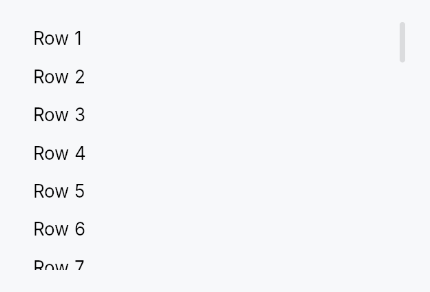
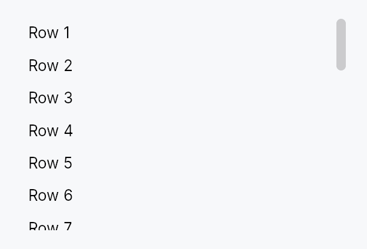

<!-- SPDX-License-Identifier: MPL-2.0 -->
<!-- SPDX-FileCopyrightText: 2026 FernTech -->

# ScrollArea



ScrollArea — a clipping viewport that scrolls its content on wheel, on a
finger's pan, and on assistive-technology actions.

## Public types

| Kind | Name |
| ---: | :--- |
| `enum` | [`ScrollBarMode`](#scrollbarmode) — How the scroll bar is presented relative to the viewport content |
| `enum` | [`ScrollBarPolicy`](#scrollbarpolicy) — Controls when the scroll bar appears for a given axis |
| `struct` | [`ScrollArea`](#scrollarea) — A clipping viewport that makes any child widget scrollable |

## Public functions

### `ScrollArea`

| Returns | Function |
| ---: | :--- |
| | **Constructors** |
| `Self` | [`new()`](#scrollarea-new) |
| `Self` | [`from_id(child: WidgetId)`](#scrollarea-from_id) |
| | **Builder methods** |
| `Self` | [`rubber_band(enabled: bool)`](#scrollarea-rubber_band) |
| `Self` | [`child(child: impl teksilo_core::IntoTeksiChild)`](#scrollarea-child) |
| `Self` | [`child_opt(widget: Option<impl teksilo_core::IntoTeksiChild>)`](#scrollarea-child_opt) |
| `Self` | [`scroll_bar_style(style: ScrollBarMode)`](#scrollarea-scroll_bar_style) |
| `Self` | [`scroll_bar_thumb_color(color: impl Into<ColorProp>)`](#scrollarea-scroll_bar_thumb_color) |
| `Self` | [`vertical_scroll_bar_policy(policy: ScrollBarPolicy)`](#scrollarea-vertical_scroll_bar_policy) |
| `Self` | [`horizontal_scroll_bar_policy(policy: ScrollBarPolicy)`](#scrollarea-horizontal_scroll_bar_policy) |
| `Self` | [`line_height(lh: f32)`](#scrollarea-line_height) |
| `Self` | [`scroll_bar_thickness(thickness: f32)`](#scrollarea-scroll_bar_thickness) |
| `Self` | [`widget_resizable(resizable: bool)`](#scrollarea-widget_resizable) |
| `Self` | [`smooth_scrolling(enabled: bool)`](#scrollarea-smooth_scrolling) |
| `Self` | [`smooth_scroll_duration(duration: Duration)`](#scrollarea-smooth_scroll_duration) |
| `Self` | [`scroll_past_end(fraction: impl Into<Prop<f32>>)`](#scrollarea-scroll_past_end) |
| `Self` | [`preferred_size(width: f32, height: f32)`](#scrollarea-preferred_size) |
| `Self` | [`preferred_height(height: f32)`](#scrollarea-preferred_height) |
| `Self` | [`overscroll_behavior(behavior: OverscrollBehavior)`](#scrollarea-overscroll_behavior) |
| `Self` | [`restore_scroll_y(offset: f32)`](#scrollarea-restore_scroll_y) |
| | **Methods** |
| `Signal<Vec2>` | [`overscroll_signal()`](#scrollarea-overscroll_signal) |
| `&Signal<f32>` | [`scroll_y_signal()`](#scrollarea-scroll_y_signal) |
| `&Signal<f32>` | [`scroll_x_signal()`](#scrollarea-scroll_x_signal) |
| `&Signal<f32>` | [`max_scroll_y_signal()`](#scrollarea-max_scroll_y_signal) |
| `&Signal<f32>` | [`viewport_ratio_y_signal()`](#scrollarea-viewport_ratio_y_signal) |
| `&Signal<f32>` | [`max_scroll_x_signal()`](#scrollarea-max_scroll_x_signal) |

## Detailed description

Wrap any widget in `ScrollArea` to make it scrollable. The scroll position
is stored in reactive `Signal<f32>` signals (one per axis), shared with the
built-in `ScrollBar` children. Two display
modes cover most use cases: `Overlay` (the default, macOS-style thin-at-rest
indicator that expands on hover) and `Permanent` (a layout-consuming gutter
always on screen). Use `ScrollBarPolicy` to control when each axis shows.

#### Pan to scroll

`ScrollArea` is the reference adopter of `ScrollableBehavior`: it
declares a both-axis pan claim, so a direct pointer dragging its content is
synthesised by the router into a positioned `Scroll` and delivered along the
claimant chain. A release hands its velocity to the tree's fling driver,
whose coast arrives back here as ordinary scroll deltas and stops — and
chains outward — at the boundary, exactly as a wheel notch does. A mouse
never pans: the wheel is its scroll device, and its behaviour here is
unchanged in every particular.

Following the finger *past* the end is off by default
(`ScrollArea::rubber_band`); a nested area that banded at its own end could
never hand the gesture to the container around it.

#### Accessibility

Reports `Role::ScrollView` with per-axis `scroll_y` / `scroll_x` position
and limit fields. Advertises `ScrollUp` / `ScrollDown` / `ScrollLeft` /
`ScrollRight` actions only for the axes that actually overflow, so AT clients
(NVDA, JAWS, VoiceOver) know which directions are reachable.

```rust
# use teksilo_widgets::scroll_area::{ScrollArea, ScrollBarMode};
# use teksilo_widgets::primitives::MinSize;
let _w = ScrollArea::new()
    .child(MinSize::new(0.0, 2000.0))
    .scroll_bar_style(ScrollBarMode::Permanent)
    .smooth_scrolling(true);
```

## Density

The picture above is the widget at `TargetDensity::Compact`, the mouse-and-keyboard ladder. Below is the same subject on the same canvas with only the ladder changed, so what moves is the density and nothing else — where the subject no longer fits, that is what the denser targets cost it at that size. See `docs/density-and-targets.md`.

**Touch**



## API reference

📖 [Full rustdoc API for this module](https://docs.rs/teksilo-widgets/latest/teksilo_widgets/scroll_area/index.html)

<a id="scrollbarmode"></a>

## `pub enum ScrollBarMode`

How the scroll bar is presented relative to the viewport content.

```rust
pub enum ScrollBarMode { /* variants */ }
```

### Variants

- **`Overlay`** — Scroll bar overlays the content (macOS-style): a thin passive indicator is painted while scrolling; the full interactive track expands on pointer proximity. Does not reduce the viewport width.
- **`Permanent`** — Scroll bar is a permanent layout sibling of the viewport, reserving its full thickness and always remaining interactive — the classic Windows/Linux gutter style.
- **`Thin`** — Floats over the content like `Overlay` but only ever shows the thin resting indicator, never the full track. A passive scroll-position display for minimal UIs; drag and track-click still work against the full slot bounds.  **Not the keyboard.** The bar's arrow / `Home` / `End` / `Page` arms sit on a node built `focusable(false)`, so no keyboard user reaches them under any of the three modes — see `ScrollBarPolicy::AlwaysOff`, which states the same limit from the other side, and `docs/touch-and-pen.md` §10.2, which carries it as an open finding.

<a id="scrollbarpolicy"></a>

## `pub enum ScrollBarPolicy`

Controls when the scroll bar appears for a given axis.

```rust
pub enum ScrollBarPolicy { /* variants */ }
```

### Variants

- **`AsNeeded`** — Show the scroll bar only when content exceeds the viewport size (default).
- **`AlwaysOn`** — Always show the scroll bar, even when content fits without scrolling.
- **`AlwaysOff`** — Never show the scroll bar; the content still scrolls on a wheel, on a finger's pan, and from the assistive-technology scroll actions the viewport advertises.  Not from the keyboard: `ScrollArea` installs no key handler, and the arrow / Home / End / Page arms on `ScrollBar` belong to a node built `focusable(false)`, so no keyboard user reaches them. A focused descendant is still revealed — that is `ScrollIntoView`, not a key the viewport handles.

<a id="scrollarea"></a>

## `pub struct ScrollArea`

A clipping viewport that makes any child widget scrollable.

The scroll offset per axis is stored in a reactive `Signal<f32>`, shared
with the built-in `ScrollBar` children. See `ScrollBarMode` for display
options and `ScrollBarPolicy` for per-axis visibility control.

```rust
pub struct ScrollArea { /* fields */ }
```

### Methods

<a id="scrollarea-new"></a>

#### `pub fn new() -> Self`

Create a new `ScrollArea` with overlay scroll bars, smooth scrolling, and no content yet.

<a id="scrollarea-rubber_band"></a>

#### `pub fn rubber_band(mut self, enabled: bool) -> Self`

Let a finger drag the content past its end, with decreasing gain, and
release it on the lift — the iOS / Flutter `BouncingScrollPhysics` feel.

**Off by default, and the default is load-bearing.** A surface that
follows the finger past its end has absorbed the movement, so a nested
area that banded could never hand the gesture to the container around
it. The band belongs to the outermost area of a scroll chain.

`prefers-reduced-motion` hard-clamps it whatever this says.

<a id="scrollarea-overscroll_signal"></a>

#### `pub fn overscroll_signal(&self) -> Signal<Vec2>`

How far past its range the content is currently being held, per axis,
after the band. Always `ZERO` with `Self::rubber_band` off.

The scroll offset itself never leaves the range, so this is the signal
a surface binds to draw a stretch or a glow; ignoring it is correct.

<a id="scrollarea-child"></a>

#### `pub fn child(mut self, child: impl teksilo_core::IntoTeksiChild) -> Self`

Set the scrollable content widget.

<a id="scrollarea-child_opt"></a>

#### `pub fn child_opt(self, widget: Option<impl teksilo_core::IntoTeksiChild>) -> Self`

Attach `widget` when it is `Some`, and do nothing when it is `None`.

The conditional-child form. `teksu!`'s `if` without an `else` lowers to
this, and it is what `cond.then(|| w)` is for in a builder chain. `None`
adds no arena node, so nothing is laid out, painted, or published to the
accessibility tree, and a stack applies no spacing around it.

<a id="scrollarea-from_id"></a>

#### `pub fn from_id(child: WidgetId) -> Self`

Construct from an already-registered child WidgetId.

<a id="scrollarea-scroll_bar_style"></a>

#### `pub fn scroll_bar_style(mut self, style: ScrollBarMode) -> Self`

Set the scroll bar display mode (`Overlay`, `Permanent`, or `Thin`).

<a id="scrollarea-scroll_bar_thumb_color"></a>

#### `pub fn scroll_bar_thumb_color(mut self, color: impl Into<ColorProp>) -> Self`

Tint the built-in scroll bars' thumb with an explicit colour instead of
the theme's `scrollbar_thumb*` tokens. Accepts anything
`impl Into<ColorProp>` — a `Color`, a theme role, or a `Signal` —
resolved against the live theme at paint, so roles/signals stay
reactive. Forwarded to both scroll bars via
`ScrollBar::thumb_color`.
Use when the area sits on a surface the surface-relative tokens don't
suit — e.g. a tooltip's inverse chip (`TextRole::TooltipText`).

<a id="scrollarea-vertical_scroll_bar_policy"></a>

#### `pub fn vertical_scroll_bar_policy(mut self, policy: ScrollBarPolicy) -> Self`

Set the vertical scroll bar visibility policy.

<a id="scrollarea-horizontal_scroll_bar_policy"></a>

#### `pub fn horizontal_scroll_bar_policy(mut self, policy: ScrollBarPolicy) -> Self`

Set the horizontal scroll bar visibility policy.

<a id="scrollarea-line_height"></a>

#### `pub fn line_height(mut self, lh: f32) -> Self`

Set the pixels-per-line used when translating line-based wheel events.

<a id="scrollarea-scroll_bar_thickness"></a>

#### `pub fn scroll_bar_thickness(mut self, thickness: f32) -> Self`

Set the scroll bar thickness in logical pixels (applies to both axes).

<a id="scrollarea-widget_resizable"></a>

#### `pub fn widget_resizable(mut self, resizable: bool) -> Self`

When true, content smaller than the viewport is stretched to fill it.
Similar to Qt's `QScrollArea::setWidgetResizable(true)`.

<a id="scrollarea-smooth_scrolling"></a>

#### `pub fn smooth_scrolling(mut self, enabled: bool) -> Self`

Enable or disable smooth animated scrolling for wheel events.
Enabled by default. Applies to both line-based (`ScrollDelta::Lines`)
and pixel-based (`ScrollDelta::Pixels`) wheel events — on Wayland and
other platforms with high-resolution scroll axes, mouse wheel notches
are delivered as pixel deltas, so animating both paths is required for
a fast flick to feel smooth instead of jumping.

<a id="scrollarea-smooth_scroll_duration"></a>

#### `pub fn smooth_scroll_duration(mut self, duration: Duration) -> Self`

Set the duration of the smooth scroll animation (default: 150ms).

<a id="scrollarea-scroll_past_end"></a>

#### `pub fn scroll_past_end(mut self, fraction: impl Into<Prop<f32>>) -> Self`

Allow scrolling past the end of the content by `fraction` of the
viewport height (default `0.0` — the last pixel of content stops flush
with the bottom of the viewport).

This extends the scroll **range** only. It adds no widget, no padding and
no layout, so it cannot interfere with the content's own padding — a
distinction worth keeping, since padding-based implementations of this
idea in other toolkits are a recurring source of "single-line content is
scrollable" bugs.

The motivating case is typewriter scrolling: to pin the caret's line at
the middle of the viewport, the view must be able to scroll half a
viewport past the last line, or the pin quietly stops working over the
final page — exactly where a writer spends their time. Pair with
`EventContext::ensure_visible_aligned`, passing `1.0 - fraction` here
for a pin at `fraction`.

Accepts a literal or a `Signal<f32>`, so it can follow a setting live.
Negative values are treated as `0.0`.


<a id="scrollarea-preferred_size"></a>

#### `pub fn preferred_size(mut self, width: f32, height: f32) -> Self`

Set a preferred size returned when the parent proposes unconstrained
dimensions. If not set, falls back to cached content size or 300×200.

This overrides **both** axes. If you only want to cap the height and let
the width follow the content — the usual case for a menu or popover, which
must be as wide as its widest row — use `preferred_height` instead.
Passing a width of `0.0` here does *not* mean "no preference": it means
zero, and the scroll area will collapse.


<a id="scrollarea-preferred_height"></a>

#### `pub fn preferred_height(mut self, height: f32) -> Self`

Cap the height when the parent proposes an unconstrained one, while
letting the **width** continue to follow the content.

This is what a scrolling menu/popover wants: it must not grow taller than
its viewport, but it must still be as wide as its widest item. Using
`preferred_size` with a `0.0` width for this
collapses the panel to its minimum width and clips every row — the parent
proposes an unconstrained width (it is hugging its content), so the `0.0`
is taken literally.

<a id="scrollarea-overscroll_behavior"></a>

#### `pub fn overscroll_behavior(mut self, behavior: OverscrollBehavior) -> Self`

Set the scroll-chaining behavior at the boundary. Default
`OverscrollBehavior::Chain` (a boundary scroll bubbles to an ancestor
scrollable); `OverscrollBehavior::Contain` absorbs it instead.

<a id="scrollarea-restore_scroll_y"></a>

#### `pub fn restore_scroll_y(self, offset: f32) -> Self`

Land `offset` on the first layout pass at which this area has a real
scrollable range, then forget it.

`max_scroll_y` is `0.0` until the content has been measured, so an
offset a host writes before that first measurement is clamped away to
zero and the page paints at the top for a frame before jumping to
where it should have started. This stores the offset instead and
applies it itself, inside layout, as soon as `max_scroll_y` becomes
nonzero, before the ordinary clamp would otherwise discard it, so the
very first frame the content is measured on is already laid out at
the restored position, with no visible jump.

It is a one-shot: once applied, it is dropped, so a later reflow (a
wider window, an edit that lengthens the document) never yanks the
reader back to where they came in. The offset is still clamped to the
real range when it lands: past the end it lands at the end, negative
it lands at zero.

`offset <= 0.0` is a no-op: there is nothing to restore, and it clears
any previously armed offset rather than leaving it pending.

An area that never calls this behaves exactly as it always has.

<a id="scrollarea-scroll_y_signal"></a>

#### `pub fn scroll_y_signal(&self) -> &Signal<f32>`

Get the vertical scroll position signal (for external observation).

<a id="scrollarea-scroll_x_signal"></a>

#### `pub fn scroll_x_signal(&self) -> &Signal<f32>`

Get the horizontal scroll position signal (for external observation).

<a id="scrollarea-max_scroll_y_signal"></a>

#### `pub fn max_scroll_y_signal(&self) -> &Signal<f32>`

Maximum vertical scroll offset for the current content
(`content_height − viewport_height`, or 0 when content fits), plus any
range bought with `scroll_past_end`.
External callers bind to this for "is there more to scroll?"
chrome (e.g. trailing scroll-arrow visibility).

<a id="scrollarea-viewport_ratio_y_signal"></a>

#### `pub fn viewport_ratio_y_signal(&self) -> &Signal<f32>`

Fraction of the scrollable height currently visible (`1.0` when
everything fits) — what sizes the vertical scroll bar's thumb. Accounts
for `scroll_past_end`, so the thumb stays
proportional to the range the user can actually travel.

<a id="scrollarea-max_scroll_x_signal"></a>

#### `pub fn max_scroll_x_signal(&self) -> &Signal<f32>`

Maximum horizontal scroll offset for the current content.
External callers bind to this for "is there more to scroll?"
chrome (e.g. trailing scroll-arrow visibility on a tab bar).
