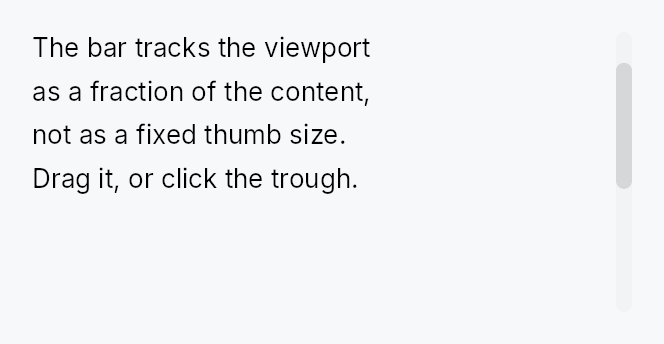

<!-- SPDX-License-Identifier: MPL-2.0 -->
<!-- SPDX-FileCopyrightText: 2026 FernTech -->

# ScrollBar



ScrollBar — pointer and keyboard affordance for a `ScrollArea`.

`ScrollBar` reads and writes a shared `Signal<f32>` scroll position and a
`Signal<f32>` viewport/content ratio, both supplied by its owning `ScrollArea`.
Interaction (thumb drag, track click, keyboard Up/Down/Home/End, hover) is
handled here; all painting is delegated to the active `ScrollBarStyle` impl so
the look is fully theme-overridable.

Most applications do not need to construct a `ScrollBar` directly — `ScrollArea`
creates and manages the bars automatically. Use this type when building a custom
scroll host (e.g. the `RichTextEditor` manages its own bars to avoid the
wrap/scrollbar circular dependency).

## Accessibility

Hidden from AT via `set_hidden()`. Scroll actions (Up/Down/Left/Right) are
advertised on the parent `ScrollView` node, not on the bar, so screen readers
navigate the content region directly without stopping on the thumb.

```rust
# use teksilo_widgets::scroll_bar::{ScrollBar, ScrollBarOrientation, ScrollBarVariant};
# use teksilo_core::signal::Signal;
let position = Signal::new(0.0_f32);
let max_scroll = Signal::new(500.0_f32);
let viewport_ratio = Signal::new(0.4_f32);
let _bar = ScrollBar::new(
    ScrollBarOrientation::Vertical,
    position,
    max_scroll,
    viewport_ratio,
)
.thickness(8.0)
.variant(ScrollBarVariant::Overlay);
```

## Builder methods at a glance

`thickness`, `min_thumb_length`, `step_size`, `visual`, `variant`, `style`, `thumb_color`

## API reference

📖 [Full rustdoc API for this module](https://docs.rs/teksilo-widgets/latest/teksilo_widgets/scroll_bar/index.html)

## `pub struct ScrollBar`

A scroll bar that shares reactive scroll-position state with a `ScrollArea`.

Supports thumb drag, track-click page scroll, and keyboard
Up/Down/Left/Right/Home/End navigation. Hidden from AT — see module docs.

```rust
pub struct ScrollBar { /* fields */ }
```

### Methods

#### `pub fn new( orientation: ScrollBarOrientation, scroll_position: Signal<f32>, max_scroll: Signal<f32>, viewport_ratio: Signal<f32>, ) -> Self`

Create a new ScrollBar with shared state.

- `scroll_position`: shared `Signal<f32>` for current scroll offset
- `max_scroll`: shared `Signal<f32>` for maximum scroll offset
- `viewport_ratio`: shared `Signal<f32>` for viewport/content ratio (0.0..1.0)

#### `pub fn thickness(mut self, thickness: f32) -> Self`

Set the bar thickness (width for vertical, height for horizontal).

#### `pub fn min_thumb_length(mut self, len: f32) -> Self`

Set the minimum thumb length in pixels.

#### `pub fn step_size(mut self, step: f32) -> Self`

Set the scroll step for keyboard navigation.

#### `pub fn visual(mut self, variant: ScrollBarVariant) -> Self`

Set the visual variant. The active `ScrollBarStyle` picks how
to paint each variant; the IntUI default ships Permanent /
Overlay / Thin out of the box.

#### `pub fn variant(mut self, variant: ScrollBarVariant) -> Self`

Alias for `visual` using the new variant naming.

#### `pub fn style(mut self, style: impl ScrollBarStyle) -> Self`

Override the active `ScrollBarStyle` for this widget instance only.

#### `pub fn thumb_color(mut self, color: impl Into<ColorProp>) -> Self`

Tint the thumb with an explicit colour instead of the theme's
`scrollbar_thumb*` tokens. Accepts anything `impl Into<ColorProp>` —
a `Color`, a theme role (`TextRole`/`SurfaceRole`/…), or a `Signal`;
resolved against the live theme at paint, so roles and signals stay
reactive. The active `ScrollBarStyle` derives the idle/hover/pressed
states from this tint. Use when the bar sits on a surface the
surface-relative tokens don't suit — a tooltip's inverse chip, a
branded panel. Mirrors `Button::text_role`.
