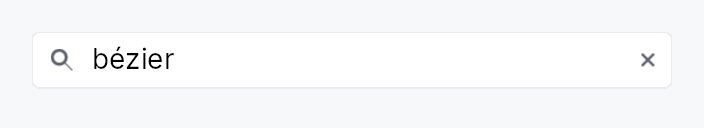

<!-- SPDX-License-Identifier: MPL-2.0 -->
<!-- SPDX-FileCopyrightText: 2026 FernTech -->

# SearchField



SearchField — a `TextInput` preset
configured for search workflows: leading magnifier glyph, default-on
clear-X, and an optional anchored suggestions popover with keyboard
navigation and the ARIA combobox-with-listbox accessibility pattern.
The popover is shown via `OverlayRequest` so it floats above sibling
content and escapes ancestor clipping (same pattern as `ComboBox`).

```ignore
let query = ctx.signal(String::new());
SearchField::new(query.clone())
    .placeholder("Search documents")
    .with_suggestions(|prefix| {
        FRUITS.iter()
            .filter(|f| f.to_lowercase().starts_with(&prefix.to_lowercase()))
            .map(|s| s.to_string())
            .collect()
    })
    .on_select(|value, _ctx| println!("picked: {value}"))
    .on_submit_fn(|ctx| ctx.send_intent(AppIntent::Search))
```

## Design — comparison with searchable `ComboBox`

A searchable `ComboBox` and a `SearchField` are visually similar
but semantically different:

- **ComboBox** is a *value picker* — the bound state is the
  selected item from a known list. The text input is a transient
  filter, embedded inside the dropdown popup; the closed combo
  shows the selected value, not the user's query.
- **SearchField** is a *query input* — the bound state is the
  query string itself. The text input is always visible at the
  top level; suggestions are completion hints, not the source of
  truth. The bound `Signal<String>` keeps whatever the user
  typed, even if no suggestion matches.

The two share the same dropdown-of-options machinery in spirit;
a future refactor could lift a common `OverlayList<T>` primitive
out of both. For now they're separate so each can keep a small
API surface tuned to its semantics.

## Accessibility

The field is `Role::SearchInput` with `HasPopup::Listbox` and
`AutoComplete::List`. When the popup is open it advertises
`set_expanded(true)` and `set_controls(listbox_id)` (mapped to
`accesskit::NodeId` via `widget_id_to_node_id`). Each row is
`Role::ListBoxOption` with `set_selected(is_highlighted)` and
`set_position_in_set(idx + 1)`; the `Role::ListBox` container
carries the matching `set_size_of_set(total)`, since AccessKit
resolves a set size by walking up from the item. Together they
let screen readers announce "Apple, 1 of 5".

## Builder methods at a glance

`style`, `placeholder`, `label`, `drives_listbox`, `enabled`, `on_submit_fn`, `with_suggestions`, `max_suggestions`, `min_chars`, `on_select`, `tooltip`, `rich_tooltip`, `rich_tooltip_content`, `composite_tooltip`

## API reference

📖 [Full rustdoc API for this module](../api/teksilo_widgets/search_field/index.html)

## `pub struct SearchField`

A search input with optional inline suggestions popup.

```rust
pub struct SearchField { /* fields */ }
```

### Methods

#### `pub fn new(text: Signal<String>) -> Self`

Create a search field bound to `text`, the reactive query string.

#### `pub fn style(mut self, style: impl teksilo_core::styles::SearchFieldStyle) -> Self`

Per-call SearchFieldStyle override.

#### `pub fn placeholder(mut self, text: impl Into<LocalizedString>) -> Self`

Set the placeholder text shown when the query is empty.

#### `pub fn label(mut self, label: impl Into<LocalizedString>) -> Self`

Set an accessible label for the field (announced by screen readers, not visually shown).

#### `pub fn drives_listbox( mut self, listbox: Signal<Option<WidgetId>>, active: Signal<Option<WidgetId>>, ) -> Self`

Wire this field to a listbox **the caller owns**, so arrow keys that
move a highlight through that list are announced while focus stays here
(the ARIA combobox pattern). `listbox` is the list's node, `active` the
currently-highlighted row's node; both are forwarded to the inner
`TextInputField`, which is the node that actually holds focus and
therefore the only one whose `active_descendant` assistive technology
follows.

This is for a search field driving a list built by its *host* — a
command palette, a filter box above a results view. The built-in
suggestion popup (`suggestions`) wires itself and needs none of this.

#### `pub fn enabled(mut self, on: impl Into<Prop<bool>>) -> Self`

Set the initial enabled state. Forwarded to the arena at build time.

#### `pub fn on_submit_fn(mut self, f: impl Fn(&mut EventContext) + 'static) -> Self`

Install a callback invoked when the user presses Enter (or activates the search action).

#### `pub fn with_suggestions(mut self, f: impl Fn(&str) -> Vec<String> + 'static) -> Self`

Provider that returns suggestions for the current query string.
When set, the popup appears below the field as soon as the
user types at least `Self::min_chars` characters and the
provider returns a non-empty list.

#### `pub fn max_suggestions(mut self, n: usize) -> Self`

Cap the number of suggestions shown in the popup (default 8, minimum 1).

#### `pub fn min_chars(mut self, n: usize) -> Self`

Minimum number of characters the user must type before suggestions appear (default 1).

#### `pub fn on_select(mut self, f: impl Fn(&str, &mut EventContext) + 'static) -> Self`

Install a callback invoked when the user picks a suggestion (tap, Enter, or Space).

#### `pub fn tooltip(mut self, text: impl Into<LocalizedString>) -> Self`

Show a plain one-line tooltip after a hover delay.

Mutually exclusive with `rich_tooltip`,
`rich_tooltip_content`, and
`composite_tooltip` — calling this
clears the other slots (last call wins).

#### `pub fn rich_tooltip(mut self, key: impl Into<String>) -> Self`

Show a registry-driven rich tooltip keyed by `key`.

Mutually exclusive with the other tooltip setters — last call wins.

#### `pub fn rich_tooltip_content(mut self, content: crate::tooltip::TooltipContent) -> Self`

Show an inline rich tooltip with the given `TooltipContent`.

Mutually exclusive with the other tooltip setters — last call wins.

#### `pub fn composite_tooltip(mut self, content: impl Widget + 'static) -> Self`

Show a composite tooltip whose body is an arbitrary widget tree.

Mutually exclusive with the other tooltip setters — last call wins.
