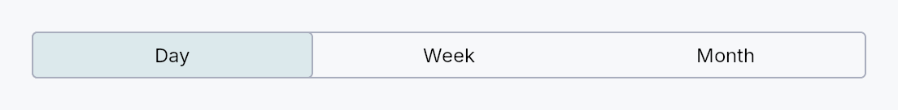

<!-- SPDX-License-Identifier: MPL-2.0 -->
<!-- SPDX-FileCopyrightText: 2026 FernTech -->

# SegmentedControl



SegmentedControl — mutually exclusive segments in a horizontal row.

Each segment is a real composed widget — a centered icon + label with
a reactive tint — built from a `Segment` descriptor. Selection is
bound to a `Signal<Option<SegmentId>>`: **keyed, not positional**, so
inserting or removing a segment never silently re-points the
selection at a different one. The chrome (rounded frame, hover tint,
selected-segment surface) is delegated to the active
`SegmentedControlStyle`.

```ignore
const LIST: SegmentId = SegmentId::from_u64(1);
const GRID: SegmentId = SegmentId::from_u64(2);

let view = ctx.signal(Some(LIST));
SegmentedControl::new(view.clone())
    .segment(Segment::new(tr!(list_view())).id(LIST).icon(|| IconWidget::list(14.0)))
    .segment(Segment::new(tr!(grid_view())).id(GRID).icon(|| IconWidget::grid(14.0)))

// Pairing with a Switcher:
Switcher::new(segmented_control::index_signal(&view, &[LIST, GRID]))
```

## When to use

- Use a `SegmentedControl` for mutually exclusive modes that read
  well as a compact horizontal strip (view mode, time period).
- Prefer a `ComboBox` when the options are many *and* the strip form
  buys nothing — though a segmented control no longer breaks down at
  seven segments, because it overflows (below).
- Prefer `RadioButton` / `RadioTileGroup` when the options need
  vertical space or descriptions.

## Width: overflow, not squeeze

When the segments do not fit, the ones that do not fit move into a
trailing chevron menu rather than all of them compressing into
ellipsised stubs (`SegmentOverflow::Menu`, the default; opt out with
`SegmentOverflow::Compress`).

Declaration order is stable, with exactly one exception: **the
selected segment is always visible**. If it would have been pushed
into the menu it takes the *last* slot, and it stays there until
another segment is chosen from the menu — so the strip does not
reshuffle under the pointer, and the promotion is forgotten once the
control is wide enough to show everything again.

```text
Declared: [A][B][C][D][E][F][G]   fits 4 + chevron

start, A selected     [A][B][C][D][v]   menu: E F G
pick F from menu      [A][B][C][F][v]   menu: D E G
click A (F stays)     [A][B][C][F][v]   menu: D E G
widen to full fit     [A][B][C][D][E][F][G]
```

## Accessibility

`Role::RadioGroup` on the control with `active_descendant` pointing at
the selected segment; `Role::RadioButton` per segment, carrying
"N of M" over the whole segment list — including segments currently in
the overflow menu, which are still reachable. Arrow keys cycle
selection (RTL-aware, resolved at event time) and Home/End jump to the
ends, both skipping disabled segments; stepping onto an overflowed
segment promotes it into view. `Increment`/`Decrement` AT actions
mirror the arrows.

The strip is **one** tab stop. While the control is overflowing the
chevron adds a second, because an overflow menu that no keyboard can
reach is not an overflow menu; it cannot join the arrow sequence,
since here arrows move *selection* rather than a roving focus.

## Builder methods at a glance

`indexed`, `segment`, `segments`, `segment_ids`, `enabled`, `label`, `on_change`, `style`, `text_style`, `display`, `sizing`, `overflow`, `is_overflowing`, `fill_width`

## API reference

📖 [Full rustdoc API for this module](https://docs.rs/teksilo-widgets/latest/teksilo_widgets/segmented_control/index.html)

## `pub enum SegmentDisplay`

What a segment paints: its icon, its label, or both.

Set on the control with
`SegmentedControl::display`; it
applies to every segment. Mirrors `TabWidget`'s `TabDisplayMode`.

Icon-only is the classic compact fallback *before* overflow kicks in:
a bar of icon-only segments fits far more of them, so switching to
`Icon` can be the difference between a
complete strip and a chevron menu.

```rust
pub enum SegmentDisplay { /* variants */ }
```

### Variants

- **`Auto`** — Paint whatever the segment declares — icon *and* label when both are present, label alone otherwise. The default, and the behaviour of every `SegmentedControl` before this mode existed.
- **`Text`** — Label only. A declared icon is suppressed.
- **`Icon`** — Icon only; the label is promoted to the hover tooltip (unless the segment already declares one). A segment with **no** icon falls back to its label, so the mode is never a silent no-op.
- **`IconText`** — Icon and label. Identical to `Auto` for a segment that declares both; kept for parity with `TabDisplayMode` so a caller can be explicit.

## `pub enum SegmentSizing`

How the visible segments divide the control's width.

```rust
pub enum SegmentSizing { /* variants */ }
```

### Variants

- **`Uniform`** — Every visible segment gets the same width — the Apple / IntUI look, and the behaviour of every `SegmentedControl` before this knob existed. The fit calculation uses the *widest* segment's natural width as the unit, so segments never look ragged.
- **`Fit`** — Every visible segment gets its own natural width, and leftover space (when the control fills a wider slot) is shared equally. Fits more short segments before overflowing, at the cost of an uneven strip.

## `pub enum SegmentOverflow`

What the control does when its segments do not fit.

```rust
pub enum SegmentOverflow { /* variants */ }
```

### Variants

- **`Menu`** — Move the segments that do not fit into a trailing chevron menu, keeping the rest at a legible width. The selected segment is always among the visible ones. This is the default.
- **`Compress`** — Keep every segment on the strip and let them compress, truncating labels with an ellipsis. The behaviour of every `SegmentedControl` before overflow existed — appropriate for two or three short segments that will never realistically overflow.

## `pub struct Segment`

One segment descriptor: a localized label with a stable
`SegmentId`, an optional leading icon, a hover tooltip, and
reactive disabled / visible flags.

```rust
pub struct Segment { /* fields */ }
```

### Methods

#### `pub fn new(label: impl Into<LocalizedString>) -> Self`

A text segment with a freshly allocated `SegmentId`. The label
may come from `tr!(...)` (translated — follows a live locale
switch) or `lit!(...)` (untranslated).

Call `id` when the segment needs a *stable* identity —
one that survives a restart, or that another crate can name.

#### `pub fn id(mut self, id: SegmentId) -> Self`

Give this segment an app-chosen stable identity, replacing the
fresh id `new` allocated. Use this whenever the
selection is persisted or the segment is contributed by another
crate.

#### `pub fn segment_id(&self) -> SegmentId`

This segment's identity.

#### `pub fn icon(mut self, factory: impl Fn() -> IconWidget + 'static) -> Self`

Add a leading icon. The factory is invoked at build time (and on
rebuild); the icon's tint is bound reactively to the segment's
selected / focus / enabled state so it matches the label.

#### `pub fn tooltip(mut self, text: impl Into<LocalizedString>) -> Self`

Hover tooltip — most useful for icon-only segments.

Mutually exclusive with `rich_tooltip` /
`rich_tooltip_content` /
`composite_tooltip` — last call wins.

#### `pub fn rich_tooltip(mut self, key: impl Into<String>) -> Self`

Rich hover tooltip resolved from the app-wide registry by key.

Mutually exclusive with `tooltip` /
`rich_tooltip_content` /
`composite_tooltip` — last call wins.

#### `pub fn rich_tooltip_content(mut self, content: crate::tooltip::TooltipContent) -> Self`

Rich hover tooltip driven by an inline
`TooltipContent` entry
(no registry key needed).

Mutually exclusive with `tooltip` /
`rich_tooltip` /
`composite_tooltip` — last call wins.

#### `pub fn composite_tooltip(mut self, factory: impl Fn() -> Box<dyn Widget> + 'static) -> Self`

Composite hover tooltip built by a factory closure at attach time.

The factory is called once per `build()` to produce the tooltip
body widget. It is stored as an `Rc<dyn Fn>` so that `Segment`
remains `Clone`.

Mutually exclusive with `tooltip` /
`rich_tooltip` /
`rich_tooltip_content` — last call wins.

#### `pub fn disabled(mut self, disabled: impl Into<Prop<bool>>) -> Self`

Disable this segment: not selectable via click or keyboard,
dimmed, and announced disabled to assistive tech.

Accepts a `bool` or a `Signal<bool>` — a bound signal flips the
segment live, with **no rebuild**, and keyboard stepping honours
the new value immediately (the flags are read at event time, not
snapshotted at build time).

#### `pub fn visible(mut self, visible: impl Into<Prop<bool>>) -> Self`

Hide this segment entirely: it leaves the strip, the overflow
menu, the keyboard order, and the accessibility tree, and it is
excluded from the overflow calculation.

Distinct from *overflowed* — an overflowed segment is still
reachable from the chevron menu, a hidden one is not there at all.
Accepts a `bool` or a `Signal<bool>`; a bound signal re-runs the
overflow plan with no rebuild.

## `pub fn index_signal(...)`

Derive a `Switcher`-compatible index from a keyed selection.

`SegmentedControl` is keyed precisely so that a contributed segment
cannot silently re-point the selection, but `Switcher` is index-driven
— this is the adapter between the two. Unknown or absent ids resolve
to `0`, matching `Switcher`'s own out-of-range behaviour.

```ignore
Switcher::new(segmented_control::index_signal(&view, &[LIST, GRID, COLUMNS]))
    .child(list_pane)
    .child(grid_pane)
    .child(columns_pane)
```

```rust
pub fn index_signal(selected: &Signal<Option<SegmentId>>, ids: &[SegmentId]) -> Signal<usize>;
```

## `pub struct SegmentedControl`

A segmented control binding a `Signal<Option<SegmentId>>` to a row of
mutually exclusive segments. Build the segment list with
`segment` or `segments`.

```rust
pub struct SegmentedControl { /* fields */ }
```

### Methods

#### `pub fn new(selected: Signal<Option<SegmentId>>) -> Self`

Create an empty segmented control bound to `selected`. Add segments
with `segment` or `segments`.

#### `pub fn indexed(index: Signal<usize>) -> Self`

Bind a **positional** `Signal<usize>` instead of a keyed
selection, mirrored in both directions.

Use this only when position *is* the meaning and the segment list
is closed and local — an enum discriminant over a fixed `ALL`
array, a `Switcher` index, a settings choice. For anything else
prefer `new`: an index silently stops meaning the
same thing the moment a segment is inserted ahead of it, which is
the entire reason selection is keyed. A persisted selection, or
segments contributed by another crate, are both firmly in
"anything else".

Positions address the **declared** list, so a segment hidden with
`Segment::visible` does not renumber the others.

```ignore
// `bucket_idx` already drives the rollup maths and a Switcher.
SegmentedControl::indexed(bucket_idx.clone())
    .segments([lit!("×2"), lit!("×4"), lit!("×8")])
```

#### `pub fn segment(mut self, segment: impl Into<Segment>) -> Self`

Append one segment. Accepts a `Segment` or, via
`From<LocalizedString>`, a bare `tr!(...)` / `lit!(...)` label
(which gets a freshly allocated `SegmentId`).

#### `pub fn segments(mut self, segments: impl IntoIterator<Item = impl Into<Segment>>) -> Self`

Append several segments. Label-only:
`.segments([tr!(day()), tr!(week())])`; rich:
`.segments([Segment::new(...).id(DAY).icon(...), ...])`.

#### `pub fn segment_ids(&self) -> Vec<SegmentId>`

The ids of the segments added so far, in declaration order.
Convenient for feeding `index_signal` without repeating the list.

#### `pub fn enabled(mut self, enabled: impl Into<Prop<bool>>) -> Self`

Set the enabled state, statically or reactively. Forwarded to
the arena at build time via
`ctx.enabled_when(segmented_control_id, self.enabled.clone())`.

#### `pub fn label(mut self, label: impl Into<LocalizedString>) -> Self`

Accessible name for the group — e.g. "View mode". Screen readers
announce it before the selected segment. Matches
`RadioGroup::label` and
`RadioTileGroup::label`.

#### `pub fn on_change(mut self, f: impl Fn(SegmentId, &mut EventContext) + 'static) -> Self`

Called whenever the user changes the selection — by click, arrow
key, assistive technology, or the overflow menu. Receives the
newly selected `SegmentId` and an `EventContext`, so it can do
things a bare `Signal` write cannot (`ctx.set_locale(...)`,
`ctx.send_intent(...)`, opening a window).

Does **not** fire for programmatic writes to the bound signal —
there is no event in flight to carry. Observe the signal for that.

#### `pub fn style(mut self, style: impl teksilo_core::styles::SegmentedControlStyle) -> Self`

Per-call override for the segmented-control chrome.

#### `pub fn text_style(mut self, style: impl Into<teksilo_core::color_prop::TextStyleProp>) -> Self`

Override every segment's label text style (font, size, weight).
Accepts a `TextStyleRole`, a `TextStyle`, or a `Signal` of either.
Default (unset) is `TextStyleRole::Small`. Text color stays
state-driven and is intentionally not overridable here.

#### `pub fn display(mut self, display: SegmentDisplay) -> Self`

What each segment paints: its icon, its label, or both. See
`SegmentDisplay`. Icon-only fits far more segments, so it is
worth reaching for *before* the control starts overflowing.

#### `pub fn sizing(mut self, sizing: SegmentSizing) -> Self`

How the visible segments divide the width. See `SegmentSizing`.

#### `pub fn overflow(mut self, mode: SegmentOverflow) -> Self`

What to do when the segments do not fit. See `SegmentOverflow`.

#### `pub fn is_overflowing(&self) -> Signal<bool>`

Reactive "some segments are in the overflow menu right now".

Republished from `place_children` behind an equality guard, so it
is safe for `RepaintOnly` / `AccessibilityOnly` consumers and for
`Relayout` consumers that do not feed back into this control's own
width. Mirrors `Toolbar::is_overflowing`.

#### `pub fn fill_width(mut self, fill: bool) -> Self`

Whether the control claims all the width offered to it (the
default, and the behaviour before this knob existed) or hugs its
segments.

`false` also makes the control *shrinkable*: in an over-constrained
stack it compresses — and overflows — instead of spilling past its
bounds.

## `pub struct SegmentId`

Stable identity of a segment. Cheap to copy; survives rebuilds,
locale changes, and segments being inserted around it.

```rust
pub struct SegmentId(NonZeroU64);
```

### Methods

#### `pub fn fresh() -> Self`

Allocate a new, never-before-seen id. Backed by a monotonic
global counter — overflow is theoretically possible after 2^64
calls, at which point the universe has had bigger problems.

`Segment::new` calls this for you, so a
control that never persists its selection needs no explicit ids.

Allocations start at 2^48, so they can never collide with a small
constant an app declared through `from_u64`.

#### `pub const fn from_raw(value: NonZeroU64) -> Self`

Wrap an externally-allocated key. Use this when the segment's
identity comes from an app-side store (a view-mode enum
discriminant, a plugin key hash, …) — calling `SegmentId::fresh`
would allocate a *new* id every restart, breaking a persisted
selection.

#### `pub const fn from_u64(value: u64) -> Self`

`const` convenience over `from_raw`, so an app
can declare its segments as constants:

```
# use teksilo_widgets::SegmentId;
const SYNOPSIS: SegmentId = SegmentId::from_u64(1);
const CHAPTER: SegmentId = SegmentId::from_u64(2);
```

# Panics

If `value` is zero. Because this is a `const fn`, a literal zero
is caught at compile time rather than at run time.

#### `pub const fn raw(self) -> NonZeroU64`

The underlying non-zero `u64`. Serialize this to persist a
selection across sessions; restore via `from_raw`
or `from_u64`.

#### `pub const fn get(self) -> u64`

The underlying value as a plain `u64`.
