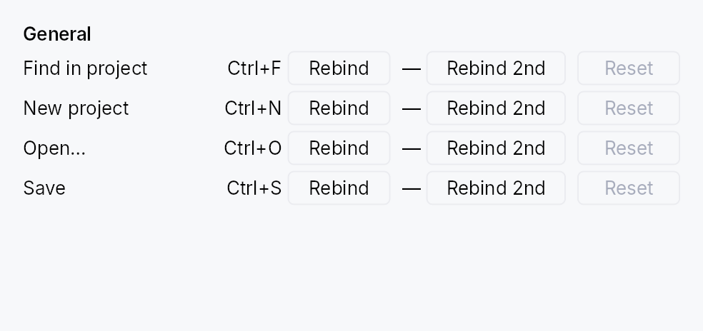

<!-- SPDX-License-Identifier: MPL-2.0 -->
<!-- SPDX-FileCopyrightText: 2026 FernTech -->

# ShortcutSettings



ShortcutSettings — user-facing widget for browsing and rebinding
application shortcuts.

Reads every shortcut registered in the tree's
`ShortcutRegistry` and
renders one row per entry, grouped by category, with both primary
and secondary keystrokes independently rebindable. Supports:

- **Rebind** (primary or secondary) via one-shot key capture.
- **Unbind** a slot explicitly (sets the override to `None`), or
  press `Delete` / `Backspace` during capture.
- **Reset** clears the user override entirely, restoring the
  declared defaults. Disabled when no override exists.
- **Conflict auto-resolution**: rebinding to a keystroke already
  bound elsewhere silently unbinds the conflicting shortcut so
  there's always exactly one binding per chord.
- **Escape** during capture cancels without committing.
- **Platform-aware keystroke labels** via `format_keystroke`.

The widget owns the currently-armed `CaptureHandle`; dropping
the widget cancels the capture, so navigating away mid-rebind
cannot leak a stray rebind onto the next keystroke pressed
somewhere else in the app.

```ignore
// Inside a settings Dialog build():
let filter = ctx.signal(String::new());
ctx.add(
    ShortcutSettings::new()
        .with_filter(filter)
        .confirm_conflicts(true)
        .on_conflict(|c| println!("displaced: {}", c.displaced_name)),
);
```

## Builder methods at a glance

`with_filter`, `confirm_conflicts`, `on_conflict`

## API reference

📖 [Full rustdoc API for this module](https://docs.rs/teksilo-widgets/latest/teksilo_widgets/shortcut_settings/index.html)

## `pub struct ShortcutConflict`

Describes a rebind that collides with an existing binding.

Passed to the `ShortcutSettings::on_conflict` callback so the app
can surface a toast ("Save lost its Ctrl+S binding"); also used
internally to drive the optional inline confirm prompt.

```rust
pub struct ShortcutConflict { /* fields */ }
```

## `pub struct ShortcutSettings`

A settings panel for browsing and rebinding application shortcuts.

Reads every `Shortcut` in the tree's `ShortcutRegistry`, groups rows
by category, and renders primary + secondary keystroke slots with
Rebind, Unbind, and Reset controls. See the module-level docs for the
full feature list.

```rust
pub struct ShortcutSettings { /* fields */ }
```

### Methods

#### `pub fn new() -> Self`

Create a settings panel that lists every shortcut currently
registered in the tree's `ShortcutRegistry`, without a filter.

#### `pub fn with_filter(mut self, filter: Signal<String>) -> Self`

Bind the visible row set to a filter signal. The widget
shows only shortcuts whose `name`, `id`, or `category`
contains the filter text (case-insensitive). Empty string =
show everything.

Apps typically drive this from a `TextInput` elsewhere in
their settings UI; keeping the filter external keeps this
widget's own surface minimal rather than embedding a search box.

#### `pub fn confirm_conflicts(mut self, yes: bool) -> Self`

Require explicit confirmation before a rebind unbinds a
conflicting shortcut. Off by default — the chord is reassigned
immediately (the historical behavior). When on, a colliding
rebind shows an inline "already assigned to X — Reassign /
Cancel" prompt on the row, and the registry is left untouched
until the user confirms.

#### `pub fn on_conflict(mut self, f: impl Fn(&ShortcutConflict) + 'static) -> Self`

Register a callback fired whenever a rebind collides with an
existing binding — **regardless** of `confirm_conflicts`. The
callback receives the displaced shortcut's id, name, and the
chord, so the app can surface a toast ("Save lost its Ctrl+S
binding"). It fires before the displaced binding is removed (in
confirm mode, before the user has confirmed).

