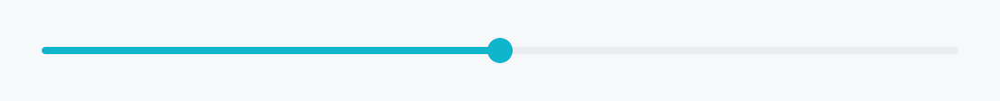

<!-- SPDX-License-Identifier: MPL-2.0 -->
<!-- SPDX-FileCopyrightText: 2026 FernTech -->

# Slider



Slider — a draggable value selector bound to a `Signal<f32>`.

The widget owns all input handling: pointer drag (click-to-jump and
thumb-drag), the keyboard, and the `Increment` / `Decrement` /
`SetValue` accessibility actions. All visual chrome is delegated to a
`SliderStyle` implementation; the
IntUI default ships out of the box and is also the theme-wide slot
override target (`theme.style_slots.slider`).

## Keyboard

- `ArrowRight` / `ArrowUp` and `ArrowLeft` / `ArrowDown` — one
  `step`, defaulting to 1 % of the range.
- `PageUp` / `PageDown` — one `page_step`,
  defaulting to ten times the step and so to 10 % of the range. That
  is `QAbstractSlider::pageStep`, `GtkScale`'s page increment, and
  what `<input type=range>` gives in both WebKit and Blink.
- `Home` / `End` — the minimum and the maximum.
- A chord holding `Ctrl`, `Alt` or `Super` is not the slider's and
  falls through to the application; `Shift` does not change the step.

The chord table is shared with every other bounded-scalar control; see
`docs/range-keyboard.md`.

## Accessibility

Exposes `Role::Slider` with numeric value, min, max, step, the page
distance as `numeric_value_jump`, and orientation. Screen readers
announce the current value on every change. `SetValue` accepts a
number or a numeric string and snaps it to `step`, so an assistive
technology's write lands on the same grid a drag does — AT-SPI's
`Value.SetCurrentValue` is how Orca sets a slider, and macOS gates
`setAccessibilityValue:` settability on the action being advertised.
The focus ring follows the `:focus-visible` heuristic — visible after
keyboard interaction, invisible after a pointer tap.

```rust
# use teksilo_core::signal::Signal;
# use teksilo_widgets::Slider;
let volume = Signal::new(0.5_f32);
let _w = Slider::new(volume, 0.0, 1.0).step(0.05);
```

## Touch and pen

A slider is a **continuous manipulator**: the value it produces *is* the
press position, so a finger that lands on it adjusts it — even inside a
scrolling form, and from the first movement rather than after a long-press
timer. Two separate things deliver that. The press *capture* the drag takes
makes the slider the innermost member of the pointer's sequence, which is
what stops an enclosing scroller winning the gesture. `touch_action(NONE)`
is the declaration on top: it forbids every default touch behaviour on the
hit path, which in practice means a **two-contact pinch** started on the
slider never reaches the surface under it. `docs/touch-and-pen.md` §7.3.

`teksilo_core::widget::Widget::target_regions`
reports what the style painted inside the slider's one node: the whole node
as the press surface, and the knob as the grab affordance, sized through the
resolved style's density-aware `thumb_diameter_for`. Nothing else in the
tree can see the knob — it is drawn on the same canvas as the track — so
this is the only way a conformance audit or a coarse-press router learns it
is there.

**Right-to-left.** A horizontal slider's minimum sits at the *leading* edge,
which is the right-hand one in an RTL UI, so both the painted fill and the
position→value map mirror. They were previously mirrored in neither, so an
RTL slider's knob moved away from the finger dragging it.

## Density

The picture above is the widget at `TargetDensity::Compact`, the mouse-and-keyboard ladder. Below is the same subject on the same canvas with only the ladder changed, so what moves is the density and nothing else — where the subject no longer fits, that is what the denser targets cost it at that size. See `docs/density-and-targets.md`.

**Touch**


## Builder methods at a glance

`on_change`, `step`, `page_step`, `orientation`, `enabled`, `variant`, `tick_count`, `style`, `label`, `tooltip`, `rich_tooltip`, `rich_tooltip_content`, `composite_tooltip`

## API reference

📖 [Full rustdoc API for this module](https://docs.rs/teksilo-widgets/latest/teksilo_widgets/slider/index.html)

## `pub const SLIDER_PART_BODY`

`Widget::target_regions` part id for the whole press surface — the track
plus everything either side of it, which is what a tap or a drag acts on.

```rust
pub const SLIDER_PART_BODY: u16 = 0;
```

## `pub const SLIDER_PART_THUMB`

`Widget::target_regions` part id for the knob.

```rust
pub const SLIDER_PART_THUMB: u16 = 1;
```

## `pub struct Slider`

A draggable value selector bound to a `Signal<f32>` in a continuous
or discrete range. Visual chrome is fully delegated to a
`SliderStyle` implementation.

```rust
pub struct Slider { /* fields */ }
```

### Methods

#### `pub fn new(value: Signal<f32>, min: f32, max: f32) -> Self`

Create a horizontal slider bound to `value` with the given inclusive
range. Use `orientation` to switch to vertical.

#### `pub fn on_change( mut self, f: impl Fn(f32, &mut teksilo_core::widget::EventContext) + 'static, ) -> Self`

Set the discrete step size for keyboard arrows and accessibility
Increment/Decrement actions. When unset, defaults to 1 % of the
range.
Run `f` for every value this control produces under the **user's**
hand, with an `EventContext`, so it can do what a bare `Signal` write
cannot (`ctx.send_intent(...)`, opening a window). Fires for a track
click, for each step of a drag, for the arrows, and for an assistive
technology's `Increment` / `Decrement` / `SetValue`.

**A drag fires this repeatedly** — once per value it actually produces,
not once per pointer sample, since a write that changes nothing reports
nothing. It is still the wrong place for work that should happen once
per interaction: persisting to disk, a network call, an undo entry.
There is no commit-on-release callback yet; observe the signal and do
that work when the value settles.

Does **not** fire for programmatic writes to the bound signal — there is
no event in flight to carry. Observe the signal for that.

#### `pub fn step(mut self, step: f32) -> Self`

#### `pub fn page_step(mut self, page_step: f32) -> Self`

Set the step size for `PageUp` / `PageDown`. When unset, ten times the
effective `step` — so with the default step of 1 % of the
range a page is 10 % of it, which is what `QAbstractSlider::pageStep`,
`GtkScale`'s page increment and `<input type=range>` in both WebKit and
Blink all give, and the same `10 x` rule
`SpinBox::page_step` uses.

#### `pub fn orientation(mut self, orientation: Orientation) -> Self`

Set the slider orientation (`Horizontal` by default). Vertical
sliders map Up/Down arrow keys to increase/decrease.

#### `pub fn enabled(mut self, enabled: impl Into<Prop<bool>>) -> Self`

Set the enabled state, statically or reactively. Forwarded to
the arena at build time via
`ctx.enabled_when(slider_id, self.enabled.clone())`.

#### `pub fn variant(mut self, variant: SliderVariant) -> Self`

Pick a Tier-1 design-language variant
(`SliderVariant::Continuous` / `Discrete` / `Range`). The
active `SliderStyle` decides what to do with the hint —
IntUI's default impl paints ticks for `Discrete` and ignores
`Range` (the widget itself doesn't yet wire dual-thumb
behaviour).

#### `pub fn tick_count(mut self, count: u32) -> Self`

Configure the tick count for a `Discrete` slider. The
IntUI default paints `n` evenly spaced tick marks above the
track (or to the leading side for vertical orientation).

#### `pub fn style(mut self, style: impl SliderStyle) -> Self`

Override the active `SliderStyle` for this widget instance
only.

#### `pub fn label(mut self, label: impl Into<LocalizedString>) -> Self`

Set an accessible name for the slider, announced by screen readers.
ARIA requires sliders to have a label; when none is set here the
caller is responsible for labelling via a wrapping element.

#### `pub fn tooltip(mut self, text: impl Into<LocalizedString>) -> Self`

Attach a plain single-line tooltip shown after a hover delay.
Mutually exclusive with `rich_tooltip`,
`rich_tooltip_content`, and
`composite_tooltip` — the last setter
wins and clears the others.

#### `pub fn rich_tooltip(mut self, key: impl Into<String>) -> Self`

Attach a rich tooltip driven by a registry key. The registry
entry supplies title, body markup, optional shortcut chip and
cascade links. Mutually exclusive with the other tooltip setters.

#### `pub fn rich_tooltip_content(mut self, content: crate::tooltip::TooltipContent) -> Self`

Attach a rich tooltip from an inline `TooltipContent`
value, bypassing the registry lookup. Mutually exclusive with the
other tooltip setters.

#### `pub fn composite_tooltip(mut self, content: impl Widget + 'static) -> Self`

Attach a composite tooltip whose body is an arbitrary widget tree.
Uses the heavier `tooltip_delay_heavy` delay. Mutually exclusive
with the other tooltip setters.
