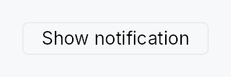

<!-- SPDX-License-Identifier: MPL-2.0 -->
<!-- SPDX-FileCopyrightText: 2026 FernTech -->

# Snackbar



Snackbar — a transient, button-triggered floating notification surface.

## Public functions

### `Snackbar`

| Returns | Function |
| ---: | :--- |
| | **Constructors** |
| `Self` | [`new(label: impl Into<LocalizedString>)`](#snackbar-new) |
| | **Builder methods** |
| `Self` | [`style(style: impl teksilo_core::styles::SnackbarStyle)`](#snackbar-style) |
| `Self` | [`content(content: impl teksilo_core::IntoTeksiChild)`](#snackbar-content) |
| `Self` | [`variant(variant: ButtonVariant)`](#snackbar-variant) |
| `Self` | [`enabled(enabled: impl Into<Prop<bool>>)`](#snackbar-enabled) |
| `Self` | [`dismiss_behavior(dismiss: DismissBehavior)`](#snackbar-dismiss_behavior) |
| `Self` | [`auto_dismiss_after(duration: Duration)`](#snackbar-auto_dismiss_after) |
| `Self` | [`persistent()`](#snackbar-persistent) |
| `Self` | [`trigger(trigger: impl teksilo_core::IntoTeksiChild)`](#snackbar-trigger) |
| `Self` | [`announcement(text: impl Into<LocalizedString>)`](#snackbar-announcement) |

## Detailed description

A `Snackbar` pairs a trigger (a `Button` by default, or any custom
widget via `.trigger(...)`) with a dormant content surface. Activating
the trigger presents the surface as an `OverlayPlacement::BottomCenter`
overlay and dismisses it automatically after a configurable timeout
(default: 4 s). The surface stays until dismissed when `.persistent()`
is set. Only one snackbar can be shown at a time — presenting a second
one dismisses the first.

For richer, stackable, severity-aware notifications see the
`Toast` system, which also maintains a
persistent `NotificationArchiveModel`.

#### Accessibility

The content surface exposes `Role::Alert` with `Live::Polite` so
screen readers announce the notification without interrupting the user.
Supply `.announcement(...)` to give the alert a descriptive name
instead of the generic "notification" fallback.

```ignore
use teksilo_widgets::{Snackbar};
use teksilo_i18n::lit;
use teksilo_widgets::primitives::TextWidget;
use teksilo_tokens::TextRole;

// In build():
ctx.add(
    Snackbar::new(lit!("Undo"))
        .content(TextWidget::new(lit!("File deleted.")).color(TextRole::TooltipText))
        .announcement(lit!("File deleted."))
        .auto_dismiss_after(std::time::Duration::from_secs(5)),
);
```

#### Touch and pen

The trigger activates on the release, whether it is the default `Button` or a
caller's widget, and the actions inside the surface are buttons and links with
their own targets. Nothing here actuates on a press.

## Density

The picture above is the widget at `TargetDensity::Compact`, the mouse-and-keyboard ladder. Below is the same subject on the same canvas with only the ladder changed, so what moves is the density and nothing else — where the subject no longer fits, that is what the denser targets cost it at that size. See `docs/density-and-targets.md`.

**Touch**


## API reference

📖 [Full rustdoc API for this module](https://docs.rs/teksilo-widgets/latest/teksilo_widgets/snackbar/index.html)

<a id="snackbar"></a>

## `pub struct Snackbar`

A button-triggered transient notification surface.

Call `.content(...)` to supply the notification body, then add the
widget to the tree. The trigger label is shown as a `Button` (or a
custom widget via `.trigger(...)`); activating it presents the
content surface at the bottom center of the window.

```rust
pub struct Snackbar { /* fields */ }
```

### Methods

<a id="snackbar-new"></a>

#### `pub fn new(label: impl Into<LocalizedString>) -> Self`

Create a snackbar whose default trigger button shows `label`.

<a id="snackbar-style"></a>

#### `pub fn style(mut self, style: impl teksilo_core::styles::SnackbarStyle) -> Self`

Per-call style override for the snackbar surface chrome.
Replaces the theme-wide default `SnackbarStyle` for just this
instance.

<a id="snackbar-content"></a>

#### `pub fn content(mut self, content: impl teksilo_core::IntoTeksiChild) -> Self`

The snackbar body — the message (and optional inline action)
shown on the floating surface.

The default surface is the high-contrast (dark) `tooltip_bg`,
the same one tooltips use, and it stays dark in light theme.
So any `TextWidget` you pass here must set
`.color(TextRole::TooltipText)` (and actions can use
`TooltipText` / `TooltipShortcut`) — the default `TextRole::Primary`
is dark and renders nearly invisible on the dark surface in light
theme. If you install a light-surface `SnackbarStyle`, color the
content to match that instead.

<a id="snackbar-variant"></a>

#### `pub fn variant(mut self, variant: ButtonVariant) -> Self`

Override the default trigger `ButtonVariant` (default: `Plain`).

<a id="snackbar-enabled"></a>

#### `pub fn enabled(mut self, enabled: impl Into<Prop<bool>>) -> Self`

Set the enabled state of the trigger, statically or reactively.

<a id="snackbar-dismiss_behavior"></a>

#### `pub fn dismiss_behavior(mut self, dismiss: DismissBehavior) -> Self`

Override the overlay dismiss behavior (default: `ClickOutside`).

<a id="snackbar-auto_dismiss_after"></a>

#### `pub fn auto_dismiss_after(mut self, duration: Duration) -> Self`

Set the auto-dismiss timeout. The overlay is removed after this
duration without user interaction (default: 4 s).

<a id="snackbar-persistent"></a>

#### `pub fn persistent(mut self) -> Self`

Keep the snackbar visible until explicitly dismissed; disables
the auto-dismiss timeout.

<a id="snackbar-trigger"></a>

#### `pub fn trigger(mut self, trigger: impl teksilo_core::IntoTeksiChild) -> Self`

Replace the default `Button` trigger with a custom widget. The
widget is wired for tap, keyboard (Enter/Space), and AT Click
activation automatically.

<a id="snackbar-announcement"></a>

#### `pub fn announcement(mut self, text: impl Into<LocalizedString>) -> Self`

Screen-reader announcement string — used as the Alert's
accessible name when the snackbar appears. Without this
the surface falls back to the generic `a11y_snackbar_name`
i18n string, which says "notification" but can't describe
the specific message. Set this whenever the snackbar
conveys information the user needs to hear (errors,
confirmations, status changes).
